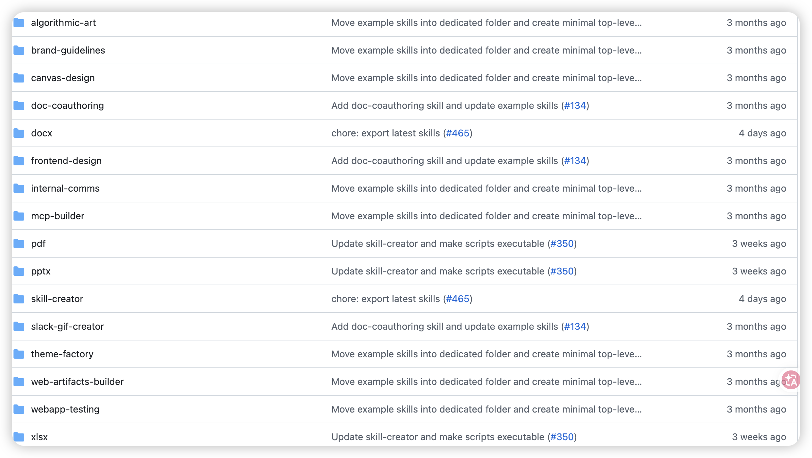
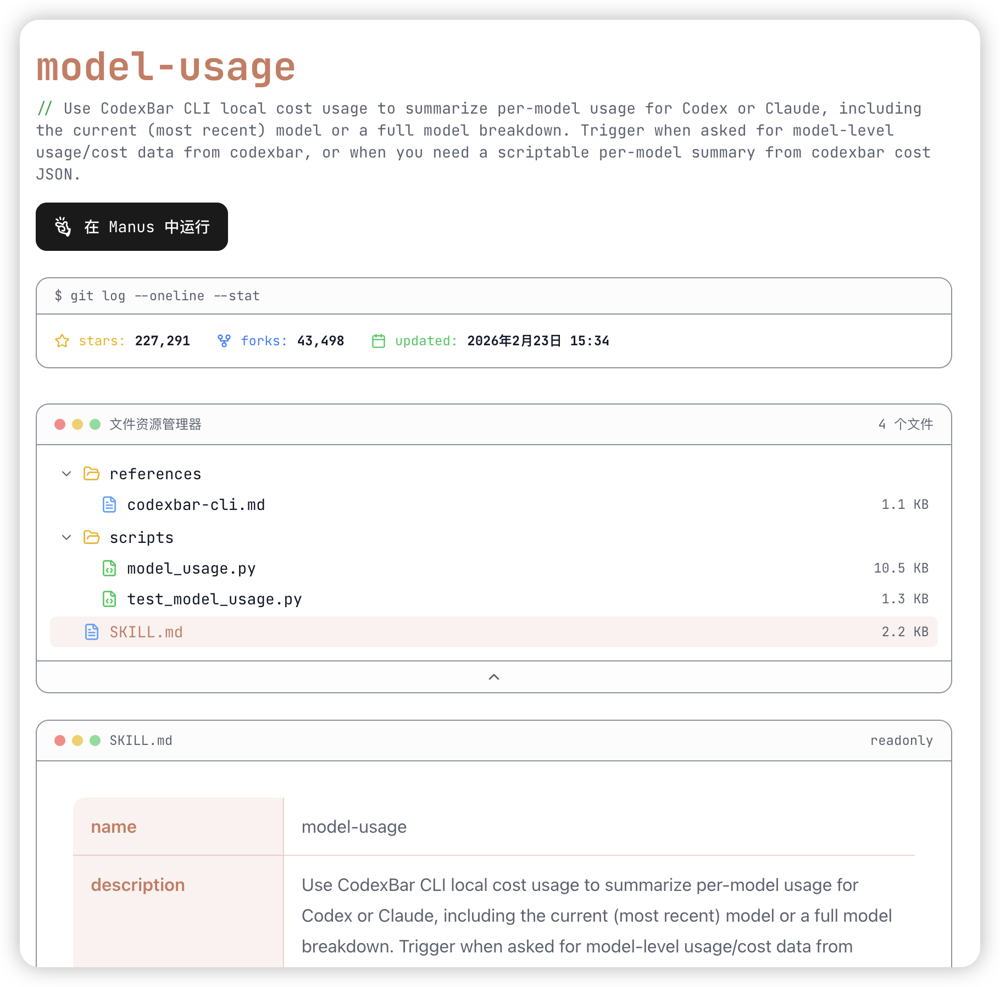
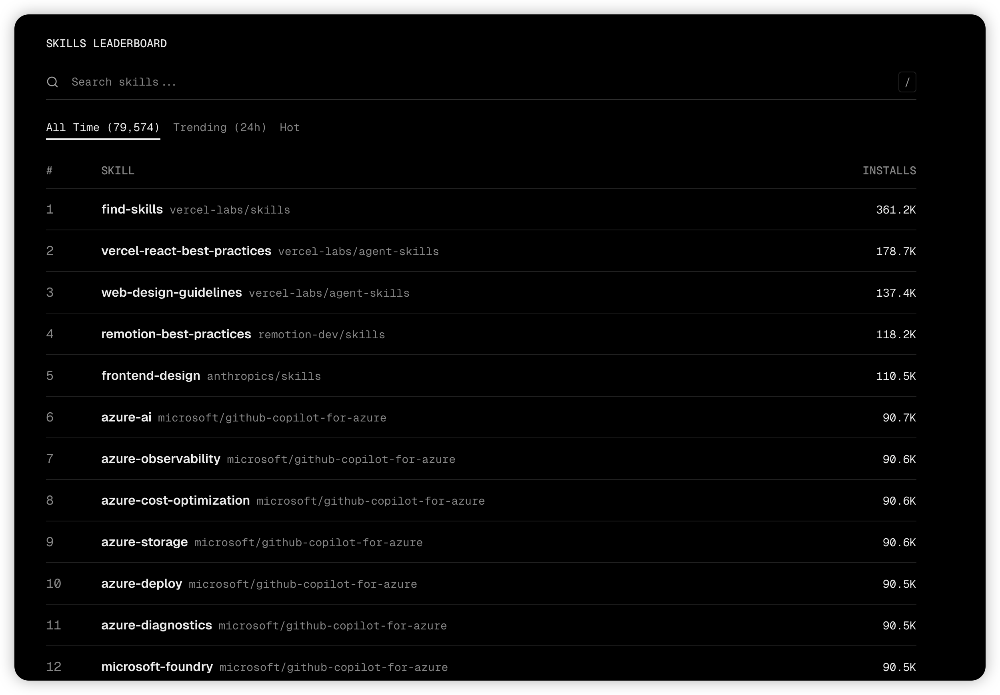

# ✅一些好用的Skills推荐

给大家推荐一些好用的skill，目前市面上有很多skill的市场，先介绍几个。

Anthropic官方Skill

Anthropic作为skill的创建者，他们同时也提供了一些Skill，在github上开源了：[https://github.com/anthropics/skills/tree/main](https://github.com/anthropics/skills/tree/main)

这里面包括了PDF、DOC、PPT、EXCEL等处理相关的skill，可以非常方便的用来操作和生成这些文件。

skillsmp

这是一个民间的skill市场，其中的skill主要来自github，目前已经包含了20多万个skill。

提供了skill的搜索功能，可以在这里搜索你想要的skill，搜索到之后，就能直接看其中的skill的介绍，如：[https://skillsmp.com/zh/skills/openclaw-openclaw-skills-model-usage-skill-md](https://skillsmp.com/zh/skills/openclaw-openclaw-skills-model-usage-skill-md)

skills.sh

前面我们介绍过，他也是一个skill的市场，第一次进到这个网站是从qoder的介绍中跳转过来的，不知道和qoder有没有关系，这里面有8万来个skill，上面也有排行榜，可以看到比较热门的skill，能看到安装量数据

[https://skills.sh/](https://skills.sh/)

更重要的是可以通过`npx skills add`一键安装这上面的命令。

skill推荐

skill-creator

[https://github.com/anthropics/skills/tree/main/skills/skill-creator](https://github.com/anthropics/skills/tree/main/skills/skill-creator)

anthropic官方提供的一个skill，他的功能就是帮你创建一个skill，有了这个skill之后，你想要一个什么样的skill，他就能帮你创建出来，减少自己去写文档、脚本的工作。

find-skills

[https://github.com/vercel-labs/skills/blob/main/skills/find-skills/SKILL.md](https://github.com/vercel-labs/skills/blob/main/skills/find-skills/SKILL.md)

这个skill也挺有意思，他是一个帮你查找并安装skill的skill，他支持了像opencode，claudecode、cursor、qoder等等agent工具。也非常好用。

frontend-design

[https://github.com/anthropics/skills/tree/main/skills/frontend-design](https://github.com/anthropics/skills/tree/main/skills/frontend-design)

这是一个能帮你写出好看的前端页面的skill。也是anthropic官方的

大家都知道，默认情况在，如果你的提示词不够丰富，ai写出来的网站就是那种蓝白色调的，很丑，有了这个skill之后，再写前端页面的时候，就能利用这个skill，写出更加精美好看的网页了。

remotion

[https://github.com/remotion-dev/skills/blob/main/skills/remotion/SKILL.md](https://github.com/remotion-dev/skills/blob/main/skills/remotion/SKILL.md)

这也是一个最近比较火的skill，他的主要功能是帮你制作视频，可以把一个网页地址发给他，它自动读取网页内容，然后制作出一个宣传视频来。

他其实是利用react，通过写代码的方式制作的视频。

code-reviewer

这是gemini团队推出的一个做代码审查的skill

[https://github.com/google-gemini/gemini-cli/tree/main/.gemini/skills/code-reviewer](https://github.com/google-gemini/gemini-cli/tree/main/.gemini/skills/code-reviewer)

它既支持审查本地代码改动（包括已暂存和未暂存的变更），也可审查远程代码合并请求（Pull Request，简称 PR）。审查的核心目标是保障代码的正确性、可维护性，并确保代码符合项目既定的规范标准。

update-docs

vercel推出的一个帮你根据源代码的变更，来分析、更新和创建相关的文档的skill。

[https://github.com/vercel/next.js/tree/canary/.claude/skills/update-docs](https://github.com/vercel/next.js/tree/canary/.claude/skills/update-docs)

核心作用是帮助你确保代码和文档保持同步。它特别为审查 Pull Request (PR) 时的文档完整性检查而设计，通过一系列标准化的步骤来规范文档的修改过程。

---

来源: https://thoughts.aliyun.com/workspaces/6963289eb0fc2e001bb052eb/docs/69ac082b51b144000149162e
