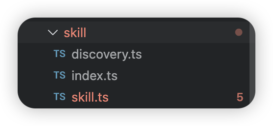
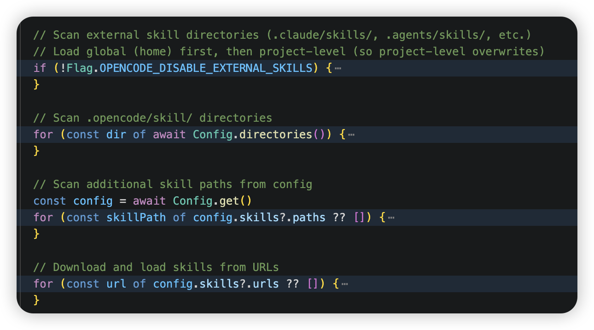
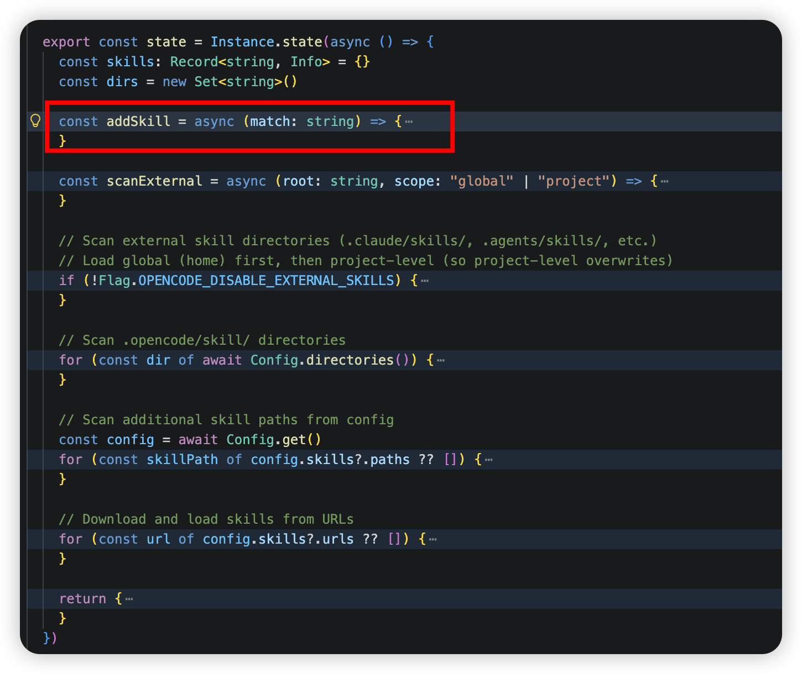
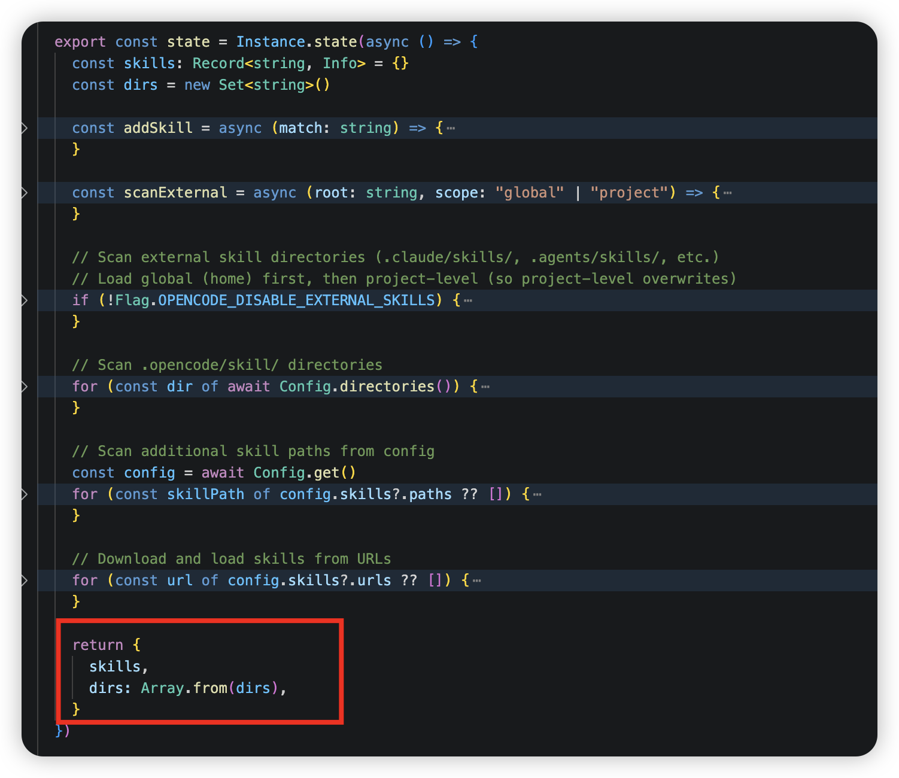
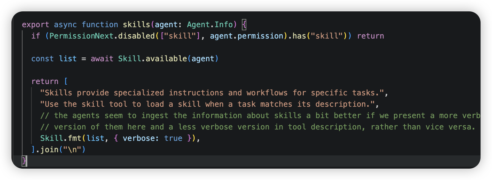

# ✅OpenCode（CC的开源版）中的Skills的实现原理

我想带着大家了解下ClaudeCode中Skills的具体的实现原理，但是ClaudeCode是不开源的，不过有一个开源项目，OpenCode（[https://github.com/anomalyco/opencode/tree/v1.2.27](https://github.com/anomalyco/opencode/tree/v1.2.27)），这个是一个目前被认为最接近CC的开源版了。我们基于他，来学习一下Skills是如何工作的。

（2026.03.31，CC源码泄露，近期会再加更一期，介绍原汁原味的Skill实现原理）

本文源码基于1.2.27版本讲解

OpenCode中，Skill相关的代码都在`src/skill`这个目录下。



一、Skill 的数据模型

Skill 在内存中被建模为一个简单的四字段结构，定义在 `src/skill/skill.ts`：

```ts
export const Info = z.object({
  name: z.string(),        // skill 唯一标识，来自 frontmatter
  description: z.string(), // AI 用来判断是否激活的描述
  location: z.string(),    // SKILL.md 的绝对路径
  content: z.string(),     // SKILL.md 正文（frontmatter 以外的内容）
})
```

每个 Skill 由四个字段组成：

- `name`：skill 的唯一标识名，从 `SKILL.md` 的 frontmatter 中提取
- `description`：人类可读的描述，AI 会通过它判断是否应激活此 skill
- `location`：`SKILL.md` 文件在磁盘上的绝对路径
- `content`：`SKILL.md` 正文内容（frontmatter 以外的 markdown 文本），即真正的指令内容

它对应的物理载体是一个 `SKILL.md` 文件，frontmatter 提供 `name` 和 `description`，正文就是 `content`：

```markdown
---
name: my-skill
description: 这个 skill 做什么用的
---

# My Skill
具体的指令和工作流程内容...
```

---

二、Skill 的发现与加载

Skill 的发现逻辑通过 state 函数懒初始化，按优先级依次扫描 4 类来源，后加载的会覆盖同名 skill（项目级覆盖全局级）：



外部兼容目录

先扫全局 home 目录下的 `.claude/skills/` 和 `.agents/skills/`

```ts
// src/skill/skill.ts — 扫描外部目录
const EXTERNAL_DIRS = [".claude", ".agents"]
const EXTERNAL_SKILL_PATTERN = "skills/**/SKILL.md"


if (!Flag.OPENCODE_DISABLE_EXTERNAL_SKILLS) {
  // 全局：~/.claude/skills/  和  ~/.agents/skills/
  for (const dir of EXTERNAL_DIRS) {
    const root = path.join(Global.Path.home, dir)
    if (!(await Filesystem.isDir(root))) continue
    await scanExternal(root, "global")
  }

  // 项目级：从项目目录向上查找 .claude/ 和 .agents/
  for await (const root of Filesystem.up({
    targets: EXTERNAL_DIRS,
    start: Instance.directory,
    stop: Instance.worktree,
  })) {
    await scanExternal(root, "project")
  }
}
```

这里会用到一个scanExternal方法，这个方法就是去目录下匹配找到具体的SKILL.md文件，后面的几层目录加载也还会用到他：

```ts
const EXTERNAL_SKILL_PATTERN = "skills/**/SKILL.md"

const scanExternal = async (root: string, scope: "global" | "project") => {
  return Glob.scan(EXTERNAL_SKILL_PATTERN, {
    cwd: root, absolute: true, include: "file", dot: true, symlink: true,
  })
    .then((matches) => Promise.all(matches.map(addSkill)))
    .catch((error) => {
      log.error(`failed to scan ${scope} skills`, { dir: root, error })
    })
}
```

**.opencode 自有目录**

扫描 opencode 原生的 skill 目录，支持 skill/ 和 skills/ 两种命名。即`.opencode/skill/` 和 `.opencode/skills/`：

```ts
const OPENCODE_SKILL_PATTERN = "{skill,skills}/**/SKILL.md"
for (const dir of await Config.directories()) {
  const matches = await Glob.scan(OPENCODE_SKILL_PATTERN, { ... })
  for (const match of matches) await addSkill(match)
}
```

用户自定义路径

用户可以在 `opencode.json` 中声明自定义的 skill 路径（支持 `~/` 前缀和相对路径展开）：

```ts
for (const skillPath of config.skills?.paths ?? []) {
  const expanded = skillPath.startsWith("~/") ? path.join(os.homedir(), ...) : skillPath
  const resolved = path.isAbsolute(expanded) ? expanded : path.join(Instance.directory, expanded)
  // 扫描 SKILL.md
}
```

**远程 URL 下载**

通过 `Discovery.pull(url)` 从远程服务器拉取 skill：

```ts
for (const url of config.skills?.urls ?? []) {
  const list = await Discovery.pull(url)  // 从远程拉取
  for (const dir of list) { /* 扫描并注册 */ }
}
```

`Discovery.pull(url)` 的工作流程：

1. 请求 `{url}/index.json`，获取 skill 清单（包含每个 skill 的文件列表）
2. 逐个下载文件到本地缓存目录（`Global.Path.cache/skills/{name}/`）
3. 验证目录中存在 `SKILL.md` 后将路径加入结果
4. 文件已缓存则跳过下载（幂等机制）

三、Skill的注册



每发现一个 SKILL.md，都用这个addSkill函数解析并注册到内存 map 中：

```ts
const addSkill = async (match: string) => {
  // 1. 解析 SKILL.md（YAML frontmatter + 正文）
  const md = await ConfigMarkdown.parse(match).catch((err) => {
    // 解析失败：发布 Bus 错误事件，不中断流程
    Bus.publish(Session.Event.Error, { ... })
    return undefined
  })

  // 2. 用 zod 校验 name/description 字段
  const parsed = Info.pick({ name: true, description: true }).safeParse(md.data)
  if (!parsed.success) return

  // 3. 同名 skill 警告（后来者覆盖）
  if (skills[parsed.data.name]) {
    log.warn("duplicate skill name", { ... })
  }

  // 4. 注册到内存 map
  skills[parsed.data.name] = {
    name: parsed.data.name,
    description: parsed.data.description,
    location: match,          // 文件路径
    content: md.content,      // 正文内容
  }
  dirs.add(path.dirname(match))
}
```

注册表是一个以 name 为 key 的 Record&lt;string, Info&gt; 对象，存储在 state 中。

四、Skill的初始化



```text
export const state = Instance.state(async () => {
  // ... 发现与注册全过程 ...
  return { skills, dirs: Array.from(dirs) }
})
```

Instance.state() 底层调用 State.create()，实现基于项目路径的单例懒加载：

```text
// state.ts
export function create<S>(root: () => string, init: () => S, ...) {
  return () => {
    const key = root()              // key = Instance.directory（项目根路径）
    const exists = entries.get(init)
    if (exists) return exists.state // 已初始化直接返回缓存 Promise
    const state = init()            // 首次访问时触发全量扫描
    entries.set(init, { state, dispose })
    return state
  }
}
```

五、Skill写入系统提示



Skill 的执行分为两个阶段：系统提示阶段（预告）和 工具调用阶段（加载详情）。

每次会话开始时，SystemPrompt.skills() 将 skill 摘要注入系统提示：

```text
export async function skills(agent: Agent.Info) {
  // 检查 agent 权限，若 skill 工具被完全禁用则跳过
  if (PermissionNext.disabled(["skill"], agent.permission).has("skill")) return

  const list = await Skill.available(agent)  // 按 agent 权限过滤

  return [
    "Skills provide specialized instructions and workflows for specific tasks.",
    "Use the skill tool to load a skill when a task matches its description.",
    Skill.fmt(list, { verbose: true }),  // 以 XML 格式列出所有 skill 摘要
  ].join("\n")
}
```

`Skill.fmt(list, { verbose: true })`  生成的 XML 片段被注入系统提示，AI 可以提前感知到有哪些 skill 可用：

```text
<available_skills>
  <skill>
    <name>my-skill</name>
    <description>...</description>
    <location>file:///path/to/SKILL.md</location>
  </skill>
</available_skills>
```

这段 description 会被 LLM 看到，相当于告诉它："这里有一个 skill 工具，它能加载以下这些 skill，当你判断任务匹配某个 skill 时，调用我并传入 name。" 此时 LLM 只看到了摘要（name + description），**并没有看到 skill 的完整内容**。

这样 LLM 在看到工具描述时就能知道有哪些 skill 可用，并在识别到匹配的任务时主动调用这个工具。

六、Skill完整信息获取

AI 认为任务匹配某 skill 后，，主动调用 skill 工具并传入 name，整个 SkillTool 是动态构建的——每次请求时重新生成描述：

```text
export const SkillTool = Tool.define("skill", async (ctx) => {
  // --- 动态生成工具描述（含当前可用 skill 列表）---
  const list = await Skill.available(ctx?.agent)
  const description = list.length === 0
    ? "No skills are currently available."
    : [
        "Load a specialized skill...",
        Skill.fmt(list, { verbose: false }),  // 简洁列表（工具描述用简洁版，系统提示用详细版）
      ].join("\n")

  return {
    description,
    parameters: z.object({
      name: z.string().describe(`The name of the skill from available_skills (e.g., 'skill-a', ...)`)
    }),

    async execute(params, ctx) {
      // 1. 从注册表查找 skill
      const skill = await Skill.get(params.name)
      if (!skill) {
        const available = await Skill.all().then((x) => x.map((s) => s.name).join(", "))
        throw new Error(`Skill "${params.name}" not found. Available: ${available}`)
      }

      // 2. 权限确认（可能触发用户交互弹窗）
      await ctx.ask({
        permission: "skill",
        patterns: [params.name],
        always: [params.name],
        metadata: {},
      })

      // 3. 扫描 skill 目录的附属文件（最多 10 个，排除 SKILL.md 本身）
      const dir = path.dirname(skill.location)
      const base = pathToFileURL(dir).href
      const files = await iife(async () => {
        const arr = []
        for await (const file of Ripgrep.files({ cwd: dir, follow: false, hidden: true, signal: ctx.abort })) {
          if (file.includes("SKILL.md")) continue
          arr.push(path.resolve(dir, file))
          if (arr.length >= 10) break
        }
        return arr
      }).then((f) => f.map((file) => `<file>${file}</file>`).join("\n"))

      // 4. 拼装完整输出，注入对话上下文
      return {
        title: `Loaded skill: ${skill.name}`,
        output: [
          `<skill_content name="${skill.name}">`,
          `# Skill: ${skill.name}`,
          "",
          skill.content.trim(),         // SKILL.md 完整正文指令
          "",
          `Base directory for this skill: ${base}`,  // 附属资源的基准路径
          "Relative paths in this skill (e.g., scripts/, reference/) are relative to this base directory.",
          "Note: file list is sampled.",
          "",
          "<skill_files>",
          files,                         // 附属文件列表（供 AI 进一步读取）
          "</skill_files>",
          "</skill_content>",
        ].join("\n"),
        metadata: { name: skill.name, dir },
      }
    },
  }
})
```

以上代码的主要流程（execute方法）：

1. **查找 Skill**：根据 LLM 传入的 name 参数，通过 Skill.get(name) 查找对应的 skill。如果找不到就抛出错误并列出所有可用的 skill 名称。
2. **权限检查**：调用 ctx.ask() 发起一个权限请求（类型为 "skill"），如果用户配置了需要确认，会弹出交互式确认。always 字段设置为 skill 名称，意味着一旦用户允许过一次，后续不再重复询问。
3. **收集附带文件**：通过 Ripgrep.files() 列出 skill 所在目录下的所有文件（排除 SKILL.md 本身），最多收集 10 个。这些文件路径会以 &lt;file&gt;...&lt;/file&gt; 标签的形式包含在输出中，让 LLM 知道 skill 目录下还有哪些脚本、模板等资源可以配合使用。
4. **构造输出**：最终返回给 LLM 的是一个结构化的文本块：

```text
<skill_content name="my-skill">
# Skill: my-skill

（SKILL.md 的正文内容）

Base directory for this skill: file:///path/to/skill-dir
Relative paths in this skill (e.g., scripts/, reference/) are relative to this base directory.
Note: file list is sampled.

<skill_files>
<file>/path/to/skill-dir/scripts/demo.sh</file>
<file>/path/to/skill-dir/reference/api.json</file>
</skill_files>
</skill_content>
```

LLM 收到这个输出后，就会按照 skill 正文中的指令来执行后续任务——可能会调用 bash 运行 skill 目录下的脚本，或者读取其中的参考文件。

这里面用到的SkillTool和其他所有 tool（Bash、Read、Edit、Skill 等）一样，在 `src/tool/registry.ts` 中统一注册：

```ts
// src/tool/registry.ts
async function all(): Promise<Tool.Info[]> {
  const custom = await state().then((x) => x.custom)
  return [
    InvalidTool,
    BashTool,
    ReadTool,
    GlobTool,
    GrepTool,
    EditTool,
    WriteTool,
    TaskTool,
    WebFetchTool,
    TodoWriteTool,
    WebSearchTool,
    CodeSearchTool,
    SkillTool,       // <-- Skill 在这里与其他 tool 并列注册
    ApplyPatchTool,
    ...custom,
  ]
}
```

七、Skill 同时作为 Slash Command

在 `src/command/index.ts` 中，所有 skill 还被注册为用户可以手动触发的斜杠命令：

```ts
// src/command/index.ts
// Add skills as invokable commands
for (const skill of await Skill.all()) {
  // 同名 command 已存在则跳过（command 优先级更高）
  if (result[skill.name]) continue
  result[skill.name] = {
    name: skill.name,
    description: skill.description,
    source: "skill",
    get template() {
      return skill.content   // 直接使用 skill 的 Markdown 正文作为 prompt 模板
    },
    hints: [],
  }
}
```

这提供了一条**绕过 LLM 判断的直接路径**——用户在输入框中输入 `/my-skill` 就会直接将 skill 内容注入为消息，不需要等 LLM 自行识别并调用 tool。注意这里 `source` 被标记为 `"skill"`，与普通 command（`"command"`）和 MCP prompt（`"mcp"`）区分开来。

八、完整执行流程总结

把上面所有环节串起来，skill 的完整生命周期是：

1. **启动时发现**：`Skill.state()` 按优先级扫描四个来源（外部兼容目录 → .opencode → 配置路径 → 远程URL），解析所有 `SKILL.md` 的 frontmatter，构建内存中的 `skills` map。
2. **注册为 Tool**：`SkillTool.init()` 读取所有 skill 的名称和描述，按 agent 权限过滤后，拼成一段 XML 格式的 tool description 提供给 LLM。此时 LLM 只看到摘要，不看到完整内容。
3. **注册为 Command**：每个 skill 同时注册为一个斜杠命令，用户可以通过 `/skill-name` 手动触发。
4. **按需加载**：LLM 在对话中判断某个任务匹配某个 skill 时，调用 `skill` tool 传入名称。`execute` 函数先做权限检查，然后把 skill 的完整 Markdown 正文、基准目录和附带文件列表组装成结构化输出，注入到对话上下文。
5. **执行指令**：LLM 拿到完整的 skill 内容后，按其中的指示使用 Bash、Read、Edit 等其他 tool 完成实际工作（实际工具调用是Agent调的，LLM只决策怎么调，入参是什么）。skill 目录下的文件因为已被白名单放行，可以直接读取使用。

这个设计的精妙之处在于**渐进式披露**——Skill 内容不在启动时就全部塞进 system prompt（那样会浪费 context window），而是只暴露摘要让 LLM 知道有什么可用，需要时再按需加载完整内容。这在 skill 数量较多时既节省了 token，又保持了灵活性。

---

来源: https://thoughts.aliyun.com/workspaces/6963289eb0fc2e001bb052eb/docs/69aea218d31fed000124ca02
