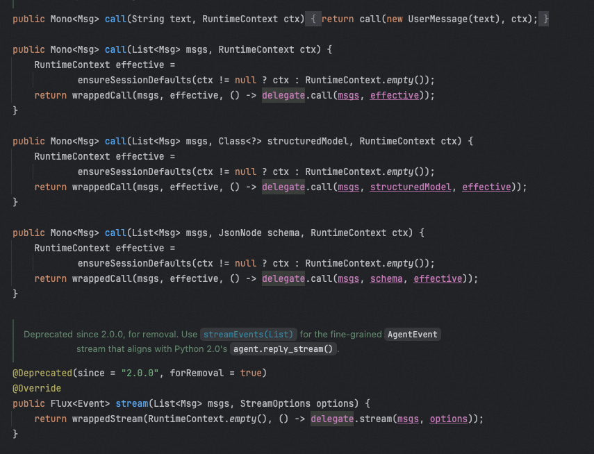

# ✅AgentScope Java 2.0中的HarnessAgent

HarnessAgent 是 agentscope-java v2 在 agentscope-harness 模块里提供的高层 API。它把底层 ReActAgent 包装了一层，专门解决"把一个 ReAct 循环变成可长期运行、可工程化部署的 agent"这件事。如果你只是写一个简单的 ReAct 演示，可以直接用 ReActAgent.builder()；如果你需要工作区文件系统、长期记忆、上下文压缩、沙箱、子 Agent、Skill、Plan Mode 或 MCP 工具注册，就应该用 HarnessAgent。

```text
import io.agentscope.core.message.Msg;
import io.agentscope.core.agent.RuntimeContext;
import io.agentscope.core.model.GenerateOptions;
import io.agentscope.extensions.model.dashscope.DashScopeChatModel;
import io.agentscope.harness.agent.HarnessAgent;

public class HarnessDemo {
    public static void main(String[] args) {
        var model = DashScopeChatModel.builder()
                .apiKey(System.getenv("DASHSCOPE_API_KEY"))
                .modelName("qwen-max")
                .defaultOptions(GenerateOptions.builder().build())
                .build();

        HarnessAgent agent = HarnessAgent.builder()
                .name("coder")
                .model(model)
                .sysPrompt("你是一名 Java 专家，回答简洁。")
                .build();

        Msg reply = agent.call("帮我写一个快速排序", RuntimeContext.empty()).block();
        System.out.println(reply.getTextContent());
    }
}
```

HarnessAgent 内部持有一个 ReActAgent delegate，所有 call() / streamEvents() / observe() 最终都会委托给它。Builder 上大部分的模型、toolkit、maxIters、generateOptions 等配置都是透传到内部 ReActAgent.Builder 的。你可以把 HarnessAgent 理解为：先配好一个 ReActAgent，再按顺序给它套上 sandbox / workspace / memory / compaction / subagent / skill / plan-mode 这些中间件，最后注册一批 harness 专属工具。



HarnessAgent.Builder 的方法可以分成两大类：一类是**透传到 ReActAgent 的基础配置**，另一类是 **Harness 专属配置**。它在 ReActAgent 之上叠加的能力可以分成几类：

- **工作区与上下文加载**：自动读取工作区里的 AGENTS.md、MEMORY.md、KNOWLEDGE.md，并把它们注入 system prompt。
- **可插拔文件系统**：支持本地文件系统、沙箱文件系统、远程/复合文件系统。

- **上下文压缩**：CompactionMiddleware 对话摘要压缩 + ToolResultEvictionMiddleware 大工具结果卸载。

```text
import io.agentscope.harness.agent.filesystem.spec.LocalFilesystemSpec;
import io.agentscope.harness.agent.memory.compaction.CompactionConfig;
import io.agentscope.harness.agent.memory.compaction.ToolResultEvictionConfig;
import java.nio.file.Path;

HarnessAgent agent = HarnessAgent.builder()
        .name("file-coder")
        .model(model)
        .workspace(Path.of("./my-agent-workspace"))
        .filesystem(LocalFilesystemSpec.builder()
                .rootPath(Path.of("./my-agent-workspace"))
                .build())
        .compaction(CompactionConfig.builder()
                .triggerMessages(30)
                .keepMessages(10)
                .build())
        .toolResultEviction(ToolResultEvictionConfig.defaults())
        .build();
```

- **长期记忆**：MemoryFlushMiddleware 把事实 flush 到 memory/YYYY-MM-DD.md，MemoryMaintenanceMiddleware 做合并与维护。

- **子 Agent 编排**：通过 task / task_output 等工具同步或后台运行子 agent。

```text
import io.agentscope.harness.agent.subagent.SubagentDeclaration;
import io.agentscope.harness.agent.subagent.SubagentDeclaration.WorkspaceMode;
import java.nio.file.Path;
import java.util.List;

HarnessAgent parent = HarnessAgent.builder()
        .name("parent")
        .model(model)
        .workspace(Path.of("./parent-ws"))
        .subagent(SubagentDeclaration.builder()
                .name("researcher")
                .description("负责搜索和整理资料")
                .workspace(Path.of("./defs/researcher"))
                .workspaceMode(WorkspaceMode.ISOLATED)
                .model("qwen-max")
                .tools(List.of("read_file", "grep_files", "search_web"))
                .build())
        .build();
```

- **Skill 体系**：支持 AgentSkillRepository 动态加载 skill，也支持 skill_manage 工具让 agent 自己创建/修改 skill。

```text
import io.agentscope.core.skill.repository.FileSystemSkillRepository;
import io.agentscope.harness.agent.tool.SkillManageConfig;
import java.nio.file.Path;

HarnessAgent agent = HarnessAgent.builder()
        .name("skill-coder")
        .model(model)
        .workspace(Path.of("./skill-ws"))
        .skillRepository(new FileSystemSkillRepository(Path.of("./skills")))
        .enableSkills("code-review", "unit-test")
        .enableSkillManageTool(SkillManageConfig.defaults())
        .enableSkillCurator(SkillCuratorConfig.defaults())
        .build();
```

- **Plan Mode**：只读设计阶段，配合 plan_enter / plan_write / plan_exit 工具。

```text
HarnessAgent agent = HarnessAgent.builder()
        .name("planner")
        .model(model)
        .workspace(Path.of("./plan-ws"))
        .enablePlanMode()
        .allowShellInPlanMode()
        .planFileDirectory("plans")
        .build();

RuntimeContext ctx = RuntimeContext.empty();
agent.enterPlanMode(ctx);
// 此时 agent 只能调用只读工具，plan 输出写到 plans/ 下
agent.exitPlanMode(ctx);
boolean active = agent.isPlanModeActive(ctx);
```

- **MCP 与工具过滤**：读取 workspace/tools.json 注册 MCP server，并做 allow/deny 过滤。
- **持久化与多租户**：基于 AgentStateStore 按 (userId, sessionId) 隔离状态，同一 session 调用自动串行。

---

来源: https://thoughts.aliyun.com/workspaces/6963289eb0fc2e001bb052eb/docs/6a85502ca7c8ff000134f660
