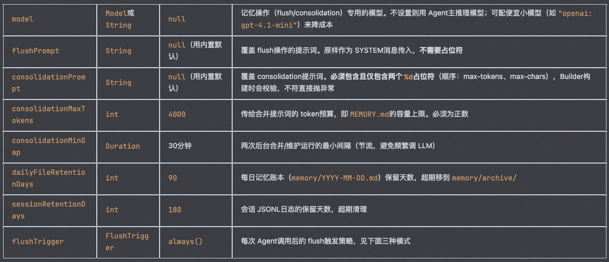
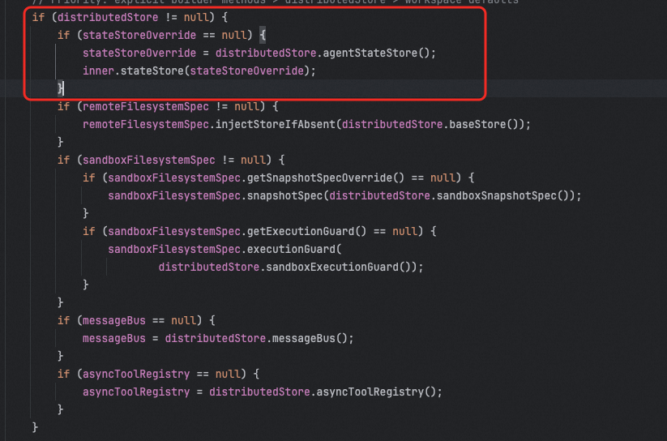
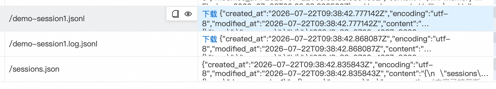

# ✅AgentScope Java 2.0中的记忆

**1.0当中的的 ****Memory**** 接口(****InMemoryMemory****/****LongTermMemory****)已经被****@Deprecated(forRemoval=true)。**

2.0 的"记忆"不是一个单体模块,而是**三条正交的机制叠加**在无状态 ReAct 循环之上:

1. **会话态持久化**(core 层):AgentState + AgentStateStore,解决"同一 (userId, sessionId) 跨请求/跨进程/跨机器能续上"。
2. **两层长期记忆**(harness 层):memory/YYYY-MM-DD.md(日志层,只追加)+ MEMORY.md(精炼层,LLM 定期合并去重,注入 system prompt)。
3. **上下文压缩 + 大结果卸载**(harness 层):ConversationCompactor 把超长历史蒸馏成摘要,超大工具结果落盘。

在ASJ 2.0中，记忆基本不太需要用户关心，只需要你在HarnessAgent中配了 workspace + model，默认就会启用记忆。（workspace后面讲）

先来个Demo：

```text
package cn.hollis.llm.llmentor.agentscope2.demo;

import io.agentscope.core.agent.RuntimeContext;
import io.agentscope.core.message.UserMessage;
import io.agentscope.core.model.Model;
import io.agentscope.extensions.model.dashscope.DashScopeChatModel;
import io.agentscope.extensions.model.dashscope.formatter.DashScopeChatFormatter;
import io.agentscope.harness.agent.HarnessAgent;

import java.nio.file.Paths;

public class MemoryDemo {
    public static void main(String[] args) {
        Model model = DashScopeChatModel.builder()
                .apiKey("sk-xxxxxx")
                .modelName("qwen-plus")
                .stream(true)
                .formatter(new DashScopeChatFormatter())
                .build();

        // 只要配了 workspace + model,默认就启用:两层长期记忆 + 后台维护;
        HarnessAgent agent = HarnessAgent.builder()
                .name("memoryDemo")
                .sysPrompt("You are a assistant.")
                .model(model)
                .workspace(Paths.get(".agentscope/workspace"))
                .build();

        RuntimeContext ctx = RuntimeContext.builder()
                .sessionId("demo-session").userId("Hollis").build();

        System.out.println(agent.call(new UserMessage("My name is Hollis and I'm a software engineer."), ctx).block());

        //新建一个agent，模拟应用重启，或者请求到集群中另外一台机器上。
        agent = HarnessAgent.builder()
                .name("memoryDemo")
                .sysPrompt("You are a assistant.")
                .model(model)
                .workspace(Paths.get(".agentscope/workspace"))
                .build();

        // 同一 (userId, sessionId):第一轮状态被 AgentStateStore 自动恢复
        System.out.println(agent.call(new UserMessage("我叫什么?我是干啥的?"), ctx).block());
    }
}
```

运行后的输出日志：

```
Got it — your name and role are now securely stored in memory. Let me know how I can assist you today: whether it’s exploring a codebase, debugging an issue, generating documentation, setting up tooling, reviewing architecture, or anything else engineering-related. I’m ready when you are!

你叫 **Hollis**，是一名 **软件工程师**。
```

可以看到`记忆功能是实现`了的。

以上代码运行之后，会在你的机器上产生一些文件：

```text
.agentscope/workspace/               ← workspace(记忆内容)
├── Hollis
    ├── MEMORY.md                    ← 精炼层(Consolidator 定期重写)
    ├── memory/
    │   ├── 2026-07-20.md            ← 日志层(Flush 追加)
    │   └── .consolidation_state           ← 合并水位线
    └── agents/memoryDemo/sessions/
        ├── demo-session.log.jsonl         ← 永不压缩的原始会话日志
        ├── demo-session.jsonl    
        └── sessions.json
```

```text
~/.agentscope/state/memoryDemo/        ← 状态存储(在 workspace 之外)
 └── Hollis/demo-session/agent_state.json ← AgentState 自动存/取
```

第一层记忆

```text
~/.agentscope/state/memoryDemo/        ← 状态存储(在 workspace 之外)
 └── Hollis/demo-session/agent_state.json ← AgentState 自动存/取
```

上面的这个agent_state.json，其实就是实现的第一层记忆，即会话的持久化记忆。以下是上面的demo运行后记录的内容：

```
{
  "session_id" : "demo-session",
  "user_id" : "Hollis",
  "summary" : "",
  "context" : [ {
    "id" : "d097b32e-c721-4ac6-b41d-828d3e986915",
    "name" : null,
    "role" : "USER",
    "content" : [ {
      "type" : "text",
      "text" : "My name is Hollis and I'm a software engineer."
    } ],
    "metadata" : { },
    "timestamp" : "2026-07-20 23:31:54.870",
    "usage" : null
  }, {
    "id" : "5d38e084-582e-9cdc-b476-64a472b3f6ff",
    "name" : "memoryDemo",
    "role" : "ASSISTANT",
    "content" : [ {
      "type" : "text",
      "text" : "Thank you for introducing yourself, Hollis — great to meet you! As a software engineer, your context and preferences will help me tailor support more effectively (e.g., CLI workflows, code analysis, debugging, documentation, or tooling integration).\n\nI’ve saved that detail to memory so it persists across our conversations.\n\n"
    }, {
      "type" : "tool_use",
      "id" : "call_05f7d443e10341ba850045",
      "name" : "memory_save",
      "input" : {
        "content" : "- User's name is Hollis\n- Hollis is a software engineer"
      },
      "content" : "{\"content\": \"- User's name is Hollis\\n- Hollis is a software engineer\"}",
      "metadata" : { },
      "state" : "allowed"
    } ],
    "metadata" : {
      "_chat_usage" : {
        "inputTokens" : 4661,
        "outputTokens" : 95,
        "cachedTokens" : 0,
        "time" : 2.218,
        "totalTokens" : 4756
      }
    },
    "timestamp" : "2026-07-20 23:31:57.148",
    "usage" : {
      "inputTokens" : 4661,
      "outputTokens" : 95,
      "cachedTokens" : 0,
      "time" : 2.218,
      "totalTokens" : 4756
    }
  }, {
    "id" : "358674e8-3f53-4de6-9170-14edc5d020a5",
    "name" : "memoryDemo",
    "role" : "TOOL",
    "content" : [ {
      "type" : "tool_result",
      "id" : "call_05f7d443e10341ba850045",
      "name" : "memory_save",
      "output" : [ {
        "type" : "text",
        "text" : "\"Saved 2 memories to MEMORY.md\""
      } ],
      "metadata" : { },
      "state" : "success"
    } ],
    "metadata" : { },
    "timestamp" : "2026-07-20 23:31:57.192",
    "usage" : null
  }, {
    "id" : "bed88c92-40f8-94a4-b074-b778ce3972a5",
    "name" : "memoryDemo",
    "role" : "ASSISTANT",
    "content" : [ {
      "type" : "text",
      "text" : "Got it — your name and role are now securely stored in memory. Let me know how I can assist you today: whether it’s exploring a codebase, debugging an issue, generating documentation, setting up tooling, reviewing architecture, or anything else engineering-related. I’m ready when you are!"
    } ],
    "metadata" : {
      "_chat_usage" : {
        "inputTokens" : 4778,
        "outputTokens" : 60,
        "cachedTokens" : 0,
        "time" : 1.6,
        "totalTokens" : 4838
      }
    },
    "timestamp" : "2026-07-20 23:31:58.795",
    "usage" : {
      "inputTokens" : 4778,
      "outputTokens" : 60,
      "cachedTokens" : 0,
      "time" : 1.6,
      "totalTokens" : 4838
    }
  }, {
    "id" : "7a8ee1a9-9bc7-4944-a6a0-7474d952fc6e",
    "name" : null,
    "role" : "USER",
    "content" : [ {
      "type" : "text",
      "text" : "我叫什么?我是干啥的?"
    } ],
    "metadata" : { },
    "timestamp" : "2026-07-20 23:32:00.546",
    "usage" : null
  }, {
    "id" : "6d8dfe11-0496-9ca1-8f46-947cad783818",
    "name" : "memoryDemo",
    "role" : "ASSISTANT",
    "content" : [ {
      "type" : "text",
      "text" : "你叫 **Hollis**，是一名 **软件工程师**。  \n\n这个信息已持久化保存在你的 long-term memory 中 —— let me know if you'd like to add preferences (e.g., preferred languages, tools, IDEs), project context, or anything else I should remember! 🛠️"
    } ],
    "metadata" : {
      "_chat_usage" : {
        "inputTokens" : 4883,
        "outputTokens" : 65,
        "cachedTokens" : 0,
        "time" : 1.787,
        "totalTokens" : 4948
      }
    },
    "timestamp" : "2026-07-20 23:32:02.361",
    "usage" : {
      "inputTokens" : 4883,
      "outputTokens" : 65,
      "cachedTokens" : 0,
      "time" : 1.787,
      "totalTokens" : 4948
    }
  } ],
  "reply_id" : "d19ebc7d0d08493b87c6d65b6f4fff9a",
  "cur_iter" : 0,
  "shutdown_interrupted" : false,
  "permission_context" : {
    "mode" : "default",
    "working_directories" : { },
    "allow_rules" : { },
    "deny_rules" : { },
    "ask_rules" : { }
  },
  "tool_context" : {
    "max_cache_files" : 100,
    "max_cache_bytes" : 25000.0,
    "activated_groups" : [ ],
    "spawn_registry" : { }
  },
  "tasks_context" : {
    "tasks" : [ ]
  },
  "plan_mode_context" : {
    "plan_active" : false,
    "current_plan_file" : null
  }
}
```

上面的json文件中，完整的记录了两轮对话的过程，和我们之前1.0中记录的session差不多，包括了user-message，assistant-message，tool_use等等内容。

这里面的agent_state.json，其实是靠JsonFileAgentStateStore产生的，他是AgentStateStore的实现类，这个AgentStateStore就是ASJ 2.0.0中用来代替Memory的抽象。

除了JsonFileAgentStateStore这种用文件的方式，还有其他几个扩展可以使用：

| 实现 | 模块 | 适用场景 |
| --- | --- | --- |
| InMemoryAgentStateStore | agentscope-core | 单元测试/单进程 demo,退出即丢 |
| JsonFileAgentStateStore | agentscope-core | 本地文件持久化,<br>**HarnessAgent 默认**<br>,根目录~/.agentscope/state/&lt;agentId&gt;/<br>(可用系统属性agentscope.state.home 覆盖);单机 |
| RedisAgentStateStore | agentscope-extensions-redis | 生产多副本默认;Jedis/Lettuce/Redisson |
| MysqlAgentStateStore | agentscope-extensions-mysql | 状态需入关系库(审计/报表) |

第二层记忆

通过上面的json日志，大家可以看到这样的内容：

```
{
    "id" : "358674e8-3f53-4de6-9170-14edc5d020a5",
    "name" : "memoryDemo",
    "role" : "TOOL",
    "content" : [ {
      "type" : "tool_result",
      "id" : "call_05f7d443e10341ba850045",
      "name" : "memory_save",
      "output" : [ {
        "type" : "text",
        "text" : "\"Saved 2 memories to MEMORY.md\""
      } ],
      "metadata" : { },
      "state" : "success"
    } ],
    "metadata" : { },
    "timestamp" : "2026-07-20 23:31:57.192",
    "usage" : null
  }
```

```
 {
    "id" : "6d8dfe11-0496-9ca1-8f46-947cad783818",
    "name" : "memoryDemo",
    "role" : "ASSISTANT",
    "content" : [ {
      "type" : "text",
      "text" : "你叫 **Hollis**，是一名 **软件工程师**。  \n\n这个信息已持久化保存在你的 long-term memory 中 —— let me know if you'd like to add preferences (e.g., preferred languages, tools, IDEs), project context, or anything else I should remember! 🛠️"
    } ],
    "metadata" : {
      "_chat_usage" : {
        "inputTokens" : 4883,
        "outputTokens" : 65,
        "cachedTokens" : 0,
        "time" : 1.787,
        "totalTokens" : 4948
      }
    }
```

这说明，在Agent运行过程中，自动提取了并保存了长期记忆。这个长期记忆保存在这里：

```text
.agentscope/workspace/               ← workspace(记忆内容)
├── Hollis
    ├── MEMORY.md                    ← 精炼层(Consolidator 定期重写)
    ├── memory/
    │   ├── 2026-07-20.md            ← 日志层(Flush 追加)
    │   └── .consolidation_state           ← 合并水位线
    └── agents/memoryDemo/sessions/
        ├── demo-session.log.jsonl         ← 永不压缩的原始会话日志
        ├── demo-session.jsonl    
        └── sessions.json
```

这里可以看到其实还是分了两层：

- **Layer 1 · 精炼层** MEMORY.md：LLM 定期合并、去重、限长后整体重写。**只由 ****MemoryConsolidator**** 写**,且是唯一被注入 system prompt 的一层。

````
```markdown
- User's name is Hollis
- Hollis is a software engineer
```
~      
````

- **Layer 1 · 日志层** memory/YYYY-MM-DD.md：只追加、不去重,每次 flush 追加一个带时间戳的小节。**只由 ****MemoryFlushManager**** 写**。

```
## Memory Save — 2026-07-20T23:31:57.189746Z
- User's name is Hollis
- Hollis is a software engineer
```

可以看到，这其实就是用户画像相关的东西了，也就是我们前面讲过的长期记忆。

前面讲的这个过程，会额外产生**三次相互独立的 LLM 调用**:

| # | 操作 | 写入 | 默认 prompt 常量 |
| --- | --- | --- | --- |
| 1 | **Flush**:从会话窗口抽取长期事实 | memory/YYYY-MM-DD.md<br>(追加) | MemoryFlushManager.DEFAULT_FLUSH_PROMPT |
| 2 | **Consolidation**:把日志层合并进<br>MEMORY.md | MEMORY.md<br>(整体重写) | MemoryConsolidator.DEFAULT_CONSOLIDATION_PROMPT |
| 3 | **Compaction summary**:把会话前缀蒸馏成一条摘要 | 注入当前上下文 | CompactionConfig.DEFAULT_SUMMARY_PROMPT |

前两个属于"长期记忆沉淀",挂在 MemoryConfig;第三个属于"上下文内压缩",挂在 CompactionConfig。三者默认都用 agent 主模型,但 MemoryConfig 与 CompactionConfig 都支持 .model(...) 用更便宜的小模型跑这些辅助操作。

记忆配置

如果你想调整一些配置的内容，可以使用MemoryConfig来进行配置；

```text
MemoryConfig memoryConfig =  MemoryConfig.builder()
.model("openai:gpt-4.1-mini")  // flush/consolidation 用便宜小模型
.flushTrigger(MemoryConfig.FlushTrigger.throttled(Duration.ofMinutes(10))) // 每 10 分钟最多 flush 一次
.consolidationMinGap(Duration.ofHours(2))   // 后台合并最多每 2h
.consolidationMaxTokens(8_000)           // MEMORY.md 上限提到 8K token
.dailyFileRetentionDays(30)
.sessionRetentionDays(60)
.build()
```

```text
HarnessAgent agent = HarnessAgent.builder()
        .name("assistant")
        .model(model)               // 主推理模型
        .workspace(Paths.get(".agentscope/workspace"))
        .memory(memoryConfig)
        .build();
```

MemoryConfig支持的配置如下：



分布式场景下的记忆管理

以上方案是基于本地文件来做记忆管理的，一旦遇到分布式场景，用户的两次请求，可能会请求到不同的机器上，这样依赖本地文件的方案是不可行的。

```text
HarnessAgent agent = HarnessAgent.builder()
        .name("assistant")
        .model(model)                                 
        .workspace(Paths.get(".agentscope/workspace"))
        .stateStore(new MysqlAgentStateStore(dataSource))  
        .distributedStore(MysqlDistributedStore.create(dataSource))
        .build();
```

我们可以使用stateStore和distributedStore这两个参数做扩展，分别使用MysqlAgentStateStore和MysqlDistributedStore来实现上面的两层记忆。

stateStore(MysqlAgentStateStore) 配置的是**单个组件**——MysqlAgentStateStore负责把每个 (userId, sessionId) 的 AgentState(对话 context、summary、permission/tool/tasks/plan 各类子上下文)使用MySQL做持久化。这就是"记忆/会话状态"落盘的那一层。

```text
package cn.hollis.llm.llmentor.agentscope2.demo;

import com.zaxxer.hikari.HikariConfig;
import com.zaxxer.hikari.HikariDataSource;
import io.agentscope.core.agent.RuntimeContext;
import io.agentscope.core.message.UserMessage;
import io.agentscope.core.model.Model;
import io.agentscope.extensions.model.dashscope.DashScopeChatModel;
import io.agentscope.extensions.model.dashscope.formatter.DashScopeChatFormatter;
import io.agentscope.extensions.mysql.state.MysqlAgentStateStore;
import io.agentscope.harness.agent.HarnessAgent;
import io.agentscope.harness.agent.memory.compaction.ToolResultEvictionConfig;

import javax.sql.DataSource;
import java.nio.file.Paths;

public class MemoryDistributeDemo {

    /**
     * 创建连接 MySQL 的 HikariCP 数据源。
     * <p>
     * MysqlAgentStateStore 会自动建库建表（agentscope.agentscope_sessions），
     * 所以连接的账号需要有 CREATE DATABASE / CREATE TABLE 权限。
     */
    private static DataSource createMysqlDataSource() {
        HikariConfig config = new HikariConfig();
        config.setJdbcUrl("jdbc:mysql://localhost:3306/gogo_travel");
        config.setUsername("xxxx");
        config.setPassword("xxxx");
        config.setDriverClassName("com.mysql.cj.jdbc.Driver");
        config.setMaximumPoolSize(10);
        config.setMinimumIdle(2);
        config.setConnectionTimeout(30_000);
        config.setPoolName("agentscope-mysql-pool");
        return new HikariDataSource(config);
    }

    public static void main(String[] args) {
        Model model = DashScopeChatModel.builder()
                .apiKey("sk-xxxxx")
                .modelName("qwen-plus")
                .stream(true)
                .formatter(new DashScopeChatFormatter())
                .build();

        DataSource dataSource = createMysqlDataSource();
        // 只要配了 workspace + model,默认就启用:两层长期记忆 + 后台维护;
        HarnessAgent agent = HarnessAgent.builder()
                .name("assistant")
                .model(model)
                .stateStore(new MysqlAgentStateStore(dataSource, "gogo_travel", "agentscope_session", false))
                .toolResultEviction(ToolResultEvictionConfig.defaults())
                .build();

        RuntimeContext ctx = RuntimeContext.builder()
                .sessionId("demo-session").userId("Hollis").build();

        System.out.println(agent.call(new UserMessage("My name is Hollis and I'm a software engineer."), ctx).block().getTextContent());

        //新建一个agent，模拟应用重启，或者请求到集群中另外一台机器上。
        agent = HarnessAgent.builder()
                .name("memoryDemo")
                .sysPrompt("You are a assistant.")
                .model(model)
                .stateStore(new MysqlAgentStateStore(dataSource, "gogo_travel", "agentscope_session", false))
                .build();

        // 同一 (userId, sessionId):第一轮状态被 AgentStateStore 自动恢复
        System.out.println(agent.call(new UserMessage("我叫什么?我是干啥的?"), ctx).block().getTextContent());
    }

}
```

以上代码运行后，会在数据库gogo_travel的agentscope_session表中增加一条记录：

| session_id | Hollis:demo-session |
| --- | --- |
| state_key | agent_state |
| item_index | 0 |
| state_data | &#123;"session_id":"demo-session","user_id":"Hollis","summary":"","context":[&#123;"id":"e5926721-3c80-482a-91c7-7c52c18e281f","name":null,"role":"USER","content":[&#123;"type":"text","text":"My name is Hollis and I'm a software engineer."&#125;],"metadata":&#123;&#125;,"timestamp":"2026-07-22 16:46:24.219","usage":null&#125;,&#123;"id":"fd45f265-0fa1-9f5c-862c-412c769b9ff8","name":"assistant","role":"ASSISTANT","content":[&#123;"type":"text","text":"Thanks for the introduction, Hollis! I’ve saved that context — your name and role as a software engineer are now part of your persistent memory.\n\nLet me know what you'd like to work on next: debugging code, designing a system, reviewing docs, writing tests, exploring a project structure, or anything else. I'm here to help — whether it's hands-on tooling, deep reasoning, or delegating complex subtasks to isolated agents."&#125;],"metadata":&#123;"_chat_usage":&#123;"inputTokens":4681,"outputTokens":91,"cachedTokens":0,"time":2.402,"totalTokens":4772&#125;&#125;,"timestamp":"2026-07-22 16:46:26.890","usage":&#123;"inputTokens":4681,"outputTokens":91,"cachedTokens":0,"time":2.402,"totalTokens":4772&#125;&#125;,&#123;"id":"5db349e0-679e-48cf-899f-9bb76783e15f","name":null,"role":"USER","content":[&#123;"type":"text","text":"My name is Hollis and I'm a software engineer."&#125;],"metadata":&#123;&#125;,"timestamp":"2026-07-22 16:50:25.161","usage":null&#125;,&#123;"id":"d52d8588-6975-9224-b650-b02b67d10119","name":"assistant","role":"ASSISTANT","content":[&#123;"type":"text","text":"Got it — confirmed and reinforced:  \n- **User's name is Hollis**  \n- **Hollis is a software engineer**\n\nThis is already recorded in memory (as shown in `<memory_context>`), so no duplicate save is needed. Let me know how I can assist with your engineering work — whether it’s code analysis, architecture design, debugging, documentation, tooling setup, or something else entirely."&#125;],"metadata":&#123;"_chat_usage":&#123;"inputTokens":4794,"outputTokens":84,"cachedTokens":0,"time":2.324,"totalTokens":4878&#125;&#125;,"timestamp":"2026-07-22 16:50:27.723","usage":&#123;"inputTokens":4794,"outputTokens":84,"cachedTokens":0,"time":2.324,"totalTokens":4878&#125;&#125;,&#123;"id":"962ed503-9042-4715-bc46-13ff8007a8ca","name":null,"role":"USER","content":[&#123;"type":"text","text":"我叫什么?我是干啥的?"&#125;],"metadata":&#123;&#125;,"timestamp":"2026-07-22 16:50:29.527","usage":null&#125;,&#123;"id":"d4b3e035-e614-9d93-8f68-e1db05cb8490","name":"memoryDemo","role":"ASSISTANT","content":[&#123;"type":"text","text":"你叫 **Hollis**，是一名 **软件工程师**（software engineer）。  \n\n这个信息已持久化在你的 long-term memory 中 —— feel free to ask anything technical, workflow-related, or project-specific! 🛠️"&#125;],"metadata":&#123;"_chat_usage":&#123;"inputTokens":4903,"outputTokens":49,"cachedTokens":0,"time":1.529,"totalTokens":4952&#125;&#125;,"timestamp":"2026-07-22 16:50:31.211","usage":&#123;"inputTokens":4903,"outputTokens":49,"cachedTokens":0,"time":1.529,"totalTokens":4952&#125;&#125;],"reply_id":"c6d8c19751134109bee013b5405abbf6","cur_iter":0,"shutdown_interrupted":false,"permission_context":&#123;"mode":"default","working_directories":&#123;&#125;,"allow_rules":&#123;&#125;,"deny_rules":&#123;&#125;,"ask_rules":&#123;&#125;&#125;,"tool_context":&#123;"max_cache_files":100,"max_cache_bytes":25000.0,"activated_groups":[],"spawn_registry":&#123;&#125;&#125;,"tasks_context":&#123;"tasks":[]&#125;,"plan_mode_context":&#123;"plan_active":false,"current_plan_file":null&#125;&#125; |
| created_at | 2026-07-22 16:46:27 |
| updated_at | 2026-07-22 16:50:31 |

distributedStore(MysqlDistributedStore), 配置的是一个**聚合工厂接口，**他负责把"整套分布式基础设施(状态 + workspace 存储 + 沙箱协调 + 消息/异步)"一股脑全都用MySQL持久化。

但是需要注意，distributedStore是依赖agentStateStore的，在初始化过程中，他会初始化agentStateStore。



```text
package cn.hollis.llm.llmentor.agentscope2.demo;

import com.zaxxer.hikari.HikariConfig;
import com.zaxxer.hikari.HikariDataSource;
import io.agentscope.core.agent.RuntimeContext;
import io.agentscope.core.message.UserMessage;
import io.agentscope.core.model.Model;
import io.agentscope.extensions.model.dashscope.DashScopeChatModel;
import io.agentscope.extensions.model.dashscope.formatter.DashScopeChatFormatter;
import io.agentscope.extensions.mysql.MysqlDistributedStore;
import io.agentscope.extensions.mysql.state.MysqlAgentStateStore;
import io.agentscope.harness.agent.HarnessAgent;
import io.agentscope.harness.agent.memory.compaction.ToolResultEvictionConfig;

import javax.sql.DataSource;

public class MemoryDistributeDemo {

    /**
     * 创建连接 MySQL 的 HikariCP 数据源。
     * <p>
     * MysqlAgentStateStore 会自动建库建表（agentscope.agentscope_sessions），
     * 所以连接的账号需要有 CREATE DATABASE / CREATE TABLE 权限。
     */
    private static DataSource createMysqlDataSource() {
        HikariConfig config = new HikariConfig();
        config.setJdbcUrl("jdbc:mysql://localhost:3306/gogo_travel");
        config.setUsername("xxxx");
        config.setPassword("xxxx");
        config.setDriverClassName("com.mysql.cj.jdbc.Driver");
        config.setMaximumPoolSize(10);
        config.setMinimumIdle(2);
        config.setConnectionTimeout(30_000);
        config.setPoolName("agentscope-mysql-pool");
        return new HikariDataSource(config);
    }

    public static void main(String[] args) {
        Model model = DashScopeChatModel.builder()
                .apiKey("sk-fa5d4336bd26444cad9982ab43543bf3")
                .modelName("qwen-plus")
                .stream(true)
                .formatter(new DashScopeChatFormatter())
                .build();

        DataSource dataSource = createMysqlDataSource();
        // 只要配了 workspace + model,默认就启用:两层长期记忆 + 后台维护;
        HarnessAgent agent = HarnessAgent.builder()
                .name("memoryDemo")
                .sysPrompt("You are a assistant.")
                .model(model)
                .stateStore(new MysqlAgentStateStore(dataSource, "gogo_travel", "agentscope_session", false))
                .distributedStore(MysqlDistributedStore.create(dataSource))
                .toolResultEviction(ToolResultEvictionConfig.defaults())
                .filesystem(new RemoteFilesystemSpec())
                .build();

        RuntimeContext ctx = RuntimeContext.builder()
                .sessionId("demo-session1").userId("Hollis").build();

        System.out.println(agent.call(new UserMessage("My name is Hollis and I'm a software engineer."), ctx).block().getTextContent());

        //新建一个agent，模拟应用重启，或者请求到集群中另外一台机器上。
        agent = HarnessAgent.builder()
                .name("memoryDemo")
                .sysPrompt("You are a assistant.")
                .model(model)
                .stateStore(new MysqlAgentStateStore(dataSource, "gogo_travel", "agentscope_session", false))
                .distributedStore(MysqlDistributedStore.create(dataSource))
                .filesystem(new RemoteFilesystemSpec())
                .build();

        // 同一 (userId, sessionId):第一轮状态被 AgentStateStore 自动恢复
        System.out.println(agent.call(new UserMessage("我叫什么?我是干啥的?"), ctx).block().getTextContent());
    }

}
```

以上代码运行后，会在数据库gogo_travel的agentscope_session表中增加一条记录，和上面的记录一样。同时，会在这个数据库的agentscope_store表中增加长期记忆相关内容（表自动创建）

| 字段名 | 值 |
| --- | --- |
| namespace_path | agentsassistantusersHollismemory |
| item_key | /.consolidation_state |
| value_json | &#123;"created_at":"2026-07-22T09:24:25.609373Z","encoding":"utf-8","modified_at":"2026-07-22T09:24:25.609373Z","content":"2026-07-22T09:24:24.215230Z"&#125; |
| version | 1 |

| 字段名 | 值 |
| --- | --- |
| namespace_path | agentsassistantusersHollismemory |
| item_key | /2026-07-22.md |
| value_json | &#123;"created_at":"2026-07-22T09:24:22.118038Z","encoding":"utf-8","modified_at":"2026-07-22T09:24:22.118038Z","content":"\n## Memory Save — 2026-07-22T09:24:22.041992Z\n- User's name is Hollis\n- Hollis is a software engineer\n"&#125; |
| version | 1 |

| 字段名 | 值 |
| --- | --- |
| namespace_path | agentsassistantusersHollisroot |
| item_key | /MEMORY.md |
| value_json | &#123;"created_at":"2026-07-22T09:24:25.522608Z","encoding":"utf-8","modified_at":"2026-07-22T09:24:25.522608Z","content":"```markdown\n- User's name is Hollis  \n- Hollis is a software engineer\n```"&#125; |
| version | 2 |

另外还有agents/memoryDemo/sessions/下面的几个文件也有的。



这里有一个我踩过的坑，官方文档没提的，需要注意的是，.distributedStore(...) 只提供了一组"存储组件"，但文件系统模式是独立选择的（源码注释原话："distributedStore provides storage components; filesystem mode is user's choice"）。不配 .filesystem(...) 时默认走 LocalFilesystemSpec，所以 MEMORY.md、memory/ 还会写在本地磁盘。

---

来源: https://thoughts.aliyun.com/workspaces/6963289eb0fc2e001bb052eb/docs/6a5f15f33fb9180001ce1637
