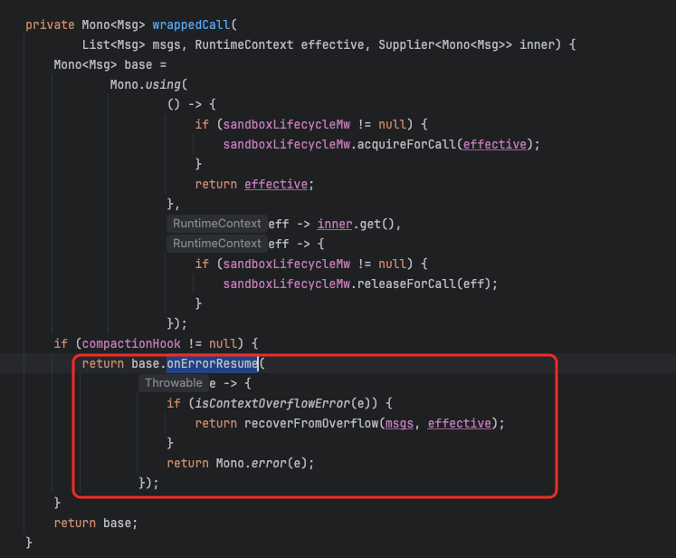
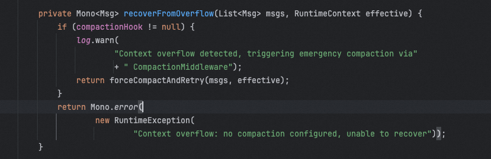
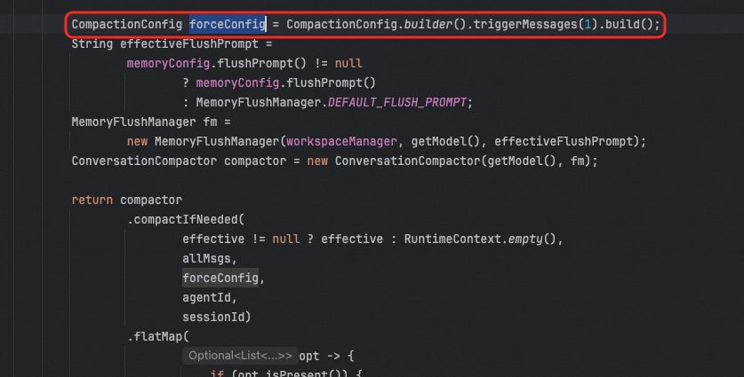

# ✅AgentScope Java 2.0中的上下文压缩

前面介绍了说ASJ 2中把Memory给干掉了，但是我们介绍ASJ 1.0的时候，说过一个上下文自动压缩，他也是基于Memory机制扩展的。那么2.0中又是则呢么做的呢？

2.0 里这套机制部以 middleware 形式插到 onReasoning 钩子上,自动运行、可独立开关:

| 策略 | 处理的问题维度 | 实现 |
| --- | --- | --- |
| **对话摘要压缩** | context 的**深度**<br>(消息条数/累计 token 太多) | CompactionMiddleware<br>+<br>ConversationCompactor |
| **大工具结果卸载** | context 的**宽度**<br>(单条 TOOL 消息太大) | ToolResultEvictionMiddleware |
| **上下文溢出兜底** | 模型端仍抛 context_length_exceeded | HarnessAgent.recoverFromOverflow+forceCompactAndRetry |

3条策略默认全开、也可以单独关闭。

**对话摘要压缩**

CompactionMiddleware 实现了 HarnessRuntimeMiddleware，挂接在 ReActAgent 的 onReasoning 钩子点，所以每次模型推理前都会先跑一遍压缩检查。

它的工作步骤是：先把 ReasoningInput.messages() 里的 SYSTEM 消息拆出来，剩余的非 SYSTEM 消息交给 ConversationCompactor.compactIfNeeded；如果触发了压缩，就把结果写回 AgentState.contextMutable()，再把 SYSTEM 消息拼回去构造新的 ReasoningInput 传给下游。

```text
public Flux<AgentEvent> onReasoning(Agent agent, RuntimeContext ctx,
                                     ReasoningInput input,
                                     Function<ReasoningInput, Flux<AgentEvent>> next) {
    // ① 拆 system 与 conversation
    Msg systemMsg  = /* messages[0] if SYSTEM */;
    List<Msg> conv = /* rest */;

    // ② 动态阈值展开
    CompactionConfig eff = resolveEffectiveConfig();

    // ③ 交给 ConversationCompactor
    return compactor.compactIfNeeded(ctx, conv, eff, agentId, sessionId)
            .flatMapMany(opt -> {
                if (opt.isPresent()) {
                    // ④ 就地覆写 AgentState.contextMutable()
                    applyToContext(state, opt.get());
                    // ⑤ 构造新 ReasoningInput
                    List<Msg> newMsgs = withSystem(systemMsg, opt.get());
                    return next.apply(new ReasoningInput(newMsgs,
                                                        input.tools(),
                                                        input.options()));
                }
                return next.apply(input);         // ⑥ 未压缩透传
            })
            .onErrorResume(e -> next.apply(input)); // ⑦ 任何异常降级
}
```

核心压缩算法在ConversationCompactor中，执行流程如下

**第一步，先做两层轻量级非 LLM 预处理。** 先执行 truncateArgs 截断旧消息里 ToolUseBlock 的大字符串参数，再执行 pruneToolResults 对旧工具结果做 head+tail 裁剪。这两步只改“保留窗口之外”的旧消息，近期消息不动。

```text
// Step 1a: Lightweight arg truncation (non-LLM).
// Step 1b: Aggregate tool-result pruning (non-LLM).
List<Msg> messages =
        pruneToolResults(
                truncateArgs(conversationMessages, config.getTruncateArgsConfig()),
                config.getPruneConfig());
```

**第二步，检查触发条件。** 触发可以是消息数（triggerMessages）或估算 token 数（triggerTokens）。

默认Builder 里 triggerMessages=50、triggerTokens=0，后者表示动态模式：实际阈值由 model.getContextWindowSize() - reserved 计算，reserved 默认 20k。如果模型没上报 context window，则回退到 160k（CompactionConfig.FALLBACK_TRIGGER_TOKENS）。

Token 估算由 TokenCounterUtil 完成，采用字符比例法：每个 token 约 2.5 个字符，并为消息结构、tool call、tool result 加上固定开销。这是一个工程估算，不是精确 tokenizer。

```text
int totalTokens = TokenCounterUtil.calculateToken(messages);
if (!shouldCompact(messages, totalTokens, config)) {
    return Mono.just(Optional.empty());
}
```

**第三步，确定 cutoff。** determineCutoffIndex 决定从哪里把对话切成“前缀（待摘要）”和“尾部（保留原文）”。它支持按消息数保留（keepMessages）或按 token 预算保留（keepTokens）。

默认是动态模式：keepTokens=-1，有效值为 min(8k, max(2k, (contextWindow - reserved) * 0.25))。cutoff 还会被 findSafeCutoffPoint 调整，确保不会把 ASSISTANT 的 tool-call 和对应的 TOOL result 拆开。

```text
int cutoff = determineCutoffIndex(messages, totalTokens, config);
if (cutoff <= 0) {
    log.debug("Compaction triggered but safe cutoff is 0 — skipping");
    return Mono.just(Optional.empty());
}
```

**第四步，长期记忆 flush 与消息 offload（可选）。** 默认 flushBeforeCompact=true、offloadBeforeCompact=true。MemoryFlushManager.flushMemories 会调一次 LLM，从即将被摘要掉的前缀里抽取事实，追加到 &lt;workspace&gt;/memory/YYYY-MM-DD.md；offloadMessages 则把整段原始消息按 stable Msg ID 去重后写入 session JSONL。

```text
// Step 2: Flush long-term memories from the prefix (best-effort).
Mono<Void> flushStep =
        config.isFlushBeforeCompact()
                ? flushManager
                        .flushMemories(rc, prefix)
                        .doOnSuccess(v -> log.debug("Memory flush before compaction done"))
                        .onErrorResume(
                                e -> {
                                    log.warn(
                                            "Memory flush before compaction failed: {}",
                                            e.getMessage());
                                    return Mono.empty();
                                })
                : Mono.empty();

// Step 3: Offload raw messages to JSONL and capture the file path.
// If offload fails, we continue with null — the summary message falls back to the
// simple format without a file reference.
Mono<String> offloadStep;
if (config.isOffloadBeforeCompact()) {
    offloadStep =
            Mono.fromCallable(
                            () -> {
                                flushManager.offloadMessages(
                                        rc, messages, agentId, sessionId);
                                return flushManager.resolveOffloadPath(
                                        rc, agentId, sessionId);
                            })
                    .doOnSuccess(
                            path ->
                                    log.debug(
                                            "Message offload before compaction done,"
                                                    + " path={}",
                                            path))
                    .onErrorResume(
                            e -> {
                                log.warn(
                                        "Message offload before compaction failed: {}",
                                        e.getMessage());
                                return Mono.just("");
                            });
} else {
    offloadStep = Mono.just("");
}
```

**第五步，LLM 摘要。** summarizePrefix 把前缀消息格式化成文本，替换进 prompt 模板 &#123;messages&#125;，再调用模型流式生成摘要。

默认 prompt 要求模型按 SESSION INTENT / SUMMARY / ARTIFACTS / NEXT STEPS 四个小节输出。注意，之前的 summary 消息会被保留在摘要输入里，这样多次压缩可以层层叠加；但它们会被过滤掉，不参与 memory flush，避免重复提取。

```text
return flushStep
        .then(offloadStep)
        .flatMap(
                offloadPath ->
                        summarizePrefix(prefix, config)
                                .map(
                                        summary -> {
                                            String filePath =
                                                    offloadPath.isBlank()
                                                            ? null
                                                            : offloadPath;
                                            Msg summaryMsg =
                                                    buildSummaryMessage(summary, filePath);
                                            List<Msg> compacted = new ArrayList<>();
                                            compacted.add(summaryMsg);
                                            compacted.addAll(tail);
                                            log.info(
                                                    "Compaction complete: {} msgs → 1"
                                                            + " summary + {} tail = {}"
                                                            + " total",
                                                    messages.size(),
                                                    tail.size(),
                                                    compacted.size());
                                            return Optional.of(compacted);
                                        }));
```

**第六步，重建消息列表。** 最终返回 [summaryUserMsg] + preservedTail]。摘要消息是一个 USER 角色消息，name 被设为 __compaction_summary__，ID 由内容哈希生成以保证幂等。如果之前做了 offload，摘要消息里还会带上原始对话文件路径，提示模型可以用 read_file 查看详情。

```text
Msg summaryMsg =
        buildSummaryMessage(summary, filePath);
List<Msg> compacted = new ArrayList<>();
compacted.add(summaryMsg);
compacted.addAll(tail);
log.info(
        "Compaction complete: {} msgs → 1"
                + " summary + {} tail = {}"
                + " total",
        messages.size(),
        tail.size(),
        compacted.size());
return Optional.of(compacted);
```

大工具结果卸载

ToolResultEvictionMiddleware 与摘要压缩独立运行，专门处理“单条消息太宽”。

它在 onReasoning 时扫描 ToolResultBlock，如果文本长度超过 maxResultChars（默认 80k 字符，约 20k tokens），就把全文写到 &#123;evictionPath&#125;/&#123;agentName&#125;/&#123;toolCallId&#125;-&#123;hash&#125;，同时在上下文里替换为一个 placeholder，包含首尾各 previewChars（默认 2k）字符以及 read_file 路径提示。

默认排除 read_file、write_file、edit_file、grep_files、glob_files、list_files、memory_search、memory_get、session_search，但**不排除** execute，因为 shell 输出可能非常大。

上下文溢出兜底

HarnessAgent 在 call() 异常路径上注册了 onErrorResume。



当错误信息匹配 context_length_exceeded、maximum context、token limit 等关键字时，会调用 forceCompactAndRetry。



这里会构造一个 triggerMessages=1 的极端配置，强制压缩到只剩 1 条摘要消息，然后让底层 delegate 重新 call 一次。这个兜底只有在 builder 里没禁用 compaction 时才生效。



---

来源: https://thoughts.aliyun.com/workspaces/6963289eb0fc2e001bb052eb/docs/6a61c28d74e4030001eb8600
