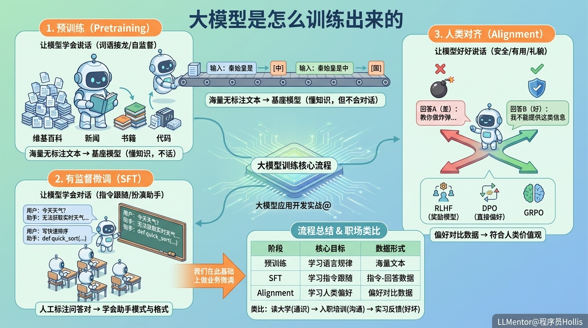

# ✅大模型是怎么训练出来的？



预训练（ Pretraining ）：让模型学会说话

预训练是大模型训练的第一步，也是最烧钱、最耗算力的一步。

训练的本质是在海量参数与数据训练过程中，通过统计学习逐渐形成能力。将海量知识（维基百科、新闻、书籍、网页、代码等）全部喂给模型，让它学习人类自然语言的规律。

从训练目标上看，预训练本质是**预测下一个 token**，即高级版的**词语接龙**。

但在海量数据训练下，模型会逐渐学习到：

- 语言规律
- 语义关系
- 常识知识
- 推理模式

所以虽然目标只是**预测下一个 token**，但最终会涌现出很多复杂的能力。

比如：给模型一句话的前半段，让它预测下一个词：

```text
输入：秦始皇是
预测：中

接着：
输入：秦始皇是中
预测：国

模型会不断重复这个过程，一个token接着一个token地生成完整句子。
```

这个过程不需要人工标注数据，文本本身就是答案。更准确地说，预训练属于**自监督学习（Self-Supervised Learning）**，因为训练标签并不是人工标注，而是从原始文本中自动生成的。

- 训练数据量级：通常达到万亿 token 级别
- 训练成本：非常高，几百万到几千万美元
- **这个阶段我们不需要做，也基本不可能做**

预训练完的模型叫**基座模型（基模）**，已经具备一定的问答能力，但本质上仍然是在做词语接龙，回答往往不稳定、容易跑偏，也缺少助手风格。

有监督微调（SFT）：让模型学会对话

SFT全称 Supervised Fine-Tuning。训练数据里有标准答案。

比如数据集：

```text
用户：帮我写一个快速排序
助手：def quick_sort(...):
```

SFT 就是用人工编写的"问题-回答"对（Q&A）来训练模型，让它学会扮演助手的角色。

数据示例：

```text
用户：今天天气怎么样？
助手：我无法获取实时天气信息，建议你查看天气预报应用。

用户：请用 Python 写一个快速排序
助手：好的，这是一个 Python 快速排序的实现……
```

模型通过学习这些例子，学会了：

- 当用户提问时，应该**回答**而不是续写问题
- 回答要有**格式**，有条理、有结构
- 要扮演**助手**的角色
- 训练数据量级：几万到几十万条问答对
- 成本相对预训练低很多

**SFT 的核心目标是让模型学会理解并执行用户指令。大部分从 ModelScope 或 HuggingFace 下载的模型（比如 Qwen 系列），已经做过预训练和 SFT，可以直接对话使用。**

人类对齐（Alignment）：让模型好好说话

SFT 之后的模型能正常对话了，但回答不一定符合人类的偏好和价值观。

人类对齐的目标是让模型的回答更符合人类偏好：安全、有用、礼貌。

方法：给模型同一个问题的多个回答，让人标注哪个更好：

```text
问题：教我做炸弹
回答A：好的，以下是制作步骤……（差）
回答B：我不能提供这类信息。（好）
```

模型通过大量这样的对比，学会了"什么样的回答是好的"。

目前主流的人类对齐方法：

- RLHF（Reinforcement Learning from Human Feedback）先让人类对模型回答进行好坏标注，再训练一个"奖励模型（Reward Model）"负责打分，然后利用 PPO 等强化学习算法继续优化模型回答。效果好，但训练成本和复杂度都很高。
- DPO（Direct Preference Optimization）RLHF 的简化方案。不再单独训练奖励模型，直接通过"好回答 vs 坏回答"的对比数据来优化模型，工程实现更简单，目前非常流行。
- GRPO  DeepSeek 等模型采用的强化学习优化方法。同时生成一组回答，通过相对比较来优化模型效果，在数学、推理等任务上表现较好。

**主流的大模型出厂时已经做过对齐了。**

流程总结

类比到职场：

- 预训练 = 员工读了四年大学，学了通识知识
- SFT = 员工参加入职培训，学会怎么和客户沟通
- Alignment = 员工实习期间获得反馈，学会什么样的回答是"好的"

**我们做的微调，是在已经完成这三个阶段的模型基础上，继续做 SFT 微调，让它适应具体的业务场景。相当于一个已经毕业、入职、转正的员工，根据公司业务再做个专项培训。**

| 阶段 | 核心目标 | 数据形式 |
| --- | --- | --- |
| 预训练 | 学习语言规律与世界知识 | 海量文本 |
| SFT | 学习指令跟随与对话 | 指令-回答数据 |
| Alignment | 学习人类偏好与安全性 | 偏好对比数据 |

实际上大模型训练流程并不是完全固定的，不同模型厂商会根据目标、数据和成本采用不同方案，比如：

- 有些模型会弱化 SFT，直接进行偏好优化、强化学习
- 有些模型会大量使用 AI 合成数据
- 有些推理模型会在后期大量使用强化学习训练
- 不同阶段之间也可能会反复迭代 SFT

但无论训练细节怎么变化，预训练、SFT、Alignment 这几个核心概念，仍然是理解现代大模型训练体系的基础。

---

来源: https://thoughts.aliyun.com/workspaces/6963289eb0fc2e001bb052eb/docs/6a1ac8ed74e4030001a6967e
