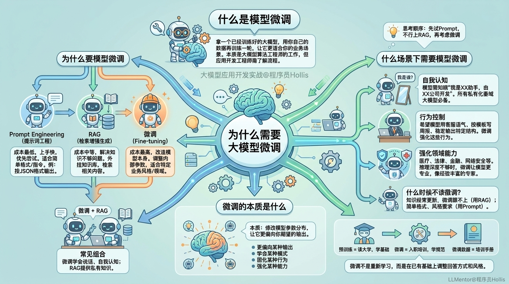

# ✅为什么需要大模型微调？

什么是模型微调

模型微调是拿一个已经训练好的大模型，用自己的数据再训练一轮，让它更适合你的业务场景。**绝大部分场景根本用不到微调。**

微调本质上是**大模型算法工程师**干的活。背后涉及大量的数学公式、最优化理论、强化学习、概率统计等。

作为大模型应用开发工程师，至少要对微调的整个流程了然于胸，能自己把一个开源模型跑起来、完成微调、部署上线。

本课程不涉及复杂的数学公式和算法，只讲应用。

为什么要模型微调

当大模型在业务中不好用的时候，通常有三种解决方案：

**Prompt Engineering（提示词工程）**：在提问方式上做文章。成本低，上手快，大部分场景优先试这个。

**RAG（检索增强生成）**：给模型外挂一个知识库。解决的是大模型私有知识不够的问题。

**微调（Fine-tuning）**：用针对性的数据再训练，调整模型内部参数，让它更适合业务场景。解决的是 Prompt 和 RAG 都搞不定的问题。

| 方案 | 改什么 | 解决什么问题 | 成本 |
| --- | --- | --- | --- |
| Prompt Engineering | 怎么问 | 简单格式/指令 | 最低 |
| RAG | 外挂知识 | 知识不够 | 中等 |
| 微调 | 模型本身 | 风格/行为/领域 | 高 |

一般在一些垂直领域的公司，**微调 + RAG** 是很常见的组合。

什么场景下需要模型微调

按优先级：先试 Prompt，不行上 RAG，都搞不定再考虑微调。

典型需要微调的场景：

**自我认知：**模型部署给客户用，需要通过微调让模型知道"我是 XX 助手，由 XX 公司开发"。所有私有化垂域大模型都必须做这一步。

**行为控制：**让模型用客服语气说话、按公司模板写周报、稳定输出特定 JSON 结构。微调可以把这些行为强化到模型中。

**强化领域能力。**医疗、法律、金融、网络安全等垂直领域，通用大模型推理深度不够。通过微调可以让模型在特定领域表现得更专业。

什么时候不该微调？只是知识不够用 RAG；知识经常更新用 RAG；只是格式要求、指令要求用 Prompt。

微调的本质是什么

**微调就是修改模型的参数分布，让它更偏向你期望的输出。**

微调让模型可以做到：

- **更偏向某种输出**：比如让模型总是用客服语气回答
- **学会某种模式**：比如让模型学会一种推理方式
- **固化某种行为**：比如让模型稳定地说"我是 XX 公司的 XX 助手"
- **强化某种能力**：比如让模型在医疗、法律领域回答得更专业

类比：

- 预训练 = 员工读了四年大学，学了基础知识
- 微调 = 员工入职培训，学会按公司规范工作
- 微调数据 = 公司的培训手册

微调不是让模型重新学习所有知识，而是在已有知识基础上，调整回答方式和风格。

---

来源: https://thoughts.aliyun.com/workspaces/6963289eb0fc2e001bb052eb/docs/6a1ac91dd31fed000189e4e4
