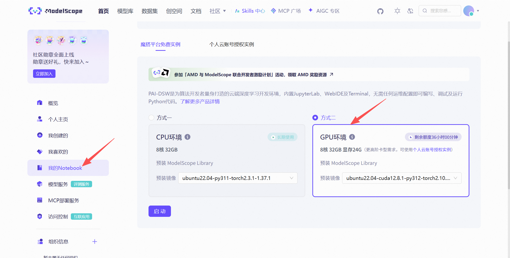
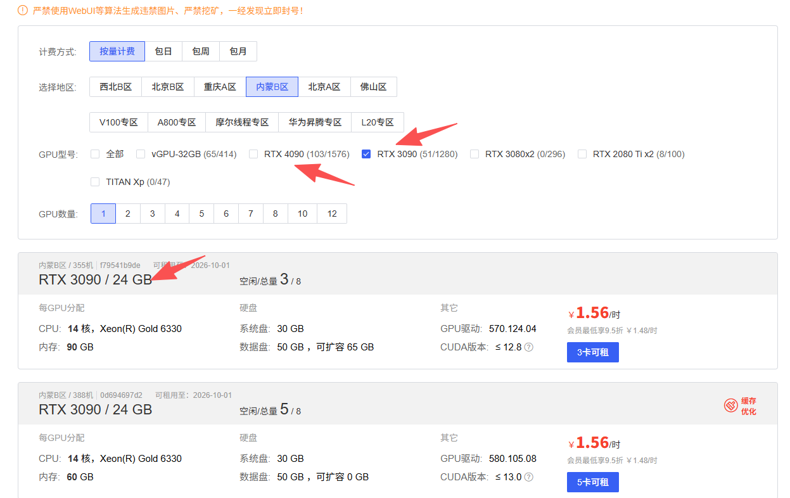
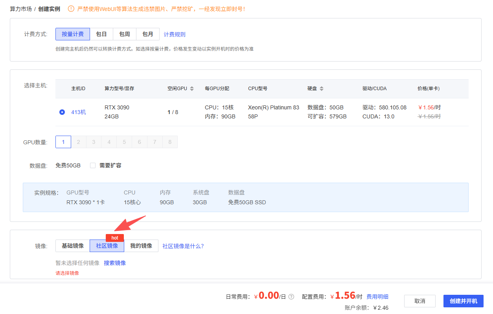
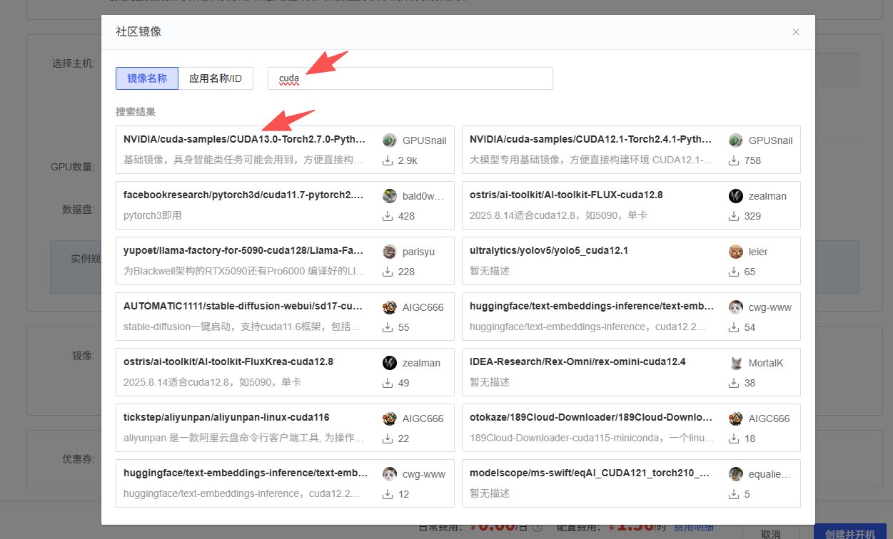
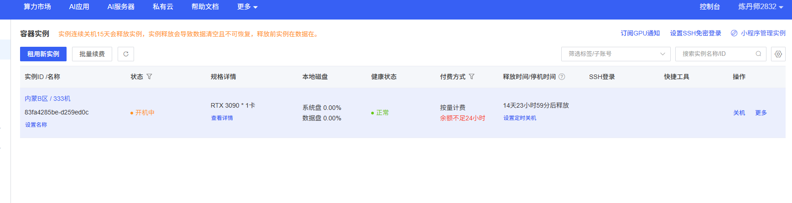
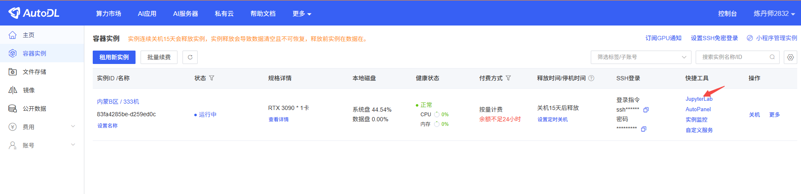
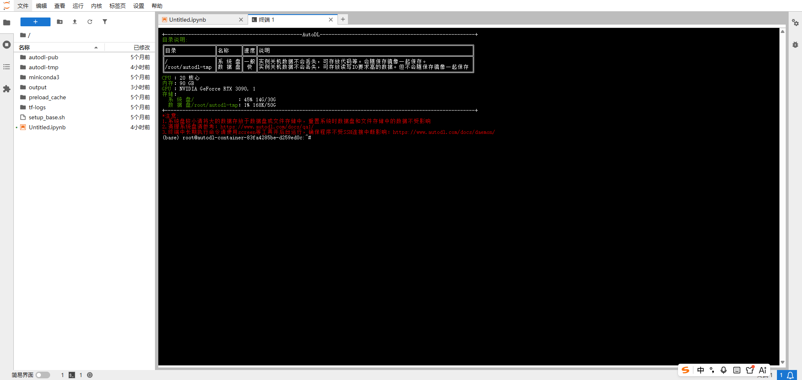
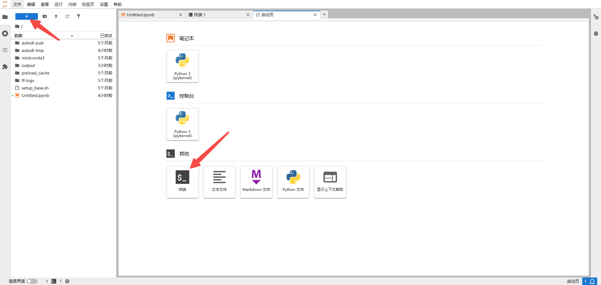
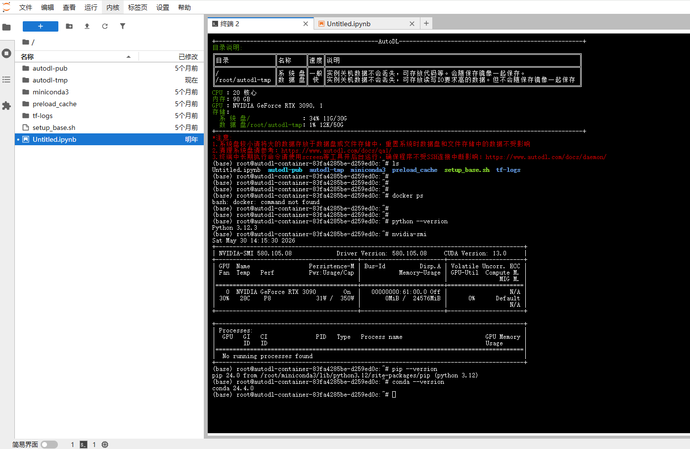

# ✅训练服务器准备

服务器选择

可以从Autodl租一台服务器，或者modelscope也有一定免费的额度，GPU的选择需要参考你要训练的模型大小以及数据来决定，可以参考下面的来估计：

[AutoDL算力云 | 弹性、好用、省钱，GPU算力零售价格新标杆](https://www.autodl.com/)

[ModelScope 魔搭社区](https://modelscope.cn/)



| **模型规模** | **训练方法** | **理论最小显存 (静态)** | **建议显存 (含激活值/Buffer)** |
| --- | --- | --- | --- |
| **7B** | LoRA (int8) | ~8 GB | 12 - 16 GB |
| **7B** | LoRA (BF16) | ~14 GB | 18 - 24 GB |
| **7B** | Full (BF16) | ~112 GB | 140 GB+ (多卡/ZeRO3) |
| **32B / 35B** | QLoRA (4bit) | ~20 GB | 28 - 32 GB |
| **32B / 35B** | LoRA (BF16) | ~64 GB | 80 GB+ (A100/H100) |
| **70B / 72B** | QLoRA (4bit) | ~40 GB | 48 - 60 GB |

**理论最小显存（静态）的含义是：模型权重本身加载到 GPU 所需的最低显存，不包含训练过程中的激活值、优化器状态、缓存等额外开销。**

**公式示例（经验值）：** 训练一个 7B 模型：

- **全参数 (BF16):**7×16=112GB (需要 2 张 A100 80G 或 DeepSpeed ZeRO-3)
- **LoRA (BF16):**7×2≈14GB + 还需要算激活值，通常可能需要18GB~24GB (单张 24G 显卡如 3090/4090 可胜任)

LoRA 的 “×2” 指的是：冻结后的模型只需要存储 BF16 权重本身，而 BF16 每个参数占 2 bytes。比如 7B 模型：

7 × 10^9 × 2 bytes ≈ 14 GB

因为 LoRA 不训练原模型，所以不需要为 7B 参数保存：

- 梯度 2
- Adam optimizer 状态 8
- FP32 master weight 4

这些才是全参数训练显存暴涨的主要原因。LoRA 真正训练的只有很小的 A/B 矩阵，所以整体显存会低很多。

AutoDL环境配置

AutoDL 上有很多可选服务器，使用 docker 镜像提供服务。**选择地区**选项如果某地区显卡不足，切换地区即可。

显卡选择：7B 以下参数的模型，LoRA 微调单卡 24GB 显存就能胜任。学习用途选择便宜的即可。

选用 RTX3090，显存 24GB，完全胜任 7B 大模型 LoRA 微调。



选择镜像：AutoDL 上有已安装好环境的镜像，拿来即用。如果是自己的服务器，建议直接使用现成的 docker 镜像部署。



点击社区镜像，搜索镜像名称输入 `cuda`，主要关注 CUDA 驱动版本（如果出问题升级非常麻烦），选择下载量最高的镜像。



AutoDL 会自动创建容器实例，不用时记得关机或仅无卡启动。



点击快捷工具下的 Jupyter 进入容器。





新打开窗口点击 +号，选择终端或 Jupyter。



验证环境版本：



**注意：AutoDL 本身就是一个容器环境，里面不能再套 Docker。需要安装什么框架，直接 pip install 就行。**

主要查看 Python 版本、GPU 信息、pip 版本、conda 版本。

```text
#Python版本
python --version

#查看显卡
nvidia-smi

#pip版本
pip --version

#conda版本
conda --version
```

---

来源: https://thoughts.aliyun.com/workspaces/6963289eb0fc2e001bb052eb/docs/6a259a243fb9180001973e67
