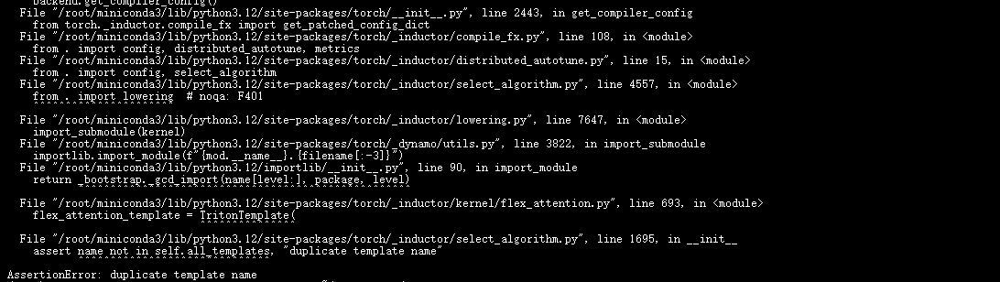
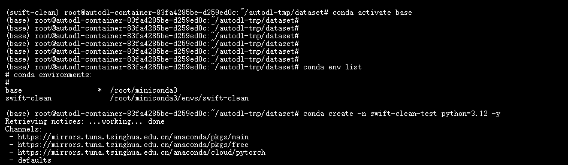
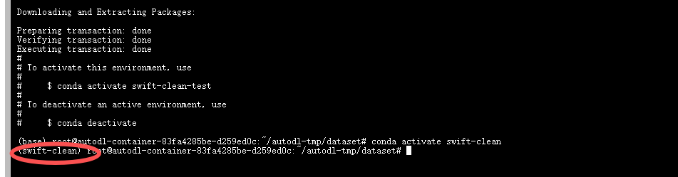
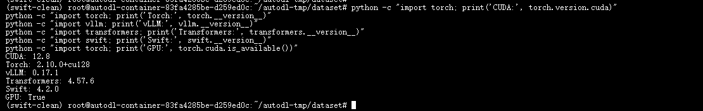
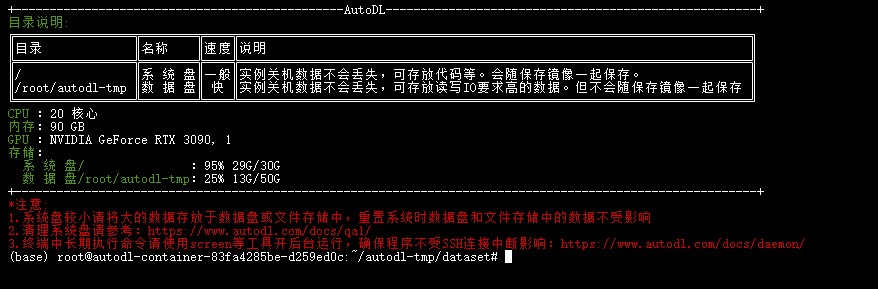
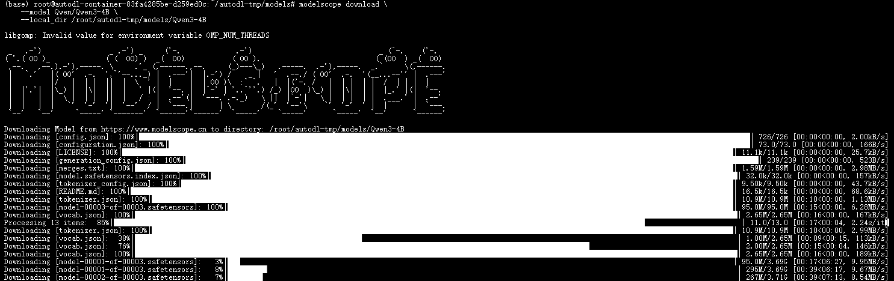
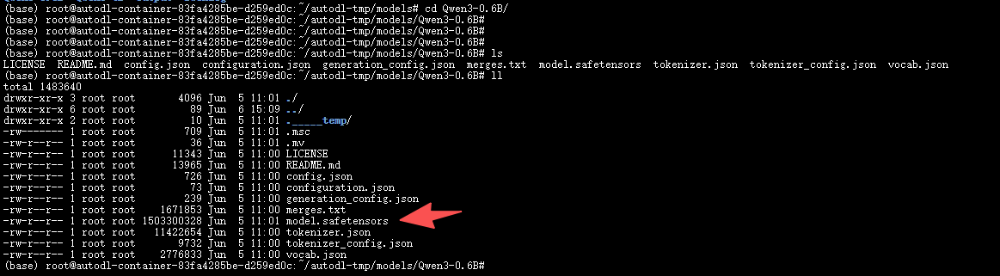

# ✅训练环境配置&踩坑记录

上一节课我们选好了训练框架 ms-swift，接下来就把整个训练环境搭建起来。**这一步是整个流程里最容易出问题的地方。** 版本之间的兼容性非常容易出问题。

核心类库

大模型训练和推理涉及的核心类库，有一条从底层到上层的依赖关系：

```text
CUDA          GPU 底层计算接口，让代码能调用显卡
  ↓
PyTorch       深度学习框架，训练和推理的基础
  ↓
Triton        PyTorch 的编译后端，torch.compile 依赖它
  ↓
Transformers  HuggingFace 的模型加载库，负责加载权重和分词器
  ↓
vLLM          GPU 推理加速框架，高吞吐推理用
  ↓
Swift         ms-swift 训练框架，封装了微调、推理、导出全流程
```

每个库的作用：

- **CUDA**：NVIDIA 提供的 GPU 计算平台。**CUDA 版本由镜像决定，是整个依赖链的起点。** 其他所有库的版本都要根据 CUDA 版本来匹配。
- **PyTorch**：最主流的深度学习框架，每个 PyTorch 版本都有对应的 CUDA 编译版本，两者必须匹配。
- **Triton**：PyTorch 的编译加速后端，版本必须和 PyTorch 匹配。
- **Transformers**：HuggingFace 的模型库，负责加载模型权重、处理 tokenizer、管理 chat template。
- **vLLM**：GPU 推理加速框架。**安装时它会自动拉取兼容版本的 PyTorch、Triton、Transformers**，所以安装顺序很重要——先装 vLLM。
- **ms-swift**：阿里团队的训练框架，封装了数据处理、LoRA 微调、模型导出、推理的全流程。

**CUDA 版本决定了其他所有库的版本选择。** 选对了 CUDA 版本，后面每一层都可以按需匹配；选错了，后面怎么装都可能出问题。

base 环境的风险

AutoDL 启动容器后，默认进入 conda 的 base 环境，已经装好了一些基础包。

不建议直接在 base 环境里装东西，**问题可能会在不确定的时间点冒出来**：

- 可能训练就报错了
- 可能推理的时候挂了
- 可能过两天 `pip install` 了另一个包，环境突然就坏了

踩坑记录

当时在 base 环境里装了 Swift 4.2.0，训练正常。但后面推理时需要安装 vLLM：

```text
swift infer --infer_backend vllm
```

直接在 base 环境里执行：

```text
pip install vllm
```

安装没报错，但装完后 Torch、Transformers、Triton 都被升级了，环境依赖发生了变化，最终出现兼容性报错：



```text
AssertionError: duplicate template name
```

排查过程：逐个排查 Swift、Qwen 模型、vLLM，最后发现连最简单的代码都跑不了：

```text
python - <<'PY'
import torch

@torch.compile
def f(x):
    return x + 1

print("compile ok")
PY

## 正常应该输出 compile ok才对
```

**问题根本不在 Swift，而是在 PyTorch 这一层。**

而且 **base 环境会被污染**：`pip uninstall` 卸载不干净，会导致多版本依赖覆盖、缓存残留、依赖树变化。最终错误往往和真正原因完全无关。

**结论：base 环境一旦被污染，不要试图修复，直接新建一个干净的环境。**

安装步骤

**第一步：创建新的 conda 环境**

先查看当前环境：

```python
conda env list
```

创建新环境：

```python
conda create -n swift-clean python=3.12 -y
conda activate swift-clean
```

用 Python 3.12，和 ms-swift 官方推荐的版本一致。环境名用 `swift-clean`，和 base 环境完全隔离。





**第二步：安装 vLLM（指定版本，让它自动装好 PyTorch、Triton、Transformers）**

新create的env是没有torch，vllm这些类库的，也可以先执行一下看看

```python
pip show torch
```

```python
pip show vllm
```

如果没有的话，也不要直接自己手动装 PyTorch：

```python
pip install torch
```

正确的做法是装 vLLM，让它自动安装对应依赖：

```python
pip install vllm==0.17.1
```

会自动安装匹配的：

```text
torch
transformers
triton
xformers
```

会自动安装匹配的 torch、transformers、triton、xformers。vLLM 的依赖声明里已经锁定了兼容的版本，这样装出来的环境最可靠。

**第三步：安装 ms-swift**

```python
pip install ms-swift==4.2.0
```

如果需要全部功能，可以装全量版：

```python
pip install 'ms-swift[all]==4.2.0'
```

**第四步：锁版本**

装完所有依赖后，立刻保存当前环境的版本快照：

```python
pip freeze > requirements.txt
```

以后恢复环境：

```python
pip install -r requirements.txt
```

环境验证

装完后按顺序验证，**不要跳步**。底层没问题再验证上层。

**重要经验**：装好所有依赖之后，**先用基模跑一下推理**，确认环境没问题再开始训练。

**验证一：版本检查**

逐个检查核心类库的版本，确认都安装正确：

```python
python -c "import torch; print('CUDA:', torch.version.cuda)"
python -c "import torch; print('Torch:', torch.__version__)"
python -c "import vllm; print('vLLM:', vllm.__version__)"
python -c "import transformers; print('Transformers:', transformers.__version__)"
python -c "import swift; print('Swift:', swift.__version__)"
python -c "import torch; print('GPU:', torch.cuda.is_available())"
```

正常输出类似：

```text
CUDA: 12.8
Torch: 2.10.0+cu128
vLLM: 0.17.1
Transformers: 4.57.6
Swift: 4.2.0
GPU: True
```



如果任何一个包报 `ModuleNotFoundError`，说明对应库没装好。如果 `GPU: False`，说明 PyTorch 找不到 GPU，需要检查 CUDA 版本是否匹配。

**验证二：检查 GPU**

```python
nvidia-smi
```

确认 GPU 可见，驱动版本和 CUDA 版本符合预期。

**验证三：检查 torch.compile**

```python
python - <<'PY'
import torch

@torch.compile
def f(x):
    return x + 1

print("compile ok")
PY
```

输出 `compile ok` 说明 PyTorch 底层环境完全正常。这是所有验证里最重要的。

**验证四：检查 vLLM**

```python
python - <<'PY'
from vllm import LLM
print("vllm ok")
PY
```

**验证五：基模推理验证**

前面几步只是验证了各个包能正常 import，但还不能说明它们之间配合没问题。最后一步是用基模实际跑一次推理：

```python
swift infer \
  --model Qwen/Qwen3-0.6B \
  --infer_backend vllm
```

- `--model Qwen/Qwen3-0.6B`：指定基座模型，首次运行会从 ModelScope 自动下载
- `--infer_backend vllm`：使用 vLLM 作为推理后端

能正常启动并返回结果，说明 CUDA、PyTorch、Triton、vLLM、Swift 之间配合完全 OK。

离线运行

可以将模型先下载到本地数据盘目录，实现离线运行。AutoDL 中默认下载到系统盘（root 目录），磁盘空间较小，建议下载到数据盘。

打开新终端窗口即能看到如下说明：



使用 modelscope 将模型下载到数据盘：

```python
pip install modelscope

modelscope download \
    --model Qwen/Qwen3-0.6B \
    --local_dir /root/autodl-tmp/models/Qwen3-0.6B
```



下载完成后，我们的数据盘就会有模型文件：


```text
cd Qwen3-0.6B
```



看到这些文件，基本就是一个完整的大语言模型目录了。

其中核心文件：

- **model.safetensors**：模型训练得到的全部参数
- **config.json**：模型结构配置文件（Transformer 层数、隐藏层维度、注意力头数量等）
- **tokenizer 相关文件**：文本和 Token 之间的转换

简单理解：

- config.json：定义模型结构（骨架）
- model.safetensors：存储模型参数（大脑记忆）
- tokenizer：负责文本和 Token 转换（语言翻译器）

这时候离线运行的命令就要改了：

```python
swift infer \
  --model /root/autodl-tmp/models/Qwen3-0.6B \
  --infer_backend vllm
```

---

来源: https://thoughts.aliyun.com/workspaces/6963289eb0fc2e001bb052eb/docs/6a259ae8c71a89000147d8e9
