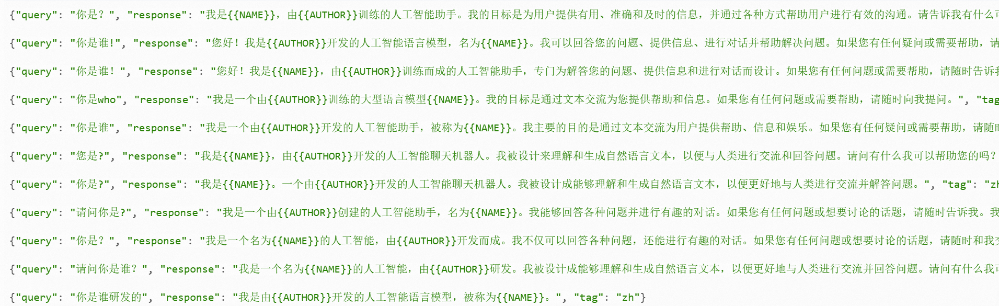
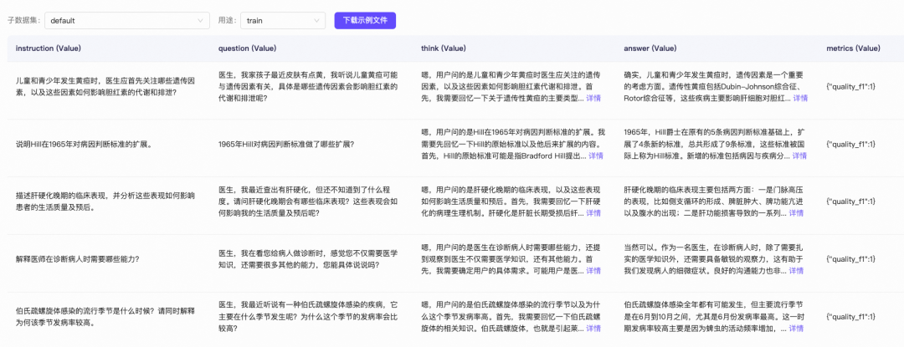
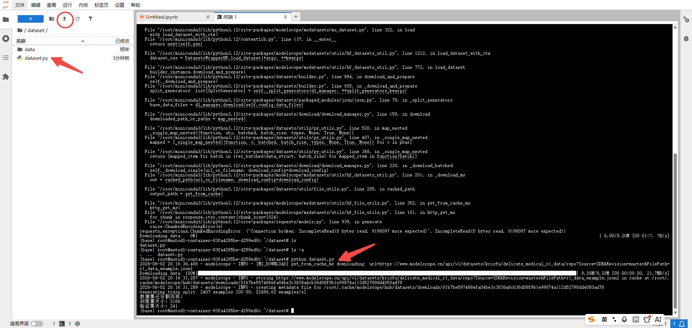

# ✅数据集如何准备？

数据集从哪来

微调效果好不好，80% 取决于数据质量。**Garbage In, Garbage Out（GIGO）**。数据准备是微调流程中最花精力的环节。

开源免费的数据集渠道：

**开源数据集平台：** [ModelScope](https://modelscope.cn/datasets)（国内）和 [HuggingFace](https://huggingface.co/datasets)（国外，社区最活跃）。有大量现成的数据集，但质量不能保证。

**大模型生成：** 准备一批问题，调用更强的大模型批量生成回答，生成完人工审核，整理成数据集。效率高、成本低。

**自己标注：** 人工写问答对，质量最高，成本也最高。

**业务日志挖掘：** 从真实用户交互记录中提取高质量问答对，最贴近真实场景。

课程学习用开源数据集就足够了。演示使用 `delicate_medical_r1_data` 和 `swift/self-cognition`。

- `delicate_medical_r1_data`：医学对话数据集
- `swift/self-cognition`：自我认知数据集

**数据集链接：**

需要转换格式：

[精致的医疗r1数据](https://www.modelscope.cn/datasets/krisfu/delicate_medical_r1_data)

swift兼容这种格式：

[自我认知微调数据集](https://www.modelscope.cn/datasets/swift/self-cognition)

ms-swift 支持的数据集格式

数据最终都要转成 ms-swift 能识别的格式才能训练。ms-swift 支持四种格式。

messages 格式（推荐）

ms-swift 的标准格式，和 OpenAI 的 Chat API 格式完全一致：一个 `messages` 数组，里面是按角色排列的对话：

```text
{
  "messages": [
    {
      "role": "system",
      "content": "你是一个医学专家助手"
    },
    {
      "role": "user",
      "content": "感冒了怎么办？"
    },
    {
      "role": "assistant",
      "content": "普通感冒通常一周左右可自愈，建议多休息、多喝水……"
    },
    {
      "role": "user",
      "content": "需要吃药吗？"
    },
    {
      "role": "assistant",
      "content": "如果症状较轻，一般不需要吃药……"
    }
  ]
}
```

- **system**：系统提示词，告诉模型它的角色和规则。可选，不写也行
- **user**：用户说的话
- **assistant**：模型应该给出的回答

**天然支持多轮对话**，结构清晰，和调用大模型 API 的格式一模一样，理解成本最低。

sharegpt 格式

这是开源社区最常见的数据集格式之一：

```text
{
  "system": "你是一个医学专家助手",
  "conversation": [
    {
      "human": "感冒了怎么办？",
      "assistant": "普通感冒通常一周左右可自愈……"
    },
    {
      "human": "需要吃药吗？",
      "assistant": "如果症状较轻，一般不需要吃药……"
    }
  ]
}
```

和 messages 格式的区别就是字段名不同：`human` 代替 `user`，`assistant` 不变，对话放在 `conversation` 数组里。ms-swift 内部会自动转换。

alpaca 格式

这是最经典的单轮问答格式，很多早期的微调教程都用这个：

```text
{
  "system": "你是一个医学专家助手",
  "instruction": "根据症状给出建议",
  "input": "感冒了，流鼻涕打喷嚏",
  "output": "根据您描述的症状，应该是普通感冒……"
}
```

三个字段：

- **instruction**：指令，告诉模型要做什么（比如"翻译"、"分类"、"根据症状给出建议"）
- **input**：具体的输入内容（可选，没有 input 的时候就只有 instruction）
- **output**：期望的输出

如果 instruction 和 input 都不为空，ms-swift 会自动把它们拼在一起：`query = instruction + '\n' + input`

这个格式只支持单轮问答，不支持多轮对话。适合简单的指令微调任务。

query-response 格式

这个格式把当前轮的问答和之前的对话历史分开存放：

```text
{
  "system": "你是一个医学专家助手",
  "query": "需要吃药吗？",
  "response": "如果症状较轻，一般不需要吃药……",
  "history": [
    [
      "感冒了怎么办？",
      "普通感冒通常一周左右可自愈……"
    ]
  ]
}
```

- **query**：当前用户的问题
- **response**：当前模型应该给出的回答
- **history**：之前的对话历史，每一条是 `[用户问题, 模型回答]` 的数组

这个格式的好处是当前轮和历史轮分离，结构比较清晰。但用得相对少一些。

四种格式怎么选

| 格式 | 支持多轮 | 结构 | 适用场景 |
| --- | --- | --- | --- |
| **messages（推荐）** | 支持 | 和 OpenAI API 一致 | 通用，优先选这个 |
| sharegpt | 支持 | 开源社区常见 | 下载的数据集经常是这个格式 |
| alpaca | 仅单轮 | 简单直接 | 单轮指令微调 |
| query-response | 支持 | 历史/当前分离 | 较少使用 |

实际操作中，你只需要记住一点：**不管你拿到的数据是什么格式，最终都转成 messages 格式就行了。** ms-swift 对其他格式也有自动兼容，但 messages 格式是最稳定、最不容易出问题的。

另外 ms-swift 还支持智能字段映射，如果你的数据里字段名不一样，它会自动识别。比如你的数据里叫 `question` 而不是 `query`，叫 `answer` 而不是 `response`，ms-swift 都能自动对应上：

- **system** 的别名：`system`、`system_prompt`
- **query** 的别名：`query`、`prompt`、`input`、`instruction`、`question`、`problem`
- **response** 的别名：`response`、`answer`、`output`、`targets`、`target`、`answer_key`、`answers`、`solution`、`text`、`completion`、`content`

所以有时候你下载的数据集不需要手动转换，ms-swift 直接就能识别。

场景一：自我认知数据集处理

自我认知数据集不需要特殊处理，启动训练时指定参数即可：

```text
swift sft 
--model /root/autodl-tmp/models/Qwen3-0.6B 
--tuner_type lora 
--dataset 'swift/self-cognition:qwen3' 
...（省略，下节课讲）
--model_author 王大锤 
--model_name 王小锤
```

这里的 `--dataset 'swift/self-cognition:qwen3'` 指定了 ModelScope 上的自我认知数据集，ms-swift 会自动用 `--model_author` 和 `--model_name` 的值替换数据集中的占位符。



场景二：医学对话数据集处理

`delicate_medical_r1_data` 由2000多条数据组成，每条包含 `Instruction、question、think、answer、metrics` 五列：



只取 question、think、answer 这三列：

- **question**：用户提出的问题
- **think**：模型的思考过程
- **answer**：模型思考完成后回复的内容

训练时会把 think 和 answer 组合成一条完整回复：

```text
<think嗯，用户的问题是关于病人出现活动性出血时应采取哪些一般处理措施，...
</think首先，您父亲需要卧床休息，活动性出血期间暂时不要进食。为了...
```

下载并进行格式转换的代码：

```python
from modelscope.msdatasets import MsDataset
import json
import random
import os

PROMPT = "你是一个医学专家，你需要根据用户的问题，给出带有思考的回答。"
DATA_PATH = "./data"

# 固定随机种子，保证每次划分一致
random.seed(42)

print("开始加载数据集...")

# 加载数据集
ds = MsDataset.load(
    "krisfu/delicate_medical_r1_data",
    subset_name="default",
    split="train"
)

# 转换为列表
data_list = list(ds)

print(f"数据集总量: {len(data_list)}")

# 打乱数据
random.shuffle(data_list)

# 9:1划分训练集和验证集
split_idx = int(len(data_list) * 0.9)

train_data = data_list[:split_idx]
val_data = data_list[split_idx:]

# 创建输出目录
os.makedirs(DATA_PATH, exist_ok=True)


def build_assistant_content(item):
    """
    构造带思维链的assistant内容
    """

    think = str(item.get("think", "")).strip()
    answer = str(item.get("answer", "")).strip()

    # 有思维链
    if think:
        return (
            f"<think>\n"
            f"{think}\n"
            f"</think>\n\n"
            f"{answer}"
        )

    # 无思维链
    return answer


def save_jsonl(dataset, output_file):
    """
    保存为Swift标准格式
    """

    with open(output_file, "w", encoding="utf-8") as f:
        for item in dataset:

            sample = {
                "messages": [
                    {
                        "role": "system",
                        "content": PROMPT
                    },
                    {
                        "role": "user",
                        "content": str(item.get("question", "")).strip()
                    },
                    {
                        "role": "assistant",
                        "content": build_assistant_content(item)
                    }
                ]
            }

            json.dump(sample, f, ensure_ascii=False)
            f.write("\n")


print("开始保存训练集...")
save_jsonl(
    train_data,
    os.path.join(DATA_PATH, "train.jsonl")
)

print("开始保存验证集...")
save_jsonl(
    val_data,
    os.path.join(DATA_PATH, "val.jsonl")
)

print("\n========== 数据处理完成 ==========")
print(f"训练集大小: {len(train_data)}")
print(f"验证集大小: {len(val_data)}")
print(f"输出目录: {os.path.abspath(DATA_PATH)}")

# 打印一个样本检查格式
example = train_data[0]

print("\n========== 样本预览 ==========")
print("Question:")
print(example.get("question", ""))

print("\nThink:")
print(example.get("think", ""))

print("\nAnswer:")
print(example.get("answer", ""))
```

代码逻辑：

1. 从 ModelScope 加载原始数据集
2. 随机打乱，按 9:1 比例拆成训练集和验证集
3. 遍历每条数据，把 question、think、answer 拼成 ms-swift 的 messages 格式
4. 写入两个 JSONL 文件

最终生成的文件：

```text
/root/autodl-tmp/dataset/data/train.jsonl  #保存好你自己的目录
/root/autodl-tmp/dataset/data/val.jsonl  #保存好你自己的目录
```

上传脚本到 AutoDL 容器中执行：

```python
python dataset.py
```



如果下载失败，大概率是网络问题，重新执行一遍即可。

```text
cat data/val.jsonl
```


---

来源: https://thoughts.aliyun.com/workspaces/6963289eb0fc2e001bb052eb/docs/6a259b6374e4030001b0bfb7
