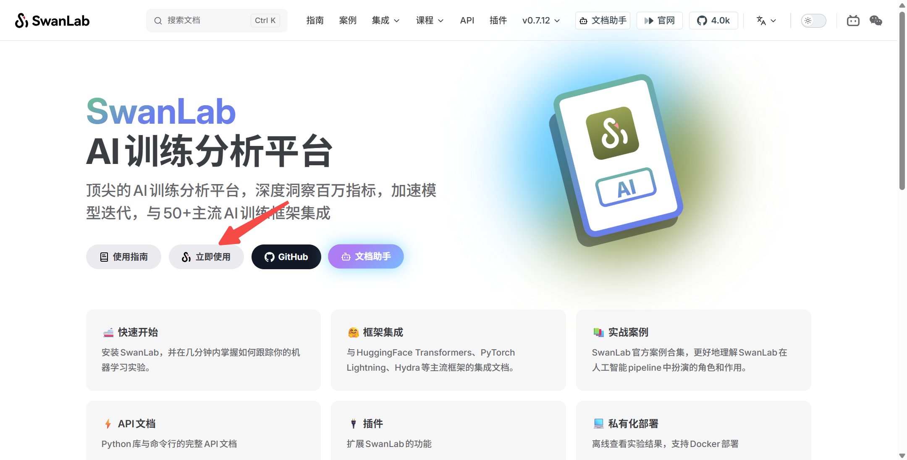
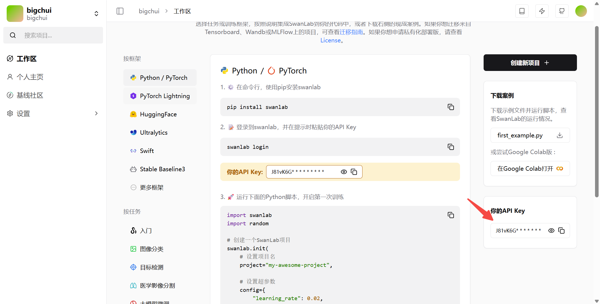
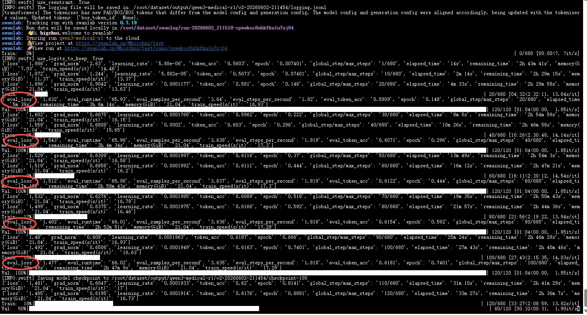
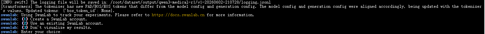
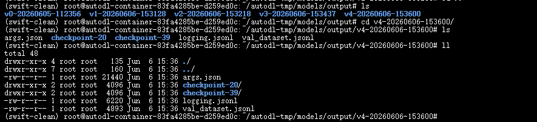
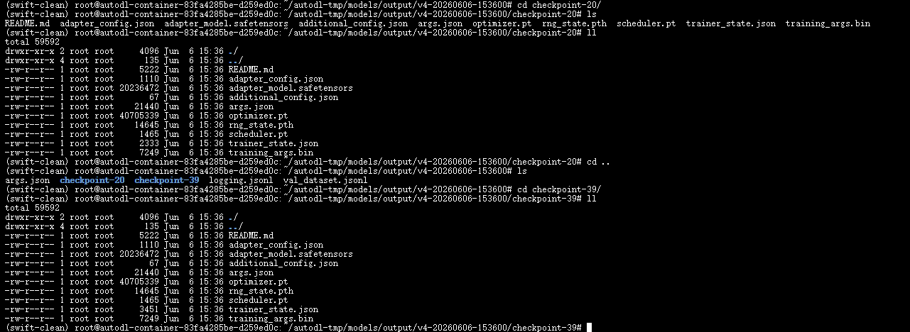
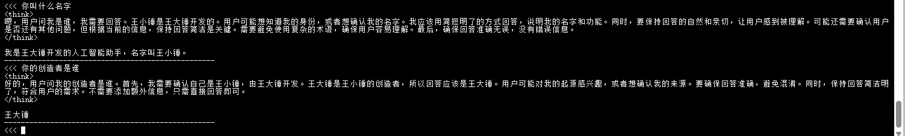
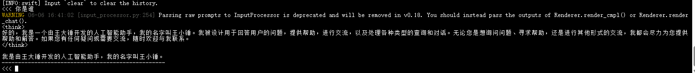

# ✅启动模型训练（上）

SwanLab

**SwanLab** 是一款 AI 训练分析平台，提供**训练可视化、自动日志记录、超参数记录、实验对比、多人协同**等功能，帮助团队快速发现训练问题，加速模型迭代。

我们可以将训练日志上传到 SwanLab 平台，可视化地观测模型的训练效果，非常方便。

到这个网站进行账号注册：

[SwanLab官方文档 | 先进的AI训练分析平台，为顶尖模型团队而生](https://docs.swanlab.cn/)



功能可参考官方文档：

[ModelScope Swift | SwanLab官方文档](https://docs.swanlab.cn/guide_cloud/integration/integration-swift.html)

注册好后在设置页面找到 API Key



后面训练的时候会自动上传数据，你就可以在这里看到所有训练的中间过程了。

开始训练

配置swanlab

在服务器上先安装一下 SwanLab：

```python
pip install swanlab
```

配置环境变量，建议不要把 token 写在命令行参数里，用配置变量更安全。

```python
export CUDA_VISIBLE_DEVICES=0
export SWANLAB_API_KEY="你的token"
```

场景一：自我认知微调

基模选择 Qwen3-0.6B，适合学习微调流程，参数量小，训练速度快。

```python
swift sft \
    --model /root/autodl-tmp/models/Qwen3-0.6B \
    --tuner_type lora \
    --dataset 'swift/self-cognition:qwen3' \
    --split_dataset_ratio 0.1 \
    --torch_dtype bfloat16 \
    --num_train_epochs 20 \
    --per_device_train_batch_size 4 \
    --per_device_eval_batch_size 4 \
    --gradient_accumulation_steps 2 \
    --learning_rate 2e-5 \
    --lora_rank 8 \
    --lora_alpha 16 \
    --target_modules all-linear \
    --eval_steps 10 \
    --save_steps 20 \
    --save_total_limit 2 \
    --logging_steps 5 \
    --max_length 1024 \
    --warmup_ratio 0.1 \
    --dataloader_num_workers 4 \
    --output_dir /root/autodl-tmp/models/output \
    --swanlab_project self-condition \
    --swanlab_exp_name qwen3-self-condition \
    --report_to swanlab \
    --model_author 王大锤 \
    --model_name 王小锤
```

看到这个界面说明微调正式开始了，前面的环境配置、数据准备都没问题。可以看到 eval_loss 也是持续下降的。



如果遇到下面这种情况，说明环境变量没配置成功，或者丢失了。重新配置一下SWANLAB_API_KEY即可。



训练参数

**--model**：指定底座模型。微调不是从零开始训练，而是在预训练模型基础上继续学习。

**--dataset**：训练数据集路径。数据集决定了模型最终学会什么内容。

**--split_dataset_ratio**：验证集划分比例。0.1 表示自动抽取 10% 数据作为验证集。验证集不参与训练，用于检查模型是否真正学会了知识。

**--num_train_epochs**：训练轮数。模型完整学习整个数据集的次数。轮数太少可能学不会，太多则可能过拟合。

**--learning_rate**：学习率。决定模型每次更新参数时"迈多大步"。对于 LoRA 微调，2e-5  是比较稳妥的设置。

**--tuner_type**：微调方式。这里使用 LoRA。

**--lora_rank**：LoRA 秩（Rank）。决定 LoRA 的学习能力和参数规模。数值越大，可学习的信息越多，但显存占用也增加。

**--lora_alpha**：LoRA 缩放系数。控制 LoRA 学到的内容对最终模型的影响程度。通常设置为 Rank 的 2 倍。

**--target_modules**：LoRA 注入层。all-linear 表示对所有线性层进行训练。

**--per_device_train_batch_size**：单卡训练批次大小。直接影响显存占用。

**--gradient_accumulation_steps**：梯度累积步数。连续处理多个 Batch 后再统一更新参数，在显存有限的情况下模拟更大的 Batch Size。

**--per_device_eval_batch_size**：单卡验证批次大小。只影响验证速度和显存占用。

**--max_length**：最大文本长度。单条训练样本允许的最大 Token 数。超过则截断。

**--torch_dtype**：训练精度类型。bfloat16 混合精度训练，降低显存占用同时保持训练稳定性。

**--warmup_ratio**：学习率预热比例。训练开始阶段先使用较小学习率，再逐步提升到目标学习率。

**--eval_steps**：验证频率。每训练指定步数执行一次验证。

**--save_steps**：模型保存频率。每训练指定步数保存一次检查点。

**--save_total_limit**：最大保留检查点数量。超过限制后自动删除旧模型。

**--logging_steps**：日志输出频率。

**--dataloader_num_workers**：数据加载线程数。

**--output_dir**：模型输出目录。

**--report_to**：训练监控平台配置。

**--swanlab_project**：SwanLab 项目名称。

**--swanlab_exp_name**：SwanLab 实验名称。

**--model_author**：模型作者信息。自我认知训练时作为模型回答中的作者身份。

**--model_name**：模型名称。自我认知训练时作为模型回答中的身份。

运行模型

output 下那些看起来是空的目录，是因为 Swift 启动训练时先创建实验目录，如果某一步执行失败了，相当于训练还没真正开始就退出了，目录被保留但里面几乎没有内容。





至于为什么有两个 `checkpoint`，这是因为训练过程中会按照你配置的 `--save_steps` 或 `--save_strategy` 定期保存模型快照。例如训练到 Step 20 保存一次生成 `checkpoint-20`，训练到 Step 40 再保存一次生成 `checkpoint-40`。每个 checkpoint 都保存了当时的 LoRA 权重，相当于游戏里的存档点。如果你设置了 `--save_total_limit 2`，Swift 只会保留最近的两个 checkpoint，避免磁盘被大量中间模型占满。实际推理时，一般优先选择最后一个 checkpoint，或者选择 SwanLab 中 `eval/loss` 最低对应的 checkpoint。

执行命令：

```python
swift infer \
    --model /root/autodl-tmp/models/Qwen3-0.6B \
    --adapters /root/autodl-tmp/models/output/v6-20260606-161308/checkpoint-260
```

或者使用 vLLM 开启推理：

```python
swift infer \
    --model /root/autodl-tmp/models/Qwen3-0.6B \
    --adapters /root/autodl-tmp/models/output/v6-20260606-161308/checkpoint-260 \
    --infer_backend vllm 
```



导出模型

训练完成后，LoRA 权重是独立于基座模型的 adapter 文件。部署时需要合并回基座模型：

```python
swift export \
    --model /root/autodl-tmp/models/Qwen3-0.6B \
    --adapters /root/autodl-tmp/models/output/v6-20260606-161308/checkpoint-260 \
    --merge_lora true \
    --output_dir /root/autodl-tmp/models/Qwen3-0.6B-self-condition
```

```python
swift infer \
    --model /root/autodl-tmp/models/Qwen3-0.6B-self-condition \
    --infer_backend vllm
```



---

来源: https://thoughts.aliyun.com/workspaces/6963289eb0fc2e001bb052eb/docs/6a259bc1d31fed000193d32a
