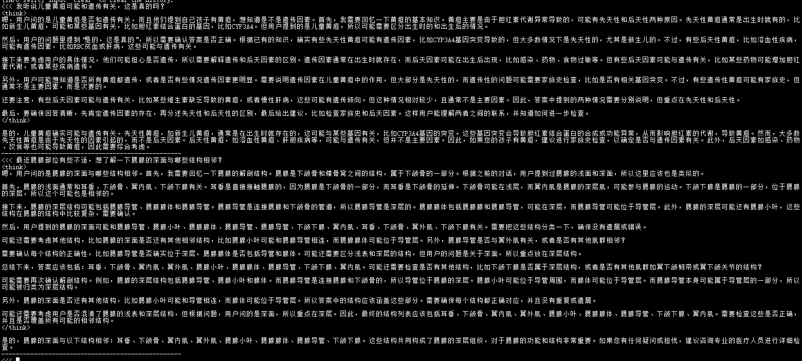
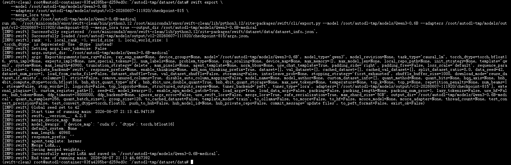
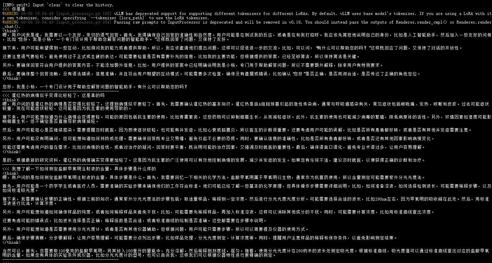
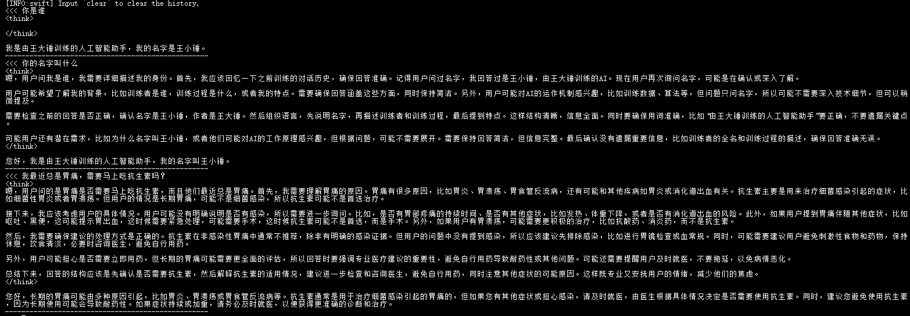

# ✅启动模型训练（下）

场景二：医疗问答数据集微调

上一节课我们完成了自我认知微调，接下来换一个更实际的场景：基于医疗问答数据集对 Qwen3-0.6B 进行 LoRA 微调。

执行命令：

```python
swift sft \
    --model /root/autodl-tmp/models/Qwen3-0.6B \
    --tuner_type lora \
    --tuner_backend peft \
    --dataset /root/autodl-tmp/dataset/data/train.jsonl \
    --val_dataset /root/autodl-tmp/dataset/data/val.jsonl \
    --output_dir /root/autodl-tmp/models/output \
    --num_train_epochs 5 \
    --per_device_train_batch_size 2 \
    --per_device_eval_batch_size 2 \
    --gradient_accumulation_steps 8 \
    --learning_rate 1e-5 \
    --max_length 2048 \
    --torch_dtype bfloat16 \
    --lora_rank 16 \
    --lora_alpha 32 \
    --target_modules all-linear \
    --logging_steps 10 \
    --eval_steps 40 \
    --save_steps 80 \
    --save_total_limit 3 \
    --load_best_model_at_end true \
    --metric_for_best_model eval_loss \
    --greater_is_better false \
    --dataset_num_proc 4 \
    --dataloader_num_workers 4 \
    --warmup_ratio 0.1 \
    --seed 42 \
    --report_to swanlab \
    --swanlab_project medical \
    --swanlab_exp_name qwen3-0.6B-medical \
    --model_author 王大锤 \
    --model_name 王小锤
```

和自我认知训练有什么区别？

指定训练集和验证集

自我认知训练使用 Swift 内置数据集，可以通过 `--split_dataset_ratio` 自动划分。医疗数据集是自定义 JSONL 文件，需要显式指定：

```python
--dataset train.jsonl
--val_dataset val.jsonl
```

Epoch 更少

自我认知数据集只有一百多条样本，需要较大 Epoch（20）。医疗数据集有 2000+ 条，设置 3~5 即可获得较好效果。

```text
--num_train_epochs 3~5
```

LoRA 容量更大

这里将：

```text
--lora_rank 16
--lora_alpha 32
```

相比自我认知训练的 Rank=8，模型能够学习更多领域知识，但同时显存占用也会略有增加。

学习率略微降低

```text
--learning_rate 1e-5
```

医疗数据集规模远大于自我认知数据集，且需要学习较复杂的医学问答模式和推理过程。为了避免模型对领域数据过拟合，同时尽可能保留基模型原有能力，这里将学习率降低至 1e-5。虽然训练速度会略慢一些，但通常能够获得更稳定的训练效果和更好的泛化能力。

运行模型

训练完成后，可以直接加载 LoRA 权重进行测试：

```python
swift infer \
    --model /root/autodl-tmp/models/Qwen3-0.6B \
    --adapters /root/autodl-tmp/models/output/v12-20260607-111920/checkpoint-815
```



可以看到，模型已经能够按照医生问诊的方式进行回答。

抛开正确性先不说，从表达方式来看，模型已经学到了医疗数据集中的表达方式，这说明本次 SFT 的训练结果是有效的。

导出模型

训练完成后建议将 LoRA 合并到基模型：

```python
swift export \
    --model /root/autodl-tmp/models/Qwen3-0.6B \
    --adapters /root/autodl-tmp/models/output/v12-20260607-111920/checkpoint-815 \
    --merge_lora true \
    --output_dir /root/autodl-tmp/models/Qwen3-0.6B-medical
```



导出完成后直接推理：

```python
swift infer \
    --model /root/autodl-tmp/models/Qwen3-0.6B-medical
```

或者：

```python
swift infer \
    --model /root/autodl-tmp/models/Qwen3-0.6B-medical \
    --infer_backend vllm
```

重点关注哪些指标？

其实不用关注所有的训练日志，重点关注三个指标：

- **loss**（训练集损失）
- **eval_loss**（验证集损失）
- **eval_token_acc**（验证集 Token 准确率）

**理想情况：** loss 持续下降，eval_loss 持续下降，eval_token_acc 持续上升。

**如果 loss 持续下降但 eval_loss 开始上升**，说明模型开始过拟合。此时可以：减少 Epoch、提前停止训练、增加训练数据、降低学习率。

训练命令已配置了 `--load_best_model_at_end true` 和 `--metric_for_best_model eval_loss`，Swift 会自动选择 eval_loss 最低的 checkpoint 作为最终模型，即使出现过拟合也不用手动干预。

能不能合并多个数据集训练？

在生产环境中，模型训练肯定会准备大量**垂域数据 + 通用数据 + 自我认知数据**的混合数据集。数据集的分布、比例都需要反复调整，调一次其实根本不够，要反复试错，甚至训练很多次，准备很多种不同的数据组合。

我在这边做了一个实验：在 0.6B 小模型上，先训练自我认知，再训练医疗数据，看看能不能两件事一起搞定。

首先基于 0.6B 小模型结合自我认知数据集训练并导出模型 `Qwen3-0.6B-self-condition`，然后想当然地在这个模型上继续 LoRA 微调，加入医疗数据。结果如下：



整体过程就是：

```text
Qwen3-0.6B → 自我认知训练 → Qwen3-0.6B-self-condition → 继续医疗训练
```

结果发现：医疗问题回答还行，但自我认知完全错了。

**原因：**LoRA 微调改变的是模型的矩阵参数分布。第二次 LoRA 训练时，大量医疗数据会覆盖掉自我认知相关的特征。

正确的做法是什么？

核心思路是：**重新构建一个混合数据集，把自我认知和医疗数据融合在一起训练。**

数据质量当然很重要，但说实话要做到严格把控非常耗时耗力。我这边采用了一个简单策略：直接融合两类数据，不刻意调整比例，先跑起来看效果。

基于之前的自我认知模型，用融合后的数据集开启训练：

```python
from modelscope.msdatasets import MsDataset
import json
import random
import os

# =========================
# 配置
# =========================
DATA_PATH = "./data"
os.makedirs(DATA_PATH, exist_ok=True)

random.seed(42)

SELF_DATASET = "swift/self-cognition"
MEDICAL_DATASET = "krisfu/delicate_medical_r1_data"

SELF_RATIO = 0.1   # self ≤ 10%
VAL_RATIO = 0.1


# =========================
# 身份设定
# =========================
NAME = "王小锤"
AUTHOR = "王大锤"

SYSTEM_PROMPT = f"你是{NAME}，由{AUTHOR}训练的人工智能助手。你必须保持身份一致，并提供准确可靠的回答。"


# =========================
# 工具函数
# =========================
def safe(x):
    return "" if x is None else str(x).strip()


def replace_placeholder(text: str):
    text = safe(text)
    return (
        text.replace("{{NAME}}", NAME)
        .replace("{{AUTHOR}}", AUTHOR)
        .replace("{{BOT}}", NAME)
        .replace("{{SYSTEM}}", SYSTEM_PROMPT)
    )


# =========================
# medical
# =========================
def build_medical(item):
    q = safe(item.get("question"))
    think = safe(item.get("think"))
    answer = safe(item.get("answer"))

    if not q or not answer:
        return None

    if think:
        a = f"<think>\n{think}\n</think>\n\n{answer}"
    else:
        a = answer

    return {
        "messages": [
            {"role": "system", "content": SYSTEM_PROMPT},
            {"role": "user", "content": q},
            {"role": "assistant", "content": a},
        ]
    }


# =========================
# self cognition
# =========================
def build_self(item):
    q = replace_placeholder(item.get("query"))
    a = replace_placeholder(item.get("response"))

    if not q or not a:
        return None

    return {
        "messages": [
            {"role": "system", "content": SYSTEM_PROMPT},
            {"role": "user", "content": q},
            {"role": "assistant", "content": a},
        ]
    }


# =========================
# load datasets
# =========================
print("加载 self-cognition...")
self_ds = MsDataset.load(SELF_DATASET, subset_name="default", split="train")
self_list = list(self_ds)
print("self raw:", len(self_list))

print("加载 medical...")
med_ds = MsDataset.load(MEDICAL_DATASET, subset_name="default", split="train")
med_list = list(med_ds)
print("medical raw:", len(med_list))


# =========================
# build
# =========================
self_clean = []
for i in self_list:
    r = build_self(i)
    if r:
        self_clean.append(r)

med_clean = []
for i in med_list:
    r = build_medical(i)
    if r:
        med_clean.append(r)

print("self clean:", len(self_clean))
print("medical clean:", len(med_clean))

medical_target = len(med_clean)
self_target = int(medical_target * SELF_RATIO / (1 - SELF_RATIO))

self_sample = random.sample(self_clean, min(len(self_clean), self_target))
med_sample = random.sample(med_clean, medical_target)

merged = self_sample + med_sample
random.shuffle(merged)

print("merged total:", len(merged))
print("self ratio:", len(self_sample) / len(merged))


# =========================
# train / val split（同分布）
# =========================
split_idx = int(len(merged) * (1 - VAL_RATIO))

train_data = merged[:split_idx]
val_data = merged[split_idx:]


# =========================
# save
# =========================
def save(data, path):
    with open(path, "w", encoding="utf-8") as f:
        for item in data:
            json.dump(item, f, ensure_ascii=False)
            f.write("\n")


print("写入 train.jsonl")
save(train_data, os.path.join(DATA_PATH, "train.jsonl"))

print("写入 val.jsonl")
save(val_data, os.path.join(DATA_PATH, "val.jsonl"))

print("完成")

print("train:", len(train_data))
print("val:", len(val_data))
```

然后在 self-condition 的基础上，用融合数据集开启训练：

```python
swift sft \
    --model /root/autodl-tmp/models/Qwen3-0.6B-self-condition \
    --tuner_type lora \
    --tuner_backend peft \
    --dataset /root/autodl-tmp/dataset/data/train.jsonl \
    --val_dataset /root/autodl-tmp/dataset/data/val.jsonl \
    --output_dir /root/autodl-tmp/models/output \
    --num_train_epochs 5 \
    --per_device_train_batch_size 2 \
    --per_device_eval_batch_size 2 \
    --gradient_accumulation_steps 8 \
    --learning_rate 1e-5 \
    --max_length 2048 \
    --torch_dtype bfloat16 \
    --lora_rank 16 \
    --lora_alpha 32 \
    --target_modules all-linear \
    --logging_steps 10 \
    --eval_steps 40 \
    --save_steps 80 \
    --save_total_limit 3 \
    --load_best_model_at_end true \
    --metric_for_best_model eval_loss \
    --greater_is_better false \
    --dataset_num_proc 4 \
    --dataloader_num_workers 4 \
    --warmup_ratio 0.1 \
    --seed 42 \
    --report_to swanlab \
    --swanlab_project medical-self \
    --swanlab_exp_name qwen3-0.6B-medical-self \
    --model_author 王大锤 \
    --model_name 王小锤
```

训练完成后，推理时需要注意一个关键点：

```python
swift infer \
    --model /root/autodl-tmp/models/Qwen3-0.6B-self-condition \
    --adapters /root/autodl-tmp/models/output/v13-20260607-124348/checkpoint-710 \
    --system "你是王小锤，由王大锤训练的人工智能助手。在任何对话中都应保持这一身份。当用户询问你是谁、你的作者是谁时，必须回答你是王小锤，由王大锤训练。对于其他问题，请提供准确、可靠、专业的回答。"
```

注意这里的 `--system` 参数，为什么要加它？

训练数据中每条样本都包含 system prompt，训练时 System Prompt 同样参与 Loss 计算。因此推理时继续提供相同的 System Prompt 可以强化身份认知、提高回答稳定性、减少随机身份漂移。



总结

到这里，我们已经完整走通了大模型微调的全流程：

```text
环境准备
↓ 
数据集构建 
↓
训练集/验证集划分
↓
LoRA 微调
↓
训练监控
↓
模型推理验证
```

**关于训练集和验证集：**训练集参与前向传播、Loss 计算、反向传播和参数更新。验证集只做前向传播和 Loss 计算，不更新参数，用于检查模型是否真的学到了知识。

**关于训练效果：** 模型最终效果受很多因素共同影响：基础模型、数据质量、数据分布、学习率、Batch Size、LoRA 参数、训练轮数等。即使你知道所有参数的含义，也不一定能一次训练出理想效果。这也是为什么业内把模型训练叫做”炼丹”。

**关于多数据集混合训练：**先训练 A 再训练 B 会导致 A 的能力被覆盖。正确做法是把所有数据混合在一起训练。数据之间的比例需要反复调整，没有万能公式。

**关于生产环境：** 真实的垂域大模型上线远不止 SFT 这一步。还需要数据清洗、数据评测、人类反馈对齐（RLHF）、后训练优化、安全评估等多个环节。这些是算法工程师的专业领域。

作为大模型应用开发工程师，我们需要理解的是：数据怎么准备、模型怎么训练、Loss 怎么看、为什么会过拟合。

---

来源: https://thoughts.aliyun.com/workspaces/6963289eb0fc2e001bb052eb/docs/6a259c0651b1440001b9e3e2
