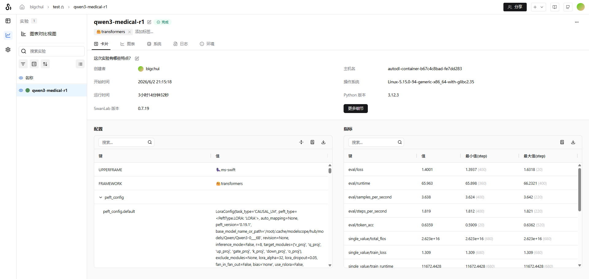
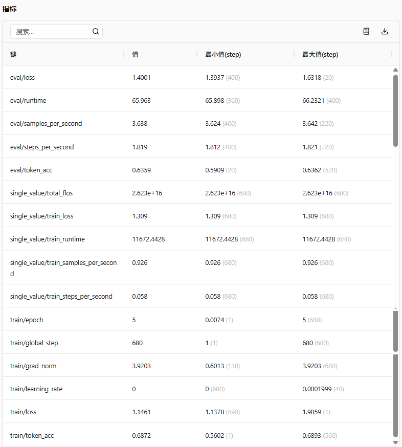
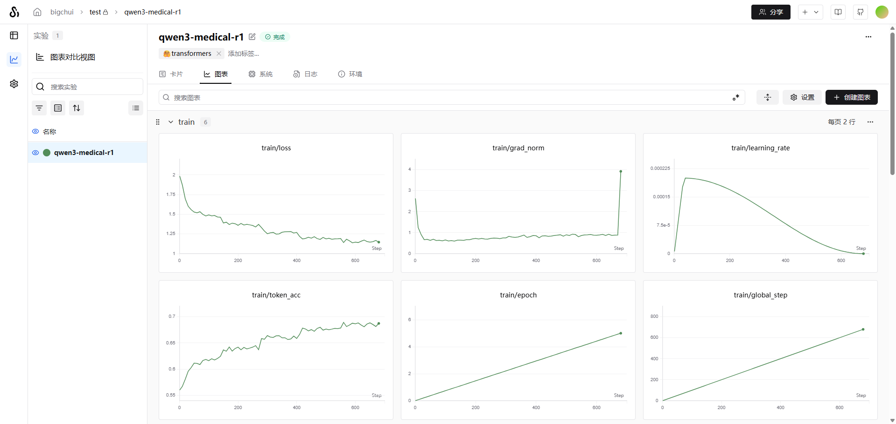
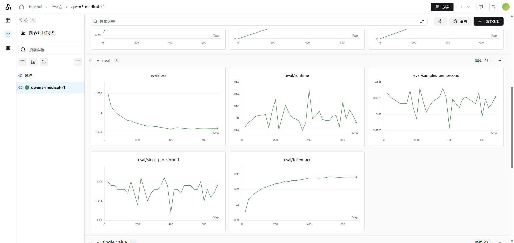

# ✅如何判断训练的好坏？

训练跑完了，但到底训得好不好？这节课我们就来拆解训练过程中的几个关键指标，教你怎么看训练结果。

我用之前一次医疗数据集训练作为例子来说明，先看一眼这次训练的基本情况。





| 指标 | 数值 |
| --- | --- |
| 数据集总量 | 2176 条 |
| Epoch | 5 |
| Global Step | 680 |
| 最终 Train Loss | ≈1.14 |
| 最终 Eval Loss | ≈1.38 |
| 最终 Train Token Acc | ≈0.69 |
| 最终 Eval Token Acc | ≈0.636 |

2176 条数据，跑了 5 轮完整训练，总共 680 次参数更新。整体训练过程正常结束。

训练指标分析（Train）



train/loss

Loss 可以理解为**模型答错被扣了多少分**。预测和标准答案差距越大，Loss 越高；越接近标准答案，Loss 越低。

整个训练过程是这样的：

```text
输入一条样本
→ 模型做预测（前向传播）
→ 和标准答案对比，算出 Loss
→ 根据误差调整参数（反向传播）
→ 更新 LoRA 参数
```

**优化器真正在优化的目标就是 Loss。** 所以 Loss 是所有指标里最核心的一个。

看我们这次的 Loss 曲线：从 2.0 一路降到 1.55 → 1.38 → 1.22 → 1.14。前期下降很快，后期逐渐变慢，最后趋于平稳。这是一个非常典型的**收敛（Convergence）**形态。

打个比方，举个直观的例子。

训练刚开始的时候，模型几乎不会医疗问答：

```text
用户：感冒怎么办？
模型：不知道
```

这时候 Loss 很高。经过训练之后，模型学会了：

```text
用户：感冒怎么办？
模型：建议休息、多饮水，症状严重及时就医。
```

预测越来越接近标准答案，Loss 就持续下降。整个过程没有发散、没有震荡，说明训练是正常有效的。

train/token_acc

Token Acc 可以理解为**模型每生成一个词（Token），预测正确的比例**。

需要注意的是，**Token Acc ≠ 最终回答的正确率**。它衡量的是更细粒度的东西：**每个 Token 预测对了没有。**

举个例子，标准答案是"患者出现发热症状"，拆成 Token 就是：

```text
患者 | 出现 | 发热 | 症状
```

模型预测出来是：

```text
患者 | 出现 | 头痛 | 症状
```

4 个 Token 里对了 3 个，那这条的 Token Acc 就是 3/4 = 75%。

我们这次的 Token Acc 曲线从 0.56 持续上升到 0.69，和 Loss 的下降趋势完全一致：Loss 在降，Acc 在升，说明训练确实在起作用，模型的预测能力在持续增强，越来越接近标准答案。

train/grad_norm

梯度范数（Gradient Norm）表示**本次参数更新的幅度有多大**。

本次 grad_norm 从 2.5 很快降到 0.7 附近，后期在 0.8~1.0 之间波动。训练初期模型错误多，调整幅度大；随着训练推进，需要调整的地方越来越少。

最后一个点突然跳到 4 左右，但 Loss 并没有跟着上升，可能是最后一批训练数据中有一些特殊数据，**不是梯度爆炸**。

真正危险的情况是 grad_norm 持续上升、同时 Loss 也在上升。

train/learning_rate

学习率决定了每一步参数更新的"步子"有多大。我们这次用的是 cosine 调度——先从 0 上升到 2e-4（热身阶段，小步试探，避免一开始就把模型学坏），然后逐步下降到 0。

```text
0 → 2e-4（热身）→ 逐步下降 → 0（收尾）
```

验证指标分析（Eval）



**如果只能看一类指标，看 Eval。** Train 指标看的是"背题能力"，Eval 指标看的是"考试能力"，模型在没见过的数据上表现如何。

eval/loss（最重要）

Eval Loss 是模型在**验证集（val_dataset）**上的平均扣分。和 Train Loss 的区别是，这里只做评估、不更新参数。相当于拿一套模型没做过的模拟卷来考它。

```text
1.63 → 1.53 → 1.45 → 1.40 → 1.38
```

我们这次的 Eval Loss 从 1.63 持续下降到 1.38，前期下降明显，后期趋于平稳，没有出现回升。

说明模型不仅记住了训练集的内容（Train Loss 在降），同时在没见过的数据上也能答得更好（Eval Loss 也在降）。**这就是泛化能力在提升。**

是否过拟合？

过拟合是微调中最常见的问题。打个比方：一个学生把练习册上的每道题都背下来了，但考试的时候换了道新题就不会做了，这就是过拟合。模型死记硬背了训练数据，但没有学到真正的规律。

判断标准很简单：**Train Loss 在降，但 Eval Loss 在回升。** 比如：

```text
Train Loss：1.3 → 1.1（还在降）
Eval Loss：1.4 → 1.6（反而升了）
```

这就说明模型开始"死记硬背"了。

而我们这次的训练，Train Loss 从 2.0 降到 1.14，Eval Loss 从 1.63 降到 1.38，两者同步下降，**没有出现过拟合**。

即使出现过拟合，可以取 Eval Loss 最低点对应的 checkpoint 作为最佳模型。

是否欠拟合？

欠拟合和过拟合刚好相反，模型连训练集都没学好。就像一个学生连练习册上的题都不会做，考试就更别指望了。

信号：Train Loss 降不动，Eval Loss 也降不动，两者都偏高。

解决办法：增加训练步数或 Epoch、适当调大学习率、提高 LoRA rank 或增加 target modules、检查 max_length 是否截断太多。

eval/token_acc

Eval Token Acc 是模型在验证集上每个 Token 的预测正确率。我们从 0.59 升到了 0.636，持续上升。说明模型在**从未参与训练的数据上**，预测正确率也在提高。

和 Train 对比一下：

| 指标 | Train | Eval | 差距 |
| --- | --- | --- | --- |
| Loss | 1.14 | 1.38 | ≈0.24 |
| Token Acc | 0.69 | 0.636 | ≈5.4% |

训练集表现更好是正常的，关键是差距不大。如果差距太大（如 Train Acc 90% vs Eval Acc 50%），说明严重过拟合。

是否已经收敛？

Train Loss 后期下降越来越慢，Eval Loss 后期基本横向，Token Acc 后期基本走平。**模型已接近收敛**，继续训练的边际收益越来越小。

对于 2176 条医疗数据，3-5 个 Epoch 是比较合理的范围。

训练总结

这是一次比较标准、健康的 LoRA 微调过程。几个关键判断：

1. **Train Loss 从 2.0 降到 1.14**，收敛形态正常，模型在持续学习
2. **Eval Loss 从 1.63 降到 1.38**，和 Train Loss 同步下降，没有过拟合
3. **Token Acc 持续上升**，Train 和 Eval 的差距约 5%，属于正常范围
4. **梯度范数稳定**，没有出现梯度爆炸；学习率调度正常
5. **模型已接近收敛**，当前训练轮数合适

**Loss 同步降、Acc 同步升、差距不大、曲线平稳**，满足这四条，基本可以判断训练过程正常。

指标好就代表模型好吗？

训练指标能告诉我们**训练过程是否正常**，但不能告诉我们**模型实际回答的质量**。

Token Acc 衡量每个 Token 是否和标准答案一致，但无法理解语义，举个例子：

```text
标准答案：建议立即卧床休息，停止进食
模型输出：建议立即卧床休息，停止运动
```

拆成 Token 来看：

```text
标准答案：建议 | 立即 | 卧床 | 休息 | ， | 停止 | 进食
模型输出：建议 | 立即 | 卧床 | 休息 | ， | 停止 | 运动

Token 准确率 = 6/7 ≈ 85.7%
```

85.7% 的准确率，Loss 也不会高。85.7% 的准确率，但从医学角度看，"停止进食"和"停止运动"含义完全不同。再比如：

```text
标准答案：该症状可能是胃溃疡引起的，建议尽快就医检查
模型输出：该症状可能是胃炎引起的，建议尽快就医检查

Token 准确率依然很高，Loss 也不高
但 "胃溃疡" 和 "胃炎" 是两种不同的疾病
```

**指标只能告诉你训练过程是否健康，不能替代实际的模型评测。**

---

来源: https://thoughts.aliyun.com/workspaces/6963289eb0fc2e001bb052eb/docs/6a259c4f3fb9180001973f95
