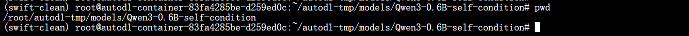
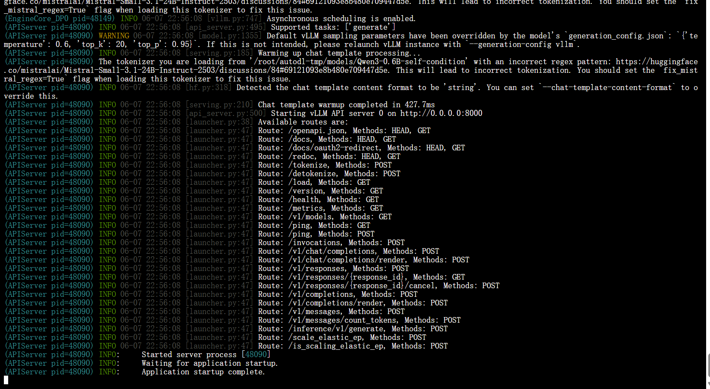
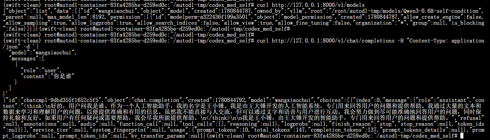

# ✅如何部署大模型服务？

前面的课程我们完成了模型微调，拿到了训练好的 checkpoint，也通过训练指标初步验证了训练效果。但训练完不等于能用，业务代码调不了，前端页面对接不了。这节课我们就来解决这个问题：**怎么把训练好的模型部署成一个可用的服务。**

在正式讲部署之前，先回顾一下前置步骤。前面的训练课程中，我们已经完成了 LoRA 权重合并导出（`swift export --merge_lora true`），并用 `swift infer` 快速验证了模型效果。如果你对这步还不熟悉，可以先回顾前面的课程。

到这一步，我们手里已经有了一个合并后的完整模型目录（比如 `checkpoint-680-merged`），可以直接被推理框架加载。接下来的问题就是：**怎么把这个模型变成一个稳定可访问的 HTTP 服务，让业务代码能通过 API 调用它。**这就是模型部署要做的事。

模型部署

微调、量化、优化 Prompt……这些做完之后，模型权重仍然停留在磁盘上。业务代码想用模型，总不能每次都手动敲命令行。部署的本质就是一句话：**把模型变成稳定可访问的 HTTP 服务，对外暴露统一的推理接口。**

模型部署的方式

目前主流的本地/私有化部署方案有这些：

| 方案 | 核心特点 | 适用场景 | 上手难度 |
| --- | --- | --- | --- |
| **llama.cpp** | C++ 实现，轻量 | CPU 推理、嵌入式设备 | 中 |
| **Ollama** | 封装 llama.cpp，开箱即用 | 个人开发、小团队验证 | 低 |
| **LM Studio** | 桌面 GUI，可视化操作 | 本地试模型、非工程师体验 | 极低 |
| **Xinference** | 统一纳管多种推理后端 | 已有运维体系的团队 | 中 |
| **TensorRT-LLM** | NVIDIA 官方优化，极致性能 | 大规模生产环境、高并发 | 高 |
| **vLLM** | GPU 推理，高吞吐，OpenAI 兼容 | GPU 服务器部署（我们的选择） | 中 |

llama.cpp

llama.cpp 是用 C/C++ 写的 LLM 推理库，是整个本地推理生态的底层基石。它的核心特点是用 **GGUF 格式**存储模型权重，支持各种量化级别（2-bit 到 8-bit），可以在纯 CPU 环境下运行大模型。

llama.cpp 解决的是**没有 GPU 也能跑大模型**的问题，适合个人使用或低并发场景。

TensorRT-LLM

NVIDIA 官方推理优化框架，通过算子融合、量化、批处理优化等手段把推理性能压榨到极致。

但是它配置复杂、调试困难，更适合大型互联网公司有专门团队维护的场景。

Ollama

底层基于 llama.cpp，包了一层易用的命令行工具和 HTTP 服务。**让跑大模型像装 App 一样简单。**

GGUF 格式

Ollama 使用的模型格式叫 **GGUF**（GPT-Generated Unified Format），是 llama.cpp 社区定义的一种模型文件格式。它的特点：

- **单文件存储**：一个 `.gguf` 文件就包含模型的全部信息
- **内置量化**：支持从 2-bit 到 8-bit 的多种量化级别
- **CPU 优先**：支持内存映射（mmap），加载速度快，内存占用低
- **支持 GPU 卸载**：支持将部分层卸载到 GPU 上加速，实现 CPU + GPU 混合推理

使用限制

Ollama 的定位是**推理工具**，不是训练工具：

- **不能做 LoRA 微调**：不提供训练或微调功能。需要先用其他工具（比如 ms-swift）把 LoRA 合并到基座模型，再转成 GGUF 格式，最后才能用 Ollama 加载
- **不适合高并发**：单请求处理，吞吐量有限
- **GPU 利用不充分**：不如 vLLM 这类专门的 GPU 推理框架高效

适用场景

个人笔记本验证模型效果、小团队内网共享、没有 GPU 的环境，这些场景用 Ollama 最方便。当你需要 GPU 加速、高并发、或者部署自己微调后的模型时，就该上 vLLM 了。

LM Studio

桌面端 GUI 工具，支持 Windows、macOS、Linux。可以在图形界面里搜索、下载、运行各种开源大模型。

核心特点：

- **可视化操作**：适合非工程师体验大模型
- **本地推理**：数据不出机器
- **OpenAI 兼容服务**：可启动本地 API 服务
- **支持 GGUF 格式**

适合场景：产品经理、运营同学想快速体验模型效果，或者开发者在本地调试时不想开终端。

Xinference

Xinference 是一个统一的模型推理平台，支持同时管理多种推理后端（vLLM、llama.cpp、TensorRT-LLM 等）和多类模型（LLM、Embedding、多模态）。**一个平台管理你所有的模型服务。**

核心特点：

- **多后端统一管理**：可以在同一个界面里管理 vLLM、llama.cpp、TensorRT-LLM 等不同推理引擎，不用为每个引擎单独部署
- **模型仓库集成**：支持从 ModelScope、HuggingFace 直接拉取模型，内置常用模型列表
- **OpenAI 兼容 API**：所有通过 Xinference 部署的模型都暴露统一的 OpenAI 兼容接口，业务代码无需关心底层用的哪个引擎
- **集群管理**：支持多机多卡环境，适合有运维体系的团队统一管理模型资源

适合场景：团队里有多张 GPU、多种模型、多种推理需求，需要一个统一的平台来管理，而不是每个模型单独起一个服务。

vLLM（重点）

vLLM 是目前开源社区最主流的大模型 GPU 推理框架之一，由 UC Berkeley 团队开发。它通过 PagedAttention 和 Continuous Batching 等技术，大幅提升 GPU 利用率和推理吞吐量，让同样的硬件能够服务更多并发请求。

同时，vLLM 原生兼容 OpenAI API，启动后即可提供标准接口，业务代码几乎无需改造即可接入。

和 Ollama 不同，Ollama 更适合本地体验和快速验证，而 vLLM 则定位于生产环境，是企业部署大模型服务的主流方案。

为什么选 vLLM

- 高吞吐：通过 PagedAttention 对 KV Cache 进行分页管理，大幅减少显存浪费，同样的 GPU 可以容纳更多并发请求
- Continuous Batching：采用动态批处理机制，请求完成后可立即补充新的请求进入 Batch，避免 GPU 出现大量空闲位置，持续保持高利用率和高吞吐
- CUDA Kernel 优化：针对 Attention、KV Cache 和显存访问进行了大量底层 CUDA 优化，减少计算和数据搬运开销，进一步提升推理性能。
- OpenAI 兼容：启动后自动提供 `/v1/chat/completions` 等标准接口，所有基于 OpenAI SDK 的应用几乎无需修改代码即可接入
- 多卡支持：通过 Tensor Parallel 将模型切分到多张 GPU 上运行，支持部署 70B 甚至更大规模模型
- LoRA 动态加载：支持同时服务多个 LoRA 模型，按需加载 Adapter，无需为每个微调模型单独启动推理服务
- 生产级部署：支持流式输出、并发请求调度、量化模型加载等能力，是目前开源社区最主流的大模型推理框架之一

环境准备

vLLM 已经在前面环境配置课程中安装好了（`pip install vllm==0.17.1`），如果你是按照课程流程操作下来的，这一步可以跳过。如果你还没有安装 vLLM，请先回顾前面的课程完成安装。

**注意**：vLLM 的安装顺序很关键。先装 vLLM 让它自动拉取匹配版本的 PyTorch、Triton、Transformers，再装 ms-swift。

启动推理服务

以自我认知的模型为例，先通过swift export命令导出模型，存放在这个目录下：

```text
/root/autodl-tmp/models/Qwen3-0.6B-self-condition
```



```python
vllm serve /root/autodl-tmp/models/Qwen3-0.6B-self-condition \
    --host 0.0.0.0 \
    --port 8000 \
    --served-model-name wangxiaochui \
    --gpu-memory-utilization 0.9 \
    --max-model-len 8192
```

启动后，vLLM 会输出类似这样的日志：



看到这样的日志就说明服务启动成功了。

参数说明：

| 参数 | 说明 | 建议值 |
| --- | --- | --- |
| `--model`<br>（第一个位置参数） | 模型路径，可以是本地路径或 HuggingFace ID | 合并后的模型路径 |
| `--host` | 监听地址，<br>`0.0.0.0`<br>表示所有网卡可访问 | `0.0.0.0` |
| `--port` | 监听端口 | `8000` |
| `--served-model-name` | 模型别名，客户端调用时<br>`model`<br>字段填这个 | 自定义，比如<br>`qwen3-medical-r1` |
| `--api-key` | API 密钥，客户端请求时需携带 | 自定义，本地开发随意 |
| `--max-model-len` | 上下文最大长度，过大会占更多显存 | 0.6B模型：1024-2048 |
| `--gpu-memory-utilization` | GPU 显存利用率，0.90 表示用 90% | `0.85`<br>~<br>`0.95` |
| `--dtype` | 数据类型，<br>`auto`<br>自动选择 | `auto` |

**假如有多卡部署**（模型单卡放不下时）：

```python
vllm serve /path/to/model \
  --tensor-parallel-size 2 \
  --max-model-len 8192
```

- `--tensor-parallel-size`：使用的 GPU 数量，模型会自动切分到多张卡上

常用参数

除了上面启动时用到的参数，vLLM 还有一些常用参数了解一下就行，用到的时候再查：

- `--trust-remote-code`：允许执行模型仓库中的自定义代码，部署国产模型（如 Qwen）时建议加上
- `--enable-lora`：动态加载 LoRA adapter，一个基座模型可同时服务多个微调版本
- `--enable-reasoning` + `--reasoning-parser deepseek_r1`：如果你的模型带思考过程（像 DeepSeek R1 那样），加这两个参数来正确解析 `<think >...</think >` 格式的输出
- `--enable-prefix-caching`：启用前缀缓存，重复 prompt 场景可加速
- `--quantization`：加载量化模型时指定量化方法（如 `awq`、`gptq`）
- `--max-num-seqs`：单个批次最大并发请求数，默认 256
- `--enforce-eager`：禁用 CUDA Graph，调试排错时有用
- ......

测试服务是否正常

服务启动后，先确认模型加载成功：

```bash
curl http://127.0.0.1:8000/v1/models
```

这条命令会返回当前服务加载的模型列表。如果能看到你的模型名称，说明模型加载没问题。

然后发一条对话请求验证推理是否正常：

```bash
curl http://127.0.0.1:8000/v1/chat/completions \
  -H "Content-Type: application/json" \
  -d '{
    "model": "wangxiaochui",
    "messages": [{"role": "user", "content": "你好，你是谁？"}],
    "temperature": 0
  }'
```

注意这里的 `model` 要和启动时 `--served-model-name` 的值一致。如果返回正常的 JSON 响应，说明服务完全可用。



在业务代码里用 OpenAI SDK 调用也很简单，只需要改一下 `base_url`：

```python
from openai import OpenAI

client = OpenAI(
    base_url="http://127.0.0.1:8000/v1",
    api_key="随便填",  # 没设 --api-key 就不校验
)

resp = client.chat.completions.create(
    model="wangxiaochui",
    messages=[{"role": "user", "content": "你好，你是谁？"}],
    temperature=0,
)
print(resp.choices[0].message.content)
```

其他所有参数和调用 OpenAI 官方 API 完全一样，代码基本不用改。

全流程总结

到这里，从模型微调到部署上线的完整链路就跑通了。回顾一下整个过程：

```text
准备训练环境（CUDA/PyTorch/vLLM/ms-swift）
    ↓
准备数据集（转成 messages 格式）
    ↓
启动训练（swift sft，LoRA 微调）
    ↓
合并导出（swift export --merge_lora true）
    ↓
部署服务（vllm serve，对外暴露 OpenAI 兼容 API）
    ↓
业务代码通过 OpenAI SDK 调用
```

整个链路跑通之后，你就有了一个属于自己的、可以对外提供服务的微调模型。业务代码只需要改一下 `base_url` 和 `model`，就能从调用 OpenAI 切换到调用你自己的模型，其他代码完全不用动。

---

来源: https://thoughts.aliyun.com/workspaces/6963289eb0fc2e001bb052eb/docs/6a259ca351b1440001b9e445
