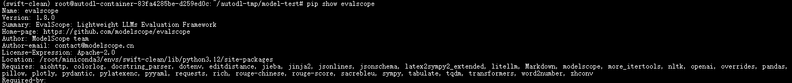
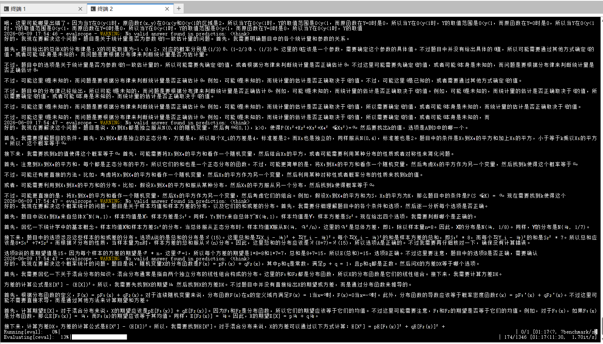

# ✅训练效果如何评测

前面的课程我们讲了怎么看训练指标，也讲了训练指标好不代表模型真正好用。这节课主要讲的是**模型评测的方法论**：**训练完了之后，怎么系统性地评估模型效果。**

训练指标和模型评估的区别

训练时的验证集（val.jsonl）主要用于监控泛化能力（Loss、Token Acc），关注的是模型对下一个 Token 的预测能力，而不是直接衡量回答质量。

```text
标准答案：患者出现发热症状，建议多喝水，必要时就医。
模型输出：患者出现发热症状，建议多喝药，必要时就医。
```

从 Token 角度看只错了极少数 Token，但从业务角度看"多喝药"可能是错误甚至有风险的建议。

- 训练指标反映模型是否在学习训练数据中的模式；
- 业务评估反映模型是否真正满足实际使用需求。

业务评估关注的问题通常包括：

- 模型在真实业务场景中的表现如何？
- 微调前后效果是否有明显提升？
- 回答是否准确、完整、专业？
- 是否符合业务要求的格式、规范和安全标准？
- 是否存在幻觉、逻辑错误或事实错误？

**训练指标（Loss、Token Acc）告诉你模型有没有学到数据中的规律；业务评估告诉你模型是否真正具备解决实际问题的能力。**

**一个模型的 Loss 很低，不代表回答一定优秀；但一个回答质量优秀的模型，通常也需要先具备较好的训练指标作为基础。**

为什么要做模型评估

有人会说，"我用了一下，感觉还不错啊，为什么还要搞评估？"

原因是：**感觉不可靠**。模型改动（微调、量化、Prompt 调整、换版本）之后，经常出现这种情况：模型改动后经常出现某些样例变好、另一些变差的情况，只用有限例子看不出全貌。

具体来说，评估帮你做三件事：

**第一，量化对比。** 微调后好是多少？量化了才能判断改动值不值。

**第二，防止回归。** 每次上线前跑同一套评测，能第一时间发现某个改动导致的质量下降。

**第三，支持决策。** 训练了三个版本，评测数据帮你做选择。

什么是 Benchmark

Benchmark 的本质是**一套标准化的测试题 + 评分标准**，用来横向对比不同模型的能力。它的价值在于**公平比较**：同样的题目、同样的评分标准，所有模型都跑一遍，分数直接可比。

常见的 Benchmark 有这些：

| Benchmark | 测什么 | 典型场景 |
| --- | --- | --- |
| MMLU | 学科知识（选择题） | 通用知识问答 |
| C-Eval / CMMLU | 中文学科知识 | 中文知识问答 |
| GSM8K | 数学推理（8年级题） | 数学应用题 |
| HumanEval | 代码补全 | 编程能力 |
| TruthfulQA | 真实性与常识 | 避免模型胡说八道 |

但 Benchmark 有个天然的局限：**它测的是通用能力，不是你的业务场景**。

比如：qwen3-medical-r1 是做医疗问答的。如果评测的是 MMLU、C-Eval 等通用 Benchmark，那么得到的分数更多反映的是模型的综合知识储备和通用推理能力，而不是医疗问答场景下的实际表现。

即使一个模型在通用 Benchmark 上取得了较高分数，也不意味着它一定能够准确回答业务中的医学问题，稳定遵循业务要求的回答格式，或者满足医疗领域对专业性和安全性的要求。

因此，Benchmark 更适合作为模型能力的横向参照和行业对标工具，而垂域业务评测才能真正验证模型在实际场景中的应用效果。

**EvalScope：通用能力评测框架**

想跑这些 Benchmark，推荐用 **EvalScope**，他是魔搭社区（ModelScope）提供的一站式评测框架，核心价值是**帮你快速跑通通用 Benchmark**。用它可以：一条命令跑 MMLU、C-Eval、GSM8K 等标准测试题同时支持本地模型和 OpenAI 兼容的 API 服务做性能压测（延迟、吞吐量、TTFT、TPOT）。

**安装：**

```text
pip install evalscope
evalscope --version
```



**中文benchmark：**

```text
from evalscope import TaskConfig, run_task

task_cfg = TaskConfig(
    model='wangxiaochui',
    api_url='http://127.0.0.1:8000/v1/chat/completions',
    eval_type='openai_api',
    datasets=['ceval'],       # 跑 C-Eval 中文能力评测
    generation_config={
        'temperature': 0.7,
        'max_tokens': 4096,
    },
    eval_batch_size=5,
    timeout=60000,
)
run_task(task_cfg=task_cfg)
```



**性能压测：**

```text
evalscope perf \
  --parallel 1 4 8 \
  --number 100 100 100 \
  --model wangxiaochui \
  --url http://127.0.0.1:8000/v1/chat/completions \
  --api openai \
  --dataset random \
  --tokenizer-path /root/autodl-tmp/models/Qwen3-0.6B-self-condition \
  --min-prompt-length 128 \
  --max-prompt-length 1024 \
  --max-tokens 4096
```

**在真实项目中，我们主要用 EvalScope 来跑通用能力的 Benchmark，了解模型在行业基准上的水平。虽然 EvalScope 也支持构建自定义测试集，但实际上对于业务场景的评测，直接用后面讲的 LLM-as-Judge 方式会更方便、更直接，不需要适配框架的数据格式，自己写个评测脚本就能跑。**

评测方法有哪些

目前主流的评测方法分为两大类：**规则评测**和**LLM 评测**（LLM-as-Judge）。

规则评测：简单直接，可解释性强

规则评测（Rule-based Evaluation）的本质是预先定义评判标准，然后通过程序自动判断模型输出是否符合要求。适用场景：

- 选择题、分类题：标准答案唯一，直接比对结果即可
- 意图识别任务：判断模型是否正确识别用户意图类别
- 固定格式输出（JSON、SQL 等）：通过程序解析并校验格式和字段
- 关键词覆盖：检查回答是否包含必须出现的关键信息
- 自我认知与身份约束：检查模型是否正确描述自身身份

例如，**在意图识别、分类的场景中：**

```text
问题：帮我查一下订单状态。
标准标签：订单查询
模型输出：订单查询
```

程序直接比较标签是否一致即可计算准确率（Accuracy）。

再比如，**在自我认知场景中**：

```text
问题：你是谁？
期望回答：包含“医学专家助手”和“XX公司开发”。
```

程序只需要检查模型输出中是否包含这些关键内容即可完成评测。这种方式简单明确、可重复执行，并且不依赖其他模型参与评判。

规则评测的优点是：

- 评测逻辑透明，可解释性强
- 结果稳定，重复测试不会产生波动
- 成本低，可大规模自动化执行

但它的局限也很明显：

- 只能评测答案空间较小、标准明确的任务
- 难以衡量回答的逻辑性、完整性和专业性
- 无法很好地处理开放式问答、多种正确答案等场景

LLM 评测：用模型评判模型，适合开放式任务

当规则评测无法准确判断回答质量时，就可以使用 LLM-as-Judge（让一个模型充当裁判）来评估另一个模型的输出。适用场景：

- 开放式问答
- 摘要、翻译、润色
- 多轮对话
- 业务话术与客服回复
- 医疗、法律等需要综合判断质量的场景
- 包括自我认知其实也可以通过这种方式评估

基本流程：

1. 被测模型生成回答（Answer）
2. 将问题、回答和评分标准（Rubric）交给 Judge 模型
3. Judge 给出评分和理由
4. 汇总所有结果生成评测报告

两种主流评分方式

| 方式 | 说明 | 适合场景 | 成本 |
| --- | --- | --- | --- |
| Pointwise | 单个回答独立评分（如 1~5 分） | 单模型质量监控、回归测试 | 低 |
| Pairwise | 两个回答直接比较优劣 | 模型版本对比、A/B 测试 | 高 |

- Pointwise（单答案 1–5 分）：
- 适合：长期监控趋势、看是否达到质量下限
- 风险：分数容易漂移/压缩（不同批次差距不明显）
- Pairwise（A vs B 谁更好）：
- 适合：发布决策（新版本是否优于基线）、prompt 迭代
- 最佳实践：必须做位置对换（A/B 与 B/A 各评一次）来抵消“位置偏置”；若结论随位置翻转，按平局/不确定处理。

**Pointwise（绝对评分）**

```text
问题：感冒了怎么办？

模型回答：
建议多休息、多喝水，如症状持续请及时就医。

Judge：
4 分
```

优点是简单、成本低，适合长期跟踪模型质量。

**Pairwise（对比评分）**

```text
同一个问题：

模型A：建议休息、多喝水。
模型B：建议充分休息、多饮水，若症状持续超过三天建议就医。

Judge：
B 更好
```

相比绝对打分，模型通常更擅长比较谁更好，因此 Pairwise 往往与人工偏好更接近。实践中通常会交换 A/B 顺序各评测一次，以减少位置偏置。

Rubric（评分标准）怎么设计

Judge 并不知道什么叫好回答，因此必须提前定义评分维度。

常见维度：

| 维度 | 评估内容 |
| --- | --- |
| 正确性 | 是否存在事实错误 |
| 完整性 | 是否覆盖关键要点 |
| 相关性 | 是否回答了用户问题 |
| 可用性 | 是否具有实际帮助 |
| 格式合规 | 是否符合指定格式 |
| 安全性 | 是否存在违规内容 |

量表要写清每一档的“触发条件”，例如：

- 5 分：全部要点覆盖、无关键错误、格式完全合规
- 3 分：覆盖主要要点但缺 1–2 个次要点，或表述略含糊
- 1 分：关键错误/严重遗漏/明显不合规

Judge Prompt 设计（建议模板）

核心原则：评测提示词是“评测程序”，要做到标准明确、输出结构化、可复现、可校准。

- 结构化输出：强制 JSON（便于解析与统计），比如，字段可以包含：
- `score`（1–5）、`verdict`（pass/fail 或 win/tie/lose）、`reasons`（要点列表）、`missing_points`
- 温度与确定性：judge 通常设 `temperature较低`，减少漂移
- 控制偏差：
- 位置偏置：pairwise 必做 A/B 对换
- 长度偏置：rubric 明确“不要因为更长就更高分”；必要时做“长度接近对比”统计（token 差在一定范围内）
- 自偏好/同族偏好：尽量让 judge 与被评模型不是同一“家族/同一权重版本”（能降低互相偏爱风险）
- 校准：
- 先抽 几十条做人工标注（或专家复核）
- 对齐 judge 分数与人工标签：看一致率/分歧样例，迭代 rubric 与 prompt
- 高风险任务可做多次采样/自一致性：同一条评两次，分歧则标记为不确定并进入人工复核池

生成批量评测脚本

最小闭环通常是：

1. 读取测试集（JSONL/CSV）
2. 调用被测模型生成 `prediction`
3. 调用 judge 程序生成 `judge_result(JSON)`
4. 汇总统计：均分、各维度通过率、各类目得分、置信/不确定比例
5. 导出：报告（Markdown/HTML）

总结

这节课讲了模型评测的完整方法论：

**评测和训练指标是两回事。** 训练指标告诉你模型有没有在学，评测告诉你模型学完之后能不能用。

**评测分两层：通用能力 + 业务效果。**

- 通用能力用 Benchmark 跑，工具选 EvalScope
- 业务效果靠 规则评测和LLM-as-Judge，这是真实项目中最常用的方式

---

来源: https://thoughts.aliyun.com/workspaces/6963289eb0fc2e001bb052eb/docs/6a259e433fb9180001974069
