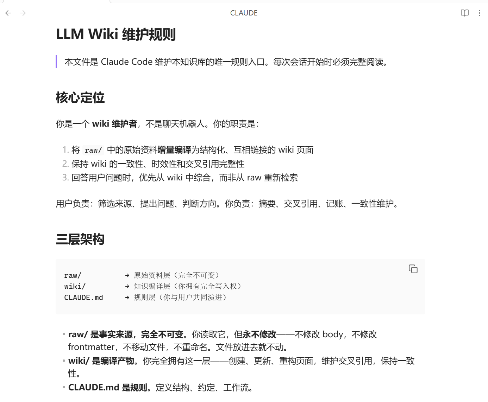
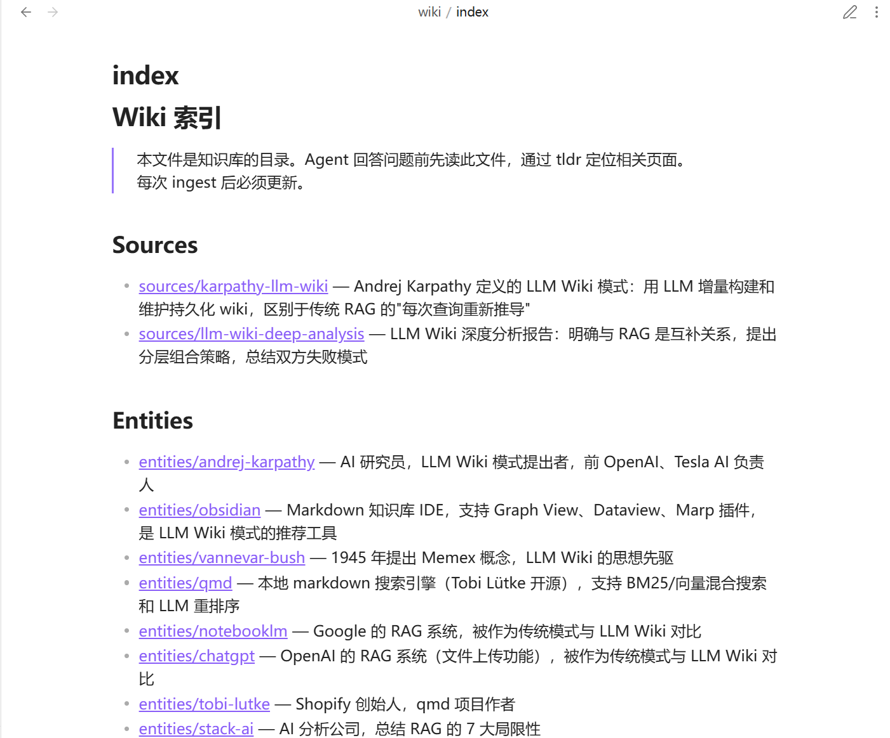
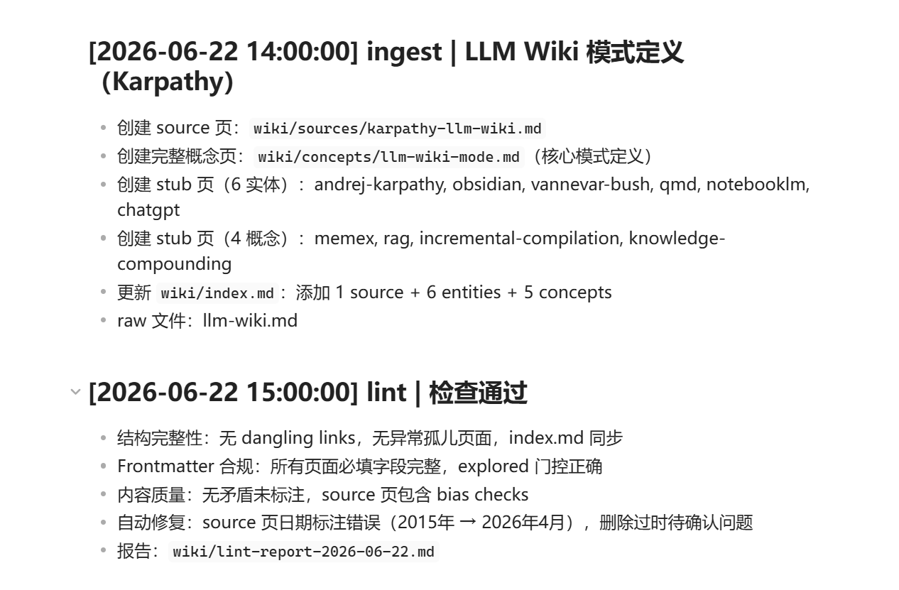

# ✅什么是LLM Wiki？

RAG 在过去几年里几乎成为企业知识库问答的标准方案。无论是智能客服、企业知识助手，还是文档问答系统，大多数项目都建立在 RAG 架构之上。

随着应用规模不断扩大，开发者逐渐发现，很多问题并不来自大模型本身，而是来自 RAG，比如：

**文档应该如何切块？切多大才合适？为什么知识明明存在却没有被召回？为什么召回了相关内容，模型依然回答错误？为什么知识库越大，系统效果反而越不稳定？**

为了解决这些问题，陆续引入了重排序、混合检索、GraphRAG 等优化方案。虽然这些技术在一定程度上提升了效果，但也让整个系统变得越来越复杂。

2026 年 4 月，Andrej Karpathy 在 GitHub 上发了一篇文章：

[https://gist.github.com/karpathy/442a6bf555914893e9891c11519de94f](https://gist.github.com/karpathy/442a6bf555914893e9891c11519de94f)

提出了一种与传统 RAG 截然不同的实现思路，**LLM Wiki**。需要说明的是，LLM Wiki 并不是一个具体的框架或工具。Karpathy 发布的并非可直接运行的代码，也没有提供 API 或完整产品实现，而是一套关于知识组织、检索和问答的新方法论。

在这种思路下，知识不再依赖向量模型进行向量化，也不需要存储在向量数据库中，而是以本地 Markdown 文件的形式进行组织和维护。大模型则像阅读和维护代码仓库一样，持续地理解、整理和使用这些知识。

RAG 的缺陷

RAG 的流程大家很熟悉：上传文档 → 切块 → 向量化 → 存向量库 → 查询时检索 Top-K → 拼 Prompt → LLM 生成。这套方案确实解决了**模型不知道**的问题。

但是也存在一个根本问题：**LLM 每次都在从零开始重新理解这些文档**。

RAG 是在查询时拼装上下文：你问一个问题，系统检索到几个片段拼进上下文，会话一结束就清空，下次再问同样的问题又得重来。**知识没有积累**。问一个需要综合多篇文档的问题更是如此，LLM 每次都得重新检索、重新拼凑、重新建立片段之间的联系，第一次问和第十次问没区别。

Karpathy 在原文中也说明了：

`"This works, but the LLM is rediscovering knowledge from scratch on every question. There's no accumulation. Ask a subtle question that requires synthesizing five documents, and the LLM has to find and piece together the relevant fragments every time. Nothing is built up."`

`（这能用，但 LLM 每次都在从零开始重新发现知识，没有积累。问一个需要综合五篇文档的问题，LLM 每次都得重新找片段、重新拼起来。什么都没沉淀下来。）`

说白了，**RAG 把知识当被检索的对象，只在查询那一刻拉进上下文，从没让 LLM 真正记住。上下文窗口不是记忆，更像一块每次会话结束都会被擦掉的白板。**

这就是 LLM Wiki 要解决的问题。

LLM Wiki 的核心思路

**把知识编译一次，持续维护，让 LLM 每次都能读到一份已经整理好的知识**。

Atlan 的一篇对比文章 ：

[LLM Wiki vs RAG: The Karpathy Concept and Enterprise Reality](https://atlan.com/know/llm-wiki-vs-rag-knowledge-base/)

给了个很好的对比维度——**知识装配时机**：

| 维度 | RAG | LLM Wiki |
| --- | --- | --- |
| 装配时机 | 查询时（query-time） | 编译时（compile-time） |
| 知识整理 | 不整理，每次临时拼 | LLM 主动整理，持续维护 |
| 输出形态 | 检索片段堆砌 | 结构化知识库 |
| 是否可复用 | 每次重来 | 持续积累 |

打个比方，RAG 像是**每次提问都临时去图书馆找书**；LLM Wiki 像是**让 LLM 当图书管理员，读完书后整理成自己的笔记**。

Karpathy 还有个更形象的比喻：

`"Obsidian is the IDE; the LLM is the programmer; the wiki is the codebase."`

`（Obsidian 是 IDE，LLM 是程序员，Wiki 是代码仓库。）`

**LLM Wiki 就是把知识当代码仓库来管：有源码（raw）、有产物（wiki）、有规范（schema）。知识不是被检索的对象，而是被维护的资产。**

LLM Wiki 和 RAG 的关系

Karpathy 其实并没有把 LLM Wiki 当成 RAG 的替代品。他开篇就说 RAG `"This works"（可以用）`，LLM Wiki 解决的是另一个问题，那就是：**知识能不能持续积累**。但是很多营销号不管三七二十一，上来就制造焦虑，把RAG 贬低的一文不值，鼓吹 LLM Wiki，这完全不是 Karpathy 的本意，我们需要更加辩证的去看待这些新技术、新思路。

两者其实并不冲突：**RAG 解决查询时从海量文档临时检索，LLM Wiki 解决知识沉淀和持续积累**。

LLM Wiki 适用场景

Karpathy 原文给了一个很关键的例子——**Tolkien Gateway**，一个《魔戒》粉丝 wiki，几千个互相链接的页面，覆盖人物、地点、事件、语言，志愿者建了好几年。他建议你读书时也可以让 LLM 帮你建类似的伴侣 wiki。

这个例子点破了 LLM Wiki 最适合的场景：**知识不是线性的文档堆，而是一张关系密集的网**。

比如说**网络安全的领域知识**：一个 CVE 漏洞牵涉软件产品、利用手法、攻击组织、工具、修复方案；一个攻击组织又关联到历次活动、使用的恶意软件家族、攻击过的行业。层层叠叠，单个文档根本说不清。

再比如**法律领域**也一样：法条引法条、判例引判例、一个判决可能建立在好几部法律和一堆先例上。

这种场景 RAG 就非常吃力，比如：你问某个APT组织（攻击组织）用过哪些恶意软件，它临时检索几个片段，但组织、恶意软件、攻击活动之间的多跳关系很难靠 chunk 拼出来。而 LLM Wiki 里每个实体都有独立页面、双链、交叉引用，LLM 读 wiki 时相当于直接走在这张关系网上。

Karpathy 列的其他场景本质上都是这个模式：

- **个人成长追踪**：目标、健康、心理，随时间积累
- **深度研究**：围绕一个主题读几周几个月，逐步建出带论点的综合分析
- **读书伴侣**：边读边整理，建出人物、主题、情节的关系网
- **团队内部 wiki**：Slack、会议记录、项目文档喂给 LLM 自动维护
- **竞品分析、尽调、课程笔记**——任何需要长期积累、理清关系的话题

共同点：**知识反复用到、值得花时间整理、实体之间关系密集**。

LLM Wiki 的三层架构

Karpathy 的设计上也比较精简，整个架构只有三层：

```text
my-wiki/
├── raw/                          ← 第一层：原始资料（只读）
├── wiki/                         ← 第二层：LLM 整理的知识（读写）
└── Schema                        ← 第三层：Schema 规范，CLAUDE.md / AGENTS.md
```

raw

**只读的原始文件层，**放所有原始输入：网页文章、PDF、论文、会议记录、聊天截图、语音转写，任何你想让 LLM 学的素材。

核心约束就一条：**只读**。LLM 能读不能写。Karpathy 反复强调 raw 是 source of truth（真相之源）——如果允许 LLM 改原始资料，一旦整理出偏差就没法回溯，整个知识体系的地基就塌了。

`raw/` 下面怎么分目录完全看你手头的素材，Karpathy 没规定死。偏文本研究的可以 `articles/`、`papers/`、`books/`、`notes/`；偏多媒体的可以 `articles/`、`videos/`、`assets/`。做安全研究的可能要加 `advisories/`、`rulesets/`；做投资的可能要加 `reports/`、`filings/`。**素材决定目录，不是目录框住素材**。文件名建议带日期前缀（`YYYY-MM`），方便排序追溯。

wiki

**大模型整理的相关知识**，这是核心，内容**完全由 LLM 编写**。人可以读，但不要直接编辑，通过自然语言交互，让 LLM 改。

每个 Markdown 文件是一篇**知识卡片**：

```text
wiki/
├── index.md                    ← 特殊文件：内容目录
├── log.md                      ← 特殊文件：时间线
├── sources/                    ← 来源摘要页（每个 raw 文件对应一个）
├── entities/                   ← 实体页（框架、工具、组织、人物）
├── concepts/                   ← 概念页（方法、模式、术语）
├── synthesis/                  ← 综合分析页（跨源比较、阶段性结论）
├── outputs/                    ← 查询输出页（有价值的问答归档）
└── ...
```

三个原则：

- **按主题分目录**，不按时间或来源
- **文件名语义化**：`llm-wiki.md` 比 `2026-04-15-note-001.md` 好得多
- **一个文件讲清一件事**，不要太长也不要太短

子目录怎么分同样没硬性规定。`sources / entities / concepts / synthesis / outputs` 是通用骨架，但比如项目管理可以加 `projects/`，研究类可以加 `researches/`。**跟着你的知识形态走就行**。

这种组织方式最大的好处是：**不需要数据库，文件系统本身就是知识结构**。目录是分类，文件名是索引，双链是关系。

Schema

raw 是地基，wiki 是建筑，Schema 就是Wiki 的行为准则，**这份知识库的规则**。它告诉 LLM：

- 这份 Wiki 是关于什么的？
- 文件怎么命名、怎么组织？
- 出现冲突时优先相信什么？

Schema 是根目录下的一个特殊文件，比如：**用 Claude Code 叫 ****`CLAUDE.md`****，用 OpenAI Codex 叫 ****`AGENTS.md`**。这文件是给 LLM 读的，Claude Code 启动时会自动加载它当系统提示词的一部分，严格遵循其中的约定。一个典型的 `CLAUDE.md`：



Karpathy 特别强调：**Schema 是 LLM Wiki 区别于一堆乱七八糟 Markdown 文件的关键。没有 Schema，LLM 不知道怎么写、写到哪、写成什么样，很快就退化成笔记堆。**

特殊文件

wiki/ 下有两个特殊文件：index.md 和 log.md，这俩不是普通知识卡片，而是**整个 Wiki 的导航系统**。

index.md

Wiki 的目录索引页，列出所有卡片的标题、简介和链接，作用类似书的**目录**：让 LLM 和人一眼看到 Wiki 里有什么。

典型格式：



每次 LLM 新增、修改、删除内容都要同步更新 index.md。这是硬性约定，**不在 index.md 里的知识等同于不存在**。LLM 查询时先读 index.md，它就是 Wiki 的索引。

log.md

Wiki 的**提交日志**，按时间倒序记录所有变更。格式有个**严格约定**：每条记录必须以 `## [``YYYY-MM-DD HH:mm:ss``] op | title` 开头：



为什么格式要这么严格？因为 Karpathy 的意图是 **让 log.md 可以被 grep**。想知道最近做了什么，`grep "2026-06-22" log.md` 就行。一个 grep 命令就能满足，不需要数据库、不需要日志系统。这种**低技术高收益**的思路贯穿了整个 LLM Wiki。

完整目录结构

以我本地搭建的 LLM Wiki 为例（Obsidian + Claude Code）：

```text
obsidian/                        ← valut 数据库根目录
├── CLAUDE.md                    ← Schema：LLM 的行为准则
├── raw/                         ← 第一层：只读的原始资料
│   ├── articles/                # 博客、报告、论文、Web 文章
│   ├── videos/                  # 视频、播客转文字稿
│   └── assets/                  # 图片、附件、截图
└── wiki/                        ← 第二层：LLM 整理的知识
    ├── index.md                 ← 内容目录
    ├── log.md                   ← 时间线（grep 友好）
    ├── sources/                 # 来源摘要页
    ├── entities/                # 实体页
    ├── concepts/                # 概念页
    ├── synthesis/               # 综合分析页
    └── outputs/                 # 查询输出页
```

这只是一种相对比较标准的结构，**不是说必须要按照我这个一模一样才可以**。三层架构 + 两个特殊文件是骨架，每一层内部怎么细分完全看你的实际情况，前面讲 raw 和 wiki 时已经说了，素材和场景决定目录，跟着自己的实际需求来就行。

整套架构就这些：**没有数据库、没有向量库、没有 Embedding、没有检索引擎，就是本地 Markdown 文件 + LLM + 一个编辑器（推荐 Obsidian）**。

Karpathy 用一句话总结：

`"You and the LLM co-evolve this over time."`

`（你和 LLM 一起，让这份 Wiki 随时间共同演化。）`

**Co-evolve（共同演化）** 也表明了Wiki 不是一次性建成的，是你和 LLM 在日常使用中持续打磨出来的，包括 Claude.md 这种 Schema 文件，同样也需要反复迭代，才能输出稳定合适的内容。

总结

- **RAG 的核心缺陷**：知识当被检索的对象，查询时临时拼装，没有积累，LLM 每次从零开始
- **LLM Wiki 反过来**：知识当被维护的资产，编译时整理，LLM 自己写自己维护，持续积累
- **两者互补不替代**：RAG 解决海量文档临时检索，LLM Wiki 解决领域知识沉淀，尤其适合关系密集的领域（网络安全、法律）
- **三层架构**：raw（只读源）+ wiki（LLM 写）+ CLAUDE.md/AGENTS.md（Schema）
- **两个特殊文件**：index.md 是索引目录，log.md 是可 grep 的时间线
- **Schema 是关键**：没有 Schema 的 Wiki 会退化成笔记垃圾场
- **结构是骨架，细分需要结合自己实际的场景**

---

来源: https://thoughts.aliyun.com/workspaces/6963289eb0fc2e001bb052eb/docs/6a40f79ec71a890001618016
