# ✅Obsidian环境安装

Karpathy 原文中的比喻还记得吧：

`"Obsidian is the IDE; the LLM is the programmer; the wiki is the codebase."`

LLM 是程序员，wiki 是代码仓库，Obsidian 就是那个 IDE。这一节我们先把 Obsidian 搭起来。

Obsidian 是什么

实际上就是**一个本地 Markdown 笔记软件**。

跟 有道云笔记、印象笔记这些云端笔记不一样，Obsidian 的数据就是一堆 `.md` 文件，放在你自己电脑的文件夹里。没有云端，没有数据库，没有专有格式，记事本都能打开。

这正好是 LLM Wiki 需要的，LLM Wiki 全部基于本地 Markdown 文件，不依赖数据库。Obsidian 的底层就是这个。

它在 LLM Wiki 里能起作用，靠的是三点：

- **双链**：页面之间能互相 `[[链接]]`，这是 wiki 关系网的基础
- **图谱视图（Graph View）**：把所有页面的链接关系可视化，一眼看出谁连谁、哪些是孤页
- **插件生态**：丰富的插件生态，比如：能装 Web Clipper 抓文章，能装 Claudian 把 LLM 嵌进来

Obsidian 在 LLM Wiki 里的位置

Karpathy 自己的用法是 agent 和 Obsidian 配着用：agent 这边你跟 LLM 对话，让它整理知识、更新 wiki；Obsidian 那边盯着，LLM 改的是磁盘上的 Markdown 文件，Obsidian 实时刷新，你跟着双链点进去看效果，就像程序员改完代码切回 IDE 看变更。

所以 Obsidian 在 LLM Wiki 里扮演的是**浏览器和巡视窗口**：

- LLM 写知识：Obsidian 让你看到写了什么
- LLM 加双链：图谱视图让你看到关系网长什么样
- LLM 做 lint：Obsidian 让你看到哪些页面被更新、合并、删除

那直接用文件管理器看行不行？也行，但双链跳转、图谱可视化、实时刷新全没了。这就好比你用记事本写代码和用 IDEA 写代码，都能写，整体效果完全不是一个量级。

安装 Obsidian

[https://obsidian.md/download](https://obsidian.md/download)

免费，全平台（Windows / Mac / Linux），下载安装即可，不用注册账号。

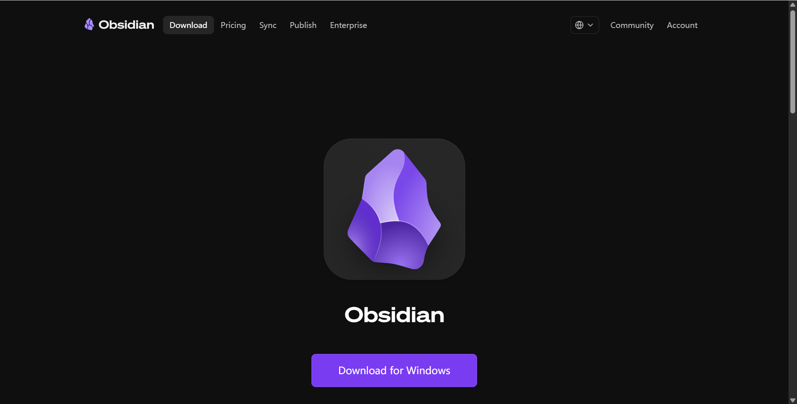

创建 Vault

先搞清楚一个概念：**Vault（仓库）就是个普通文件夹**，不是 Obsidian 的什么特殊格式，可以理解为你的存放文档的数据库。

上一节设计的目录结构长这样：

```text
obsidian/
├── CLAUDE.md
├── raw/
│   ├── articles/
│   ├── videos/
│   └── assets/
└── wiki/
    ├── index.md
    ├── log.md
    └── ...
```

把这个 `obsidian/` 文件夹用 Vault 打开就行。Obsidian 把它当 Vault 管理，但底层还是那堆 `.md` 文件，没有任何变化。

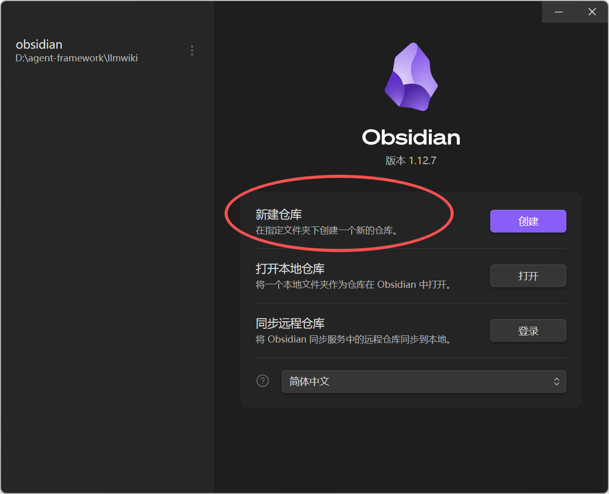

还没建这个文件夹的话，现在建一个空的文件夹，用 Obsidian Vault 打开，再把 raw/、wiki/ 这些子目录补上。

Claudian插件

这是整个 LLM Wiki 工作流的**核心插件**。

Karpathy 原文的工作流是"一边 LLM agent，一边 Obsidian"，两个窗口来回切。Claudian 把这两件事合到一个窗口。**它把 Claude Code（ Codex、Opencode 等 AI 编程 agent）直接嵌进 Obsidian 的侧边栏**。

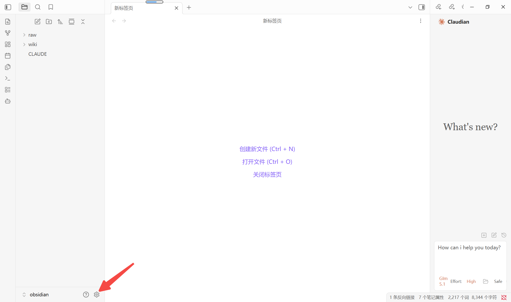

点击左侧边框下面的设置按钮，打开设置页面

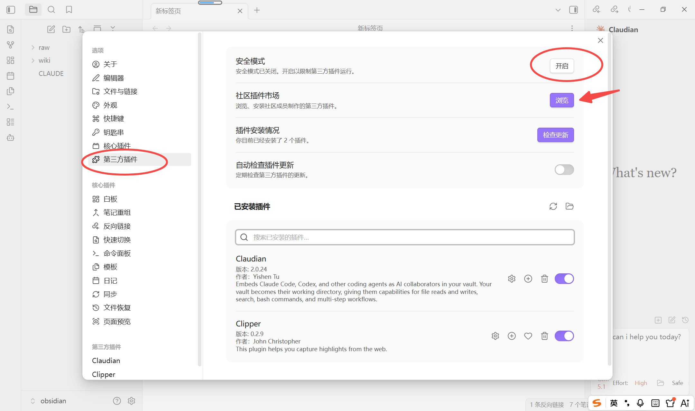

选择第三方插件，关闭安全模式，点击浏览按钮。

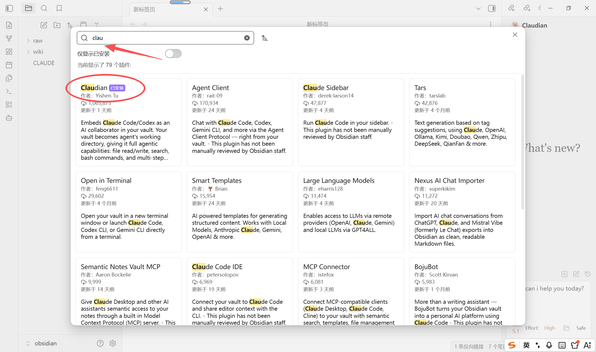

搜索Claudian插件，点击安装并启用即可。

启用后左侧边栏会多出一个 Claudian 图标，点开就是一个对话面板。

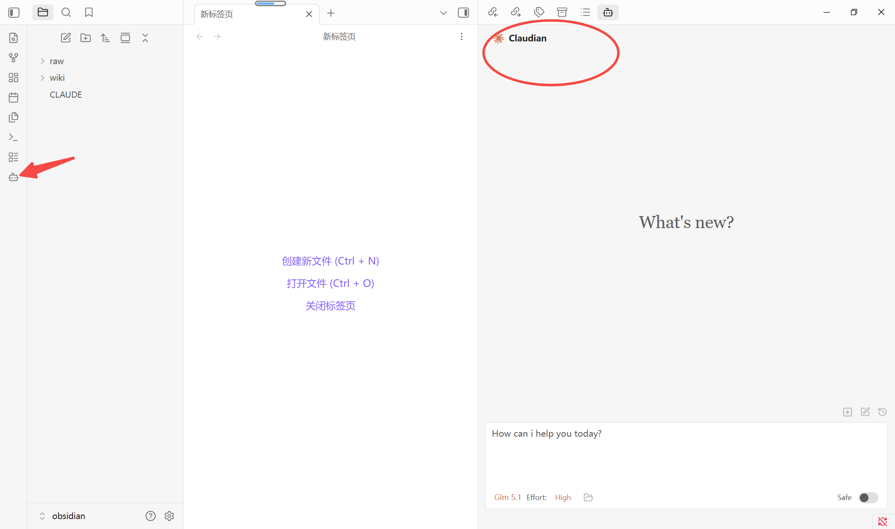

但是第一次用的时候，需要配置告诉 Claudian 用哪个 agent cli（Claude Code / Codex），以及 agent 的可执行路径。配好就能在 Obsidian 里直接跟 agent 对话了。继续点击设置，选择插件，选择agent客户端：

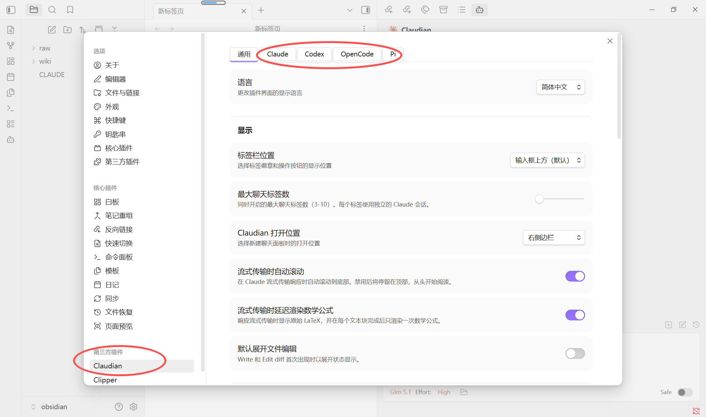

这边我选择的是Claude Code，首先需要注意一下这个Claude Cli路径

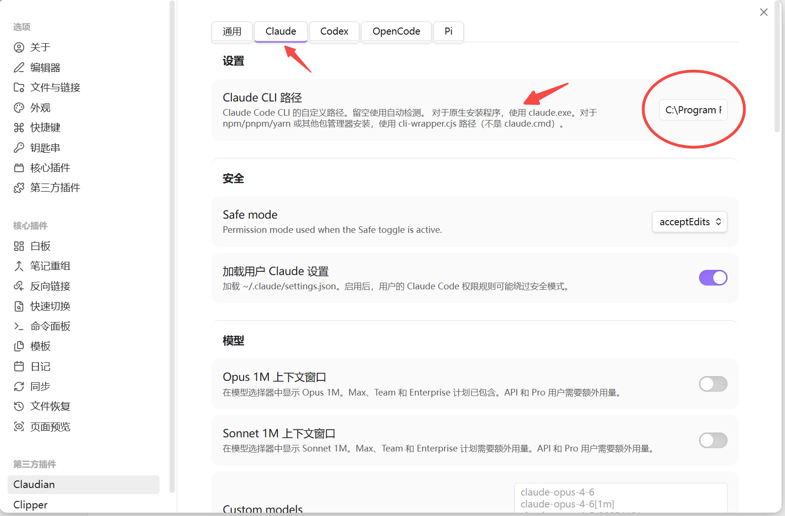

因为我是nodejs安装的，所以这地方填写的是：

```text
C:\Program Files\nodejs\claude.cmd
```

下面还有一些自定义的配置，你可以按需去配置，比如可以自定义环境变量，设置模型：

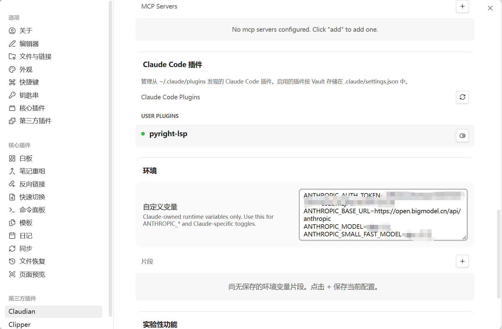

配置完成后，就可以开始对话了：

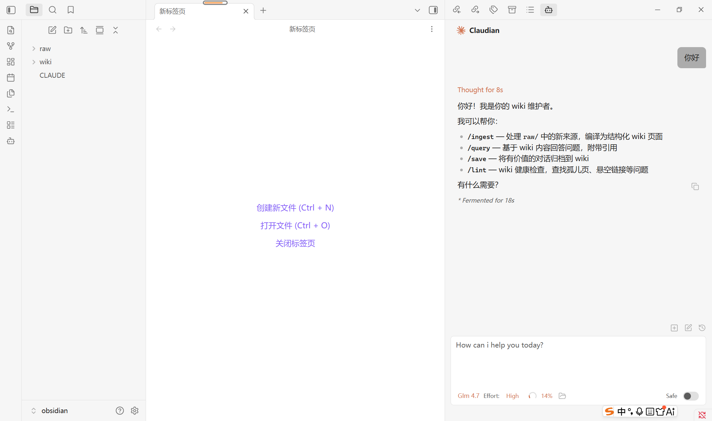

Web Clipper插件

这是一个非常好用的插件，强烈推荐。我们 raw 里的素材从哪来？一部分可以是你已有的 PDF、笔记，另一部分则可以是**网上看到的文章**。

Web Clipper 是 Obsidian 官方出的浏览器扩展（免费），装在 Chrome / Edge / Firefox 里，**一键把当前网页转成 Markdown 存进 Vault**。比手动复制粘贴方便很多，是往 raw 添加素材的主要工具。

打开chrome应用商店，搜索clipper，选择obsidian web clipper安装：

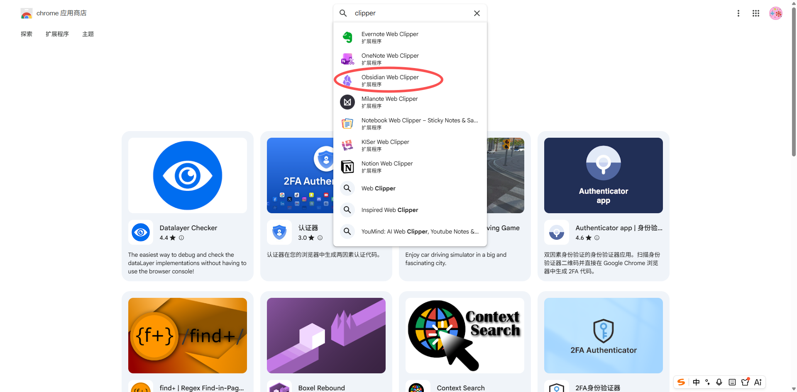

安装完成后，浏览器上的扩展插件就多出来一个：

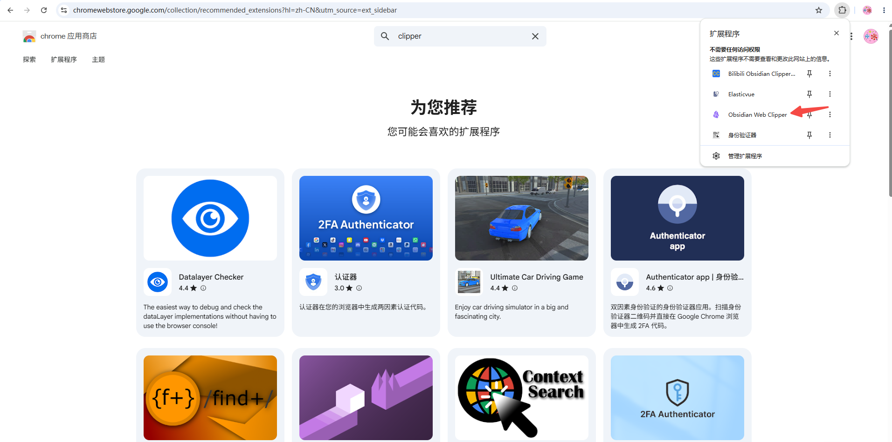

然后点击Obsidian web clipper的设置页面：

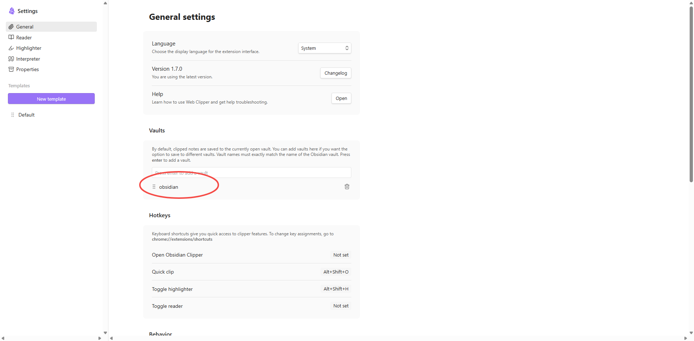

选择好自己的valut，也就是文件夹目录，到这里配置就ok了。

接下来就是使用，比如说，在网页中看到一篇好文章，点那个 Obsidian 图标，它会：

1. 自动提取正文（去掉广告、侧边栏、评论区）
2. 转成 Markdown
3. 让你选存到哪个 Vault、哪个文件夹、用什么文件名
4. 一点保存，文章就落到你指定的 raw/articles/ 下了

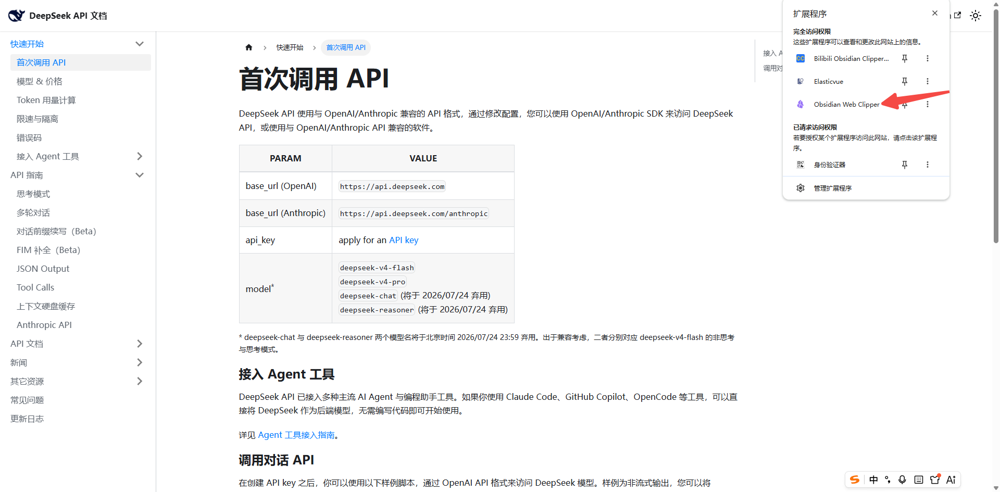

填写raw的存放路径，点击`Add to Obsidian`：

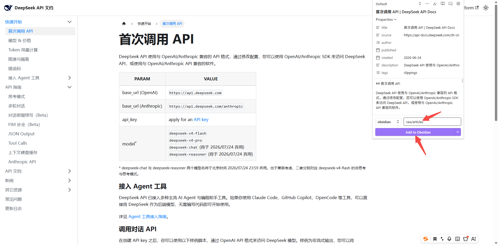

然后你的本地的Obsidian目录下就能看到一份结构完整的文档了：

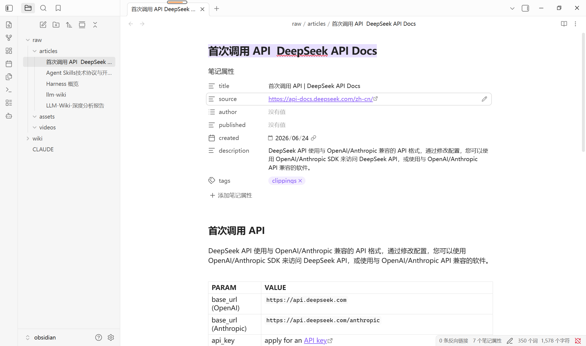

小结

这一节把 IDE 就装好了：

- **Obsidian**：本地 Markdown 笔记软件，是 LLM Wiki 的浏览器和巡视窗口（Karpathy 的 原文中的"IDE"）
- **Vault**：就是一个文件夹目录，表示知识库，用 Obsidian 打开 `obsidian/` 目录就行
- **Claudian 插件**：把 Claude Code 嵌进 Obsidian 侧边栏，agent 和 wiki 合并在一个窗口操作，这是 LLM Wiki 工作流的核心
- **Web Clipper 插件**：一键抓网页文章进 raw，是往 raw 添加素材的主要工具

---

来源: https://thoughts.aliyun.com/workspaces/6963289eb0fc2e001bb052eb/docs/6a40f99d51b1440001d3e67b
