# ✅一次完整的wiki流程

这一节我们拿一篇真实的资料，完整跑一遍：从 Web Clipper 抓进来，到 ingest 编译，再看生成的 wiki 会变成什么样 、用 Graph View 看关系网、query 来提问问题、lint 执行巡检、save 沉淀好的回答。

演示用的资料是一个和网络安全领域相关的：《APT攻击基础科普》：

[APT攻击基础科普 - 渗透测试中心 - 博客园](https://www.cnblogs.com/backlion/p/10153563.html)

这篇文章讲高级持续威胁攻击（APT）的来龙去脉、攻击方式、杀伤链模型、钻石模型、常用漏洞等知识点，内容扎实、概念密集，特别适合演示 ingest 能把一份资料拆成多少实体。当然，你也可以换成自己熟悉领域的文档，流程上是完全一样的。

先看下我们当前的这个vault下，目录结构是ok的，目前只有空文件夹，没有内容，CLAUDE.md规则文件也就位了，接下来我们就开始构建自己的wiki。

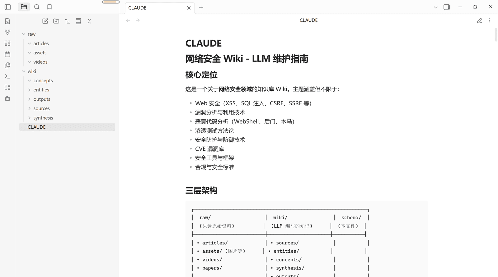

用 Web Clipper 把资料抓进 raw

之前介绍过 Web Clipper，它是 Obsidian 官方的浏览器扩展，能把网页文章一键转成 Markdown 存进 vault。

在浏览器里打开上面那篇 APT 文章的链接，点 Web Clipper 图标，选择好你指定的vault，并配置好保存目录指向 `raw/articles/`，抓下来。

**这个地方需要注意一下，有可能第一次画红圈那边的内容可能是空的，可能因为网络问题，或者网页内容很长的问题，你可以多重新抓取几次就好了，看到下面的内容是页面上的内容就ok了，这时候再保存就没问题了。**

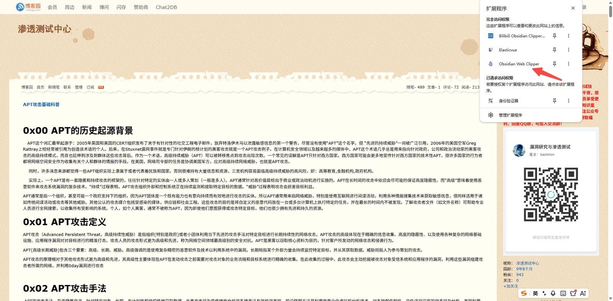

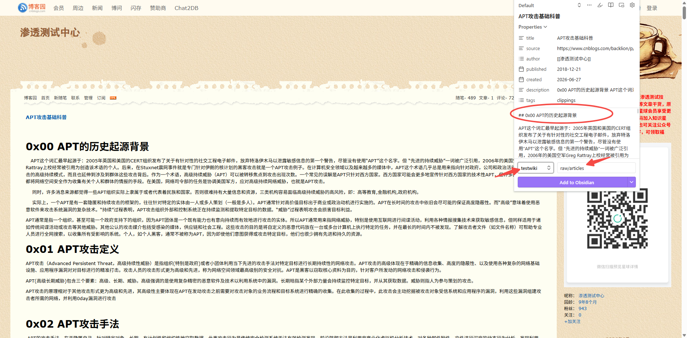

抓完后，可以看下Obsidian的目录 `raw/articles/` 下是不是多了一个 Markdown 文件，文件名就是文章标题（`APT攻击基础科普.md`）。注意，**这就是 raw 了，从这一刻起 LLM 永不修改它**，包括文件名。

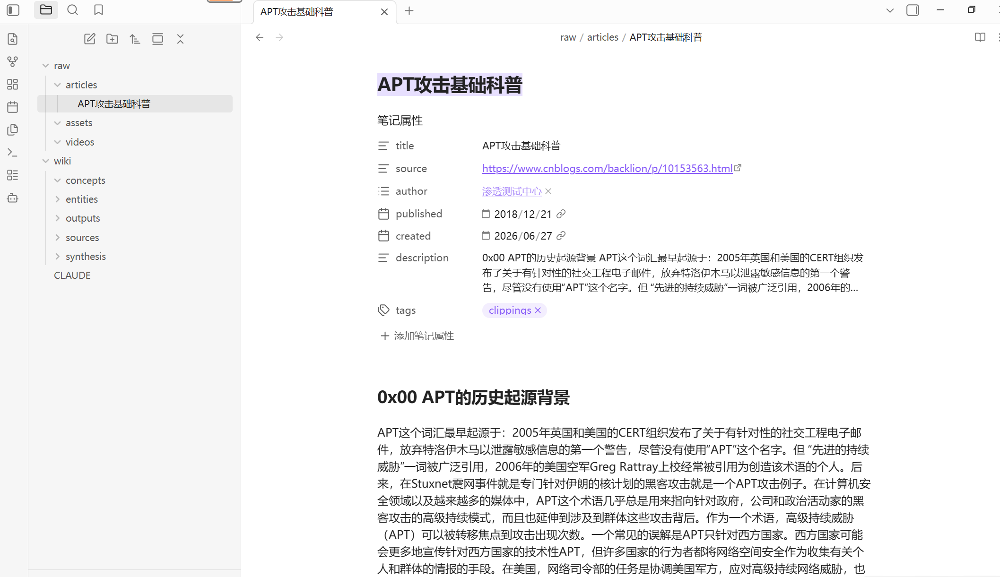

ingest 之前先想清楚这份资料值不值得进 wiki。raw/ 是你精选过的来源，不是什么垃圾都往里塞。Karpathy 说过，人的工作是` curate sources（精选来源）`，LLM 的工作才是剩下的所有事。

ingest 把资料编译进 wiki

资料进 raw 了，开始正式构建wiki。

在 Obsidian 右侧打开 Claudian 侧边栏（第一篇讲过怎么装），在对话框里敲 `/ingest`，回车。你可以先不用敲完，敲几个字母，claudian会自动提示出来这个命令的作用。

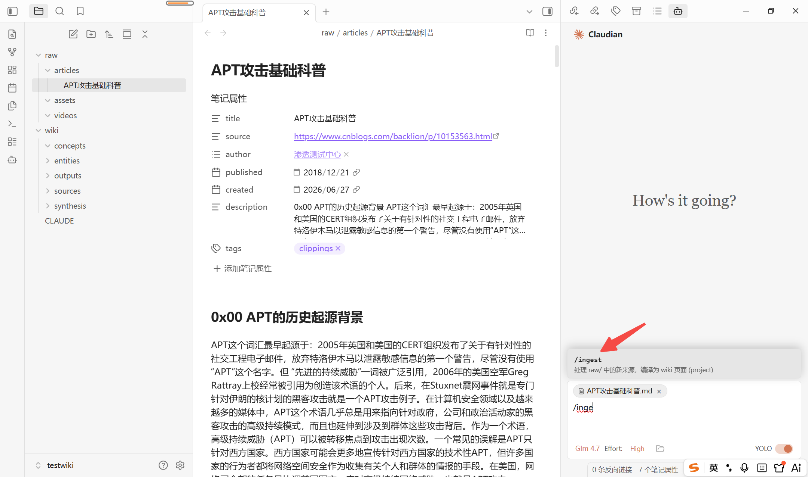

Claude Code 会按 CLAUDE.md 里写的流程一步步走：先读 raw 全文，跟你确认关键发现和重点方向，然后开始往 wiki/ 里写页面。

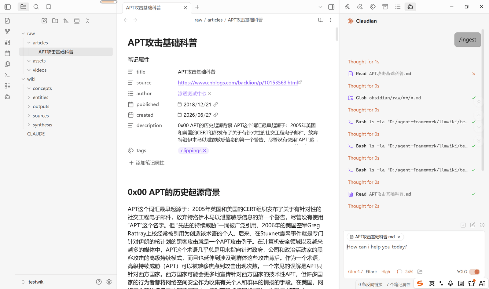

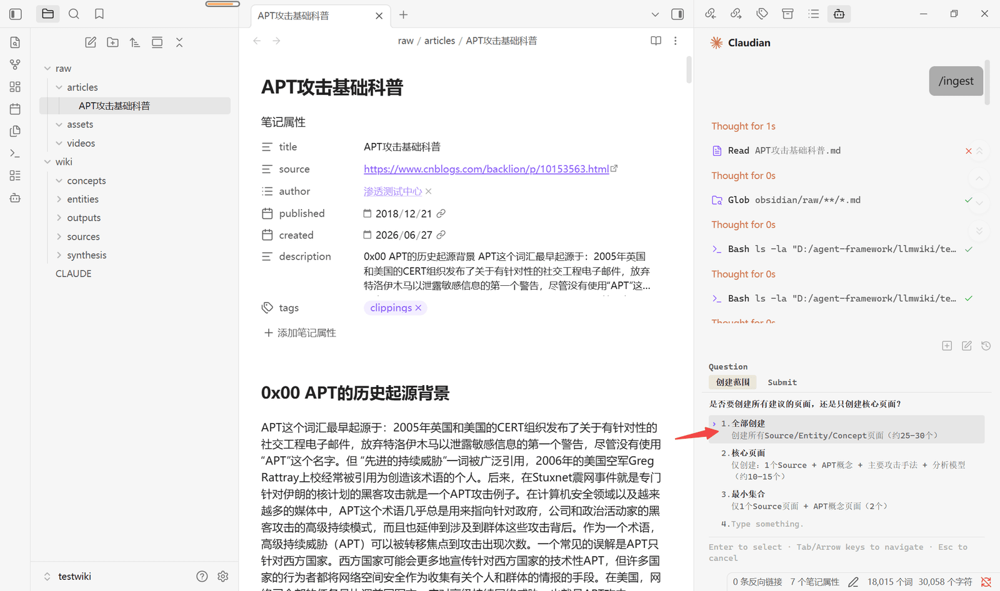

ingest 一份资料可能牵动很多概念，这篇 APT 攻击的文章概念特别多，你会在 wiki/ 下看到一连串新东西生成出来。

查看wiki目录

ingest 跑完后，我们看一下wiki/ 目录。

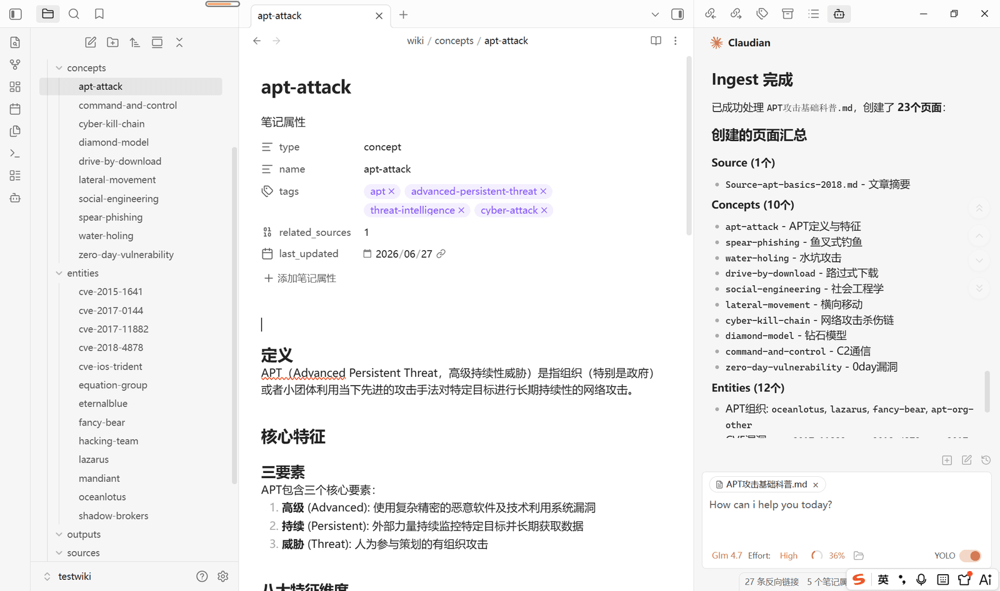

**wiki/sources/ 摘要页**

LLM 会按 CLAUDE.md 的命名规范给这一页起个 kebab-case 的英文名，比如 `backlion-2018-apt-attack-basics.md`（注意：raw 那份中文名文件不动，源页用规范命名）。这一页是这篇资料的"编译产物"：一句话摘要、核心内容、APT的背景、要素、攻击手法、所以关联的各种实体和概念。

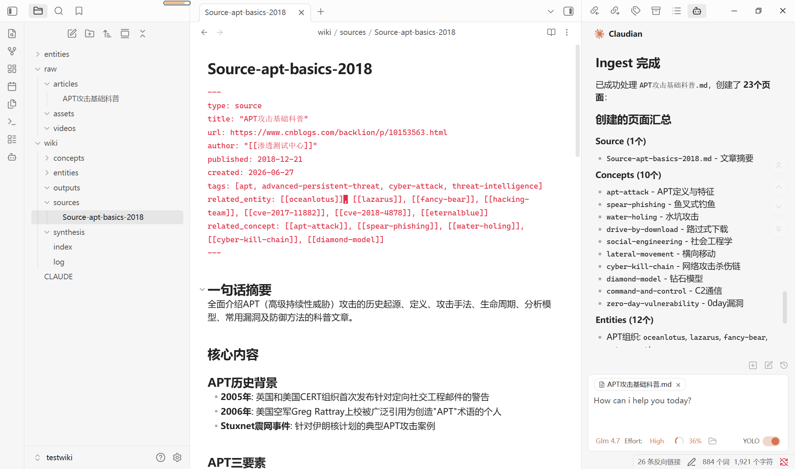

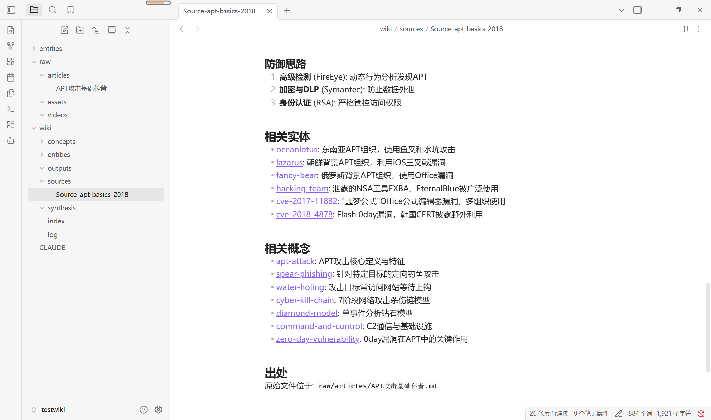

但是，只要是大模型输出，总归会有不确定性，可以看到我们上面生成的这个source页开头的部分展示是有问题的，他的双向链接都没有生效，说明大模型生成的这个文档的markdown语法是有问题的，那遇到这种情况也不用慌张，可以直接执行`/lint`命令（这个后面会讲），也可以直接让claudian帮你去修复就好了，这边我们选择后者。

```text
现在source页的amrkodwn语法是有问题的，开头的元数据部分线上是有问题的，请修复，还有其他的页面如果有类似问题也请一并修复
```

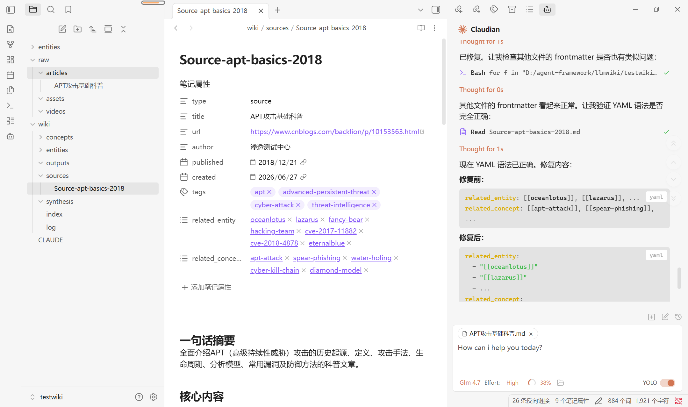

修复完成后，我们可以看到Obsidian里面的文档开头展示都是ok的了。

**wiki/entities/ 实体页**

这篇文章提到大量实体（cve漏洞、工具、组织、APT 团伙），LLM 会把它们拆成独立页面。

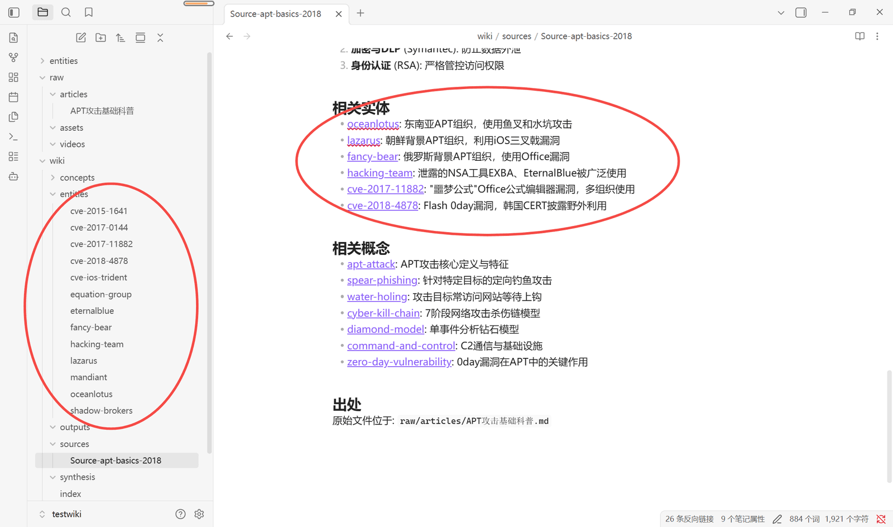

可以看到这边source文件中的相关实体和entites的数量并不一致，这个其实可能和LLM创建文件的时机有关系，可能source目录先创建出来，entites后创建出来，导致这个不一致的问题，也有可能是某些实体只是简单在别的实体中提及，而和主source关系不大，都有可能。

但是没关系，我们可以通过后续的 lint 操作来修复此类问题。这边我们只需要查看entites中的实体是否都有关联即可。

**wiki/concepts/ 概念页**

方法和术语会拆成概念页。这篇文章能拆出来的核心概念：

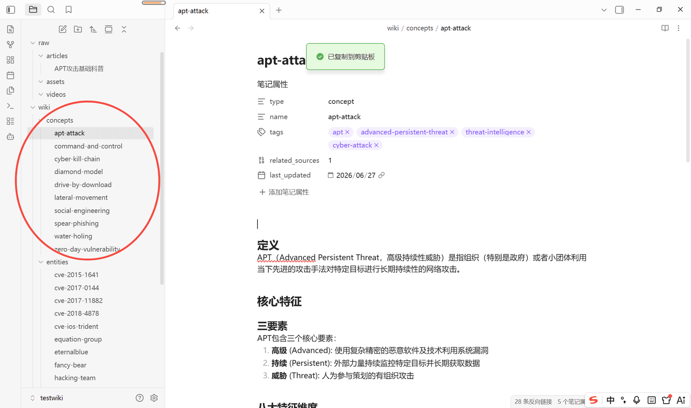

这些里面，像 APT、鱼叉钓鱼、水坑攻击、Cyber-Kill-Chain 这种文章提到的核心概念，都会建成完整的页面，包含定义、机制、原理、案例，还包含关联的实体概念。

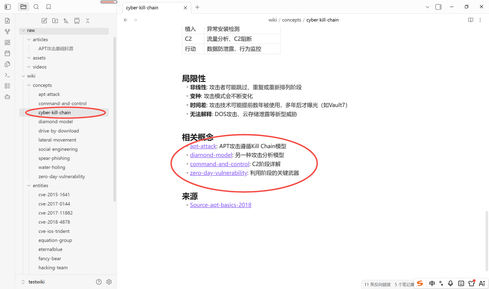

这些页面不是孤立的，通过这样每个概念、实体中再增加引用链接`[[页面名]]`的方式，整个wiki就形成了一个`Graph`。所有的知识也都串联在了一起。ingest 的时候 LLM 一边写页面，一边把这些链接织起来。想看清这张知识网，就需要用到` Obsidian `的 `Graph View`。

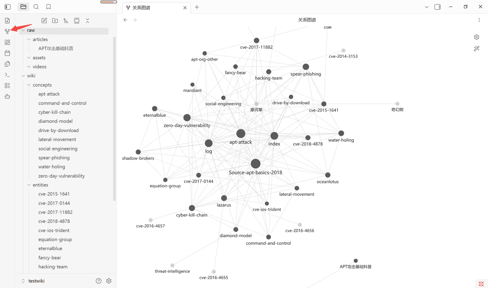

这就是为什么 CLAUDE.md 里把"双链要求"列为核心原则。没有双链，就没有关系网，LLM Wiki 就退化成一堆散文件。Graph View 是双链的可视化验收：ingest 干得好不好，看一眼图就知道。

Graph View 还能帮你发现问题：哪个节点孤零零没人连（孤儿页）、哪个节点连得特别多（核心枢纽，像 apt-attck 这个节点）、哪些页面之间应该有联系却没连上。这些肉眼一看就知道了。

**wiki/index.md 索引目录**

内容索引页也就是整个wiki知识库的目录，它会按类型分章节索引，每条 = 链接 + 摘要描述。第一次 ingest 时这个文件被创建出来，把上面所有新页面都收录进去。方便后续Query的时候进行快速检索。

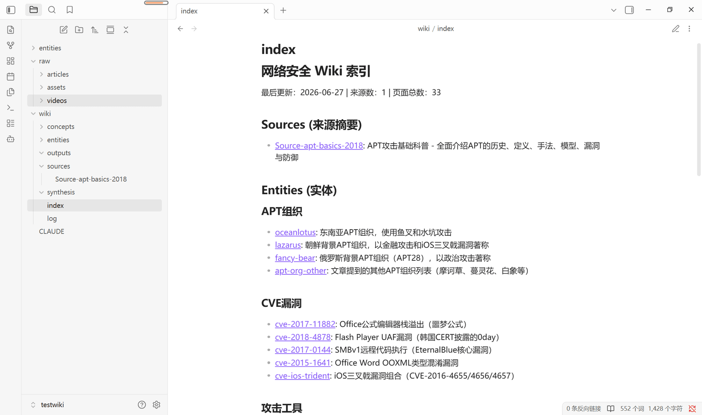

**wiki/log.md 操作日志**

格式如 `## [2026-06-27] ingest | APT攻击基础科普`，记下我们当前已经处理了 `raw/articles/` 下的哪份文件。这条记录：可以 grep 它看操作历史，下次 ingest 时 LLM 会先查 log，跳过已经处理过的 raw。

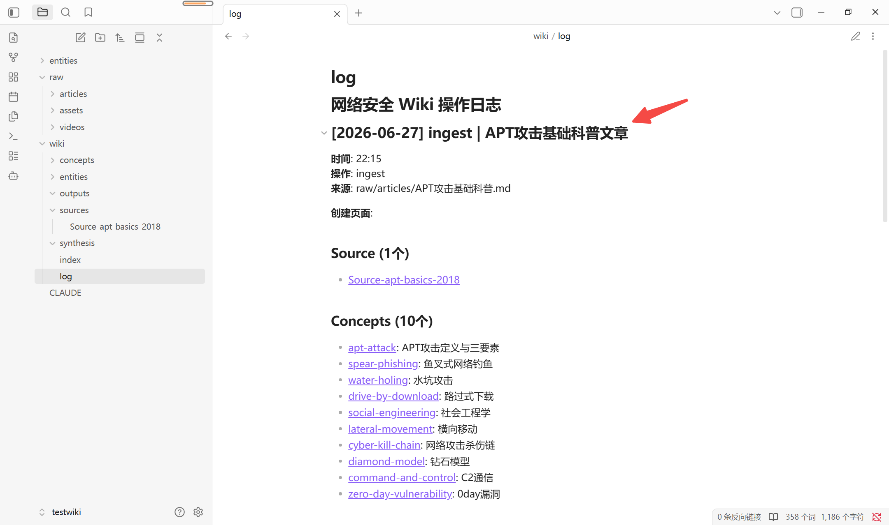

到这里，一篇 APT 科普文章就被真正编译成了 wiki 了。注意 raw 那份原文我们是保持不动的，它只是读的，写的全是在 wiki/ 这一层。

可以看到一篇文档资料就拆出了几十个有效页面，LLM Wiki 做的就是把文档资料里的知识点全部建立起双向链接，挂到知识图谱上。

query 基于 wiki 提问

wiki 知识库有了内容，就能用了。

回到 Claudian，敲 `/query`，问一个基于已编译 wiki 的问题。比如：

鱼叉式钓鱼和水坑攻击有什么区别？分别针对什么样的目标？

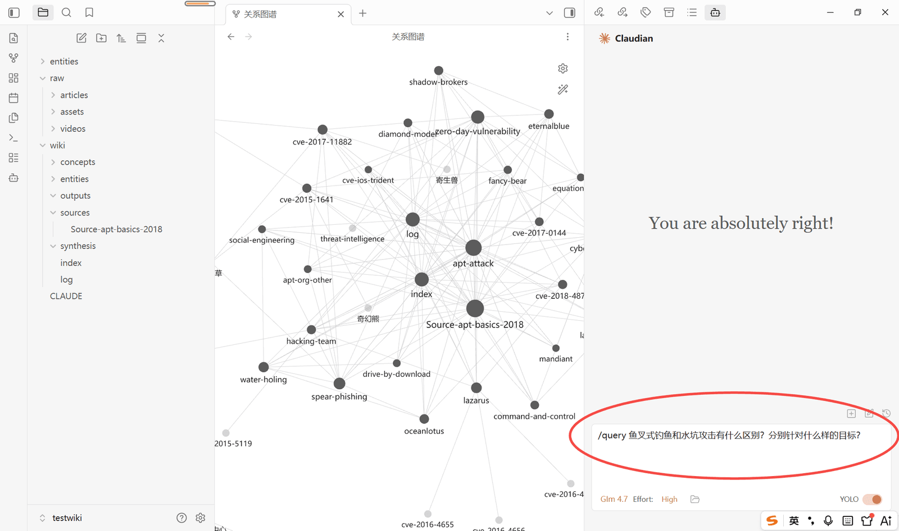

LLM 的处理过程是这样：先读 index.md，通过每条摘要快速判断哪些页面相关（这次命中了 `鱼叉式网络钓鱼`、`水坑攻击`这几个概念页）→ 拉取这些页面的完整内容 → 综合出答案。

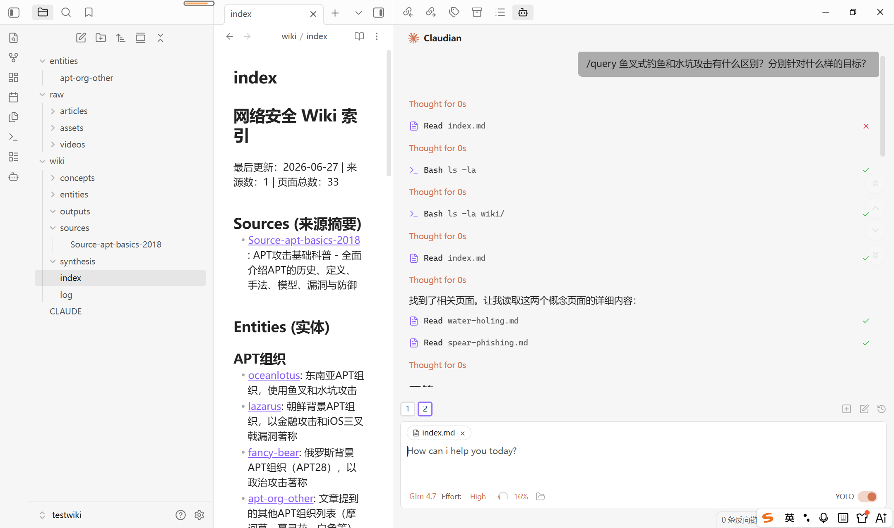

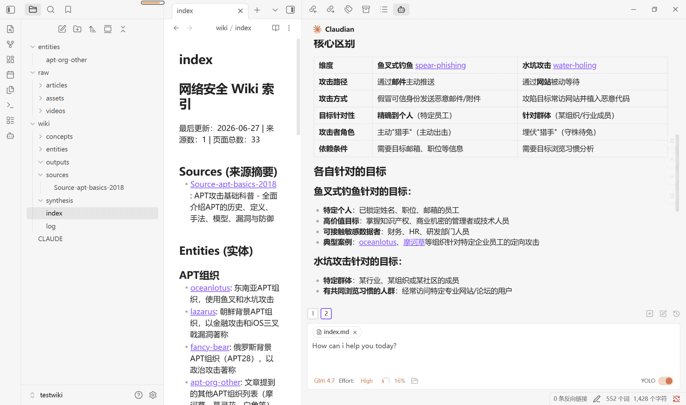

每一条关键论断都会带上 `[[]]` 引用，告诉你这个结论来自哪个页面，比如**`鱼叉式钓鱼 `**`spear-phishing`、**`水坑攻击 `**`water-holing`。这就是 LLM Wiki 和 RAG 的差异：RAG 每次都是从原始文档块临时拼凑，并总结出答案，`llm wiki query `是从已经结构化、已经交叉引用过的 wiki 里读。知识是预先整理、编译好的。

save 沉淀优质的回答

这一步不是每次都要做，但是如果遇到了就别错过。你用 /query 问出了一个特别有价值的答案，比如刚才那个"鱼叉钓鱼 vs 水坑攻击"的对比，问完就丢进聊天记录太可惜。下次想用还得重新问一遍。

这时候敲 `/save`，LLM 会判断这次内容归到哪：

- **跨源综合分析**（综合了多个来源的比较、结论）→ `wiki/synthesis/`
- **有价值的单次问答**（基于 wiki 回答的问题）→ `wiki/outputs/`

现在你只有一份 APT 资料，所以这次问答归到 `outputs/`。等以后你 ingest 了第二份、第三份资料，做出跨资料的对比分析时，那种才会进 `synthesis/`。

LLM 会用对应模板把这次问答写成结构化的 wiki 页面（不是把聊天记录原样复制），更新交叉引用、index、log。

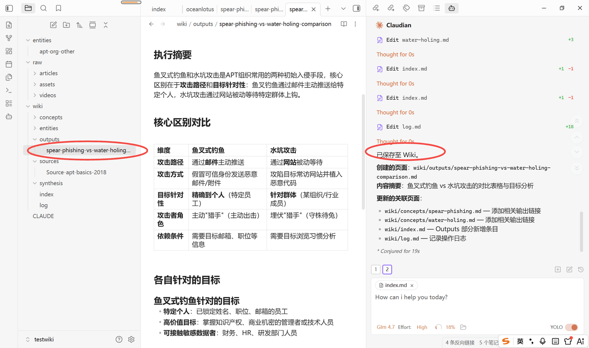

这就是 Karpathy 原文中说的：

` good answers can be filed back into the wiki as new pages`

一次性的探索变成了持久的知识，你下次 query 的时候，这个沉淀下来的答案也会成为综合新材料的一部分。wiki 就是这样越用越好用，越用知识越丰富。

lint 给 wiki 巡检

每隔一段时间，或者说每导入一篇新的文档，你都可以让 Claudian 给整个 wiki 做个健康检查了。

输入 `/lint`。

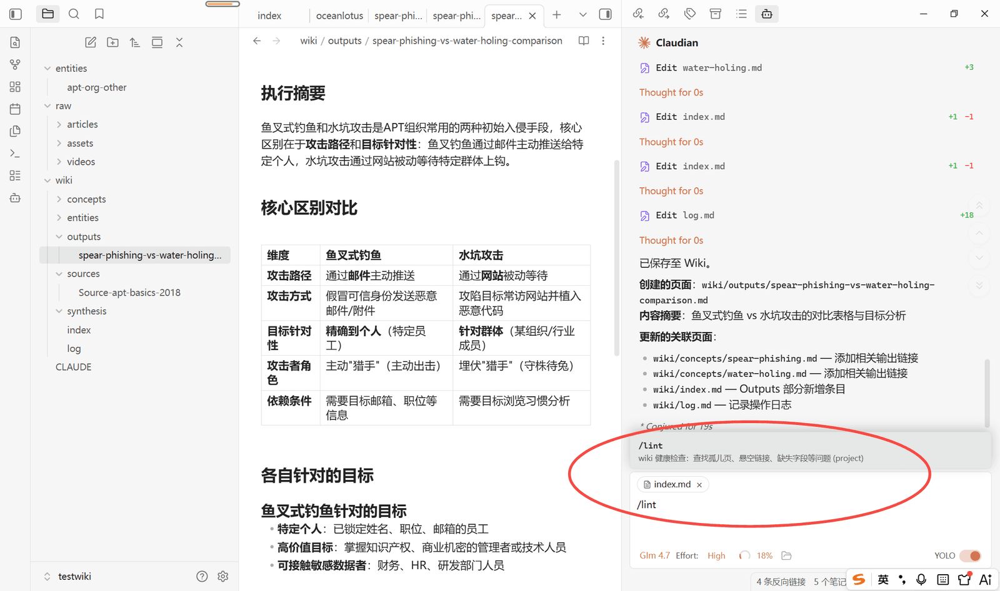

lint 会按 CLAUDE.md 里写好的检查清单，把 wiki/ 下所有页面扫一遍。

主要查 **结构完整性、Frontmatter 是否合规、内容质量是否达标，是否存在矛盾点这几类问题。**

跑完后，lint 会在 wiki/ 下生成一份报告文件（类似 `lint-report-2026-06-28.md`），把所有发现的问题列出来。低风险的问题（比如 index 漏了条目）它会直接帮你修掉；高风险的问题（比如内容矛盾、命名冲突）只报告不动手，等你来判断。log.md 里也会追加一条 lint 记录。

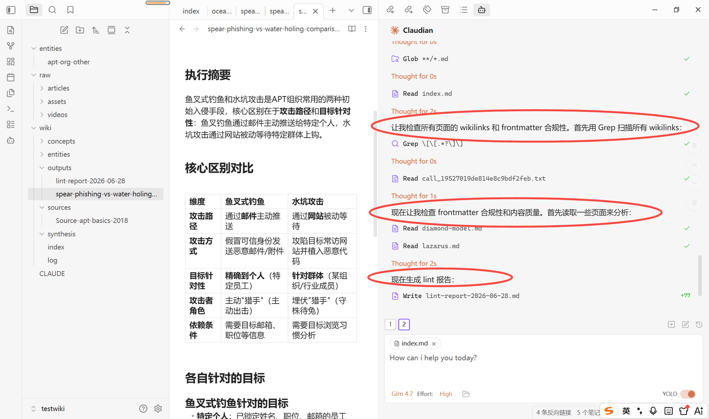

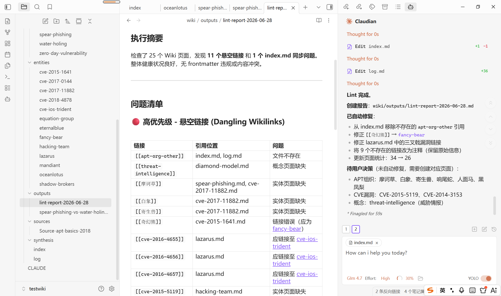

从lint执行摘要中，我们可以看到这些问题都不算特别严重的问题，基本上跑一次 lint，claudian 就能把绝大多数问题当场修掉，省得 wiki 后期膨胀积累太多了之后，再想清理就比较费劲了。

如果有一些你比较在意的问题，lint没有帮你修复成功，你可以通过调整lint.md的提示词的方式，增加修复的指令约束，可以进一步提升wiki的质量。

比如：**我们在之前发现wiki的source的相关实体和entities数量不匹配。**

这个问题我们就可以调整一下lint.md来增强一下约束。同样可以让claudian来帮你实现：

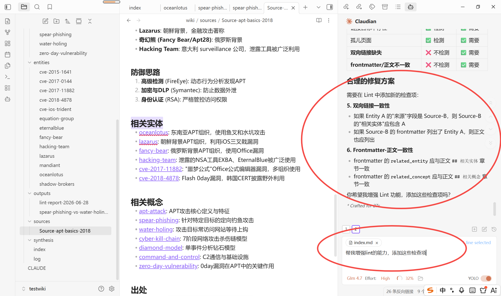

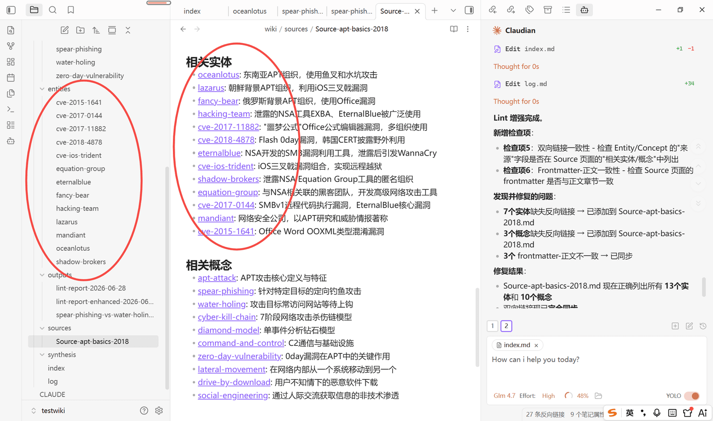

可以看到我们的source摘要页和实体页的双向链接就做到了一致性了。同时查看我们的lint.md文件，

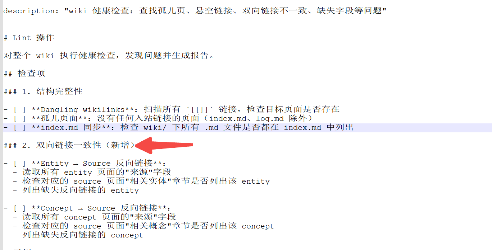

lint.md文件的功能也得到了修复和增强。

总结

这一节我们拿一篇真实的 APT 攻击科普文章，把 LLM Wiki 的完整流程跑了一遍：

1. **通过 Web Clipper** 把资料抓进 `raw/articles/`。
2. **/ingest** 把资料编译成 source 摘要页，拆出十几个 entity 页（CVE 漏洞、APT 组织、攻击工具、机构）和 concept 页（鱼叉钓鱼、水坑攻击、Cyber-Kill-Chain、钻石模型），更新 index 和 log。
3. **Graph View** 看 `[[]]` 双链织出的关系网，`apt-attack`节点居中向四周发散链接其他节点。
4. **/query** 基于已编译的 wiki 回答问题，每个论断都会带上 `[[]]` 引用。
5. **/save** 把有价值的对比问答归档到 `outputs/`。
6. **/lint** 巡检，找出悬空的链接、孤儿页等问题，并执行修复逻辑。

raw/ 进，wiki/ 出，关系网在中间生长起来。一篇资料文章，二十多个页面，一张知识图谱。从这一刻起，你的 wiki 开始了持续的积累。下一步你要做的，就是往 raw/ 里持续填自己领域的资料。每加一份，这张网就更密一层；每问一次好问题，wiki 就更聪明一点。

这就是 LLM Wiki 的全部：把 LLM 从一次性聊天工具，变成一个会陪你长期积累知识库的合作伙伴。

---

来源: https://thoughts.aliyun.com/workspaces/6963289eb0fc2e001bb052eb/docs/6a40fa8cc71a89000161804c
