# ✅如何实现多模态回答

我们回头看一下那篇 APT 攻击的科普文章，会发现一个问题：**文章里其实是有图的**。架构图、流程图、模型图有差不多10几张图片，但是这些图片在 ingest 的时候全被忽略了，wiki 里只生成了文字概念页，图本身一张没进。

这样就会导致：你用 /query 问 APT 杀伤链长什么样，LLM 只能给你列七个阶段的名字，给不出原文中具体的流程图。

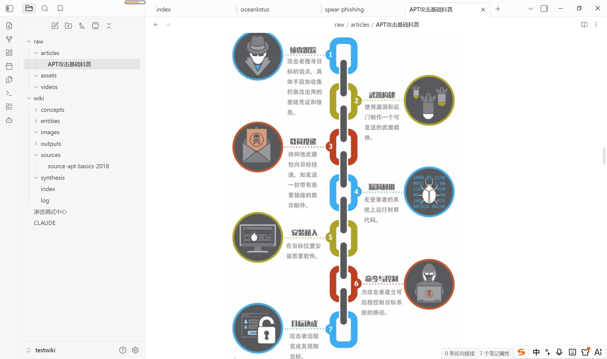

第一篇讲过 LLM Wiki 和 RAG 的根本区别：RAG 是 query 的时候临时拼凑，LLM Wiki 是 ingest 的时候提前编译。那是不是自然而然的可以想到，我们可以在编译期ingest的时候把图片的含义给分析了，query 时直接检索召回就好了。

那问题的本质就变成了：**LLM Wiki 能不能像多模态 RAG 一样，在检索时关注文档里图片的语义，返回图文并茂的内容？**

设计思路

这边我的设计思路参考了我们之前做过的多模态 RAG，我们先大致回顾一下多模态RAG的操作步骤：

1. 从文档里提取出图片
2. 调用多模态模型，对每张图做语义理解，生成一段语义描述文本
3. 在原文中图片的位置插入 `<image>` 标签占位符，标签里 `src` 属性指向原图链接，`desc` 属性保存刚生成的语义描述
4. 对源文档做向量化时，这段图片描述和正文一起被向量化
5. 检索时，用户的问题就能命中图片的语义内容（因为描述已经变成可检索的文本了）
6. 召回时，命中的 `<image>` 标签会被解析，把 markdown 里的原始图片渲染出来

这样一来，图片就不再是检索的盲区。图文一起被索引、一起被召回，返回的是图文并茂的内容。

**那显然 LLM Wiki 也可以借鉴这套思路来实现图文并茂的回答。**只是区别在于处理时机：**多模态 RAG** 是在**构建向量索引**时理解图片，然后将图片描述与文本一起向量化；Query 时仍然需要通过检索、拼接 Prompt，再交给 LLM 临时组织答案。

而 **LLM Wiki** 更适合在 **ingest（编译）阶段**完成图片理解。

具体来说，在 ingest 时：

1. 提取 Markdown 中引用的图片资源；
2. 调用视觉模型，对图片生成语义描述、涉及实体、架构关系等结构化内容；
3. 将图片信息组织成独立的图片页（Image Page），并建立与当前文档、实体页、概念页之间的双向链接；
4. 编译完成后，整个 Wiki 已经形成图文关联的知识网络，而不是仅仅生成一份向量索引。

此外，**Claudian 本身就具备多模态读取的能力，能直接读图**，内容会作为视觉输入呈现给模型。不用额外接多模态服务，ingest 流程里直接调 Read 就行。

实现落地

我们继续使用Claudian来帮我们做功能的增强，提示词如下：

````text
为 LLM Wiki 增强多模态图片能力，使图片成为可检索、可关联的知识节点。

要求：

* **视觉理解仅发生在 ingest 阶段**，Query 阶段禁止再次调用视觉模型。
* **raw/** 为原始数据，禁止修改；所有新增内容写入 **wiki/**。

### 1. 新增 Image 页面

新增 `wiki/images/`，每张图片生成一个独立 Markdown（kebab-case 命名），图片文件仍保留在 `raw/assets/`。

在 `CLAUDE.md` 中新增 `image` 页面类型，Frontmatter 至少包含：

* `type: image`
* `caption`：一句高质量摘要，包含检索关键词
* `visual_description`：完整视觉语义（架构图必须描述组件、连接关系、数据流、执行顺序；流程图描述步骤和分支）
* `extracted_text`：OCR 提取的全部可见文字
* `asset_path`：`[[raw/assets/xxx.png]]`
* `related`：关联相关的知识页： `concept`、`entity`

页面顶部嵌入原图：

```md
![[raw/assets/xxx.png]]
```

禁止生成无意义描述（如"一张关于 XX 的图片"）。

### 2. 扩展 ingest

扫描 `raw/articles/` 中引用的图片及 `raw/assets/` 下所有图片，调用 Read（Vision）完成视觉理解，生成对应 Image 页面。

同时自动：

* 建立 `related` 双向关联；
* 在相关 Concept / Entity 页面增加 `## 图解`，嵌入原图并链接 `[[images/xxx]]`；
* 更新 `index.md` 和 `log.md`。

### 3. 扩展 Query

Query 阶段禁止再次调用 Read（Vision）分析图片，仅使用 ingest 阶段生成的 Image 页面进行检索和推理。

当命中关联图片时，自动在回答中嵌入：

```md
![[raw/assets/xxx.png]]

> 图：一句图片说明。

来源：[[images/xxx]]

实现图文并茂的回答。

### 4. 回溯历史图片

检查 `raw/assets/` 中尚未生成 Image 页的图片，全部补建，并同步更新相关 Concept、Entity、Index、Log。

目标：图片与 Concept、Entity 一样成为 Wiki 一级知识节点，图片语义在 ingest 阶段完成编译，Query 阶段直接利用编译结果完成图文联合回答。
````

改造点和整体流程

这段提示词发给 Claudian 之后，它会对三个地方做改造：

**CLAUDE.md 新增 image 页面类型**：规定了图片页的 frontmatter 规范（caption、visual_description、extracted_text、asset_path、related），以及页面顶部必须嵌入原图的约定。从此图片和 concept、entity 一样，是 wiki 的一级知识节点。

**ingest 命令扩展**：原来的 ingest 只处理文本，现在加了一步：扫描源文档引用的图片和 raw/assets/ 下的独立图片，用 Read 工具做视觉理解，生成图片页，并在相关的 concept/entity 页里嵌图，同步更新 index.md 和 log.md。

**query 命令扩展**：query 阶段禁止调视觉模型，只能读已经编译好的 image 页。命中带图的页面时，答案里自动嵌入原图。

整体流程串起来是这样：

```text
原始文档（图文混排 markdown）
↓
ingest 阶段 Claudian 用 Read 逐张读图
↓
生成 wiki/images/ 下的图片页（含语义描述）
↓
双向链接到 concept/entity 页
↓
query 阶段纯文本检索
↓
命中图片语义
↓
答案嵌入原图。
```

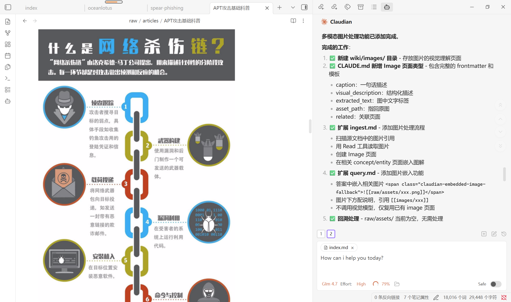

案例一：构建 APT 源文档图片页

之前 ingest 的 APT 攻击科普文的时候，wiki 里只生成了文本概念页，图全被忽略了。现在功能增强了，让 Claudian 回溯处理。

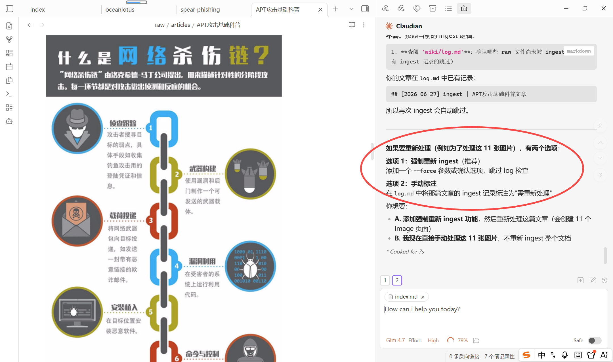

可以看到这边Claudian给我提供了两个解决方案：第一是强制重新ingest，并增加一个--force参数选项，第二是可以让它手动处理这些就图片，我们这边选择推荐的方案A。

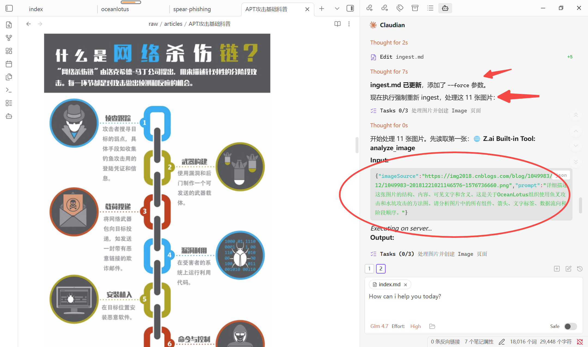

可以看到agent在自动的帮我更新ingest.md，更新完成后，就开始着手处理文档中的11张图片，每张图片都会调用多模态能力去进行语义分析。解析完成后，还会去生成对应的images类型的页面。

等待一会，Claudian就会完成所有images类型页面的创建了。

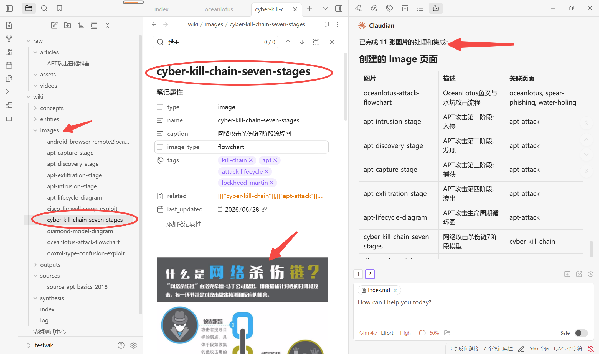

到这里我们的图文构建就ok了，接下来我们就来尝试提问，看能否有图文并茂的回复。

```text
/query 网络杀伤链是什么，并提供一下他的流程图
```

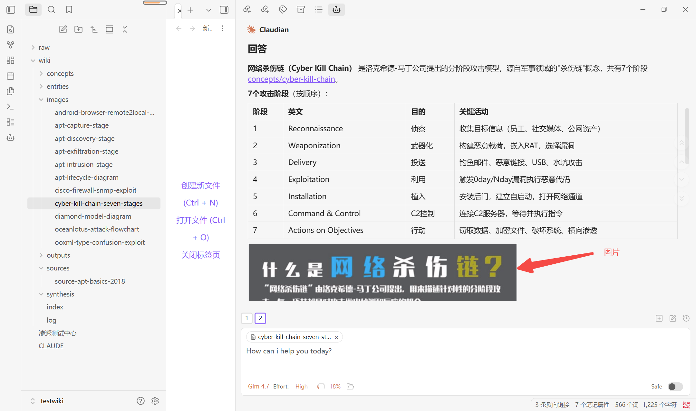

案例二：图片的 ingest

这部分我们主要演示一下`raw/assets`下的图片如何处理。我们之前使用的 APT 科普文，在进行web clipper的时候，有一张图片丢失掉了，我们在本地的raw/articles的文档中这个图片没有抓取到，这边我们直接使用这个图片来举例。

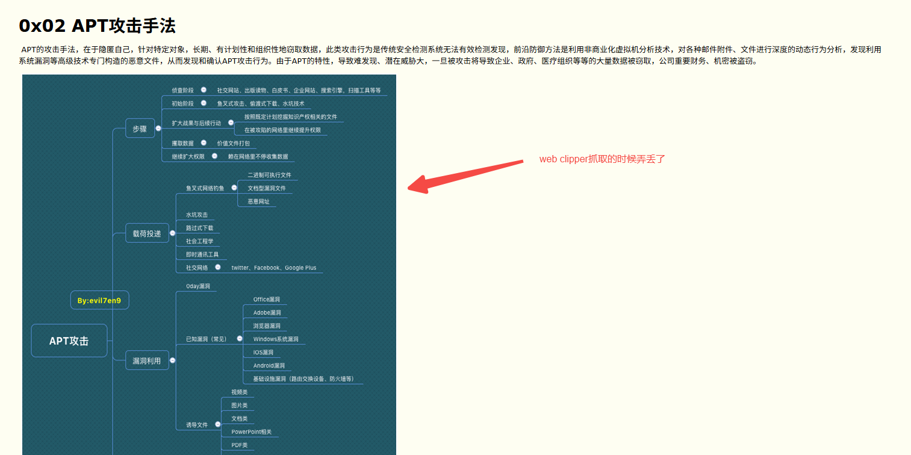

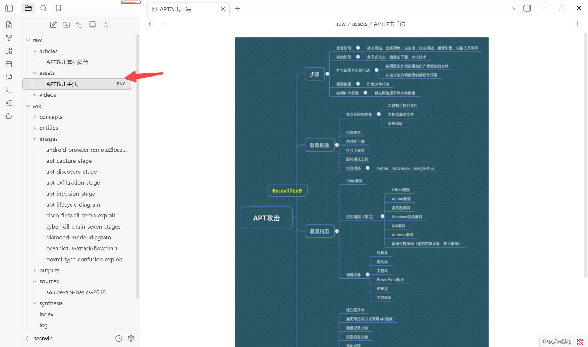

但是我尝试用Claudian对原文中的这个图片进行视觉理解，发现工具确实理解不了，一直报错400，可能图片格式有问题，正好也印证了为啥web clipper抓取不下来，但是，我在一个github的项目中找到了一样的图片。

[https://github.com/SecWiki/sec-chart/blob/master/APT%20%E6%94%BB%E5%87%BB/APT%20%E6%94%BB%E5%87%BB.png](https://github.com/SecWiki/sec-chart/blob/master/APT%20%E6%94%BB%E5%87%BB/APT%20%E6%94%BB%E5%87%BB.png)

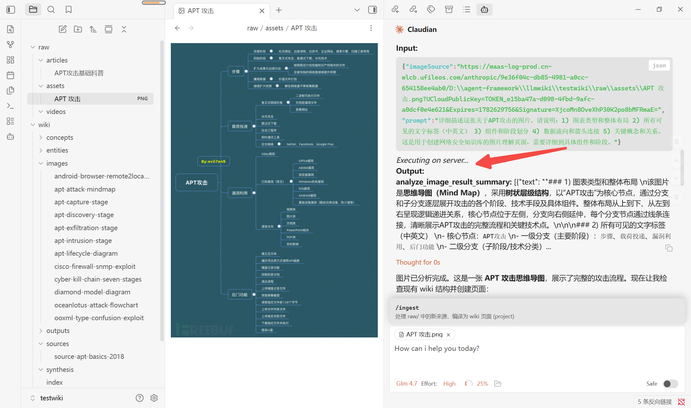

这时候就可以正常视觉理解了，等ingest 完成后，`wiki/images/` 下会多出对应的图片页，并且`apt-attack`概念页也增加了链接的思维导图，双向链接全部组织好。

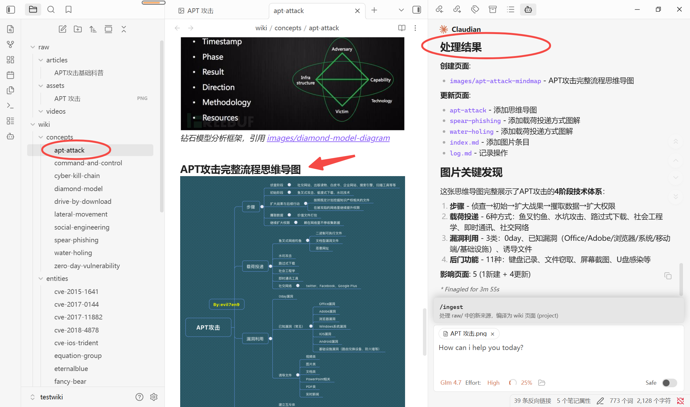

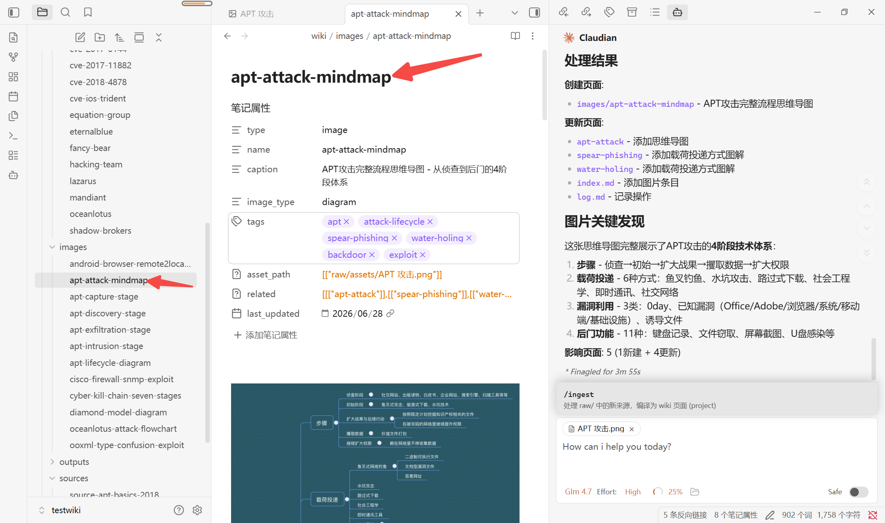

这也就说明了，就算`raw/assets`下面直接放图片资源，我们的llm wiki依然可以正常的进行解析编译，组织生成知识图谱。当然还是和之前说的一样，每次ingest完成，建议都执行一下lint，保证wiki的质量。

可以尝试提问一下：

```text
/query apt攻击的思维导图是什么样的
```

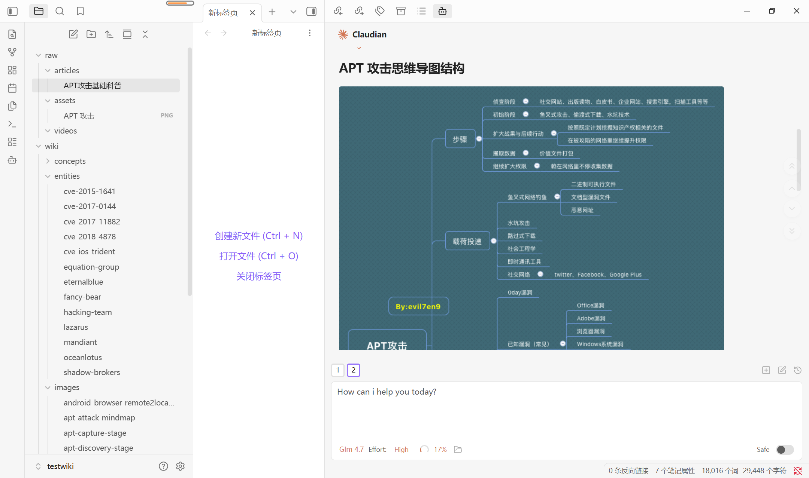

---

来源: https://thoughts.aliyun.com/workspaces/6963289eb0fc2e001bb052eb/docs/6a40fafea7c8ff0001f45cd9
