# ✅音视频文本的抓取

这一节我们再给大家补充几个获取知识素材的方式。前面我们 ingest 的都是文章，但平时接触的知识很多不只是在文章里，而是在视频和音频里，比如：B站技术分享视频、播客、教程录屏等等。这些知识都没办法直接喂给 LLM。

针对这些场景，这边给大家介绍两个很实用的工具。

Bilibili Obsidian Clipper

很多 B 站视频本身是有字幕的（UP 主上传的字幕，或者 B 站自动生成的 AI 字幕）。这种情况不用做语音识别，直接把字幕扒下来就行，又快又准。

工具叫 **Bilibili Obsidian Clipper**：

[https://chromewebstore.google.com/detail/bilibili-obsidian-clipper/jokophbofiphenlplmohabdcmalcbenl?hl=zh-CN&utm_source=ext_sidebar](https://chromewebstore.google.com/detail/bilibili-obsidian-clipper/jokophbofiphenlplmohabdcmalcbenl?hl=zh-CN&utm_source=ext_sidebar)

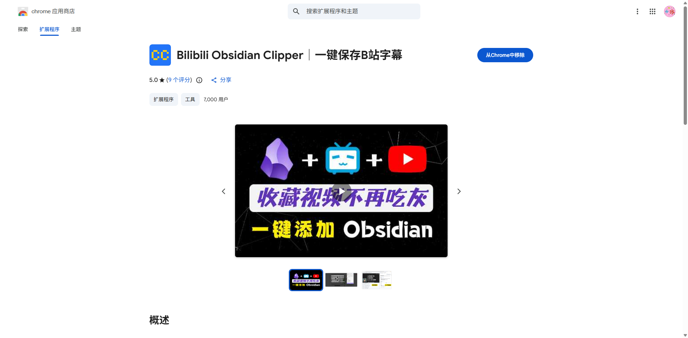

直接点击安装这个插件，你的chrome浏览器上就出现了这插件了。

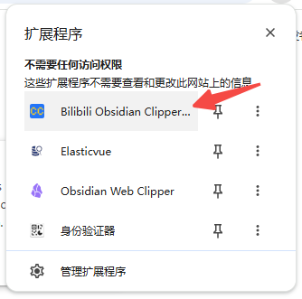

安装完成后，接下来我们开始正式尝试抓取B站上的学习视频：

1. 打开你的目标 B 站视频页面，比如说，这边我随便选择了一个和APT攻击相关的视频
2. 点浏览器右上角的扩展图标，它会自动识别当前视频的字幕轨
3. 预览字幕内容，确认没问题
4. 一键保存：可以复制 Markdown、下载字幕文件

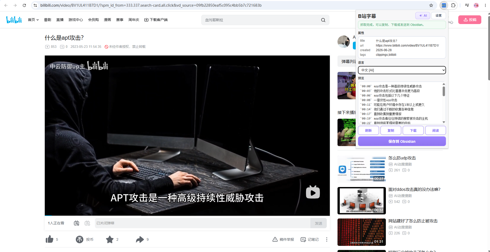

如果遇到一些没法识别出字幕的视频，可以尝试多刷新几次页面，绝大多数情况下都可以重新抓取到。

但是，这个工具只能抓"有字幕轨"的视频。判断方法很简单：看 B 站播放器有没有"字幕"这个选项，有就能抓，没有就抓不了。UP 主没上传字幕、B 站也没生成 AI 字幕的视频，这个工具则无能为力。

到这里我们其实已经可以抓取到我们想要的内容了，只需要自己手动copy或者下载放到我们的Obsidian之中就好了，但是我们现在想要的效果是，可以和web clipper一样，可以一键点击保存到Obsidian。

第一次点击"保存到Obsidian"这个按钮，会跳转到一个配置页面：

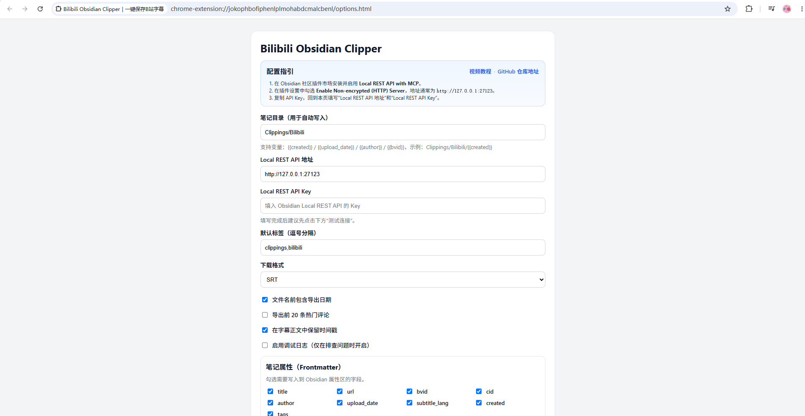

可以看到他的"配置指引"中说明了，需要我们在Obsidian安装一个插件，并做一下配置，这个插件就是用来给Obsidian发送数据用的，那我们打开本地的Obsidian，第三方插件商城中搜索下面这个插件：

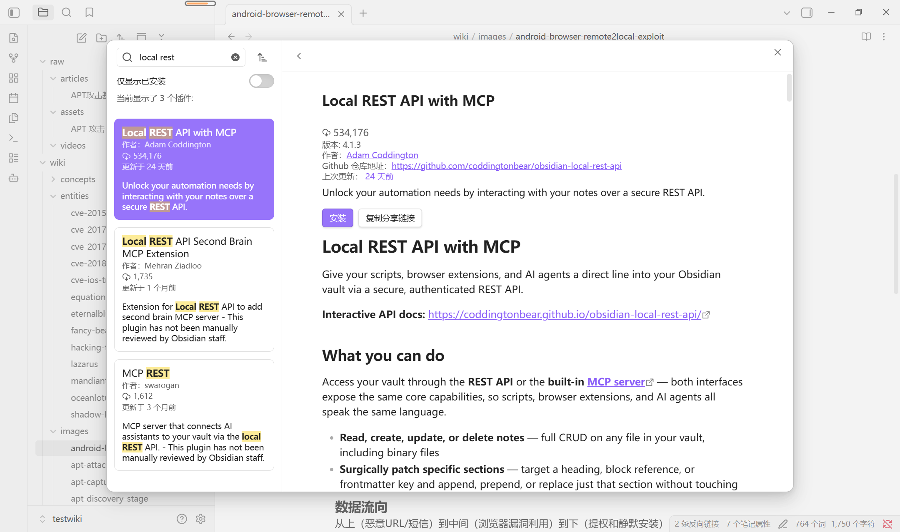

安装完成后，打开这个插件配置页面：

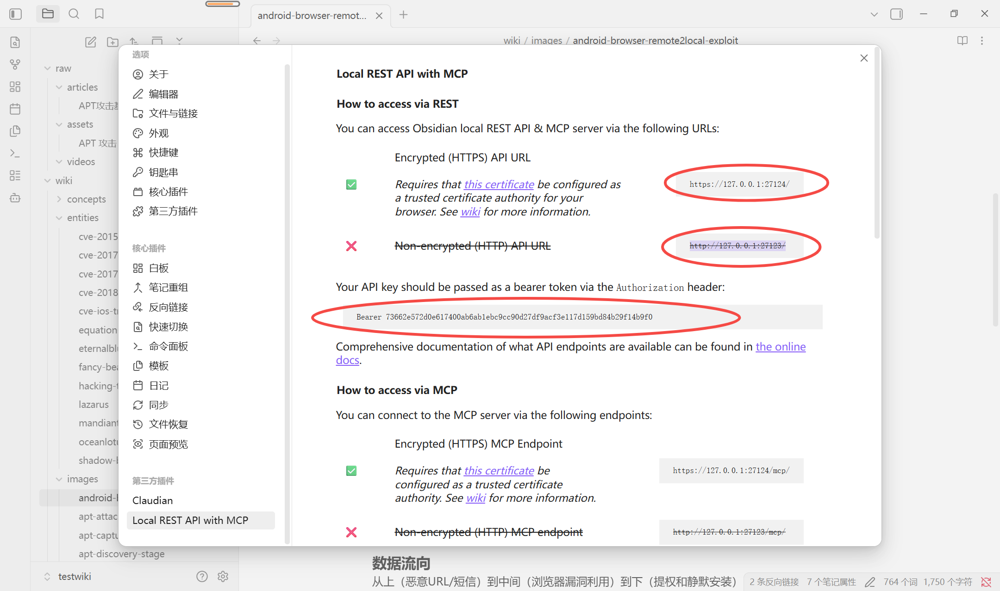

这个地方http的方式是禁用的，我们需要打开一下开关，这个配置是在当前页面的下面：

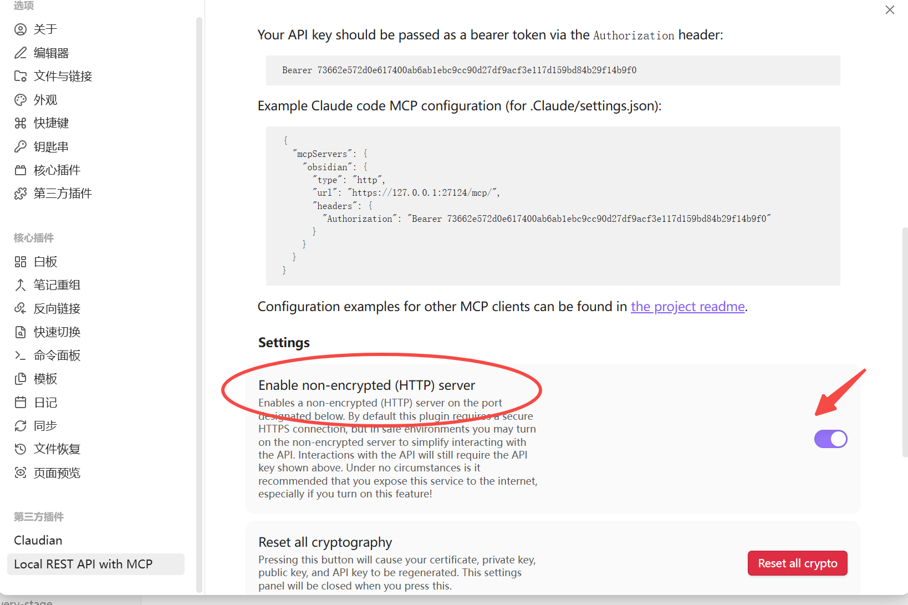

打开之后，就可以看到我们的http是可用的了：

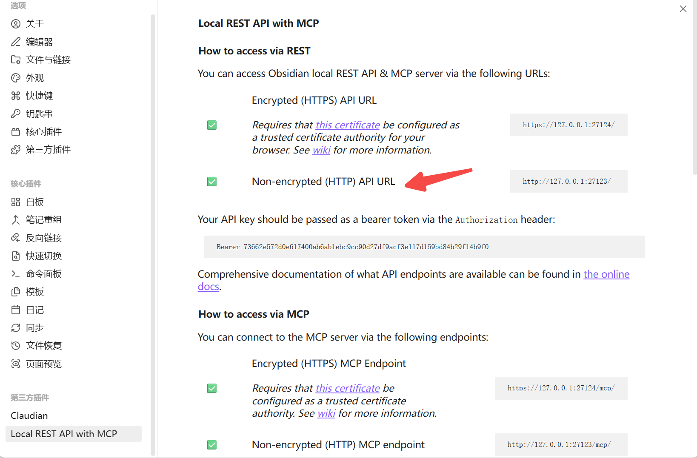

到这Obsidian的配置就ok了，我们现在回到浏览器的那个配置页面，按照我们的本地配置，填写这三处的内容。

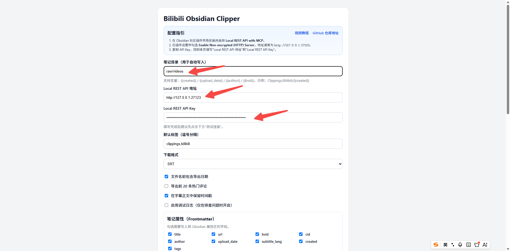

往下拖一点，可以点击连接测试，测试和本地obsidian的连通性是否ok，没问题的话，就保存设置即可。

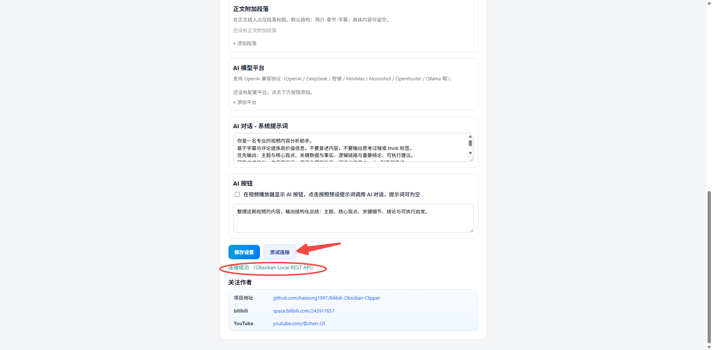

回到我们B站的原视频处，点击保存至Obsidian：

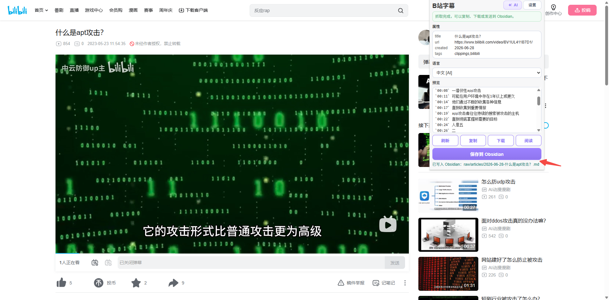

可以看到我们本地的Obsidian，多了这样一个抓取的视频台词文件：

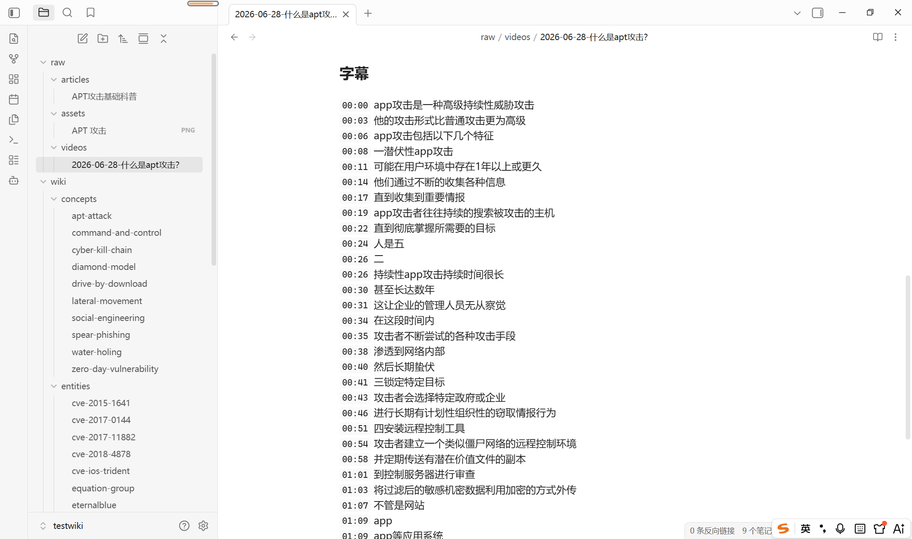

这样就获取到了我们的目标内容，可以继续我们之前的流程，ingest即可。

videotranscriber

播客、没字幕的访谈、YouTube 教程录屏、会议录像，这些没有现成字幕的，就得做语音转文字。

[Transcribe Video to Text - Free AI Video & Audio Transcription Tool Online, Unlimited & No Sign-up ｜ Video Transcriber AI](https://videotranscriber.ai/)

这是一款在线工具，支持贴 YouTube 链接，tiktok 链接，也支持直接上传本地的视频/音频文件（MP4、MP3 等常见格式都行），每天可以免费转10次。

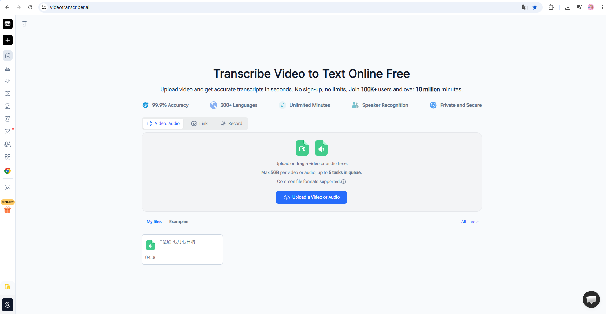

使用流程：

1. 打开 `videotranscriber.ai`
2. 贴视频链接，或者上传本地文件
3. 等它转写完成（几分钟到十几分钟，看时长）
4. 复制转写出来的文字
5. 整理成 Markdown（去掉多余的时间戳，保留说话人标注如果有），存进 `raw/videos/`

比如说我在tiktok上搜索到的一个关于apt的视频：

[https://www.tiktok.com/@cybertutor24/video/7527630087978487047?q=apt%E6%94%BB%E5%87%BB&t=1782641311075](https://www.tiktok.com/@cybertutor24/video/7527630087978487047?q=apt%E6%94%BB%E5%87%BB&t=1782641311075)

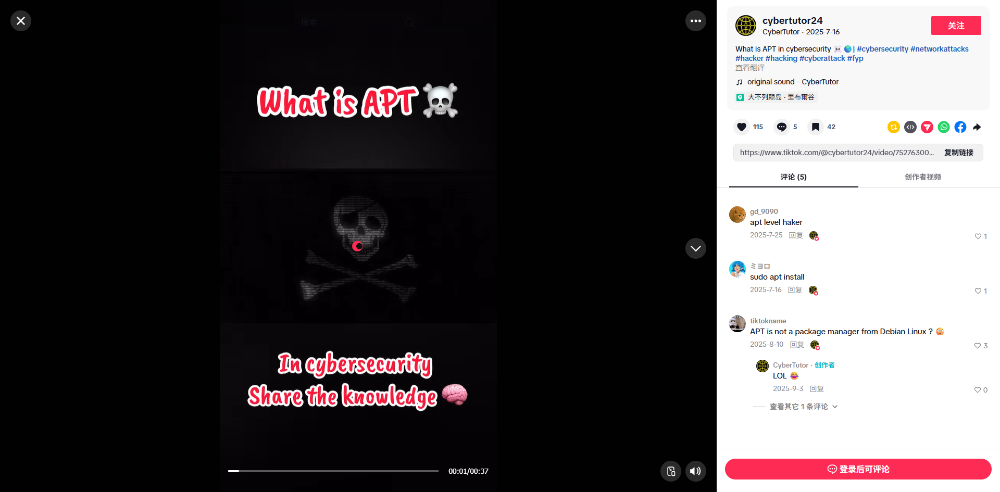

我们可以直接copy链接到下面的link输入框之中：

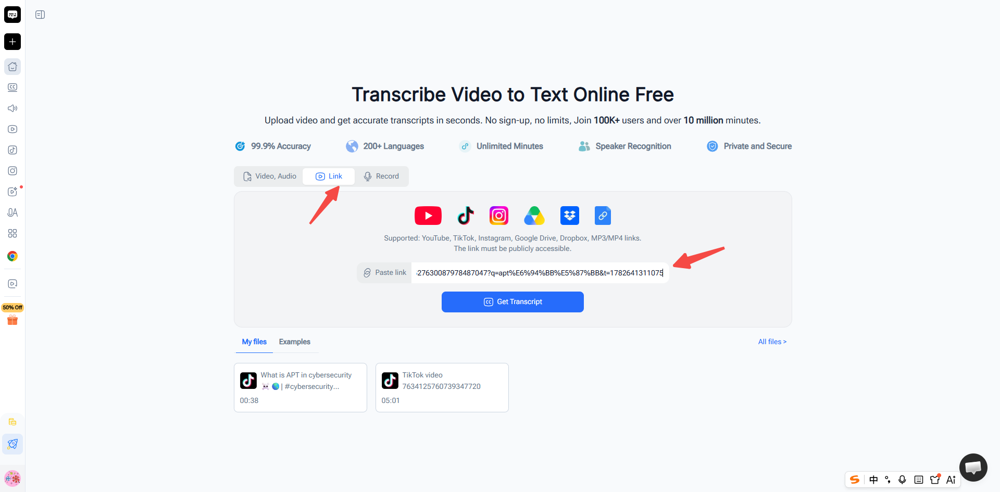

点击Get Transcript：

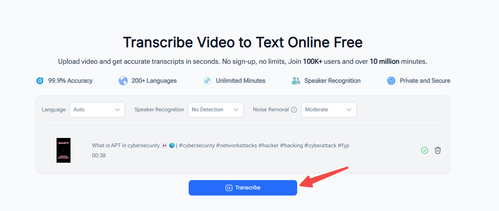

点击：Transcribe

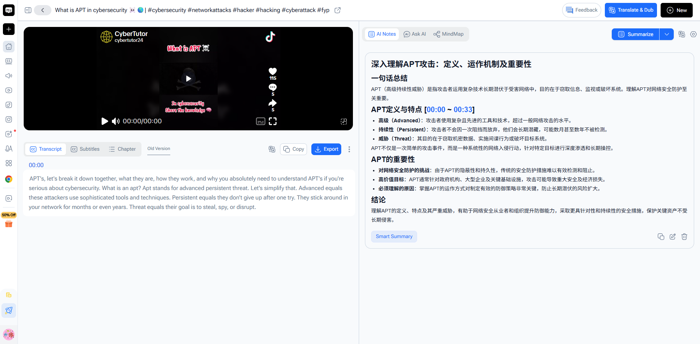

还可以选择导出各种文本格式，我们直接复制上面的内容放入到Obsidian的`raw/videos`目录下即可：

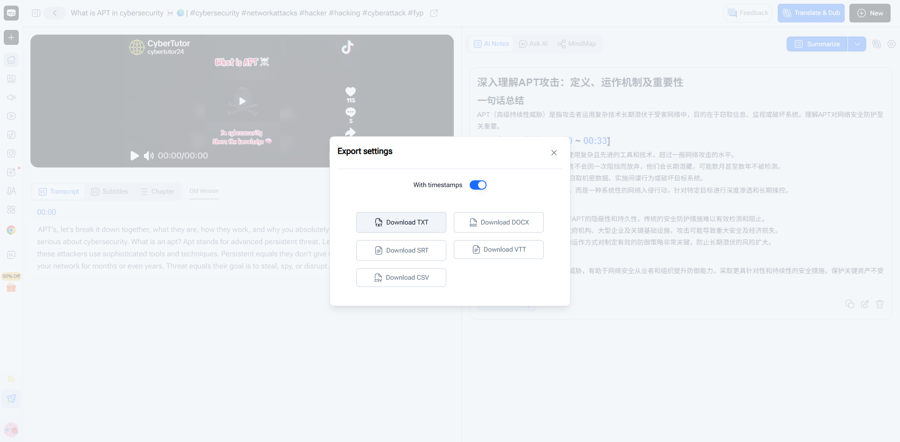

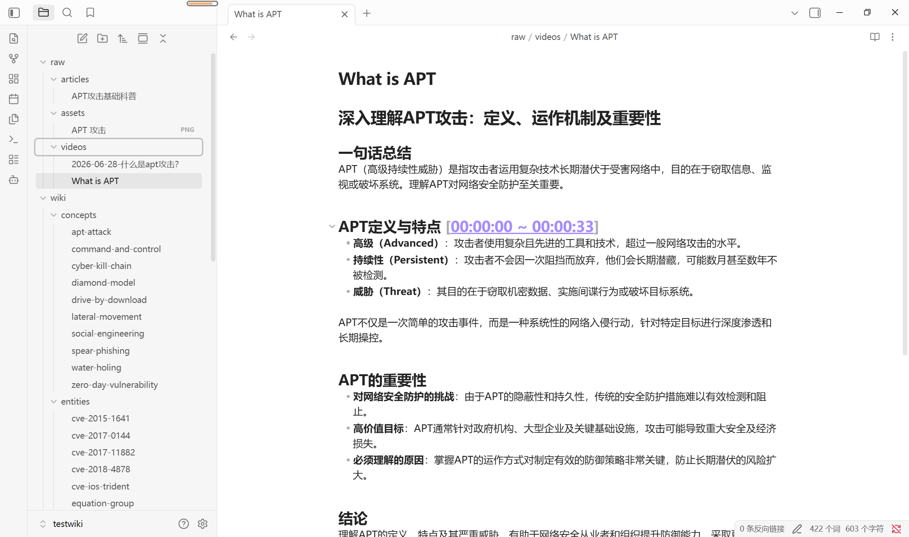

接下来我们就可以继续我们之前的流程 /ingest 就好了：

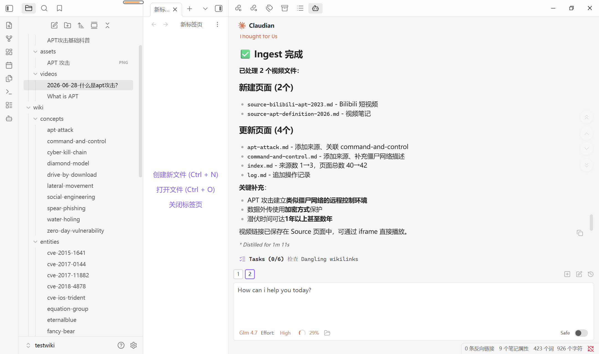

总结

这一节主要就是给大家补齐一下 `raw/videos/` 这个目录的操作方式。

两个工具，两个场景：

- **有字幕的 B 站视频**：Bilibili Obsidian Clipper 直接扒字幕
- **没字幕的任意音视频**（播客、访谈、录屏）：videotranscriber.ai 语音转文字

产出都是其实都是文本，存进 `raw/videos/`，走标准 ingest。到这一步，raw 目录下的三个子目录就都跑通了：`articles/`（文章）、`assets/`（图片）、`videos/`（音视频台词）。文本、图片、音视频三类素材的入库流程，到这里就完整了。

---

来源: https://thoughts.aliyun.com/workspaces/6963289eb0fc2e001bb052eb/docs/6a40fb4ac71a89000161806c
