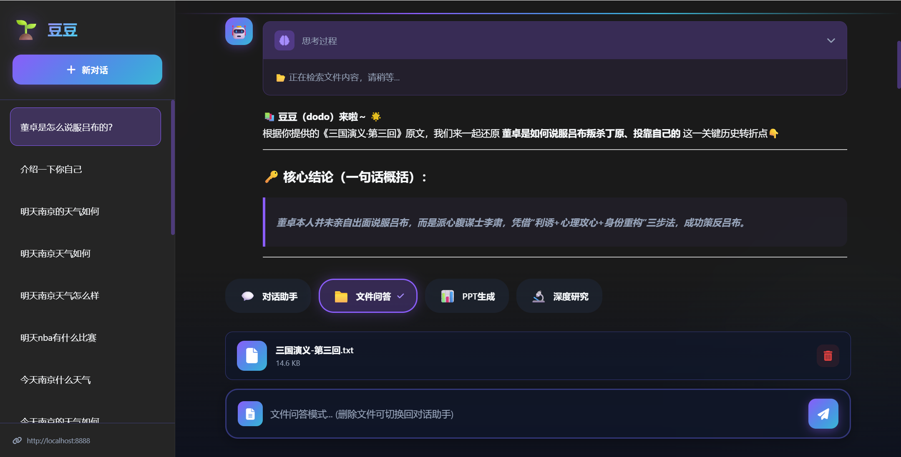

# ✅大文件如何处理？

在上一节课中，我们实现了一个直接截断的文件问答助手：在 Agent 执行之前，通过 `loadContent` 方法直接读取文件内容，然后将文本注入到模型上下文中完成问答。这种方式最大的优势是响应速度快，因为整个过程只需要 一次模型推理。对于文件不大的场景，或者说是回答要求不高的场景，这种方式非常好用。

但在真实业务中，尤其是 ToB 场景，文件规模往往会比较大，例如几十页甚至上百页的 PDF。如果仍然采用简单截断的方式，可能会导致重要信息被裁剪掉，从而影响回答质量，客户更不能接受。因此，在工程实践中更常见的做法是：使用 RAG（Retrieval Augmented Generation，检索增强生成）来处理大文件问答问题。

本节课我们将采用另一种实现方式来构建文件问答助手：通过工具调用实现文件内容获取与向量检索。整体架构依然基于前面课程实现的 ReAct Agent，只不过这一次我们会为 Agent 注入检索工具，从而让模型能够在推理过程中主动检索文件内容。

直接注入文件内容的问题

在上一节课的文件问答方案中，文件内容是在 Agent 执行前直接加载的：

```java
String content = loadContent(fileId);
```

然后再将内容注入到 Prompt 中。这种方式虽然简单，但有两个明显问题：

**第一，如果文件很大，模型上下文无法容纳全部内容。**

**第二，模型无法只读取“相关部分”，必须一次性加载全部文本。**

所以很多时候，我们仅需要检索出与用户问题相关的片段就好了，再基于这些片段进行回答。这种方式在大文件场景下，不仅能够处理更大的文件规模，同时也能够显著提高回答的相关度。当然，对于小文件而言，还是直接加载效果最佳。

如何解决？

为了解决大文件这个问题，我们可以引入 RAG（Retrieval Augmented Generation）。RAG的具体内容可以在前面RAG课程的相关章节详细去了解，本实战课程直接使用RAG的相关技能即可。

它的核心思想也很简单：

**不要把整个文件交给模型，而是只检索最相关的内容。**

基本流程如下：

```text
用户问题
    ↓
向量化
    ↓
相似度检索
    ↓
找到最相关的文本片段
    ↓
将片段注入 Prompt
    ↓
模型回答
```

这样就可以做到，不受文件大小限制，并且减少一定的 Token 消耗，相关性回答准确率会提高，但是响应速度会变慢。

具体实现

数据源配置

既然要引入 RAG 检索，那么向量数据库就是必不可少的组件。本课程中我们使用 PgVector 来存储文件向量数据。

因此，整个项目中实际上会存在 两个数据源：

- **MySQL：用于存储会话、聊天记录等业务数据**
- **PgVector（PostgreSQL）：用于存储大文件分块后的向量数据**

这就意味着我们需要在 Spring Boot 中同时配置两个 `DataSource`。

如果不进行明确配置，Spring Boot 在启动时会因为检测到 多个数据源 而无法自动选择，从而导致启动报错。

因此，我们需要对两个数据源进行分别配置，并指定 主数据源（Primary）。

```java
@Configuration
public class MySQLDataSourceConfig {

    @Bean
    @Primary
    @ConfigurationProperties("spring.datasource")
    public DataSourceProperties mysqlDataSourceProperties() {
        return new DataSourceProperties();
    }

    @Bean
    @Primary
    public DataSource mysqlDataSource() {
        return mysqlDataSourceProperties().initializeDataSourceBuilder().build();
    }
}
```

```javascript
@Configuration
public class VectorStoreConfig {

    /**
     * 全局唯一连接池
     */
    @Bean(name = "pgVectorDataSource")
    public DataSource pgVectorDataSource(
            @Value("${embeddings.store.host}") String host,
            @Value("${embeddings.store.port}") String port,
            @Value("${embeddings.store.database}") String database,
            @Value("${embeddings.store.user}") String user,
            @Value("${embeddings.store.password}") String password
    ) {
        HikariDataSource ds = new HikariDataSource();
        ds.setJdbcUrl("jdbc:postgresql://" + host + ":" + port + "/" + database);
        ds.setUsername(user);
        ds.setPassword(password);
        ds.setDriverClassName("org.postgresql.Driver");

        ds.setMaximumPoolSize(50);
        ds.setMinimumIdle(5);
        ds.setPoolName("PgVectorPool");

        return ds;
    }
}
```

动态PgVectorStore

在前面的课程中，大家一般都是用的yml配置PgVectorStore，指定表名，但是实际生产场景中，很多时候，比如有多个产品都会接入你的智能体，他们都有各自的文件，除了我们可以用metadata来隔离之外，当然我们也可以用分表的方式来处理，这边也给大家介绍一下，如何动态的创建pgvectorstore。

这个类的核心逻辑其实很简单：

1. 判断向量表是否已经存在
2. 如果不存在，则自动创建
3. 返回对应的 `PgVectorStore` 实例

需要特别注意的一点是：`afterPropertiesSet()` 的调用是整个过程的关键。

如果没有执行这一步，PgVector 是不会自动初始化表结构的，也就无法完成向量表的动态创建。

核心代码如下：

```java
@Component
@Slf4j
public class DynamicPgVectorStoreFactory {

    private final DataSource dataSource;
    private final EmbeddingModel embeddingModel;

    @Autowired
    public DynamicPgVectorStoreFactory(@Qualifier("pgVectorDataSource") DataSource dataSource,
                                       EmbeddingModel embeddingModel) {
        this.dataSource = dataSource;
        this.embeddingModel = embeddingModel;
    }

    public PgVectorStore createPgVectorStore(String tableName) {
        if (tableName == null || tableName.trim().isEmpty()) {
            throw new IllegalArgumentException("向量表名称不能为空！");
        }

        String actualTableName = tableName.trim();
        JdbcTemplate jdbcTemplate = new JdbcTemplate(dataSource);

        boolean tableExists = tableExists(actualTableName);

        if (tableExists) {
            log.info("向量表 [{}] 已存在，开始直接加载PgVectorStore", actualTableName);
        } else {
            log.info("向量表 [{}] 不存在，将自动创建并初始化PgVectorStore", actualTableName);
        }

        PgVectorStore pgVectorStore = PgVectorStore.builder(jdbcTemplate, embeddingModel)
        .dimensions(1024)
        .distanceType(PgVectorStore.PgDistanceType.COSINE_DISTANCE)
        .indexType(PgVectorStore.PgIndexType.HNSW)
        .initializeSchema(true)
        .removeExistingVectorStoreTable(false)
        .vectorTableName(actualTableName)
        .maxDocumentBatchSize(100)
        .build();

        // 关键步骤：初始化表结构
        pgVectorStore.afterPropertiesSet();

        log.info("PgVectorStore加载/创建完成，表名：{}", actualTableName);
        return pgVectorStore;
    }
}
```

这里的关键点就是：

```java
pgVectorStore.afterPropertiesSet();
```

这一行代码会触发 PgVectorStore 的初始化逻辑，如果表不存在就会自动创建对应的向量表结构。因此，如果缺少这一步，即使 `PgVectorStore` 创建成功，也不会真正初始化数据库表。

EmbeddingService

完成向量库配置之后，我们还需要一个服务类来负责两件事情：

1. **文件分块后的向量化存储**
2. **基于问题进行 RAG 检索**

初始化 VectorStore

首先在服务初始化时，我们通过前面实现的 `DynamicPgVectorStoreFactory` 创建向量表，并构造 `PgVectorStore` 实例。

```java
@Autowired
private DynamicPgVectorStoreFactory pgVectorStoreFactory;

private PgVectorStore vectorStore;

@PostConstruct
public void init(){
    vectorStore = pgVectorStoreFactory.createPgVectorStore("vector_file_info");
}
```

这一步会完成两件事情：

- 如果向量表不存在 → 自动创建表结构
- 如果表已存在 → 直接加载 `PgVectorStore`

这样整个系统启动后，就可以直接进行向量存储和检索。

生成索引

当用户上传文件后，系统会完成：

1. 文件解析
2. 文本分块（chunk）
3. 生成 embedding
4. 存入向量数据库

向量存储的核心代码如下：

```java
public void embedAndStore(List<Document> documents) {
    for (int i = 0; i < documents.size(); i += 9) {
        List<Document> batches = documents.subList(i, Math.min(i + 9, documents.size()));
        vectorStore.doAdd(batches);
    }
}
```

检索内容

当用户提问时，系统会根据 **问题 + fileId** 进行向量检索，从而找到文件中最相关的文本片段。

核心方法如下：

```java
public List<String> ragRetrieve(String fileId, String question)
```

整个检索流程主要分为三个步骤。

**问题重写**

首先使用大模型对用户问题进行 **压缩重写**，减少冗余信息，提高检索精度。

```java
Query query = Query.builder().text(question).build();

CompressionQueryTransformer queryTransformer =
        CompressionQueryTransformer.builder()
                .chatClientBuilder(chatClient.mutate())
                .build();

Query compressed = queryTransformer.transform(query);
```

**问题扩展**

为了提升召回率，我们会对问题进行 **多角度扩展**。

```java
QueryExpander queryExpander = MultiQueryExpander.builder()
        .chatClientBuilder(chatClient.mutate())
        .numberOfQueries(3)
        .includeOriginal(true)
        .build();

List<Query> expandedQueries = queryExpander.expand(compressed);
```

**向量检索**

最后对每个扩展后的问题进行向量检索，并通过 `fileid` 过滤，确保只检索当前文件。

```java
FilterExpressionBuilder builder = new FilterExpressionBuilder();
Filter.Expression filter = builder.eq("fileid", fileId).build();

List<Document> docs = vectorStore.similaritySearch(
        SearchRequest.builder()
                .query(eq.text())
                .topK(5)
                .filterExpression(filter)
                .build());
```

同时对结果进行简单去重，最终返回最相关的文本内容。

为什么要封装成工具

前面的步骤，我们已经做好了RAG的准备工作。在 Agent 架构中，我们通常不会直接在接口层直接执行 RAG，而是将 RAG 封装为 Tool。那这样做有什么好处呢？

Agent 可以自主决策

Agent 可以判断：

- 是否需要搜索
- 搜索几次
- 是否换关键词搜索

例如：

```text
第一次检索失败
Agent 改写问题
再次检索
```

这就是 ReAct 思维链 + 工具调用。

可以和其他工具组合

在一个完整的 Agent 系统中，通常会提供多种工具能力，例如：

```text
load_file_content
rag_search
query_database
web_search
```

当这些工具被统一注入到 Agent 中之后，模型就可以在推理过程中 根据任务动态选择合适的工具 来补充上下文信息。

例如：

- 文件问题 → 调用 `rag_search`
- 数据查询 → 调用 `query_database`
- 实时信息 → 调用 `web_search`

通过不断调用不同工具获取外部信息，Agent 就能够逐步完成更复杂的任务。这也是 Agent + Tool 架构 的核心价值所在。

更符合 Agent 架构

在实际的 Agent 系统中，各种能力通常都是以 Tool 或者 MCP 服务 的形式提供的。因此，将 RAG 封装成一个 Tool，本身就是一种标准的 Agent 架构方式。

另外，还有一个比较现实的问题。如果采用传统的 RAG 流程来实现问答，并且希望尽可能提高回答的精准度，往往需要引入一系列优化策略，比如：问题重写、问题扩展、混合检索、重排序等等。

这些步骤虽然可以显著提升检索质量，但同时也会带来一个副作用：整体响应时间会明显增加。尤其是在问答系统中，用户对问答的响应时间要求是比较高的。

而如果把 RAG 封装成工具交给 Agent 调用，体验上就会好一些。因为 Agent 在执行过程中可以先输出一些 思考（Think）过程，让用户看到当前正在进行的步骤，例如正在分析问题、准备调用工具、执行检索等。

这样一来，从用户的感知上就不会出现长时间没有任何响应的情况，而是能够清晰地看到 智能体正在一步一步完成任务，只是中间需要调用工具进行检索而已。

这种方式不仅更加符合 Agent 的执行模式，在用户体验上也会更加自然。

工具实现

`FileContentService `通过 `@Tool` 注解，将文件内容能力暴露给 Agent：

```java
@Tool(description = "根据文件ID加载文件内容或进行RAG语义检索")
public String loadContent(
        @ToolParam(description = "文件ID") String fileId,
        @ToolParam(description = "用户的问题，用于语义检索（可选）") String question)
```

工具内部会根据文件的 **embed 字段** 自动选择处理方式：

```java
Integer embed = fileInfo.getEmbed();

if (embed != null && embed == 1) {
    return retrieveWithRAG(fileId, fileInfo, question);
} else {
    return loadDirectly(fileId, fileInfo);
}
```

逻辑非常简单：

- **embed = 1** → 使用 **RAG 语义检索**
- **embed = 0 / null** → **直接加载完整文件**

其中 RAG 检索会调用我们前面实现的 `EmbeddingService`：

```java
List<String> results = embeddingService.ragRetrieve(fileId, question);
```

FileReactAgent

为了让 Agent 更好地处理文件问答，我们还需要对 **FileReactAgent** 做了一次结构升级。

核心思路就是：**让 Agent 通过工具获取文件内容，而不是直接把文件塞进 Prompt。**

修改 System Prompt

首先修改 Agent 的系统提示词：

```java
public static String getFilePrompt() {
    return """
        ## 角色
        你是一个专业的文件分析助手，名字叫做：豆豆（dodo），负责帮助用户理解和分析上传的文件内容。

        ## 文件处理规则
        1. 所有回答必须基于文件内容，禁止编造信息。
        2. 文件内容必须通过 loadContent 工具获取。
    """;
}
```

这个 **Prompt 的作用非常关键**：

- 强制模型 **通过工具获取文件内容，增强约束**
- 避免模型 **凭空编造答案**
- 让 Agent 形成 **先检索 → 再回答** 的行为模式

传递用户问题和文件 ID

在构建消息时，我们会把 **用户问题** 和 **文件 ID** 一起传给模型：

```java
messages.add(new UserMessage("<question>" + question + "</question>"));
messages.add(new UserMessage("<fileid>" + currentFileId + "</fileid>"));
```

这样 Agent 在调用工具时，就可以直接使用 `fileid` 作为入参进行文件内容检索工具的调用。

移除直接加载文件内容

在之前的实现中，我们会直接读取文件并注入 Prompt：

```java
loadFileContent()
```

但现在这部分逻辑已经被移除：

```java
// 注释掉原有的 loadFileContent 调用
// 使用 FileContentService 工具替代
```

也就是说：**文件内容不再直接放入 Prompt，而是由 Agent 通过工具动态获取。**

整体流程总结

到此，整个系统改造就OK了，分为两个流程的改造。

**首先是文件上传流程。** 当用户上传文件后，系统会先对文件内容进行解析，然后按照一定的规则将文本切分成多个片段（Chunk）。接着通过 Embedding 模型将这些文本片段转换为向量，并最终写入到 **PgVector 向量数据库**中，建立语义索引。完成这一过程之后，文件就具备了被语义检索的能力，为后续的问答做好准备。

```text
用户上传文件
    ↓
保存数据库
    ↓
上传MINIO
    ↓
对文件进行解析（大文件向量化）
    ↓
向量检索
    ↓
更新数据库
```

**其次是文件问答流程。** 当用户提出与文件相关的问题时，请求会首先进入 **FileReactAgent**。Agent 会根据系统提示词进行推理，如果需要获取文件内容，就会调用 `loadContent` 工具。该工具会根据文件的处理方式决定是直接加载文件内容，还是执行 RAG 语义检索。当进行向量检索时，系统会从 PgVector 中找到与问题最相关的文本片段并返回给模型，模型再基于这些上下文生成最终答案。通过这种 **Agent + Tool + RAG** 的方式，就可以实现对大文件的处理。

```text
用户提问
    ↓
FileReactAgent
    ↓
Agent 思考
    ↓
调用 RAG 工具
    ↓
向量检索
    ↓
返回相关文本
    ↓
模型生成答案
```



---

来源: https://thoughts.aliyun.com/workspaces/6963289eb0fc2e001bb052eb/docs/69aed1c7a7c8ff00016cc571
