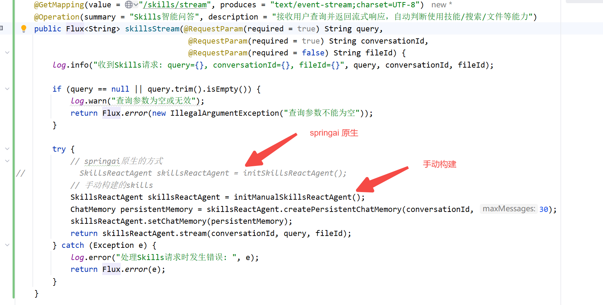

# ✅spring-ai-agent-utils中的skills

在上一节课中，我们手搓了一套 Agent Skills 系统，通过 SkillRegistry、SkillPromptFormatter、ReadSkillTool 等组件，实现了技能的元数据注入提示词 + 渐进式按需加载完整内容的两阶段架构。这套方案在大多数模型上都能正常工作，但在实际使用中可能经常会发现一个问题，**有一些大模型会频繁把技能名称直接当作工具来调用，然后导致React一直重试，虽然最后可能还是会执行任务成功，但是其实会比较影响效率**。

比如用户说"帮我做一个 PPT"，模型本应调用 `read_skill("autumnsgrove-pptx")`，但它却直接尝试调用 `autumnsgrove-pptx()` 这个不存在的工具。这是因为模型看到技能列表后，直觉上认为这些技能名称就是可用的工具名称。为了解决这个问题，我们在上一节的方案中不得不在提示词中加入大量的约束规则，反复强调"技能不是工具"、"必须通过 read_skill 工具加载"等等。这些提示词虽然有效，但其实不能从根本解决问题，部分大模型仍然偶尔会出现此类问题，不够稳定。

那么有没有一种方式，能够**顺应模型的直觉，而不是对抗它**？Spring AI 原生框架其实给出的方案非常巧妙。

Spring AI 原生 Skills

Spring AI 官方在 2026 年 1 月发布了一篇博客（[https://spring.io/blog/2026/01/13/spring-ai-generic-agent-skills），](https://spring.io/blog/2026/01/13/spring-ai-generic-agent-skills），介绍了)介绍了 Spring AI 的 Generic Agent Skills 方案。这个方案的核心思路是：**直接把技能当成工具，让模型用调用工具的方式加载技能**。（感兴趣的可以自己去这个官方博客上，集成使用看看，写写demo，目前springai原生支持的agent功能还是蛮多的，可以做很多定制化的开发。）

但问题是：技能不是一个简单的函数调用，它有自己的元数据（名称、描述等），而且技能数量可能很多，总不能为每个技能都注册一个独立的工具。

Spring AI 的做法是：**把所有技能的元数据注入到一个统一的 **`SkillsTool`** 工具的描述中**，模型只需要调用这一个工具，传入技能名称即可。

两种方案的核心差异

在深入代码之前，先对比两种方案的本质区别：

```text
【上节课的手搓方案】
技能列表 → 注入到系统提示词（SystemMessage）
技能加载 → 通过 read_skill 工具（独立注册的工具）

模型需要理解：系统提示词里的技能列表 → 找到 read_skill 工具 → 调用它加载技能
问题：模型容易混淆"技能名称"和"工具名称"

【Spring AI 官方方案】
技能列表 → 注入到 SkillsTool 工具的描述（@Tool description）
技能加载 → 直接调用 SkillsTool 工具

模型只需要理解：看到工具描述里的技能列表 → 直接调用这个工具加载技能
优势：工具和技能在同一个地方，模型不会混淆
```

用一个具体的例子来对比。在上一节的手搓方案中，模型看到的上下文是这样的：

```text
【系统提示词】（SystemMessage）
  ...
  **可用技能：**
  - autumnsgrove-pptx：Professional PowerPoint presentation...
  - spring-ai：Expert Spring AI development guide...

  **正确的使用流程：**
  1. 调用 read_skill("技能名称")
  ...

【工具列表】
  - loadContent: 加载文件内容
  - read_skill: 加载指定技能的完整内容   ← 模型需要找到这个工具
  - read_file: 读取文件
  - bash: 执行命令
  ...
```

模型需要先在系统提示词里看到技能列表，然后去工具列表中找到 `read_skill` 工具，最后调用它。这个跨上下文的关联，就是某些模型容易犯错的地方。

而在 Spring AI 官方方案中，模型看到的上下文变成了这样：

```text
【系统提示词】（无技能相关内容）

【工具列表】
  - Skill: 加载技能的工具（描述中包含所有可用技能的元数据）  ← 技能列表就在这里！
  - loadContent: 加载文件内容
  - read_file: 读取文件
  - bash: 执行命令
  ...
```

技能列表和技能加载工具合二为一，模型只需要"看到一个工具，直接调用它"，完全符合模型的直觉。

SkillsTool 源码解析

Spring AI 官方的 SkillsTool 开源在 `spring-ai-agent-utils` 库中，但它要求 Spring AI 2.0.0-M2+ 版本。而我们的项目暂时还在用 Spring AI 1.1.0，所以直接把源码 copy 出来做适配。核心源码其实非常简洁，全部加起来不到 200 行。

整体结构

```java
public class SkillsTool {

    // 工具描述模板（技能元数据注入到这里）
    private static final String TOOL_DESCRIPTION_TEMPLATE = "...";

    // 输入参数（只有技能名称一个字段）
    public static record SkillsInput(
            @ToolParam(description = "The skill name (no arguments). E.g., \"pdf\" or \"xlsx\"")
            String command) {}

    // 工具执行函数
    public static class SkillsFunction implements Function<SkillsInput, String> { ... }

    // Builder（链式构建）
    public static class Builder { ... }

    // 技能数据模型
    public static record Skill(String basePath, Map<String, Object> frontMatter, String content) { ... }
}
```

工具描述模板

这是整个方案最精妙的部分，把技能元数据注入到工具描述中：

```java
private static final String TOOL_DESCRIPTION_TEMPLATE = """
        Execute a skill within the main conversation

        <skills_instructions>
        When users ask you to perform tasks, check if any of the available skills below can help complete the task more effectively. Skills provide specialized capabilities and domain knowledge.

        How to use skills:
        - Invoke skills using this tool with the skill name only (no arguments)
        - When you invoke a skill, you will see <command-message>The "{name}" skill is loading</command-message>
        - The skill's prompt will expand and provide detailed instructions on how to complete the task

        NOTE: Response always starts start with the base directory of the skill execution environment. You can use this to retrieve additional files of call shell commands.
        Skill description follows after the base directory line.

        Important:
        - Only use skills listed in <available_skills> below
        - Do not invoke a skill that is already running
        </skills_instructions>
        <available_skills>
        %s
        </available_skills>
        """;
```

注意最后的 `%s` 占位符——它会被所有技能的元数据 XML 填充。比如加载了 PPT 和 Spring AI 两个技能后，最终的工具描述会变成：

```java
Execute a skill within the main conversation

<skills_instructions>
...
</skills_instructions>
<available_skills>
<skill>
  <name>pptx</name>
  <description>Professional PowerPoint presentation creation...</description>
</skill>
<skill>
  <name>spring-ai</name>
  <description>Expert Spring AI development guide...</description>
</skill>
</available_skills>
```

技能的元数据以 XML 格式嵌入在工具描述中。为什么用 XML 而不是 JSON 或 Markdown？因为 XML 的标签结构对 LLM 来说更容易解析，而且不会和工具描述中的其他内容混淆。

技能数据模型

每个技能被解析为一个 `Skill` record：

```java
public static record Skill(String basePath, Map<String, Object> frontMatter, String content) {

    public String name() {
        return this.frontMatter().get("name").toString();
    }

    public String toXml() {
        String frontMatterXml = this.frontMatter()
            .entrySet()
            .stream()
            .map(e -> "  <%s>%s</%s>".formatted(e.getKey(), e.getValue(), e.getKey()))
            .collect(Collectors.joining("\n"));

        return "<skill>\n%s\n</skill>".formatted(frontMatterXml);
    }
}
```

三个字段的含义：

- **basePath**：技能目录的绝对路径，模型加载技能后可以根据这个路径读取技能附带的参考文件、模板、脚本等资源
- **frontMatter**：SKILL.md 文件中 YAML frontmatter 解析出来的键值对，包含 `name`、`description` 等元信息
- **content**：去掉 frontmatter 后的技能正文，即完整的提示词指令

`toXml()` 方法将 frontmatter 转换为 XML 格式，用于注入到工具描述中。例如一个 PPT 技能的 frontmatter 是：

```text
---
name: pptx
description: "Professional PowerPoint presentation creation..."
---
```

转换后的 XML 就是：

```text
<skill>
  <name>pptx</name>
  <description>Professional PowerPoint presentation creation...</description>
</skill>
```

工具执行逻辑

当模型调用 SkillsTool 时，执行逻辑非常简单：

```java
public static class SkillsFunction implements Function<SkillsInput, String> {

    private Map<String, Skill> skillsMap;

    @Override
    public String apply(SkillsInput input) {
        Skill skill = this.skillsMap.get(input.command());

        if (skill != null) {
            return "Base directory for this skill: %s\n\n%s".formatted(skill.basePath(), skill.content());
        }

        return "Skill not found: " + input.command();
    }
}
```

根据传入的技能名称，从 Map 中查找对应的 Skill，返回"工作目录 + 技能完整内容"。如果找不到，返回 "Skill not found" 提示模型。

Builder 构建

SkillsTool 使用 Builder 模式构建，支持从目录、Classpath 资源等多种来源加载技能：

```java
public ToolCallback build() {
    Assert.notEmpty(this.skills, "At least one skill must be configured");

    // 将所有技能的元数据转换为 XML
    String skillsXml = this.skills.stream()
            .map(Skill::toXml)
            .collect(Collectors.joining("\n"));

    // 构建工具回调，技能 XML 注入到描述模板中
    return FunctionToolCallback.builder("Skill", new SkillsFunction(toSkillsMap(this.skills)))
            .description(this.toolDescriptionTemplate.formatted(skillsXml))
            .inputType(SkillsInput.class)
            .build();
}
```

`build()` 方法的核心就两步：

1. 将所有技能的 frontmatter 转换为 XML 字符串
2. 用 XML 填充工具描述模板的 `%s` 占位符，然后通过 `FunctionToolCallback.builder()` 创建工具回调

最终产出一个 `ToolCallback`，注册到 ChatClient 中即可。工具名称是 `"Skill"`，模型看到的工具描述提示词中已经包含了所有可用技能的信息。

在 dodo-agent 中的适配

由于 Spring AI 官方的 `spring-ai-agent-utils` 库要求 Spring AI 2.0.0-M2+，而我们的项目还在用 Spring AI 1.1.0，所以我们可以换个思路，直接把 SkillsTool 的源码 copy 到项目中，并做了一些适配。

与官方的差异

我们的 `SkillsTool`（位于 `cn.hollis.llm.mentor.agent.tool.SkillsTool`）与官方源码的主要差异在三个方面：**第一，YAML 解析方式**。官方使用了 `spring-ai-agent-utils` 库中的 `Skills.loadDirectory()` 来解析 SKILL.md，这个类内部使用了 `MarkdownParser` 来解析 YAML frontmatter。`MarkdownParser` 是一个非常简洁的工具类，只做两件事：用 `---` 分隔符提取 frontmatter，然后逐行按 `key: value` 格式解析。整个类不到 100 行，没有任何外部依赖。既然这么简单，我们直接把 `MarkdownParser` 也 copy 到了项目中，让 `SkillsTool` 使用它来解析 SKILL.md：

```java
// loadDirectory 中使用 MarkdownParser 解析 SKILL.md
String markdown = Files.readString(skillFile, StandardCharsets.UTF_8);
MarkdownParser parser = new MarkdownParser(markdown);
skills.add(new Skill(skillFile.getParent().toAbsolutePath().toString(),
        parser.getFrontMatter(), parser.getContent()));
```

这样我们的实现和官方完全一致，不需要引入额外的依赖。

**第二，工具描述模板的优化**。官方的模板是英文的，我们做了中文化，并加入了更详细的使用说明和禁止规则：

```java
private static final String TOOL_DESCRIPTION_TEMPLATE = """
        在当前会话中加载一个技能（Skill）。本工具的唯一作用是：传入技能名称，获取该技能的完整提示词和工作目录。

        <什么是技能>
        技能是一段专业的提示词，包含特定领域的知识、工作流程和操作指令。
        每个技能通常还附带参考文件、模板、脚本等资源，存放在技能工作目录中。
        </什么是技能>
        <技能的完整使用流程>
        第一步 — 判断是否需要技能：...
        第二步 — 通过本工具加载技能：...
        第三步 — 阅读并理解技能提示词：...
        第四步 — 按技能提示词执行任务：...
        </技能的完整使用流程>
        <可用技能列表>
        %s
        </可用技能列表>
        """;
```

**第三，skills资源加载做了简化**。官方支持非常完善的 Classpath 和 路径资源加载。而我们的 `SkillsTool` 目前只保留了从文件系统目录加载（`addSkillsDirectory`）和基本的 `Resource` 加载，省略了官方那套较为复杂的多层扫描逻辑。所以，目前 dodo-agent 的技能都是从本地文件系统目录加载的。

使用方式

在 dodo-agent 中，SkillsTool 通过 AgentController 的 `initSkillsReactAgent()` 方法创建：

```java
private SkillsReactAgent initSkillsReactAgent() {
    // SkillsTool：技能元数据注入工具描述，模型直接调用 Skill 工具加载
    ToolCallback[] allTools = ToolMergeUtils.mergeTools(
            webSearchToolCallbacks,
            ToolCallbacks.from(fileContentService),
            new ToolCallback[]{SkillsTool.builder()
                    .addSkillsDirectory(skillsDirectory)
                    .build()},   // ← 一个 ToolCallback 就包含了所有技能
            FileSystemTools.create(),
            GrepTool.create(),
            BashTool.create()
    );

    return SkillsReactAgent.builder()
            .name("skills")
            .chatModel(chatModel)
            .tools(allTools)
            .sessionService(sessionService)
            .taskManager(taskManager)
            .maxRounds(10)
            .build();
}
```

对比上一节手搓方案的 `initManualSkillsReactAgent()`，最大的区别是：

- **不需要 SkillManager**：没有 SkillManager、SkillConfig、SkillRegistry、SkillPromptFormatter 这些组件
- **不需要 systemPrompt**：技能信息不在系统提示词中，而是在工具描述中
- **不需要 ReadSkillTool**：技能加载功能已经内置在 SkillsTool 中

整个 Skills 的集成从多个类简化为**一行 Builder 调用**。

两种方案的对比

| 维度 | 手搓方案（Manual） | Spring AI 官方方案（SkillsTool） |
| --- | --- | --- |
| 技能元数据注入位置 | 系统提示词（SystemMessage） | 工具描述（Tool Description） |
| 技能加载方式 | 调用 read_skill 工具 | 直接调用 Skill 工具 |
| 模型混淆风险 | 高（需要额外约束提示词） | 低（符合模型直觉） |
| 代码复杂度 | 高（SkillManager + Registry + Formatter + ReadSkillTool） | 低（一个 SkillsTool 类搞定） |
| 依赖 | 无额外依赖 | 官方需要 Spring AI 2.0+（我们 copy 源码适配） |
| 灵活性 | 高（可自定义格式化器、注册表等） | 中（工具描述模板可自定义） |
| 提示词 Token 消耗 | 系统提示词中占用较多 | 工具描述中占用（只在工具调用时发送） |

在实际使用中，我们可以都在 AgentController 中来尝试切换两种方案，进行对比：



总结

Spring AI 官方的 SkillsTool 方案用一句话概括：**把技能元数据注入工具描述，让模型用调用工具的自然方式加载技能**。

这个方案的精妙之处在于它没有对抗大模型的行为模式，而是顺应了模型的直觉：模型看到一个工具，工具描述里列出了可用的技能，直接调用即可。相比我们在上一节中通过大量提示词规则来约束模型行为，这种方式更加优雅和稳定。

在工程实现上，整个方案的核心就是一个 `FunctionToolCallback`，通过 Builder 模式加载技能目录，将技能的 YAML frontmatter 转换为 XML 注入到工具描述模板中。最终产出一个 `ToolCallback`，注册到 ChatClient 即可使用。代码量不到 200 行，但设计思路值得学习。

---

来源: https://thoughts.aliyun.com/workspaces/6963289eb0fc2e001bb052eb/docs/69faec0bd31fed000167d7ff
