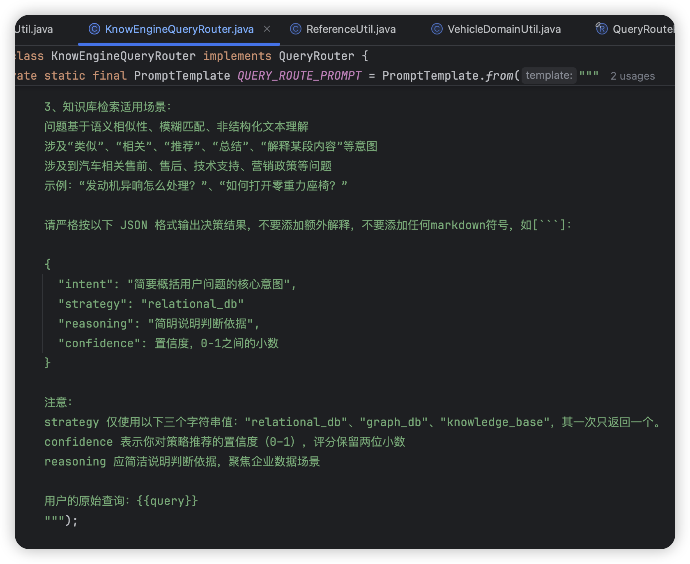
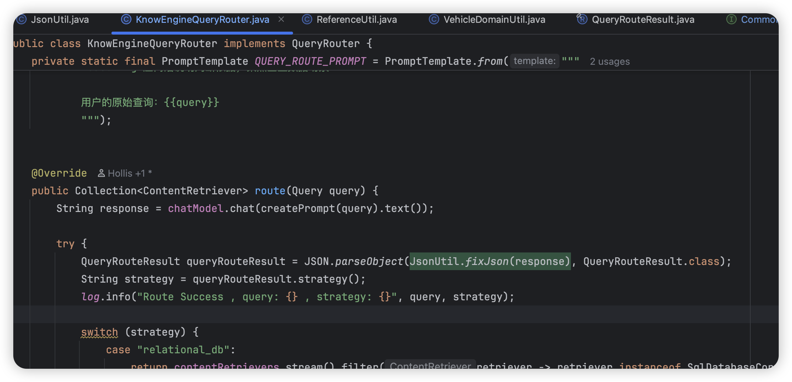

# ✅如何解决模型json格式输出不稳定问题？

如果大家做大模型相关的开发做的早的话，会发现，在以前，模型很不听话，尤其是我们让他输出json格式的时候，经常错误，经常会出现缺少引号、逗号、括号不匹配、包含多余的解释性文字等。

随着模型的不断升级，很多模型已经在这方面做过很多优化了，但是还是会存在不稳定的情况，比较典型的就是输出的json中会包含```这样的markdown的代码块内容，这就会导致json解析出错。

为了解决这个问题，我们通常会在提示词中给出具体的json结构，如我们的意图识别的过程：



但是实际运行过程中，我发现还是有出现失败的情况，于是就可以用另外一种办法，那就是手动修复json。于是我写了个json fix的代码。帮助我们实现json的修复。（思想参考了python中的json_repair框架）

就可以在llm返回之后，先修复一把：



具体实现如下：

````text
package cn.hollis.llm.mentor.know.engine.ai.utils;

import com.fasterxml.jackson.databind.JsonNode;
import com.fasterxml.jackson.databind.ObjectMapper;
import org.slf4j.Logger;
import org.slf4j.LoggerFactory;

import java.util.regex.Matcher;
import java.util.regex.Pattern;

/**
 * JSON 修复工具类
 * 用于处理大模型返回的可能包含错误的 JSON 字符串
 */
public class JsonUtil &#123;

    private static final Logger log = LoggerFactory.getLogger(JsonUtil.class);
    private static final ObjectMapper objectMapper = new ObjectMapper();

    /**
     * 修复并解析 JSON 字符串
     *
     * @param jsonString 可能包含错误的 JSON 字符串
     * @return 修复后的 JSON 字符串
     */
    public static String fixJson(String jsonString) &#123;
        if (jsonString == null || jsonString.trim().isEmpty()) &#123;
            return "&#123;&#125;";
        &#125;

        String fixed = jsonString.trim();

        // 1. 提取 JSON 内容（移除 markdown 代码块标记）
        fixed = extractJsonFromMarkdown(fixed);

        // 2. 移除 JSON 前后的非法字符
        fixed = removeLeadingTrailingGarbage(fixed);

        // 3. 修复常见的引号问题
        fixed = fixQuotes(fixed);

        // 4. 修复尾部逗号问题
        fixed = fixTrailingCommas(fixed);

        // 5. 修复缺失的引号
        fixed = fixMissingQuotes(fixed);

        // 6. 修复转义字符问题
        fixed = fixEscapeChars(fixed);

        // 7. 尝试验证并返回
        try &#123;
            // 验证 JSON 是否有效
            objectMapper.readTree(fixed);
            return fixed;
        &#125; catch (Exception e) &#123;
            log.warn("JSON 修复后仍然无效，返回原始字符串。Error: &#123;&#125;", e.getMessage());
            // 最后的容错：如果还是无效，尝试包装成简单对象
            return wrapAsSimpleJson(jsonString);
        &#125;
    &#125;

    /**
     * 修复并解析为 JsonNode
     *
     * @param jsonString JSON 字符串
     * @return JsonNode 对象
     */
    public static JsonNode fixAndParse(String jsonString) &#123;
        String fixed = fixJson(jsonString);
        try &#123;
            return objectMapper.readTree(fixed);
        &#125; catch (Exception e) &#123;
            log.error("JSON 解析失败", e);
            return objectMapper.createObjectNode();
        &#125;
    &#125;

    /**
     * 从 Markdown 代码块中提取 JSON
     */
    private static String extractJsonFromMarkdown(String text) &#123;
        // 匹配 ```json ... ``` 或 ``` ... ```
        Pattern pattern = Pattern.compile("```(?:json)?\\s*([\\s\\S]*?)```", Pattern.CASE_INSENSITIVE);
        Matcher matcher = pattern.matcher(text);
        if (matcher.find()) &#123;
            return matcher.group(1).trim();
        &#125;
        return text;
    &#125;

    /**
     * 移除 JSON 前后的垃圾字符
     */
    private static String removeLeadingTrailingGarbage(String text) &#123;
        // 找到第一个 &#123; 或 [
        int start = -1;
        for (int i = 0; i &lt; text.length(); i++) &#123;
            char c = text.charAt(i);
            if (c == '&#123;' || c == '[') &#123;
                start = i;
                break;
            &#125;
        &#125;

        // 找到最后一个 &#125; 或 ]
        int end = -1;
        for (int i = text.length() - 1; i >= 0; i--) &#123;
            char c = text.charAt(i);
            if (c == '&#125;' || c == ']') &#123;
                end = i + 1;
                break;
            &#125;
        &#125;

        if (start != -1 && end != -1 && start &lt; end) &#123;
            return text.substring(start, end);
        &#125;
        return text;
    &#125;

    /**
     * 修复引号问题（中文引号、单引号等）
     */
    private static String fixQuotes(String text) &#123;
        // 替换中文引号为英文引号
        text = text.replace("“", "\"").replace("”", "\"");
        text = text.replace("‘", "'").replace("’", "'");

        // 将单引号替换为双引号（JSON 标准要求双引号）
        // 注意：只替换键名和字符串值的单引号
        text = text.replaceAll("'([^']*?)'", "\"$1\"");

        return text;
    &#125;

    /**
     * 修复尾部逗号问题
     */
    private static String fixTrailingCommas(String text) &#123;
        // 移除对象中的尾部逗号: ,&#125;
        text = text.replaceAll(",\\s*&#125;", "&#125;");
        // 移除数组中的尾部逗号: ,]
        text = text.replaceAll(",\\s*]", "]");
        return text;
    &#125;

    /**
     * 修复缺失的引号（针对键名）
     */
    private static String fixMissingQuotes(String text) &#123;
        // 为没有引号的键名添加引号
        // 匹配模式: word: (不带引号的键)
        text = text.replaceAll("([&#123;,]\\s*)([a-zA-Z_][a-zA-Z0-9_]*)\\s*:", "$1\"$2\":");
        return text;
    &#125;

    /**
     * 修复转义字符问题
     */
    private static String fixEscapeChars(String text) &#123;
        // 修复常见的非法转义字符
        // 注意：这里需要谨慎处理，避免破坏合法的转义字符

        // 移除字符串中的非法换行符
        text = text.replaceAll("(?&lt;!\\\\)\\n", " ");
        text = text.replaceAll("(?&lt;!\\\\)\\r", " ");
        text = text.replaceAll("(?&lt;!\\\\)\\t", " ");

        return text;
    &#125;

    /**
     * 将文本包装成简单的 JSON 对象
     */
    private static String wrapAsSimpleJson(String text) &#123;
        try &#123;
            // 尝试转义特殊字符后包装
            String escaped = text.replace("\\", "\\\\")
                    .replace("\"", "\\\"")
                    .replace("\n", "\\n")
                    .replace("\r", "\\r")
                    .replace("\t", "\\t");
            return "&#123;\"content\":\"" + escaped + "\"&#125;";
        &#125; catch (Exception e) &#123;
            return "&#123;\"error\":\"Invalid JSON\"&#125;";
        &#125;
    &#125;

    /**
     * 验证 JSON 字符串是否有效
     *
     * @param jsonString JSON 字符串
     * @return true 如果有效，false 如果无效
     */
    public static boolean isValidJson(String jsonString) &#123;
        try &#123;
            objectMapper.readTree(jsonString);
            return true;
        &#125; catch (Exception e) &#123;
            return false;
        &#125;
    &#125;

    /**
     * 美化 JSON 字符串
     *
     * @param jsonString JSON 字符串
     * @return 格式化后的 JSON 字符串
     */
    public static String prettify(String jsonString) &#123;
        try &#123;
            Object json = objectMapper.readValue(jsonString, Object.class);
            return objectMapper.writerWithDefaultPrettyPrinter().writeValueAsString(json);
        &#125; catch (Exception e) &#123;
            log.error("JSON 美化失败", e);
            return jsonString;
        &#125;
    &#125;
&#125;
````

---

来源: https://thoughts.aliyun.com/workspaces/6963289eb0fc2e001bb052eb/docs/69be4ea651b144000159c619
