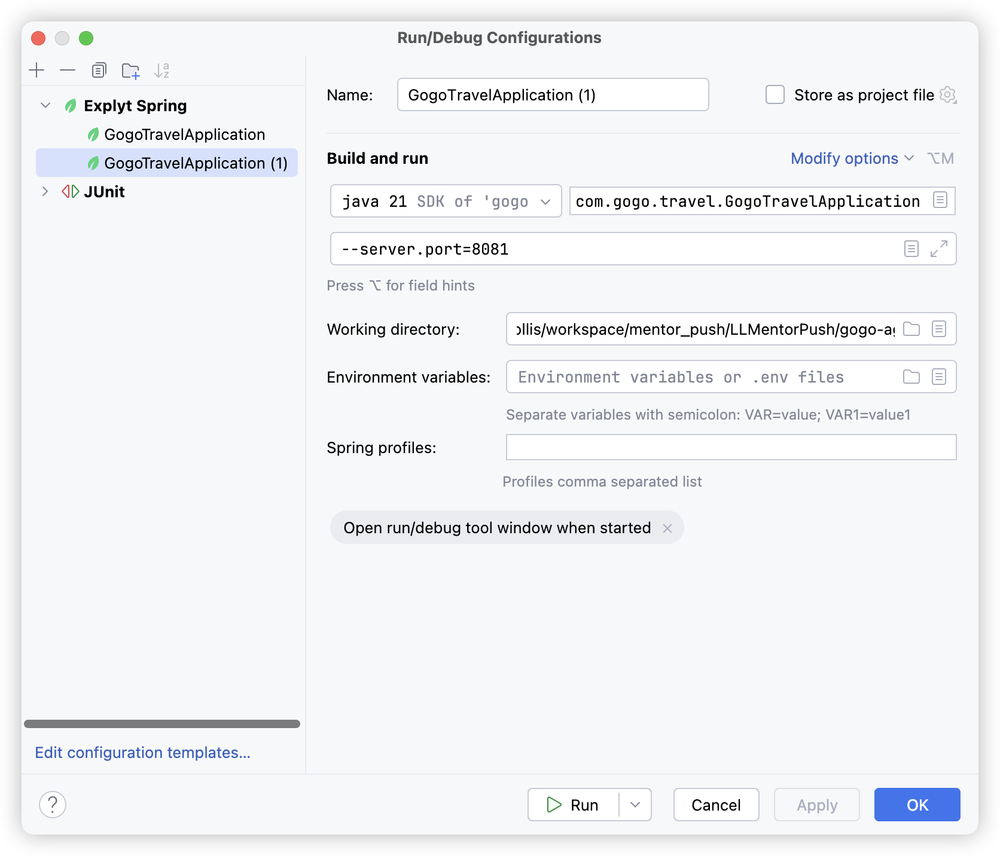
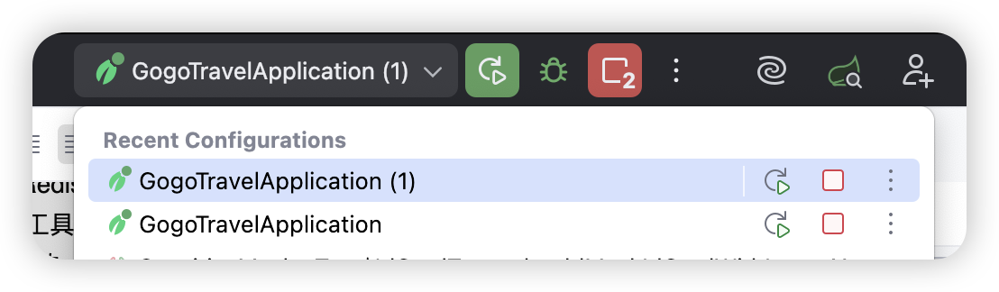

# ✅如何在本地模拟集群服务

一个服务如果是集群部署的，那一般是通过nginx来做一个负载均衡，前端请求先打到nginx，然后Nginx在通过负载均衡把请求分发给集群中的服务。

但是我们本地想要验证的话，部署一个nginx太麻烦了，但是我们还是需要验证集群下的功能是否好用，那么，我们可以通过以下方式来实现：

| 层面 | 生产环境 | 本地模拟方案 |
| --- | --- | --- |
| 多实例 | 多台机器/多容器 | IDEA 多 Run Configuration 不同端口启动 |
| 负载均衡 | Nginx / SLB 轮询 | **前端轮询开关**<br>（每次请求切换后端地址） |
| 共享存储 | 云 Redis / 云 MySQL | 复用现有的远程 Redis / MySQL（零改动） |

```text

                          ┌──────────────────────────┐
                          │  Frontend (React + Vite)  │
                          │                          │
                          │  getApiBase() 轮询取址    │
                          │  ┌────────────────────┐  │
                          │  │ 集群轮询开关 (OFF)   │──┼──► 固定走 8080（日常开发）
                          │  │ 集群轮询开关 (ON)    │  │
                          │  └─────────┬──────────┘  │
                          └────────────┼─────────────┘
                                       │ 每次请求轮询分发
                 ┌─────────────────────┼─────────────────────┐
                 ▼                     ▼                     ▼
        ┌────────────────┐   ┌────────────────┐   ┌────────────────┐
        │ Gogo-8080      │   │ Gogo-8081      │   │ Gogo-8082      │
        │ IDEA 实例 1     │   │ IDEA 实例 2     │   │ IDEA 实例 3     │
        └───────┬────────┘   └───────┬────────┘   └───────┬────────┘
                │      同一套配置，仅 server.port 不同      │
                └──────────────┬────────┴──────────────────┘
                               ▼
                  ┌─────────────────────────┐
                  │  共享 Redis + MySQL      │
                  │  （会话/中断广播/持久化）  │
                  └─────────────────────────┘
```

后端：IDEA 启动多实例

项目天然具备多实例启动条件，唯一的冲突点是 `server.port`：

- **日志**：`logback-spring.xml` 无文件输出（纯控制台），多实例不会争抢日志文件
- **Redis / MySQL**：使用远程共享实例，多节点连接同一套存储，正好模拟生产拓扑
- **外部依赖**：DashScope、MCP 等均为无状态 HTTP/stdio 调用，各实例独立访问

配置步骤

1. 顶部运行配置下拉框 → **Edit Configurations...**
2. 选中 `GogoTravelApplication` → 左上角复制（`⌘+D`），复制两份
3. 分别命名并填写 **Program arguments**：配置名Program argumentsGogo-8080`--server.port=8080`Gogo-8081`--server.port=8081`Gogo-8082`--server.port=8082`Spring Boot 命令行参数优先级高于 `application.yml`，会覆盖其中的 `server.port: 8080`，其余配置全部复用，零代码改动。
4. 依次启动三个配置即可。





前端：轮询开关实现

前端原本在各 API 模块中硬编码 `API_BASE` 常量，改造为**每次请求时动态取址**：开关关闭时行为与原来完全一致（固定第一个地址），开关打开时每次 fetch 轮询下一个地址。用前端轮询替代 Nginx 的 round-robin，无需任何基础设施。

**地址池与轮询逻辑（config.ts）：**

```typescript

// 从 VITE_CLUSTER_URLS 环境变量解析地址列表，逗号分隔
// 未配置时降级为单地址 [VITE_API_BASE || http://localhost:8080]
const clusterUrls = parseClusterUrls();

// 轮询游标（模块级变量，跨请求持续递增）
let cursor = 0;

export function getApiBase(): string {
  const clusterMode = useUiStore.getState().clusterMode;
  if (!clusterMode || clusterUrls.length <= 1) {
    return clusterUrls[0] ?? DEFAULT_BASE;   // 关：固定第一个地址
  }
  const base = clusterUrls[cursor % clusterUrls.length];
  cursor = (cursor + 1) % clusterUrls.length;
  return base;                               // 开：每次调用轮询下一个
}
```

**API 调用侧改动（所有 API 模块统一模式）：**

```typescript

// 改造前：模块加载时固化地址
const API_BASE = import.meta.env.VITE_API_BASE || 'http://localhost:8080';
fetch(`${API_BASE}/api/chat/${sessionId}`, ...)

// 改造后：每次请求时动态取址（fetch 执行到该行才调用 getApiBase()）
import { getApiBase } from './config';
fetch(`${getApiBase()}/api/chat/${sessionId}`, ...)
```

关键点：`${getApiBase()}` 写在 fetch 模板字符串内，**求值时机是每次请求发起时**，因此轮询游标每次请求都会前进；SSE 长连接、打断、确认、历史加载等所有接口一视同仁。

**开关 UI（Sidebar 底部）：**

仅在 `isClusterAvailable()`（即配置了多个地址）时渲染，日常单后端开发完全不可见。开启后额外展示地址标签，方便确认当前轮询池。

3.4 环境变量配置

创建 `frontend/.env.local`：

```bash

VITE_CLUSTER_URLS=http://localhost:8080,http://localhost:8081,http://localhost:8082
```

使用步骤

```bash

# 1. IDEA 启动三个后端实例（Gogo-8080 / Gogo-8081 / Gogo-8082）

# 2. 配置并启动前端
echo 'VITE_CLUSTER_URLS=http://localhost:8080,http://localhost:8081,http://localhost:8082' \
  > frontend/.env.local
cd frontend && npm run dev

# 3. 打开侧边栏底部「⚡ 集群轮询」开关
```

- **开关 OFF**：所有请求固定走 8080，与集群改造前的开发体验完全一致
- **开关 ON**：每次请求轮询 8080 → 8081 → 8082 → 8080 …

请求分发情况可通过两个途径确认：

- 浏览器 DevTools → Network 面板，看每个请求的域名端口
- IDEA Services 面板中三个实例的控制台日志，请求轮流出现

---

来源: https://thoughts.aliyun.com/workspaces/6963289eb0fc2e001bb052eb/docs/6a9d064774e40300011c2632
