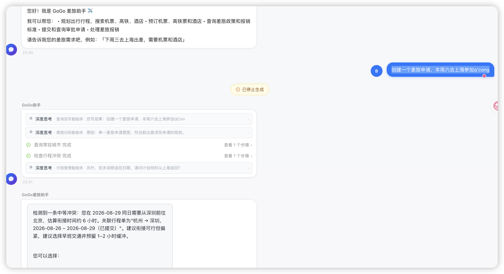
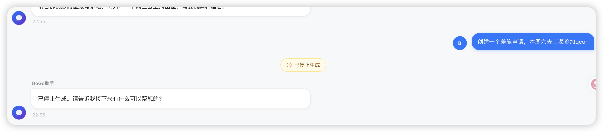

# ✅意图识别/问题改写的打断支持

在我们支持了Agent的打断之后，我在测试的时候发现一个问题：



也就是我明明已经发起了打断请求，页面也提示打断了，但是后台还是在执行，并且在最终执行后，把内容返回给前端展示了出来。

于是我看了下日志，开始定位问题：

````
2026-08-26 22:41:18.875 [http-nio-8080-exec-6] INFO  c.g.travel.controller.ChatController - [CHAT] 收到请求 sessionId=session_1787755231636, userId=u002, messageLength=23
2026-08-26 22:41:18.922 [http-nio-8080-exec-6] DEBUG c.g.t.b.c.m.C.selectById - ==>  Preparing: SELECT conversation_id,user_id,title,created_at,updated_at,deleted FROM chat_conversation WHERE conversation_id=? AND deleted=0
2026-08-26 22:41:18.923 [http-nio-8080-exec-6] DEBUG c.g.t.b.c.m.C.selectById - ==> Parameters: session_1787755231636(String)
2026-08-26 22:41:18.957 [http-nio-8080-exec-6] DEBUG c.g.t.b.c.m.C.selectById - <==      Total: 0
2026-08-26 22:41:18.960 [http-nio-8080-exec-6] DEBUG c.g.t.b.c.m.C.insert - ==>  Preparing: *********** chat_conversation ( conversation_id, user_id, title, created_at, updated_at ) VALUES ( ?, ?, ?, ?, ? )
2026-08-26 22:41:18.961 [http-nio-8080-exec-6] DEBUG c.g.t.b.c.m.C.insert - ==> Parameters: session_1787755231636(String), u002(String), 新对话(String), 2026-08-26 22:41:18.95964(Timestamp), 2026-08-26 22:41:18.95964(Timestamp)
2026-08-26 22:41:19.028 [http-nio-8080-exec-6] DEBUG c.g.t.b.c.m.C.insert - <==    Updates: 1
2026-08-26 22:41:19.029 [http-nio-8080-exec-6] DEBUG c.g.t.b.c.m.C.selectById - ==>  Preparing: SELECT conversation_id,user_id,title,created_at,updated_at,deleted FROM chat_conversation WHERE conversation_id=? AND deleted=0
2026-08-26 22:41:19.029 [http-nio-8080-exec-6] DEBUG c.g.t.b.c.m.C.selectById - ==> Parameters: session_1787755231636(String)
2026-08-26 22:41:19.064 [http-nio-8080-exec-6] DEBUG c.g.t.b.c.m.C.selectById - <==      Total: 1
2026-08-26 22:41:19.067 [http-nio-8080-exec-6] DEBUG c.g.t.b.c.m.C.update - ==>  Preparing: UPDATE chat_conversation SET title=? WHERE deleted=0 AND (conversation_id = ?)
2026-08-26 22:41:19.068 [http-nio-8080-exec-6] DEBUG c.g.t.b.c.m.C.update - ==> Parameters: 创建一个差旅申请，本周六去上海参加q'cong(String), session_1787755231636(String)
2026-08-26 22:41:19.134 [http-nio-8080-exec-6] DEBUG c.g.t.b.c.m.C.update - <==    Updates: 1
2026-08-26 22:41:19.136 [http-nio-8080-exec-6] DEBUG c.g.t.b.c.m.ChatMessageMapper.insert - ==>  Preparing: *********** chat_message ( message_id, conversation_id, role, content, created_at ) VALUES ( ?, ?, ?, ?, ? )
2026-08-26 22:41:19.136 [http-nio-8080-exec-6] DEBUG c.g.t.b.c.m.ChatMessageMapper.insert - ==> Parameters: msg_caabd117bc314711af1693c2e5eb307b(String), session_1787755231636(String), user(String), 创建一个差旅申请，本周六去上海参加q'cong(String), 2026-08-26 22:41:19.136239(Timestamp)
2026-08-26 22:41:19.201 [http-nio-8080-exec-6] DEBUG c.g.t.b.c.m.ChatMessageMapper.insert - <==    Updates: 1
2026-08-26 22:41:19.201 [http-nio-8080-exec-6] DEBUG c.g.t.b.c.service.ChatHistoryService - [CHAT_HISTORY] 保存用户消息 conversationId=session_1787755231636
2026-08-26 22:41:19.268 [http-nio-8080-exec-6] DEBUG c.g.t.a.r.AgentExecutionRegistry - [EXEC_REGISTRY] session=session_1787755231636 本地无运行中 Agent
2026-08-26 22:41:19.302 [redisMessageListenerContainer-1] INFO  c.g.t.a.s.AgentInterruptBroadcast - [INTERRUPT_BROADCAST] 收到广播中断消息, sessionId=session_1787755231636
2026-08-26 22:41:19.302 [redisMessageListenerContainer-1] DEBUG c.g.t.a.r.AgentExecutionRegistry - [EXEC_REGISTRY] session=session_1787755231636 本地无运行中 Agent
2026-08-26 22:41:19.302 [http-nio-8080-exec-6] INFO  c.g.t.a.s.AgentInterruptBroadcast - [INTERRUPT_BROADCAST] 已广播中断消息, sessionId=session_1787755231636
2026-08-26 22:41:19.379 [http-nio-8080-exec-6] INFO  c.g.travel.controller.ChatController - [CHAT] 会话 session_1787755231636 由 MasterAgent 进行协调
2026-08-26 22:41:19.380 [http-nio-8080-exec-6] DEBUG c.g.t.a.registry.SseEmitterRegistry - [SSE_REGISTRY] session=session_1787755231636 emitter 已注册
2026-08-26 22:41:19.389 [boundedElastic-1] DEBUG c.g.t.a.i.IntentRecognitionRouter - [INTENT_ROUTER] L1 miss, cost=0ms, fall through to L2
2026-08-26 22:41:19.439 [redisMessageListenerContainer-1] DEBUG c.g.t.a.s.PendingToolSessionStore - [PendingToolStore] 已清除 pendingTool, sessionId=session_1787755231636
2026-08-26 22:41:19.963 [boundedElastic-1] DEBUG c.g.t.a.intent.IntentVectorMatcher - [INTENT_ROUTER] L2 top-1 相似度 0.705955********03 < 阈值 0.75，放行到 L3
2026-08-26 22:41:19.963 [boundedElastic-1] INFO  c.g.t.a.i.IntentRecognitionRouter - [INTENT_ROUTER] L1/L2 miss, will fall through to L3 (q='创建一个差旅申请，本周六去上海参加q'cong', L1=0ms, L2=573ms)
2026-08-26 22:41:19.963 [boundedElastic-1] INFO  c.g.t.a.service.AgentPipelineService - [PIPELINE] L1/L2 未命中，进入问题改写后重新识别流程
2026-08-26 22:41:19.971 [boundedElastic-1] DEBUG c.g.t.b.c.m.C.selectList - ==>  Preparing: SELECT message_id,conversation_id,role,content,agent_name,extra,feedback,feedback_at,created_at,deleted FROM chat_message WHERE deleted=0 AND (conversation_id = ?) ******** created_at ********** 11
2026-08-26 22:41:19.972 [boundedElastic-1] DEBUG c.g.t.b.c.m.C.selectList - ==> Parameters: session_1787755231636(String)
2026-08-26 22:41:20.005 [boundedElastic-1] DEBUG c.g.t.b.c.m.C.selectList - <==      Total: 1
2026-08-26 22:41:20.005 [boundedElastic-1] DEBUG c.g.t.a.service.AgentPipelineService - [PIPELINE] 已加载 1 条 chat_message 历史用于问题改写 sessionId=session_1787755231636
2026-08-26 22:41:20.009 [boundedElastic-1] DEBUG c.g.t.a.r.AgentExecutionRegistry - [EXEC_REGISTRY] session=session_1787755231636 Agent=QueryRewritingAgent 已注册到本地执行表
2026-08-26 22:41:20.009 [boundedElastic-1] INFO  c.g.t.a.h.AgentExecutionLoggerHook - [AGENT][QueryRewritingAgent] PreCall 输入消息数=1
2026-08-26 22:41:20.009 [boundedElastic-1] DEBUG c.g.t.a.h.AgentExecutionLoggerHook - [AGENT][QueryRewritingAgent] msg[0] role=USER content=创建一个差旅申请，本周六去上海参加q'cong
2026-08-26 22:41:21.274 [http-nio-8080-exec-7] INFO  c.g.travel.controller.ChatController - [CHAT] 收到打断请求 sessionId=session_1787755231636, userId=u002
2026-08-26 22:41:21.275 [http-nio-8080-exec-7] INFO  c.g.t.a.r.AgentExecutionRegistry - [EXEC_REGISTRY] 优雅中断 session=session_1787755231636 的 Agent: QueryRewritingAgent
2026-08-26 22:41:21.276 [http-nio-8080-exec-7] DEBUG c.g.t.a.r.AgentExecutionRegistry - [SessionPersistence] Agent QueryRewritingAgent 不暴露 memory 入口，跳过被中断时的记忆保存
2026-08-26 22:41:21.409 [http-nio-8080-exec-7] DEBUG c.g.t.a.s.PendingToolSessionStore - [PendingToolStore] 已清除 pendingTool, sessionId=session_1787755231636
2026-08-26 22:41:22.730 [boundedElastic-1] INFO  c.g.t.a.h.AgentExecutionLoggerHook - [AGENT][QueryRewritingAgent] PostCall 最终回复长度=178
2026-08-26 22:41:22.741 [boundedElastic-1] INFO  c.g.t.a.service.AgentPipelineService - [PIPELINE] 问题改写完成: 创建一个差旅申请，本周六去上海参加QCon
2026-08-26 22:41:22.741 [boundedElastic-1] DEBUG c.g.t.a.r.AgentExecutionRegistry - [EXEC_REGISTRY] session=session_1787755231636 Agent=IntentRecognitionAgent 已注册到本地执行表
2026-08-26 22:41:22.741 [boundedElastic-1] INFO  c.g.t.a.h.AgentExecutionLoggerHook - [AGENT][IntentRecognitionAgent] PreCall 输入消息数=1
2026-08-26 22:41:22.741 [boundedElastic-1] DEBUG c.g.t.a.h.AgentExecutionLoggerHook - [AGENT][IntentRecognitionAgent] msg[0] role=USER content=创建一个差旅申请，本周六去上海参加QCon
2026-08-26 22:41:22.742 [boundedElastic-1] DEBUG c.g.t.a.i.IntentRecognitionRouter - [INTENT_ROUTER] L1 miss, cost=0ms, fall through to L2
2026-08-26 22:41:23.294 [boundedElastic-1] DEBUG c.g.t.a.intent.IntentVectorMatcher - [INTENT_ROUTER] L2 top-1 相似度 0.708229********62 < 阈值 0.75，放行到 L3
2026-08-26 22:41:23.295 [boundedElastic-1] INFO  c.g.t.a.i.IntentRecognitionRouter - [INTENT_ROUTER] L1/L2 miss, will fall through to L3 (q='创建一个差旅申请，本周六去上海参加QCon', L1=0ms, L2=552ms)
2026-08-26 22:41:23.295 [boundedElastic-1] DEBUG c.g.t.agent.IntentRecognitionAgent - [INTENT_RECOGNITION] L1/L2 未命中，转交 L3 LLM 兜底
2026-08-26 22:41:25.794 [boundedElastic-1] INFO  c.g.t.a.h.AgentExecutionLoggerHook - [AGENT][IntentRecognitionAgent] PostCall 最终回复长度=323
2026-08-26 22:41:25.797 [boundedElastic-1] DEBUG c.g.t.a.r.AgentExecutionRegistry - [EXEC_REGISTRY] session=session_1787755231636 Agent=IntentRecognitionAgent 已从本地执行表移除
2026-08-26 22:41:25.798 [boundedElastic-1] INFO  c.g.t.a.service.AgentPipelineService - [PIPELINE] 意图识别完成: ```json
&#123;
  "intents": [
    &#123;
      "intent": "travel_application",
      "target_agent": "itineraryManageAgent",
      "confidence": "high",
      "reason": "用户明确提出创建差旅申请，并提供了时间、目的地和事由等新出差要素。"
    &#125;
  ],
  "primary_intent": "travel_application",
  "multi_intent": false,
  "overall_reason": "单一差旅申请意图，符合新出差须先申请的规则。"
&#125;
```
2026-08-26 22:41:25.806 [boundedElastic-1] INFO  c.g.t.a.m.TravelPreferenceLongTermMemoryFactory - [TravelPreferenceLTM] 已为用户 u002 创建百炼长期记忆实例
````

通过分析日志+代码，我们能得出以下结论：

**AgentScope 的中断是“协作式”（cooperative）而非“抢占式”：interrupt() 只是设置一个 AtomicBoolean 标志位，框架要求 Agent 在 doCall 的 Mono 链中主动调用 checkInterruptedAsync() 作为检查点，标志位才会被消费。而 QueryRewritingAgent / IntentRecognitionAgent 的 doCall 里一次都没调用它，LLM 调用又是 block() 同步阻塞——于是标志位被置为 true 后无人读取，打断完全落空。**

```
/ L305: interrupt() 只置标志，不取消任何执行
public void interrupt() {
    interruptSource.set(InterruptSource.USER);
    interruptFlag.set(true);
}

// L360: 检查点——由子类在自己的 Mono 链中主动调用，置位后抛 InterruptedException
protected Mono<Void> checkInterruptedAsync() {
    return Mono.defer(() -> interruptFlag.get()
            ? Mono.error(new InterruptedException("Agent execution interrupted"))
            : Mono.empty());
}

// L436: call() 组装的 onErrorResume 捕获该异常 → 调 handleInterrupt() 返回恢复消息
if (error instanceof InterruptedException || ...) {
    return handleInterrupt(createInterruptContext(), originalArgs);
}
```

而ReActAgent的话，在 4 处正确埋了检查点：reasoning 前（L468）、每个 LLM 流式 chunk（L480 concatMap(chunk -> checkInterruptedAsync().thenReturn(chunk))）、acting 前（L542）。所以打断 MasterAgent 是有效的。

所以，我们需要在 QueryRewritingAgent / IntentRecognitionAgent 中增加中断检查点：

```text
// 全响应式调用 LLM，并在三个位置埋中断检查点（与 ReActAgent reasoning 阶段一致）：
// 1. 调用前：打断发生在 LLM 尚未开始时直接短路；
// 2. 每个 chunk 到达时：流式中被打断立即取消上游 LLM 请求，实现"秒停"；
// 3. 结果聚合后：兜住"LLM 已返回但打断恰好到达"的窗口。
// 检查点抛出的 InterruptedException 会被 AgentBase.call 的 onErrorResume 捕获，
// 转交 handleInterrupt 返回带 GenerateReason.INTERRUPTED 的恢复消息，由流水线终止后续步骤。
return checkInterruptedAsync()
        .then(stableModel.stream(messages, null, null)
                .concatMap(chunk -> checkInterruptedAsync().thenReturn(chunk))
                .collectList())
        .flatMap(responses -> checkInterruptedAsync().thenReturn(responses))
        .map(responses -> Msg.builder()
                .name(NAME)
                .role(MsgRole.ASSISTANT)
                .content(TextBlock.builder().text(extractText(responses)).build())
                .build());
```

优化后效果：



对应的日志：

```
2026-08-26 22:55:26.966 [http-nio-8080-exec-5] INFO  c.g.travel.controller.ChatController - [CHAT] 收到请求 sessionId=session_1787756116621, userId=u002, messageLength=21
2026-08-26 22:55:27.015 [http-nio-8080-exec-5] DEBUG c.g.t.b.c.m.C.selectById - ==>  Preparing: SELECT conversation_id,user_id,title,created_at,updated_at,deleted FROM chat_conversation WHERE conversation_id=? AND deleted=0
2026-08-26 22:55:27.016 [http-nio-8080-exec-5] DEBUG c.g.t.b.c.m.C.selectById - ==> Parameters: session_1787756116621(String)
2026-08-26 22:55:27.057 [http-nio-8080-exec-5] DEBUG c.g.t.b.c.m.C.selectById - <==      Total: 0
2026-08-26 22:55:27.060 [http-nio-8080-exec-5] DEBUG c.g.t.b.c.m.C.insert - ==>  Preparing: *********** chat_conversation ( conversation_id, user_id, title, created_at, updated_at ) VALUES ( ?, ?, ?, ?, ? )
2026-08-26 22:55:27.061 [http-nio-8080-exec-5] DEBUG c.g.t.b.c.m.C.insert - ==> Parameters: session_1787756116621(String), u002(String), 新对话(String), 2026-08-26 22:55:27.059248(Timestamp), 2026-08-26 22:55:27.059248(Timestamp)
2026-08-26 22:55:27.157 [http-nio-8080-exec-5] DEBUG c.g.t.b.c.m.C.insert - <==    Updates: 1
2026-08-26 22:55:27.157 [http-nio-8080-exec-5] DEBUG c.g.t.b.c.m.C.selectById - ==>  Preparing: SELECT conversation_id,user_id,title,created_at,updated_at,deleted FROM chat_conversation WHERE conversation_id=? AND deleted=0
2026-08-26 22:55:27.157 [http-nio-8080-exec-5] DEBUG c.g.t.b.c.m.C.selectById - ==> Parameters: session_1787756116621(String)
2026-08-26 22:55:27.497 [http-nio-8080-exec-5] DEBUG c.g.t.b.c.m.C.selectById - <==      Total: 1
2026-08-26 22:55:27.505 [http-nio-8080-exec-5] DEBUG c.g.t.b.c.m.C.update - ==>  Preparing: UPDATE chat_conversation SET title=? WHERE deleted=0 AND (conversation_id = ?)
2026-08-26 22:55:27.506 [http-nio-8080-exec-5] DEBUG c.g.t.b.c.m.C.update - ==> Parameters: 创建一个差旅申请，本周六去上海参加qcon(String), session_1787756116621(String)
2026-08-26 22:55:27.589 [http-nio-8080-exec-5] DEBUG c.g.t.b.c.m.C.update - <==    Updates: 1
2026-08-26 22:55:27.590 [http-nio-8080-exec-5] DEBUG c.g.t.b.c.m.ChatMessageMapper.insert - ==>  Preparing: *********** chat_message ( message_id, conversation_id, role, content, created_at ) VALUES ( ?, ?, ?, ?, ? )
2026-08-26 22:55:27.591 [http-nio-8080-exec-5] DEBUG c.g.t.b.c.m.ChatMessageMapper.insert - ==> Parameters: msg_f7fdc424eda44019a6ab4d8f3226f774(String), session_1787756116621(String), user(String), 创建一个差旅申请，本周六去上海参加qcon(String), 2026-08-26 22:55:27.590702(Timestamp)
2026-08-26 22:55:27.675 [http-nio-8080-exec-5] DEBUG c.g.t.b.c.m.ChatMessageMapper.insert - <==    Updates: 1
2026-08-26 22:55:27.675 [http-nio-8080-exec-5] DEBUG c.g.t.b.c.service.ChatHistoryService - [CHAT_HISTORY] 保存用户消息 conversationId=session_1787756116621
2026-08-26 22:55:27.776 [http-nio-8080-exec-5] DEBUG c.g.t.a.r.AgentExecutionRegistry - [EXEC_REGISTRY] session=session_1787756116621 本地无运行中 Agent
2026-08-26 22:55:27.985 [http-nio-8080-exec-5] INFO  c.g.t.a.s.AgentInterruptBroadcast - [INTERRUPT_BROADCAST] 已广播中断消息, sessionId=session_1787756116621
2026-08-26 22:55:27.986 [redisMessageListenerContainer-1] INFO  c.g.t.a.s.AgentInterruptBroadcast - [INTERRUPT_BROADCAST] 收到广播中断消息, sessionId=session_1787756116621
2026-08-26 22:55:27.986 [redisMessageListenerContainer-1] DEBUG c.g.t.a.r.AgentExecutionRegistry - [EXEC_REGISTRY] session=session_1787756116621 本地无运行中 Agent
2026-08-26 22:55:28.031 [http-nio-8080-exec-5] INFO  c.g.travel.controller.ChatController - [CHAT] 会话 session_1787756116621 由 MasterAgent 进行协调
2026-08-26 22:55:28.031 [http-nio-8080-exec-5] DEBUG c.g.t.a.registry.SseEmitterRegistry - [SSE_REGISTRY] session=session_1787756116621 emitter 已注册
2026-08-26 22:55:28.041 [boundedElastic-1] DEBUG c.g.t.a.i.IntentRecognitionRouter - [INTENT_ROUTER] L1 miss, cost=1ms, fall through to L2
2026-08-26 22:55:28.183 [redisMessageListenerContainer-1] DEBUG c.g.t.a.s.PendingToolSessionStore - [PendingToolStore] 已清除 pendingTool, sessionId=session_1787756116621
2026-08-26 22:55:29.853 [http-nio-8080-exec-6] INFO  c.g.travel.controller.ChatController - [CHAT] 收到打断请求 sessionId=session_1787756116621, userId=u002
2026-08-26 22:55:29.854 [http-nio-8080-exec-6] DEBUG c.g.t.a.r.AgentExecutionRegistry - [EXEC_REGISTRY] session=session_1787756116621 本地无运行中 Agent
2026-08-26 22:55:29.899 [boundedElastic-1] DEBUG c.g.t.a.intent.IntentVectorMatcher - [INTENT_ROUTER] L2 top-1 相似度 0.709369********55 < 阈值 0.75，放行到 L3
2026-08-26 22:55:29.900 [boundedElastic-1] INFO  c.g.t.a.i.IntentRecognitionRouter - [INTENT_ROUTER] L1/L2 miss, will fall through to L3 (q='创建一个差旅申请，本周六去上海参加qcon', L1=1ms, L2=1858ms)
2026-08-26 22:55:29.900 [boundedElastic-1] INFO  c.g.t.a.service.AgentPipelineService - [PIPELINE] L1/L2 未命中，进入问题改写后重新识别流程
2026-08-26 22:55:29.909 [boundedElastic-1] DEBUG c.g.t.b.c.m.C.selectList - ==>  Preparing: SELECT message_id,conversation_id,role,content,agent_name,extra,feedback,feedback_at,created_at,deleted FROM chat_message WHERE deleted=0 AND (conversation_id = ?) ******** created_at ********** 11
2026-08-26 22:55:29.909 [boundedElastic-1] DEBUG c.g.t.b.c.m.C.selectList - ==> Parameters: session_1787756116621(String)
2026-08-26 22:55:29.952 [boundedElastic-1] DEBUG c.g.t.b.c.m.C.selectList - <==      Total: 1
2026-08-26 22:55:29.953 [boundedElastic-1] DEBUG c.g.t.a.service.AgentPipelineService - [PIPELINE] 已加载 1 条 chat_message 历史用于问题改写 sessionId=session_1787756116621
2026-08-26 22:55:29.956 [boundedElastic-1] DEBUG c.g.t.a.r.AgentExecutionRegistry - [EXEC_REGISTRY] session=session_1787756116621 Agent=QueryRewritingAgent 已注册到本地执行表
2026-08-26 22:55:29.957 [boundedElastic-1] INFO  c.g.t.a.h.AgentExecutionLoggerHook - [AGENT][QueryRewritingAgent] PreCall 输入消息数=1
2026-08-26 22:55:29.957 [boundedElastic-1] DEBUG c.g.t.a.h.AgentExecutionLoggerHook - [AGENT][QueryRewritingAgent] msg[0] role=USER content=创建一个差旅申请，本周六去上海参加qcon
2026-08-26 22:55:30.025 [http-nio-8080-exec-6] DEBUG c.g.t.a.s.PendingToolSessionStore - [PendingToolStore] 已清除 pendingTool, sessionId=session_1787756116621
2026-08-26 22:55:30.060 [http-nio-8080-exec-6] INFO  c.g.t.a.s.AgentInterruptBroadcast - [INTERRUPT_BROADCAST] 已广播中断消息, sessionId=session_1787756116621
```

---

来源: https://thoughts.aliyun.com/workspaces/6963289eb0fc2e001bb052eb/docs/6a8efdb23fb9180001f782fb
