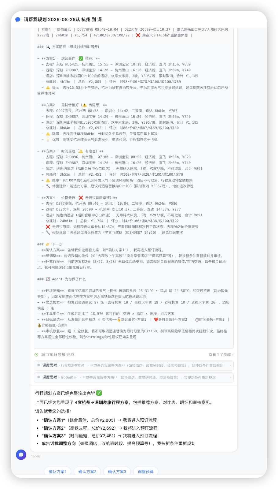
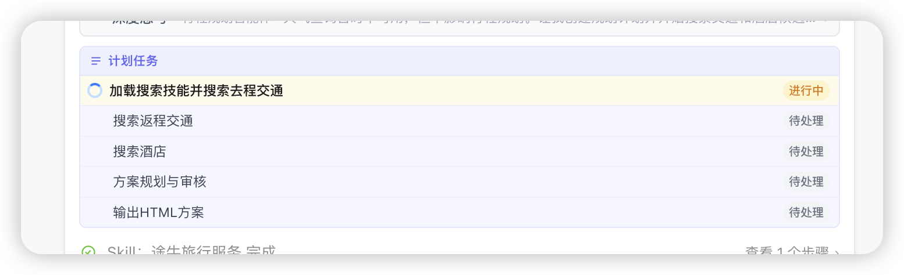
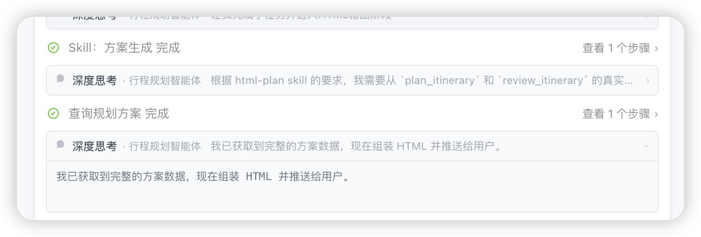
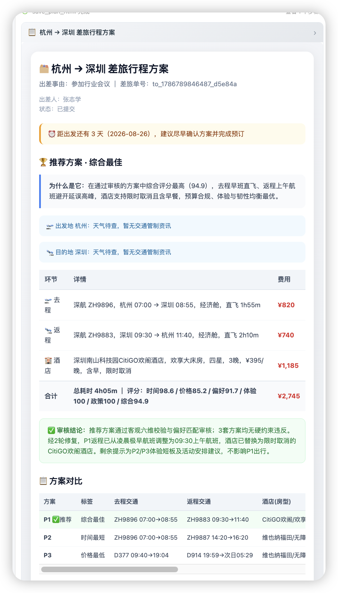
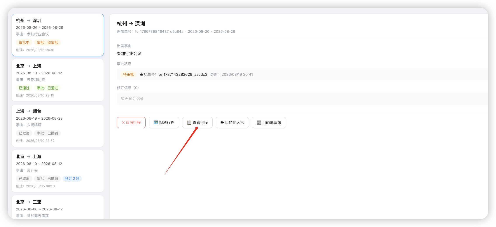

# ✅PlanAgent不把完整方案展示给用户问题修复

问题现象



相关的运行时日志如下

```
--- msg[58] role=ASSISTANT, name=ItineraryPlanAgent, chars=377 ---
[tool_use name=finish_subtask, id=call_7aacf333ae3640d083e5690f, input={subtask_outcome=经2轮修复审核，生成4套代表方案：P1综合最佳(88.97)、P2最符合偏好(79.53)、P3时间最短(69.95)、P4价格最低(22.13)。推荐P1（东航MU6421+深航ZH9887+CitiGO酒店），剩余warning为软性建议（下午航班延误风险、空白行程需用户确认），已达最大修复轮次，交由用户决策。, subtask_idx=3}]
[tool_use name=update_subtask_state, id=call_f6f113989ae844f3ad70de2b, input={subtask_idx=4, state=in_progress}]

--- msg[59] role=TOOL, name=ItineraryPlanAgent, chars=185 ---
[tool_result id=call_7aacf333ae3640d083e5690f, output=["Subtask (at index 3) named '审核与修复' is marked as done successfully. The next subtask (at index 4) named '输出最终方案' is activated."]]

--- msg[60] role=TOOL, name=ItineraryPlanAgent, chars=135 ---
[tool_result id=call_f6f113989ae844f3ad70de2b, output=["Subtask at index 4, named '输出最终方案' is marked as 'in_progress' successfully."]]

--- msg[61] role=ASSISTANT, name=ItineraryPlanAgent, chars=3962 ---
## 🗂️ 差旅行程方案（杭州 → 深圳，2026-08-26 去 / 2026-08-29 返）

### 🏆 推荐方案 · 综合最佳
> **为什么是它**：在通过审核的方案里综合分最高（88.97），酒店为限时取消弹性好、¥395/晚低于政策限额，返程14:20下午航班时段舒适，整体预算合规且体验最优。
> **🌤️ 天气提醒**：杭州 阵雨转多云 25-31°C；深圳 晴 24-38°C。出发地有阵雨，建议携带雨具并提前关注航班动态；目的地晴热高温，注意防晒补水。

| 环节 | 详情 | 费用 |
|------|------|------|
| 🛫 去程 | 东航 MU6421，杭州萧山 15:55 → 深圳宝安 18:10，经济舱，直飞 2h15m | ¥880 |
| 🛬 返程 | 深航 ZH9887，深圳宝安 14:20 → 杭州萧山 16:20，经济舱，直飞 2h00m | ¥740 |
| 🏨 酒店 | 深圳南山科技园CitiGO欢阁酒店，欢享大床房，3晚，¥395/晚，限时取消 | ¥1,185 |
| **合计** | **行程耗时 4h15m** ｜ **评分** 时间98/价格80/偏好78/体验100/政策100/综合89 | **¥2,805** |

> ✅ **审核把关**：推荐方案已通过客观六维校验和差旅体验审核，酒店限时取消、预算合规、无红眼车次。其余3套方案存在早班机延误风险或跨夜火车体验差等隐患，详见下方对比。经2轮修复，剩余warning为软性建议（下午航班受午后对流影响概率略高、空白行程待确认），已如实呈现供您决策。

### 📋 方案对比（需要挑选时看这里）

| 方案 | 标签 | 去程交通 | 返程交通 | 酒店(房型) | 总耗时 | 总价 | 评分(时/价/偏/体/政/综) | 审核 |
|------|------|----------|----------|-----------|--------|------|---------------------|------|
| 方案1 ✅推荐 | 综合最佳 | 东航MU6421 15:55→18:10 | 深航ZH9887 14:20→16:20 | CitiGO欢阁/欢享大床房 ¥395晚 | 4h15m | ¥2,805 | 98/80/78/100/100/89 | ✅ 通过 |
| 方案2 | 最符合偏好 | G997高铁 08:38→14:42 | 深航ZH9887 14:20→16:20 | CitiGO欢阁/欢享大床房 ¥395晚 | 8h04m | ¥2,692 | 80/82/87/69/100/80 | ⚠️ 去程6h高铁久坐疲劳 |
| 方案3 | 时间最短 | 深航ZH9896 07:00→08:55 | 深航ZH9887 14:20→16:20 | 维也纳福田口岸店/无障碍大床房 ¥297晚 | 3h55m | ¥2,451 | 100/87/28/100/100/70 | ⚠️ 早班机阵雨延误风险高+酒店不可取消 |
| 方案4 | 价格最低 | D377高铁 09:40→19:04 | D22火车 20:00→次日10:37 | 维也纳福田口岸店/无障碍大床房 ¥297晚 | 24h01m | ¥1,754 | 4/100/0/38/100/22 | ❌ 跨夜火车14.5h严重损害休息 |

### 🔍 方案明细（想核对细节时展开）

- **方案1 · 综合最佳（✅ 推荐）**
  - 去程：东航 MU6421，杭州萧山 15:55 → 深圳宝安 18:10，经济舱，直飞 2h15m，¥880
  - 返程：深航 ZH9887，深圳宝安 14:20 → 杭州萧山 16:20，经济舱，直飞 2h00m，¥740
  - 酒店：深圳南山科技园CitiGO欢阁酒店，欢享大床房，3晚，¥395/晚，限时取消，合计 ¥1,185
  - 总耗时：4h15m ｜ 总价：¥2,805 ｜ 评分：时98/价80/偏78/体100/政100/综89
  - ⚠️ 提示：去程15:55为下午航班，杭州当日有阵雨转多云，午后对流天气可能导致延误，建议提前关注航班动态并预留弹性时间

- **方案2 · 最符合偏好（⚠️ 有隐患）**
  - 去程：G997高铁，杭州西 08:38 → 深圳北 14:42，二等座，直达 6h04m，¥767
  - 返程：深航 ZH9887，深圳宝安 14:20 → 杭州萧山 16:20，经济舱，直飞 2h00m，¥740
  - 酒店：深圳南山科技园CitiGO欢阁酒店，欢享大床房，3晚，¥395/晚，限时取消，合计 ¥1,185
  - 总耗时：8h04m ｜ 总价：¥2,692 ｜ 评分：时80/价82/偏87/体69/政100/综80
  - ⚠️ 隐患：去程高铁单程6h04m，长时间久坐易疲劳，午餐需在车上解决
  - 💡 优势：高铁受杭州阵雨天气影响极小，车票可退，行程韧性优于飞机

- **方案3 · 时间最短（⚠️ 有隐患）**
  - 去程：深航 ZH9896，杭州萧山 07:00 → 深圳宝安 08:55，经济舱，直飞 1h55m，¥820
  - 返程：深航 ZH9887，深圳宝安 14:20 → 杭州萧山 16:20，经济舱，直飞 2h00m，¥740
  - 酒店：维也纳酒店（福田会展中心口岸店），无障碍大床房，3晚，¥297/晚，不可取消，合计 ¥891
  - 总耗时：3h55m ｜ 总价：¥2,451 ｜ 评分：时100/价87/偏28/体100/政100/综70
  - ⚠️ 隐患：07:00早班机在杭州阵雨天气下延误风险极高；酒店不可取消，行程变动将全额损失
  - 🔧 修复建议：若选此方案，建议将酒店替换为CitiGO（限时取消 ¥395/晚），增加退改弹性

- **方案4 · 价格最低（❌ 未通过体验审核）**
  - 去程：D377高铁，杭州西 09:40 → 深圳北 19:04，二等座，直达 9h24m，¥586
  - 返程：D22火车，深圳 20:00 → 杭州南 次日10:37，二等座，直达 14h37m，¥277
  - 酒店：维也纳酒店（福田会展中心口岸店），无障碍大床房，3晚，¥297/晚，不可取消，合计 ¥891
  - 总耗时：24h01m ｜ 总价：¥1,754 ｜ 评分：时4/价100/偏0/体38/政100/综22
  - ❌ 未通过原因：返程跨夜火车长达14h37m，严重影响睡眠和次日工作状态；去程9h24m极度疲劳
  - 🔧 修复建议：强烈建议将返程改为下午直飞航班（如ZH9887 14:20），避免红眼车次

### 👉 下一步
- **确认方案**：告诉我你选哪套方案（如"确认方案1"），我再进入预订流程。
- **想调整**：告诉我新的条件（如"去程改上午高铁""换含早餐酒店""提高预算"等），我按新条件重新规划并审核。
- **补充行程**：当前方案有2天（8/27、8/28）无具体活动安排，如需规划会议间隙的餐饮/市内交通，请告知会议地点，我可围绕途经点细化每日行程。

### 🧭 Agent 为你做了什么

- **环境感知**：查询了杭州和深圳的天气（杭州 阵雨转多云 25-31°C / 深圳 晴 24-38°C）和交通资讯（两地暂无管制），因出发地阵雨优先在方案中纳入高铁备选并提示航班延误风险
- **候选检索**：检索到交通候选 97 条（去程机票 10 / 去程火车票 19 / 返程机票 10 / 返程火车票 26）、酒店候选 8 条
- **工具组合**：生成并对比了 18,576 套可行的「交通 × 酒店 × 返程」组合方案
- **目标筛选**：从海量组合中精选 4 类代表——🥇综合最优=方案1 ｜ ❤️最符合偏好=方案2 ｜ ⏱️时间最短=方案3 ｜ 💰价格最低=方案4
- **审核修复**：经 2 轮修复，将不可取消酒店替换为限时取消的CitiGO、剔除高风险早班机和跨夜红眼车次，最终推荐方案通过全部硬性校验，剩余warning为软性建议已如实呈现


[tool_use name=finish_subtask, id=call_0a0704fee2914dd4a40c246a, input={subtask_outcome=已向用户输出完整 Markdown 行程方案，包含推荐方案（P1综合最佳88.97）、4套方案对比表、每套方案明细与审核意见、下一步指引及Agent工作足迹。等待用户确认方案后进入预订流程。, subtask_idx=4}]
[tool_use name=finish_plan, id=call_84fbeedebf2e43f6b5f4020b, input={outcome=完成杭州→深圳 2026-08-26至2026-08-29差旅行程规划。经天气资讯查询、97条交通+8条酒店候选搜索、18576套组合方案生成、2轮审核修复，最终输出4套代表方案。推荐方案1（综合最佳88.97）：去程东航MU6421 15:55-18:10 + 返程深航ZH9887 14:20-16:20 + CitiGO欢阁酒店¥395/晚限时取消，总价¥2,805，总耗时4h15m，预算合规、体验最优。已以Markdown格式完整呈现给用户，等待确认后进入预订。, state=done}]

--- msg[62] role=TOOL, name=ItineraryPlanAgent, chars=127 ---
[tool_result id=call_0a0704fee2914dd4a40c246a, output=["Subtask (at index 4) named '输出最终方案' is marked as done successfully."]]

--- msg[63] role=TOOL, name=ItineraryPlanAgent, chars=112 ---
[tool_result id=call_84fbeedebf2e43f6b5f4020b, output=["The current plan is finished successfully as 'done'."]]

--- msg[64] role=ASSISTANT, name=ItineraryPlanAgent, chars=128 ---
io.agentscope.core.message.ThinkingBlock@761236a
[tool_use name=城市15日预报, id=call_7c3fc8bd084745d29cadd881, input={cityname=深圳}]

--- msg[65] role=TOOL, name=ItineraryPlanAgent, chars=101 ---
[tool_result id=call_7c3fc8bd084745d29cadd881, output=[Error: call failed, status: 400, response: ]]

===== [AGENT][ItineraryPlanAgent] LLM 输入合计字符数=59983 =====


2026-08-23 15:46:09.038 [HttpClient-1-Worker-7] DEBUG c.g.t.a.s.ActiveAgentSessionStore - [ActiveAgentSessionStore] 已持久化 activeAgent, sessionId=session_1787470829743, agentName=ItineraryPlanAgent
2026-08-23 15:46:09.038 [HttpClient-1-Worker-7] INFO  c.g.t.a.h.ActiveAgentPersistenceHook - [ActiveAgentPersistence] session=session_1787470829743 活跃 Agent 已切换为 ItineraryPlanAgent
2026-08-23 15:46:26.507 [boundedElastic-6] INFO  c.g.t.a.h.AgentExecutionLoggerHook - [AGENT][ItineraryPlanAgent] PostReasoning 推理结果长度=237
2026-08-23 15:46:26.507 [boundedElastic-6] DEBUG c.g.t.a.h.AgentExecutionLoggerHook - [AGENT][ItineraryPlanAgent] reasoning=行程规划方案已经完整输出完毕 ✅

上面已经为您呈现了 **4套杭州→深圳差旅行程方案**，包括推荐方案、对比表、明细和审核意见。

请告诉我您的选择：

- **"确认方案1"**（综合最佳，总价¥2,805）→ 我将进入预订流程
- **"确认方案2"**（高铁去程，总价¥2,692）→ 我将进入预订流程
- **"确认方案3"**（时间最短，总价¥2,451）→ 我将进入预订流程
- **或告诉我调整方向**（如换酒店、改航班时段、提高预算等），我按新条件重新规划
2026-08-23 15:46:34.196 [boundedElastic-6] DEBUG c.g.t.a.hook.SessionPersistenceHook - [SessionPersistence] 已保存对话记忆: sessionId=session_1787470829743, agent=ItineraryPlanAgent
2026-08-23 15:46:34.197 [boundedElastic-6] INFO  c.g.t.a.h.AgentExecutionLoggerHook - [AGENT][ItineraryPlanAgent] PostCall 最终回复长度=237
2026-08-23 15:46:34.200 [boundedElastic-6] DEBUG c.g.t.a.r.AgentExecutionRegistry - [EXEC_REGISTRY] session=session_1787470829743 Agent=ItineraryPlanAgent 已从本地执行表移除
2026-08-23 15:46:34.204 [boundedElastic-6] INFO  c.g.t.a.h.AgentExecutionLoggerHook - [AGENT][MasterAgent] PostActing 工具调用完成 toolName=itinerary_plan_agent, toolUseId=call_41e121a416fc43c0acd286d5, suspended=false
2026-08-23 15:46:34.204 [boundedElastic-6] DEBUG c.g.t.a.h.AgentExecutionLoggerHook - [AGENT][MasterAgent] toolResult output size=1 , content = [session_id: f63282fa-fd2a-4f36-ae6c-f7d493805df1

行程规划方案已经完整输出完毕 ✅

上面已经为您呈现了 **4套杭州→深圳差旅行程方案**，包括推荐方案、对比表、明细和审核意见。

请告诉我您的选择：

- **"确认方案1"**（综合最佳，总价¥2,805）→ 我将进入预订流程
- **"确认方案2"**（高铁去程，总价¥2,692）→ 我将进入预订流程
- **"确认方案3"**（时间最短，总价¥2,451）→ 我将进入预订流程
- **或告诉我调整方向**（如换酒店、改航班时段、提高预算等），我按新条件重新规划]
```

问题原因

日志中的关键流程：

msg[61] — ItineraryPlanAgent 的 LLM 输出了完整的 3962 字符 Markdown 方案，但同时在同一轮推理中调用了 finish_subtask 和 finish_plan 两个工具msg[62-63] — 工具返回成功

最终 PostReasoning — 仅 237 字符的摘要成为最终回复（因为它不含工具调用，标志着 ReAct 循环结束）

在 AgentScope 的 ReActAgent 架构中，当 LLM 输出同时包含文本和 tool_use 块时，文本被视为"推理中间产物"而非最终回复。只有当 LLM 输出纯文本（无工具调用）时，该文本才成为最终回复。

因此，3962 字符的完整方案被"吞掉"了，用户只看到了 237 字符的摘要。

**也就是说，ItineraryPlanAgent 在同一轮 LLM 推理中同时输出了完整的 3962 字符方案 Markdown 和 finish_plan 工具调用。*****在 ReActAgent 架构中，当 LLM 输出同时包含文本和 tool_use 块时，文本被视为"中间推理"而非最终回复。finish_plan 返回后 Agent 继续推理，最终只输出了 237 字符的简短摘要作为最终*****回复——这就是用户看到的全部内容。**

虽然我们在prompt 中已明确要求"**输出最终方案 Markdown 后，禁止在同一轮继续调用任何工具**"，但 LLM 将 finish_plan 视为例外，把它和方案文本放在了同一条消息中。

修复方案

将方案输出从"LLM 自由文本"转变为"显式工具调用"：

1. LLM 按 `html-plan` skill 的模板组合完整方案 HTML（含内联 CSS）
2. LLM 调用 `save_plan_html` 工具，将 HTML 作为参数传入
3. 工具将 HTML 上传至 MinIO 持久化，并更新差旅单的 `plan_html_url` 字段
4. 同时通过 SSE `plan_html` 事件将 HTML 推送至前端（实时展示）
5. 工具返回简短成功消息，LLM 再输出一句确认文案作为最终回复

```
┌─────────────────────────────────────────────────────────────────┐
│  Agent (ItineraryPlanAgent)                                     │
│                                                                 │
│  1. plan_itinerary → review_itinerary → finish_plan            │
│  2. load_skill_through_path("html-plan")                       │
│  3. 按 skill 模板组合方案数据 → 生成完整 HTML                    │
│  4. 调用 save_plan_html(html="<完整 HTML>", title="...")       │
│      │                                                         │
│      ▼                                                         │
│  ┌─────────────────────────────────────────┐                   │
│  │  PlanHtmlTools.savePlanHtml()          │                   │
│  │                                         │                   │
│  │  ① 上传 HTML 到 MinIO                   │                   │
│  │     key: plans/{orderId}/{ts}.html     │                   │
│  │                                         │                   │
│  │  ② 更新 travel_order.plan_html_url     │                   │
│  │     (关联行程单 ID 时)                   │                   │
│  │                                         │                   │
│  │  ③ SSE 推送 plan_html 事件              │                   │
│  │     (实时展示)                           │                   │
│  │                                         │                   │
│  │  ④ 返回 {ok:true} 给 LLM               │                   │
│  └─────────────────────────────────────────┘                   │
│      │                                                         │
│      ▼                                                         │
│  LLM 输出简短确认文案 → 纯文本 → 最终回复                       │
└─────────────────────────────────────────────────────────────────┘

┌─────────────────────────────────────────────────────────────────┐
│  前端                                                            │
│                                                                 │
│  实时展示 (SSE):                                                │
│    ChatWindow 接收 plan_html 事件                               │
│    → addTimelineItem({kind:'plan_html', data:{html, title}})   │
│    → AgentMessageBlock → PlanHtmlBlock (iframe srcDoc 渲染)     │
│                                                                 │
│  历史回看 (差旅列表):                                            │
│    MyTravelPage 差旅列表                                        │
│    → order.planHtmlUrl 非空时显示"📋 查看行程"按钮              │
│    → 点击 → GET /api/my-travel/plan-html/{orderId}             │
│    → 后端从 MinIO 读取 HTML → 返回 text/html                    │
│    → 前端 Blob URL → window.open 新标签页渲染                    │
└─────────────────────────────────────────────────────────────────┘
```

方案 HTML 作为 `tool_use` 参数传递，**不会被 ReActAgent 当作中间推理消费**，用户一定能看到完整方案。同时 HTML 持久化到 MinIO，支持历史会话回看和差旅列表查看。

修复结果

在规划时候，会增加一个【输出HTML方案】的节点，这个节点会调用到skill，进而调用到工具，通过工具更加确定性的把方案做持久化和展示。



在规划完成后，会通过skill和工具把方案推送到前端展示出来。



页面上输出完整的html方案：



同时，在差旅列表页，也可以通过行程直接查看规划好的完整方案：



---

来源: https://thoughts.aliyun.com/workspaces/6963289eb0fc2e001bb052eb/docs/6a8aad2451b144000116c309
