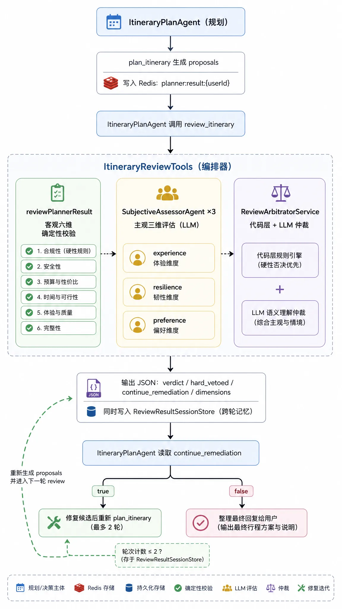

# ✅多维行程审核架构的方案设计

在旧版 gogo-agent 中，行程审核由单一的 ItineraryReviewAgent 完成。规划 Agent 把完整的方案 JSON 塞给审核 Agent，由它自行推理、查询政策、检查时间/预算/舱位，再输出报告。

这个模式在简单场景跑得通，但随着方案维度变多，出现三个结构性问题：

1. **职责过载**：一个 Agent 要同时做政策合规、时间计算、预算校验、体验评估、偏好匹配、风险判断，提示词里塞满规则，很容易漏检或自相矛盾。
2. **主观维度不稳定**：**体验好不好、行程够不够"韧性"、是否匹配用户偏好**，这些确实适合 LLM 评估，但如果和硬规则混在一起，LLM 可能为了"体验"把硬约束盖住，也可能为了"合规"把所有方案都否掉。

因此需要把审核拆成三层：

- **确定性工具**：硬规则由 Java 代码精确计算，结果稳定、可解释、可单测。
- **LLM 主观评估器**：体验、韧性、偏好等主观维度交给专门的轻量 Agent **并行**评估。
- **代码层仲裁器**：汇总客观与主观结果，按硬约束优先原则生成整改单，并由代码层决定是否继续修复循环。

这样，"不可让 LLM 做数学题"的规则被抽出来，"必须让 LLM 做判断"的维度被保留，二者之间的冲突由仲裁器用明确的优先级解决。



- **核心审核逻辑已经从 ****ItineraryReviewAgent**** 迁移到 ****ItineraryReviewTools****。**
- 审核不再是"一个 Agent 黑盒推理"，而是"工具编排 + 并行评估 + 仲裁器决策"的可组合流程。

ItineraryReviewTools

ItineraryReviewTools的reviewItinerary方法，是整个审核流程的编排入口。

```text
@Tool(
        name = "review_itinerary",
        description = "对行程规划方案做多维审核（客观确定性校验 + 主观差旅体验/行程韧性/偏好匹配评估），仲裁生成整改单。" +
                      "规划结果由 plan_itinerary 自动存储，本工具自动读取，无需传入方案 JSON。" +
                      "上一轮审核结果自动加载（跨轮记忆），无需手动传入。"
)
public String reviewItinerary(
        @ToolParam(name = "policy", required = false) String policy,
        @ToolParam(name = "weather_summary", required = false) String weatherSummary,
        @ToolParam(name = "news_summary",required = false) String newsSummary,
        @ToolParam(name = "user_preferences", required = false) String userPreferences,
        AgentSessionContext sessionCtx) {

    String userId = sessionCtx != null ? sessionCtx.getUserId() : null;
    String sessionId = sessionCtx != null ? sessionCtx.getSessionId() : null;
    long startTime = System.currentTimeMillis();

    // 1. 加载上一轮审核结果，用于跨轮一致性
    String previousReview = sessionId != null ? reviewResultStore.load(sessionId) : null;

    // 2. 读取当前规划结果
    String rawJson = loadItinerary(userId);
    if (rawJson == null) {
        return failReport("未找到规划结果。请确认 plan_itinerary 已成功执行。");
    }

    // 3. 客观六维校验
    ReviewResult objectiveResult = safeObjectiveReview(policy, userId);

    // 4. 三个主观评估器并行执行
    List<ReviewResult> subjectiveResults = runSubjectiveFanout(
            rawJson, weatherSummary, userPreferences);

    // 5. 合并与仲裁
    List<ReviewResult> allResults = mergeResults(objectiveResult, subjectiveResults);
    boolean hardVetoed = VERDICT_FAIL.equals(objectiveResult.getVerdict());
    ReviewResult arbitration = arbitrate(allResults, objectiveResult, hardVetoed, previousReview);

    // 6. 计算是否继续修复循环
    boolean continueRemediation = computeContinueRemediation(arbitration);
    JSONObject report = buildReport(objectiveResult, subjectiveResults, arbitration, hardVetoed, continueRemediation);
    report.put("elapsed_ms", System.currentTimeMillis() - startTime);

    // 7. 持久化到 Session，供下一轮读取
    if (sessionId != null) {
        reviewResultStore.save(sessionId, report.toJSONString());
    }
    return report.toJSONString();
}
```

- **自动读取规划结果**：review_itinerary 不需要传入方案 JSON，避免上下文膨胀。它从 ItineraryPlanStore（Redis planner:result:&#123;userId&#125;）读取。
- **自动加载上一轮结果**：ReviewResultSessionStore 按 sessionId 保存审核报告，实现跨轮一致性。
- **客观审核异常不会拖垮主观审核**：safeObjectiveReview 包了一层 try-catch，返回 fallback 结果，确保 fanout 仍能执行。

客观审查

ItineraryReviewTools中先做客观审查，即靠代码就能实现的一些检查项：

```text
private JSONObject reviewSingle(JSONObject itineraryJson, JSONObject policyJson) {
    List<CheckResult> checks = new ArrayList<>();
    List<String> issues = new ArrayList<>();
    List<String> suggestions = new ArrayList<>();

    // 1. 行程完整性
    // 2. 时间合理性
    // 3. 出发地/目的地核实
    // 4. 预算合规
    // 5. 舱位合规
    // 6. 路径合理性

    String overallStatus = computeOverallStatus(checks);

    JSONObject result = new JSONObject();
    result.put("overall_status", overallStatus);
    result.put("checks", checks.stream().map(CheckResult::toJson).toList());
    result.put("issues", issues);
    result.put("suggestions", suggestions);
    return result;
}
```

主观审核

SubjectiveAssessorAgent是负责三维主管评测的，三个主观评估器不是完整的 ReActAgent，而是继承 AgentBase 的轻量 LLM 调用包装。每个评估器只加载自己的 system prompt，对输入做一次性的生成：

```text
public class SubjectiveAssessorAgent extends AgentBase {

    private final Model model;
    private final String systemPrompt;
    private final String source;

    public SubjectiveAssessorAgent(String name, String source, String systemPrompt, Model model) {
        super(name, source + " 主观评估器");
        this.source = source;
        this.systemPrompt = systemPrompt;
        this.model = model;
    }

    @Override
    protected Mono<Msg> doCall(List<Msg> msgs) {
        List<Msg> fullMessages = new ArrayList<>();
        fullMessages.add(Msg.builder()
                .role(MsgRole.SYSTEM)
                .name("system")
                .content(TextBlock.builder().text(systemPrompt).build())
                .build());
        if (msgs != null) {
            fullMessages.addAll(msgs);
        }

        return Mono.fromCallable(() -> {
            try {
                List<ChatResponse> responses = model.stream(fullMessages, null, null)
                        .collectList().block();
                String text = extractText(responses);
                return Msg.builder()
                        .role(MsgRole.ASSISTANT)
                        .name(source)
                        .content(TextBlock.builder().text(text).build())
                        .build();
            } catch (Exception e) {
                logger.error("[{}] LLM 调用失败: {}", source, e.getMessage(), e);
                return buildFallbackMsg();
            }
        });
    }
}
```

三个评估器在 ItineraryReviewTools 里被组装并并行执行：

```text
private List<ReviewResult> runSubjectiveFanout(String rawJson, String weatherSummary, String userPreferences) {
    List<AgentBase> agents = List.of(
            new SubjectiveAssessorAgent("TripExperienceAssessor", SOURCE_EXPERIENCE,
                    experiencePrompt, stableModel),
            new SubjectiveAssessorAgent("ResilienceAssessor", SOURCE_RESILIENCE,
                    enrichPrompt(resiliencePrompt, "当前天气摘要", weatherSummary),
                    stableModel),
            new SubjectiveAssessorAgent("PreferenceAssessor", SOURCE_PREFERENCE,
                    buildPreferencePrompt(userPreferences),
                    stableModel)
    );

    Msg inputMsg = Msg.builder()
            .role(MsgRole.USER).name("user")
            .content(TextBlock.builder().text(formatItineraryJson(rawJson)).build())
            .build();

    List<Msg> fanoutResults = Pipelines.fanout(agents, inputMsg).block();
    return parseAndFillGaps(fanoutResults);
}
```

使用 AgentScope 的 Pipelines.fanout 实现并行，三个 LLM 调用同时发起，总耗时接近单次最长调用，而不是三次串行相加。

每个评估器有独立 **prompt：**

- **review/trip-experience-assessor.md****：通勤强度、行程节奏、餐食休息、路径绕路。**
- **review/resilience-assessor.md****：天气影响、航班延误风险、旺季影响、缓冲时间、备选方案。**
- **review/preference-assessor.md****：用户画像匹配度，并对不同标签（"时间最短"/"最省钱"/"最符合偏好"）施加不同容忍度。**

审核结果仲裁

仲裁器先用 LLM 汇总，LLM 失败时降级为代码层硬规则仲裁：

```text
public ReviewResult arbitrate(List<ReviewResult> allResults, String previousReview) {
    StringBuilder userMessage = new StringBuilder();
    userMessage.append("# 各维度审核结果汇总\n\n");

    for (ReviewResult r : allResults) {
        userMessage.append("## ").append(sourceLabel(r.getSource())).append("\n");
        userMessage.append("- 判定: ").append(r.getVerdict()).append("\n");
        // ... 追加 issues / suggestions / details
    }

    if (previousReview != null && !previousReview.isBlank()) {
        userMessage.append("## 上一轮审核结果（修复前）\n");
        userMessage.append(previousReview).append("\n\n");
    }

    List<Msg> messages = List.of(
            systemPromptMsg(),
            Msg.builder()
                    .role(MsgRole.USER)
                    .content(TextBlock.builder().text(userMessage.toString()).build())
                    .build());

    try {
        List<ChatResponse> responses = model.stream(messages, null, null).collectList().block();
        String responseText = extractText(responses);
        String fixedJson = JsonUtil.fixJson(responseText);
        JSONObject json = JSON.parseObject(fixedJson);
        // 解析为 ReviewResult
    } catch (Exception e) {
        logger.error("[ARBITRATOR] LLM 仲裁失败，降级为代码仲裁: {}", e.getMessage(), e);
        return fallbackArbitrate(allResults);
    }
}
```

LLM 仲裁的 prompt（review/review-arbitrator.md）定义了关键规则：

- **硬约束优先**：客观审核 fail 时整体必须为 fail。
- **问题去重与归并**：不同维度报告同一问题时合并。
- **fixable_by_replanning**** 标注**：每条整改项必须标明是否可通过重新选择交通/酒店候选解决。
- **跨轮一致性**：若输入包含上一轮审核结果，建议方向不能矛盾。

代码层降级仲裁 fallbackArbitrate 则在 LLM 不可用时保住底线：

```text
private ReviewResult fallbackArbitrate(List<ReviewResult> results) {
    boolean anyHardFail = results.stream()
            .anyMatch(r -> "objective".equals(r.getSource()) && "fail".equals(r.getVerdict()));
    boolean anyWarning = results.stream().anyMatch(r -> "warning".equals(r.getVerdict()));

    ReviewResult result = new ReviewResult();
    result.setSource("arbitrator");
    result.setVerdict(anyHardFail ? "fail" : (anyWarning ? "warning" : "pass"));
    // ... 合并 issues / suggestions
    return result;
}
```

修复闭环

```text
private static boolean computeContinueRemediation(ReviewResult arbitration) {
    if (VERDICT_FAIL.equals(arbitration.getVerdict())) {
        return true;
    }
    if (arbitration.getDetails() == null) return false;

    JSONObject details = new JSONObject(arbitration.getDetails());
    JSONArray remediation = details.getJSONArray("remediation_priority");
    if (remediation == null || remediation.isEmpty()) return false;
    String recommendedProposalId = details.getString("recommended_proposal_id");

    int fixableHighPriorityCount = 0;
    boolean recommendedHasFixableIssue = false;

    for (int i = 0; i < remediation.size(); i++) {
        JSONObject item = remediation.getJSONObject(i);
        if (item.getBooleanValue("hard_constraint", false)) {
            return true;
        }
        boolean fixable = item.getBooleanValue("fixable_by_replanning", true);
        int priority = item.getIntValue("priority", Integer.MAX_VALUE);
        if (fixable && priority <= 3) {
            fixableHighPriorityCount++;
            if (recommendedProposalId != null) {
                JSONArray affected = item.getJSONArray("affected_proposals");
                if (affected != null && affected.contains(recommendedProposalId)) {
                    recommendedHasFixableIssue = true;
                }
            }
        }
    }
    return recommendedHasFixableIssue || fixableHighPriorityCount >= 2;
}
```

规则解释：

- 只要整体 verdict 是 fail，就必须修复。
- 非 fail 时，要看推荐方案是否有可修复的高优先级问题，或者可修复高优先级问题是否 ≥2 个。
- 这个计算在代码层完成，**覆盖 LLM 自己填写的 ****continue_remediation**，避免 LLM 漏判。

与规划 Agent 的衔接

```text
@Bean(name = "itineraryPlanAgent")
@Scope("prototype")
public ReActAgent build() {
    Toolkit toolkit = new Toolkit(ToolkitConfig.builder().parallel(true).build());
    // ... 注册规划相关 tools
    toolkit.registration().tool(itineraryReviewTools).apply();
    // ...
    return ReActAgent.builder()
            .name("ItineraryPlanAgent")
            .description("智能行程规划专家，负责方案生成、比价分析、审核修复闭环")
            .model(strongModelWithThinking)
            // ...
            .sysPrompt(PromptLoader.loadStatic("itinerary-plan-agent-system.md"))
            .maxIters(MAX_ITERATIONS)
            .build();
}
```

这里我们把MAX_ITERATIONS调高了，从15调到了30，避免修复时轮次不够导致提前中止。

---

来源: https://thoughts.aliyun.com/workspaces/6963289eb0fc2e001bb052eb/docs/6a840d2e3fb9180001eeddc3
