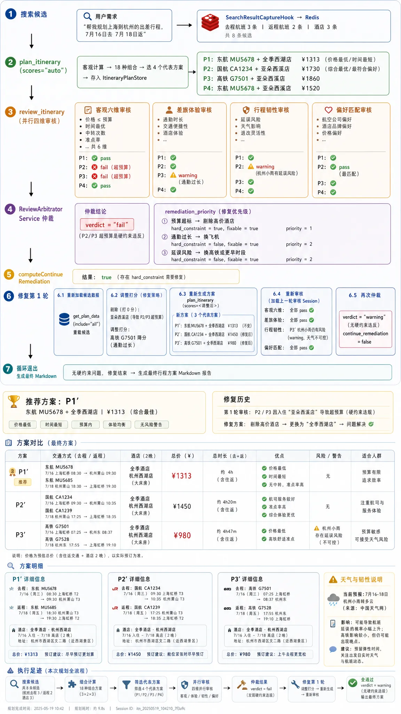

# ✅审核建议给出后如何优化给出新方案？

gogo-agent的整个流程是一个 "规划 → 审核 → 仲裁 → 修复 → 再审核" 的闭环，由 ItineraryPlanAgent 作为 LLM 驱动的主控代理，通过 prompt 指令编排，底层由代码层工具保证确定性。

整体流程



第一步/第二步：搜索候选+方案生成

`ItineraryPlanAgent` 按 `itinerary-plan-agent-system.md` 的 prompt 指令执行：

1. 搜索候选（去程交通、返程交通、酒店），`SearchResultCaptureHook` 自动将搜索结果写入 `SearchCandidateStore`
2. 调用 `plan_itinerary` 工具，它从 Redis 读取候选 + LLM 给出的偏好分，做纯客观计算（时间差、价格求和、min-max 归一化、政策校验、组合过滤、排序），选出 4 个代表方案
3. 结果自动存入 `ItineraryPlanStore`

第二步：多维审核（review_itinerary）

`ItineraryPlanAgent` 调用 `review_itinerary` 工具，这是整个流程的核心。审核编排器在代码层并行执行四条线。

1. **加载上一轮审核结果**：从 `ReviewResultSessionStore` 按 sessionId 读取（跨轮记忆）
2. **客观六维校验**（`ObjectiveReviewEngine`）：行程完整性、时间合理性、出发目的地、预算合规、舱位合规、路径合理性 — 纯代码，无 LLM
3. **三个主观 LLM 评估器并行**（`runSubjectiveFanout`）：
4. `TripExperienceAssessor`：通勤强度、行程节奏、餐食休息、路径绕路
5. `ResilienceAssessor`：天气影响、航班延误风险、旺季影响、缓冲时间
6. `PreferenceAssessor`：用户画像/偏好匹配度
7. 通过 `Pipelines.fanout()` 实现真正并行执行
8. **硬约束一票否决**：如果客观审核 verdict=fail，直接标记 `hardVetoed=true`
9. **仲裁**：调用 `ReviewArbitratorService` 汇总全部结果，生成结构化整改单

审核报告：

```json
{
  "verdict": "pass|warning|fail",
  "hard_vetoed": false,
  "continue_remediation": true,
  "dimensions": [
    { "source": "objective", "label": "客观审核（六维确定性校验）", "verdict": "pass", "issues": [], "suggestions": [] },
    { "source": "experience", "label": "差旅体验审核", "verdict": "warning", "issues": ["..."], "suggestions": ["..."] },
    { "source": "resilience", "label": "行程韧性审核", "verdict": "warning", "issues": ["..."], "suggestions": ["..."] },
    { "source": "preference", "label": "偏好匹配审核", "verdict": "pass", "issues": [], "suggestions": [] }
  ],
  "best_proposal_id": "P1",
  "arbitration": { "recommended_proposal_id": "P1", "remediation_priority": [ ... ] },
  "elapsed_ms": 12345
}
```

第三步：仲裁生成整改单

`ReviewArbitratorService` 将四维审核结果拼接成提示词，交给 LLM 仲裁器（prompt: `review-arbitrator.md`），输出结构化 JSON：

```json

{
  "verdict": "fail",
  "issues": [
    "[硬约束] 方案P3 总价 ¥2560 超出预算上限 ¥2000（28%）",
    "方案P2 去程航班为红眼航班（23:30出发）"
  ],
  "suggestions": [
    "方案P3: 将酒店从亚朵西溪替换为全季酒店，可降低 ¥360",
    "方案P2: 将去程航班改为次日 07:00-08:00 时段的早班航班"
  ],
  "details": {
    "recommended_proposal_id": "P1",
    "remediation_priority": [
      {
        "priority": 1,
        "issue": "预算超标",
        "action": "替换高价酒店或改经济舱",
        "hard_constraint": true,
        "fixable_by_replanning": true,
        "affected_proposals": ["P3"]
      },
      {
        "priority": 2,
        "issue": "红眼航班",
        "action": "改为早班航班",
        "hard_constraint": false,
        "fixable_by_replanning": true,
        "affected_proposals": ["P2"]
      },
      {
        "priority": 3,
        "issue": "距出发仅2天，政策要求提前3天预订",
        "action": "向审批人说明情况申请豁免",
        "hard_constraint": false,
        "fixable_by_replanning": false,
        "affected_proposals": ["P1","P2","P3"]
      }
    ],
    "next_action": "fix_and_replan",
    "continue_remediation": true
  }
}
```

| 字段 | 类型 | 说明 |
| --- | --- | --- |
| `hard_constraint` | boolean | 是否违反政策/法规（硬约束） |
| `fixable_by_replanning` | boolean | 是否能通过重新选择交通/酒店候选解决 |
| `priority` | int (1-5) | 越小越紧急 |
| `affected_proposals` | array | 受影响的方案 ID 列表 |

仲裁器还接收**上一轮审核结果**作为上下文，确保跨轮建议一致性（不矛盾、不漂移标准）。

- **硬约束优先**：客观审核 fail 时，整体 verdict 必须为 fail，不可被主观评估覆盖
- **综合判定**：全 pass → pass；有 warning 无 fail → warning；任意 fail → fail
- **问题去重归并**：不同维度可能报告同一问题，合并为一条，按严重程度排序
- **可修复性判定**：每条整改项必须标注 `fixable_by_replanning`，编排器代码层依据此字段决定是否触发修复循环

第四步：代码层判定是否继续修复

`computeContinueRemediation()` 是纯代码逻辑，覆盖 LLM 填写的 `continue_remediation` 字段：

| 条件 | 是否继续修复 |
| --- | --- |
| verdict =`fail` | ✅ 必须 |
| remediation_priority 中存在`hard_constraint=true` | ✅ 必须 |
| 推荐方案存在`fixable_by_replanning=true`且`priority≤3` | ✅ 必须 |
| `fixable_by_replanning=true`且`priority≤3`的项 ≥2 个 | ✅ 必须 |
| 仅剩`fixable_by_replanning=false`的 warning | ❌ 终止 |
| 仅剩`priority≥4`的软约束 warning | ❌ 终止 |

第五步：修复执行（最多 2 轮）

当 `continue_remediation=true`，`ItineraryPlanAgent` 按 prompt 指令执行修复：

**加载上一轮数据**

调用 `get_candidates` 从 Redis 重新加载：

- `SearchCandidateStore` → 完整候选列表（交通 + 酒店）

**根据 remediation_priority 的 action 执行不同修复策略**

| action 类型 | 执行操作 | 示例 |
| --- | --- | --- |
| **补搜** | 候选池中不存在满足条件的选项时，重新调用搜索 skill 搜索新候选，新结果自动合并到 Redis，然后`plan_itinerary(scores="auto")`重跑 | 审核建议"改为 09:00 后的航班"，但候选池中没有 → 重新搜索 |
| **剔除** | 将导致硬约束违反的候选打 0 分（不参与评选），其余正常打分，`plan_itinerary(scores=<调整后JSON>)`重跑 | 方案 P3 酒店超预算 → 该酒店打 0 分 |
| **调整打分** | 对候选重新打分以反映审核建议方向，`plan_itinerary(scores=<调整后JSON>)`重跑 | 审核建议避免红眼航班 → 红眼航班降分 |

**重跑 + 再审核**

- 调用 `plan_itinerary` ，传入scores字段，生成新方案
- 调用 `review_itinerary` 再次审核
- 审核编排器自动从 Session 加载上一轮审核结果，确保建议方向一致

**跨轮一致性保障**

`ReviewResultSessionStore` 在每次 `review_itinerary` 执行后保存审核报告，下一轮审核时自动加载。仲裁器 prompt 中明确要求：

1. 建议方向保持一致，不得给出矛盾建议
2. 认可已完成的修复，不重复提出相同建议
3. 补充而非推翻，在上轮建议基础上细化
4. 禁止标准漂移，同一问题的严重程度判定标准不得随意升降

第六步：循环退出与最终输出

当满足以下任一条件时退出循环：

- `continue_remediation = false`
- 已达到最大 2 轮修复

退出后，`ItineraryPlanAgent` 生成 Markdown 输出，包含：

- 🏆 推荐方案（置顶）
- 📋 方案对比表（初稿 + 修复版）
- 🔍 方案明细（含未通过原因和修复结果）
- 🧭 评估足迹（搜索/组合/筛选/审核修复的量化数据）

---

来源: https://thoughts.aliyun.com/workspaces/6963289eb0fc2e001bb052eb/docs/6a840fe6c71a890001a01ca4
