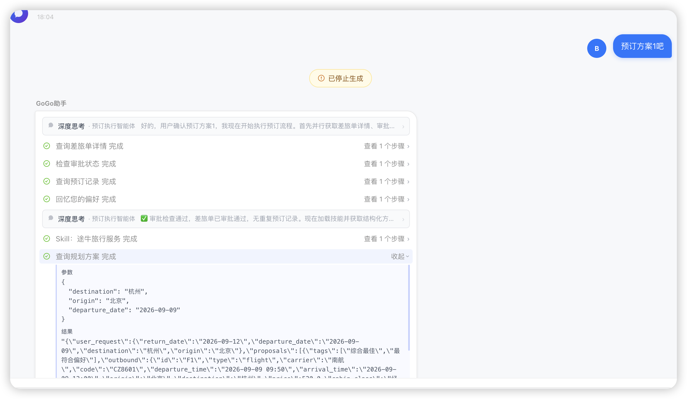

# ✅预订Agent如何获取方案做预订？

正常来说，预订Agent的内容是由MasterAgent传递的，而MasterAgent是能拿到PlanAgent给出的方案的完整内容的。

但是我们前面不是介绍过一种极端case么，在一些小概率情况下会导致MasterAgent看不到完整方案：

那我们就需要像上面这篇内容一样，解决这个问题。那思路也很简单。既然Agent上下文传递不可靠，那我们还是用工具传递好了。

于是，我们把原来的ItineraryPlannerTools给他拆一下，把规划的方法留着，把两个查询方法独立出来，作为一个ItineraryPlanReadTools工具，专门提供get_candidates和get_proposals方法。

然后再把这个工具注册给BookingAgent：

```text
toolkit.registration().tool(itineraryPlanReadTools).apply();
```

并且，我们要在提示词中约束bookingAgent来使用这个方法：

```text
1. **你只在用户明确确认方案后才执行预订**：MasterAgent 会将用户的确认指令（如"确认P1""就选推荐方案""帮我定了"）传递给你，你需要从中理解用户选定了哪个方案。确认消息往往只含方案编号或概要描述，方案详情必须通过第 2 条获取。
2. **获取结构化方案（强制）**：下单前必须调用 `get_proposals(origin, destination, departure_date)` 取回规划阶段保存的结构化方案：返回 `user_request`（出发地/目的地/日期）与 `proposals`（各方案去程/返程交通与酒店的完整明细），按用户选定的方案编号（如 P1）定位内容，作为下单参数的唯一依据：
   - 入参 origin / destination / departure_date 从确认消息或差旅单查询结果中获取。
   - 消息中的文字描述仅用于理解用户意图，下单参数一律以 `get_proposals` 返回的结构化明细为准；两者不一致时，以结构化结果为准，并在下单前向用户简要复述将要预订的内容。
   - 若返回无规划结果（方案已过期或未规划过）：告知用户方案数据已失效、需要重新规划，禁止凭消息概要或记忆拼凑下单参数。
   - 例外：用户已明确给出完整预订要素（如具体航班号+日期、车次+日期、酒店名+入住/离店日期）的单点预订，可不调用 `get_proposals`。
3
```

这样在执行预订的时候，bookingAgent就能自己去查询方案了：



---

来源: https://thoughts.aliyun.com/workspaces/6963289eb0fc2e001bb052eb/docs/6a9be8b7a7c8ff0001472242
