# ✅行程预订的下单结果持久化方案

**CLI 下单成功后，订单信息怎么可靠地进数据库？**

一个天真的做法是：让 LLM 下单成功后，再调一个「保存订单」的 Java 工具。但这很脆弱——模型可能忘了调、可能把参数填错、还白白多消耗一轮推理和 token。

gogo-agent 的做法是**在框架层用 Hook 拦截 shell 执行结果，对 LLM 完全透明地自动落库**。BookingPersistenceHook 监听 PostActingEvent（工具执行完成后触发）

```text
@Override
public <T extends HookEvent> Mono<T> onEvent(T event) {
    if (event instanceof PostActingEvent postActing) {
        try {
            handlePostActing(postActing);
        } catch (Exception e) {
            logger.error("[BookingPersistence] 预订记录落库异常", e);  // 落库失败不得影响主流程
        }
    }
    return Mono.just(event);
}
```

它的处理流程是：

**第一步，识别是不是下单/取消命令。** 用命令字符串匹配来判断操作类型和业务类型：

```text
private static final String CMD_FLIGHT_CREATE = "call flight saveOrder";
private static final String CMD_HOTEL_CREATE  = "call hotel tuniuHotelCreateOrder";
private static final String CMD_TRAIN_CREATE  = "call train bookTrain";
private static final String CMD_FLIGHT_CANCEL = "call flight cancelOrder";
private static final String CMD_TRAIN_CANCEL  = "call train cancelOrder";
// resolveOp(command)：命令含哪个片段 → 返回 (CREATE/CANCEL, FLIGHT/HOTEL/TRAIN)；非预订命令返回 null
```

不是预订命令就直接跳过，所以 cat、ls 这些辅助命令不受影响。

**第二步，只在成功时同步，且能解开 MCP 嵌套结构。** 途牛 CLI 返回的业务 JSON 有时被包在 MCP 的 content[].text 字符串里，Hook 会先解包再取外部单号：

```text
// 业务结果通常在 result 内层
JSONObject result = resultJson.getJSONObject("result");
if (result == null) result = resultJson;
result = unwrapMcpContent(result);   // 解开 content[].text 里的嵌套业务 JSON

// 容错多种字段命名提取外部单号
String externalOrderNo = firstString(result,
        "orderId", "orderNo", "mainOrderNo", "bookingOrderId", "order_id");
if (externalOrderNo == null || externalOrderNo.isBlank()) return;  // 没单号不落库
```

**第三步，组装 BookingRecord，幂等落库。** 从会话上下文拿 userId、travelOrderId（关联到差旅单），新订单状态一律 CREATED + paymentStatus=UNPAID；落库前先按「平台+类型+外部单号」查重，保证幂等：

```text
// 幂等：同平台 + 类型 + 外部单号已存在则不重复落库
if (bookingRecordRepository.findByExternalOrder(PLATFORM_TUNIU, bizType, externalOrderNo).isPresent()) {
    return;
}
BookingRecord record = new BookingRecord();
record.setUserId(userId);
// 关联差旅单
record.setTravelOrderId(resolveTravelOrderId(sessionCtx, memory));
record.setBizType(bizType);
record.setPlatform(PLATFORM_TUNIU);
record.setExternalOrderNo(externalOrderNo);
record.setStatus(BookingStatus.CREATED);
record.setPaymentStatus("UNPAID");
record.setBookedAt(Instant.now());
// 从下单入参补全标题/时间/联系人/金额
enrichFromArgs(record, bizType, args);   
bookingRecordRepository.save(record);
```

注意 enrichFromArgs——它从 CLI 命令里 -a '&#123;...&#125;' 那段入参 JSON 里回填展示字段（机票的出发到达城市+航班号、酒店的入离店日期、火车的车次价格、联系人等）。也就是说，展示信息不依赖平台返回，而是从「我们发出去的下单请求」里取，更可控。

**各平台返回结构差异收敛在本 Hook（Java 侧适配），skill 保持工具无关。对 LLM 完全透明，不占用 token。** 也就是说，脏活累活（解析五花八门的平台返回、字段容错、落库幂等）都由 Java Hook 扛下，技能文档保持纯净，LLM 也不用操心落库这件事。

resolveTravelOrderIdresolveTravelOrderId这个是获取travelOrderId的主要方法。我们需要在预订单上面把对应的差旅单号也保存上，这样我们才能在差旅单上反向看到对应的预订记录。

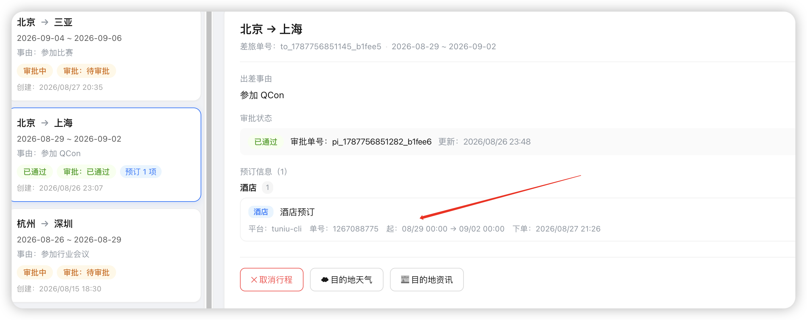

那么，这个travelOrderId怎么实现呢？

最容易想到的方案是从sessionCtx中读取：

```text
private String resolveTravelOrderId(AgentSessionContext sessionCtx, Memory memory) {    // 优先取上下文中由 Tool 主动设置的值    String travelOrderId = sessionCtx.getTravelOrderId();    if (travelOrderId != null && !travelOrderId.isBlank()) {        return travelOrderId;    }}


Plain Text
```

sessionCtx中的travelOrderId在以下几个地方保存的：

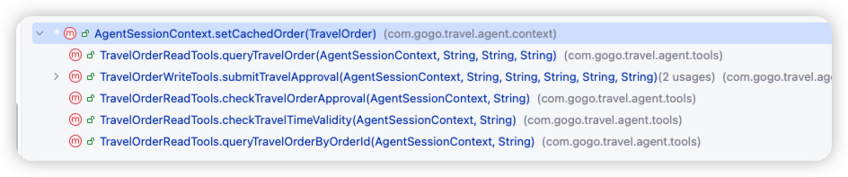

其实就是Agent在调用对应的方法（queryTravelOrderByOrderId、checkTravelOrderApproval）的时候，保存进去的。

这么做的话，大多数情况下是可以的，比如：

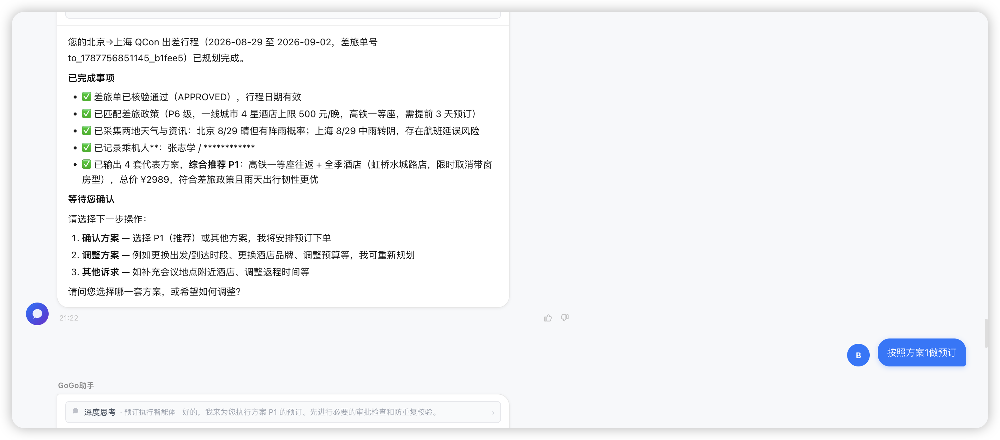

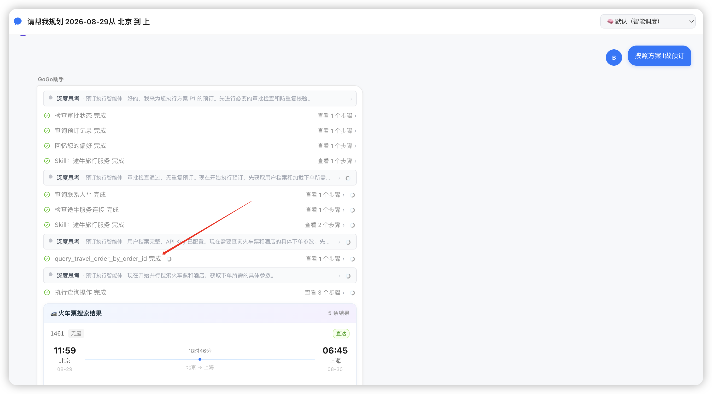

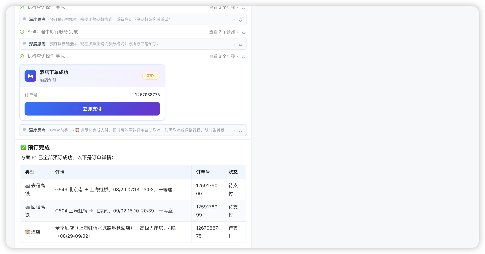

这样的对话流程下，是可以保存成功的。

但是，如果是下面这种对话流程就会有问题：

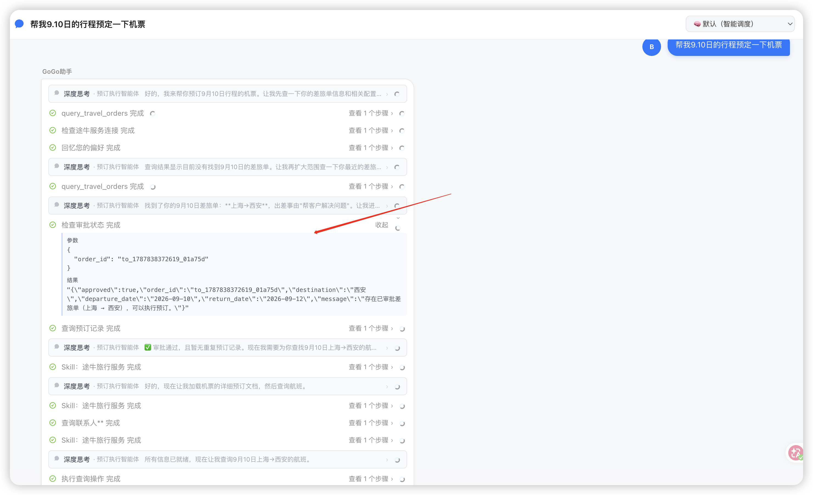

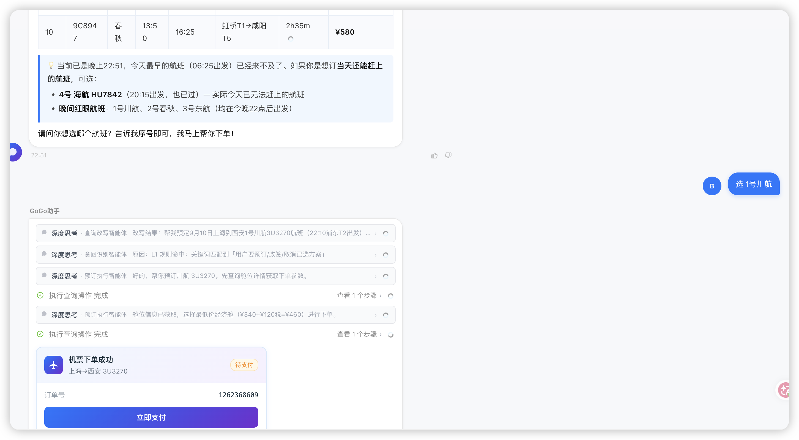

这种情况，预订单会创建成功，但是traverOrderId是空的：

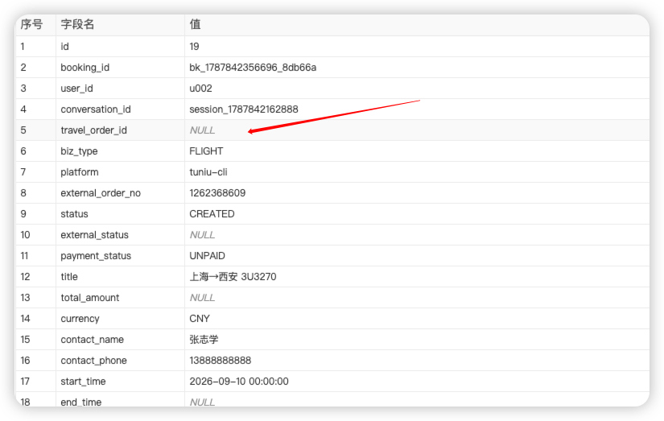

主要原因是，第一次对话的时候，调用了checkTravelOrderApproval吧travelOrderId保存到了sessionCtx中，但是对话结束之后，用户说【选1号川航】发起了第二次对话。第二次对话过程中，并没有调用任何能保存sessionCtx的过程。而上一次保存的那个sessionCtx，因为线程是新的，所以也没了。

那这个问题要解决的话，也是有办法的。

那就是，虽然在这一轮的对话中没有queryTravelOrderByOrderId、checkTravelOrderApproval等的调用，但是session中是有的呀。所以，我们可以在hook中从session中获取。于是我们就增加了以下补偿逻辑：

```text
/**
 * 解析关联的差旅单 ID。优先取会话上下文中的值（由 Tool 主动设置）；
 * 若为 null 则回溯 Memory 会话历史，按优先级从差旅单工具调用结果中提取 orderId。
 *
 * <p>回溯优先级：
 * <ol>
 *   <li>{@code check_travel_order_approval} → 预订前审批校验，入参 {@code order_id}
 *       即为本次预订关联的差旅单，确定性最高</li>
 *   <li>{@code query_travel_order_by_order_id} → 按单号精确查询，入参 {@code order_id}
 *       为用户明确指定的差旅单</li>
 * </ol>
 *
 * <p>优势：不依赖 LLM 调用顺序（Memory 里一定有历史）、无需 DB 查询、
 * 所有预订类型通用（机票/酒店/火车票）、准确关联最近一次差旅单操作。
 */
private String resolveTravelOrderId(AgentSessionContext sessionCtx, Memory memory) {
    // 优先取上下文中由 Tool 主动设置的值
    String travelOrderId = sessionCtx.getTravelOrderId();
    if (travelOrderId != null && !travelOrderId.isBlank()) {
        return travelOrderId;
    }

    // 兜底：从 Memory 会话历史中回溯，按优先级依次查找
    return extractTravelOrderIdFromMemory(memory);
}

/**
 * 从 Memory 会话历史中逆向扫描，按优先级从工具入参中提取差旅单 ID。
 *
 * <p>第一优先级：{@code check_travel_order_approval}（预订前审批校验，确定性最高）；
 * 第二优先级：{@code query_travel_order_by_order_id}（按单号精确查询）。
 *
 * <p>两个工具的入参均包含 {@code order_id}，直接从 ToolUseBlock 入参取值，
 * 不依赖结果 JSON 结构，可靠性最高。
 */
private String extractTravelOrderIdFromMemory(Memory memory) {
    if (memory == null) {
        return null;
    }
    List<Msg> messages = memory.getMessages();
    if (messages == null || messages.isEmpty()) {
        return null;
    }

    // 按优先级依次查找：先 check_travel_order_approval，再 query_travel_order_by_order_id
    String[] toolPriority = {"check_travel_order_approval", "query_travel_order_by_order_id"};

    for (String targetTool : toolPriority) {
        String orderId = findOrderIdFromToolInput(messages, targetTool);
        if (orderId != null && !orderId.isBlank()) {
            logger.info("[BookingPersistence] 从 Memory 回溯到差旅单ID, tool={}, orderId={}",
                    targetTool, orderId);
            return orderId;
        }
    }

    logger.info("[BookingPersistence] Memory 中未找到差旅单工具调用记录");
    return null;
}

/** 从消息列表中逆向查找指定工具的最近一次调用入参，提取 order_id。 */
private String findOrderIdFromToolInput(List<Msg> messages, String toolName) {
    for (int i = messages.size() - 1; i >= 0; i--) {
        Msg msg = messages.get(i);
        List<ContentBlock> blocks = msg.getContent();
        if (blocks == null) {
            continue;
        }
        for (ContentBlock block : blocks) {
            if (block instanceof ToolUseBlock toolUse && toolName.equals(toolUse.getName())) {
                String orderId = extractOrderIdFromInput(toolUse);
                if (orderId != null && !orderId.isBlank()) {
                    return orderId;
                }
            }
        }
    }
    return null;
}

/**
 * 从工具的 {@link ToolUseBlock} 入参中提取 {@code order_id}。
 *
 * <p>{@code check_travel_order_approval} 和 {@code query_travel_order_by_order_id}
 * 的入参均为 {@code {"order_id":"to_xxx"}}，格式固定，可靠性高。
 */
private String extractOrderIdFromInput(ToolUseBlock toolUse) {
    Map<String, Object> input = toolUse.getInput();
    if (input == null) {
        return null;
    }
    Object orderId = input.get("order_id");
    return orderId != null ? orderId.toString() : null;
}
```

这么改完之后，同样的对话流程：

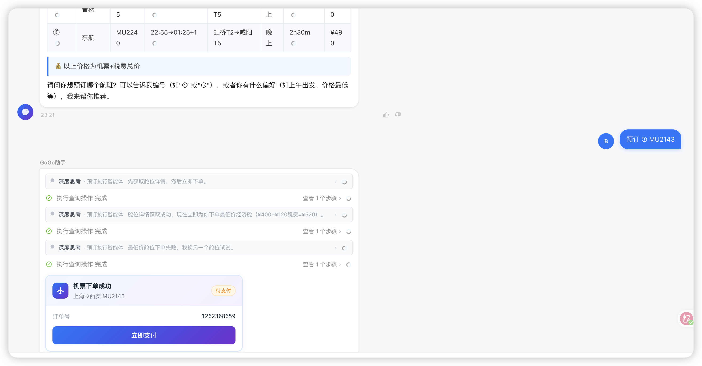

这次就能保存成功了

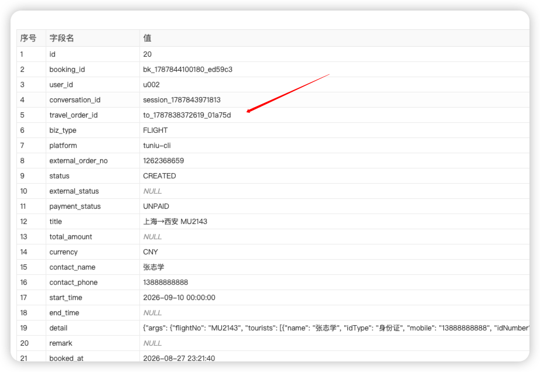

对应的日志：

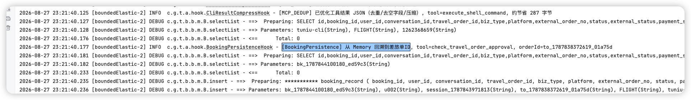

---

来源: https://thoughts.aliyun.com/workspaces/6963289eb0fc2e001bb052eb/docs/6a90564674e403000113219d
