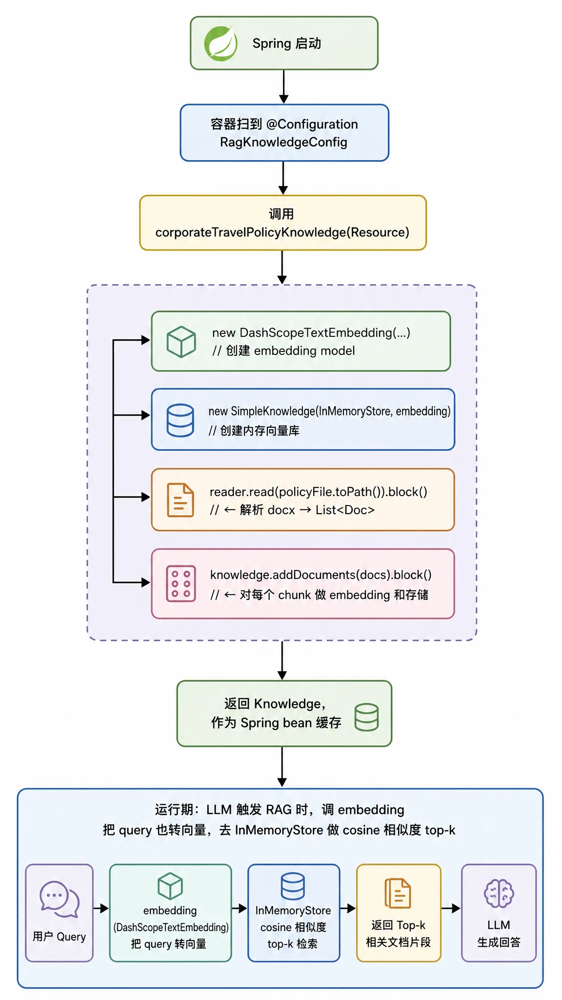

# ✅差旅政策知识库定义及开发

假设我们**只有** PolicyTools（前一篇讲过的工具），会出什么问题？

- 用户问："差旅管理制度对超标住宿是怎么规定的？"——这是语义问题，答案在几百字的段落里，工具返回的 JSON 数字根本回答不了。
- 用户问："差旅报销要走什么流程？"——完全跟"我是谁 / 去哪座城"无关，走工具查库没意义。
- 用户问："出差期间发生医疗紧急情况怎么处理？"——这是**行为准则**，不在政策表格里。

这类问题的共性是：**语义 + 长文本 + 与用户身份无关**。这时把政策 Word 文档灌进 RAG，用 embedding 做相似度检索、把最相关的几段丢给 LLM 组织语言，比任何工具都自然。

而反过来，"我 P7 去深圳的住宿标准是多少？"——RAG 的回答只能是"根据政策文档，一般在 X 元左右"，而没法直接给出精确的 500 元/晚——**这时才是工具通道的活儿**。

一句话概括：**知识库补齐了 LLM 对"公司政策语料"的缺失，而工具补齐了 LLM 对"实时业务数据"的缺失**。

差旅政策、差旅指南是两份 Word 文档，体量小、随应用发版更新，适合在**启动时**读进来、就地向量化、存到进程内存。相关文档我们直接放到了代码中：

```text
src/main/resources/dataset/
├── business_travel_policy.docx        21,064 B  ← 差旅政策
└── business_travel_guidelines.docx    18,353 B  ← 差旅注意事项 / 行为准则
```

ataset/ 直接放在 classpath 下、进版本管理。这样做的三个隐含好处：

1. 语料修改和代码提交挂在同一次 PR 里，review 时能一眼看到"改了政策 X"。
2. 部署包自带语料，没有额外的资源同步流程。
3. 单测/CI 环境天然可用，不依赖任何外部索引服务。

代价也很直接：**语料一改就必须发版**——不适合"政策频繁变动、非技术同学也要能改"的场景。

**知识库定义**

知识库的初始化流程如下：



**corporateTravelPolicyKnowledge**

```text
@Bean(name = "corporateTravelPolicyKnowledge")
public Knowledge corporateTravelPolicyKnowledge(
        @Value("classpath:dataset/business_travel_policy.docx") Resource policyResource) {

    // 1) embedding 模型：DashScope text-embedding-v4
    DashScopeTextEmbedding embedding = DashScopeTextEmbedding.builder()
            .modelName("text-embedding-v4")
            .apiKey(apiKey).build();

    // 2) 知识库 = 内存向量库 + embedding 模型
    SimpleKnowledge knowledge = SimpleKnowledge.builder()
            .embeddingStore(InMemoryStore.builder().build())
            .embeddingModel(embedding)
            .build();

    // 3) 读 docx → 切片 → 灌库（block() 阻塞等待，确保 Bean 就绪时数据已就位）
    WordReader reader = new WordReader();
    try {
        File policyFile = policyResource.getFile();
        List<Document> docs = reader.read(ReaderInput.fromPath(policyFile.toPath())).block();
        knowledge.addDocuments(docs).block();
    } catch (Exception e) {
        // 资源缺失或解析失败时主动抛错，提示开发者补齐语料 —— fail-fast
        throw new IllegalStateException(
                "从 classpath 读取 [dataset/business_travel_policy.docx] 失败，"
                + "请确认文件存在于 src/main/resources/dataset/ 目录下。", e);
    }

    return knowledge;
}
```

corporateTravelGuidelinesKnowledge（差旅指南库）是同一套模板，只是换了 business_travel_guidelines.docx。这里有三个值得学的工程细节：

- **文档摄取（ingestion）三步走**：WordReader.read(ReaderInput.fromPath(...)) 负责解析 Word 并切片成 List&lt;Document&gt;，knowledge.addDocuments(docs) 负责把每片做 embedding 并写入 InMemoryStore。切片、分块策略由 AgentScope 的 Reader 内部完成，业务侧不用操心。
- **.block()**** 的用意**：addDocuments 返回的是 Reactor 的 Mono，这里刻意阻塞。因为是在 Spring Bean 初始化阶段，必须保证 Bean 返回时知识库已经灌好，否则第一个请求会检索到空库。
- **fail-fast**：语料文件缺失时直接抛 IllegalStateException 让应用**起不来**，而不是静默降级。知识库是 InfoAgent 的立身之本，宁可启动就报错，也不要上线后才发现检索永远为空。

**两种 VDB 的取舍**：数据量大、独立于发版生命周期 → 托管（BailianKnowledge）；数据量小、随代码走、要求零外部依赖 → 内存（SimpleKnowledge + InMemoryStore）。gogo-agent 在同一个 Agent 上把两者混用，这正是 AgentScope Knowledge 抽象的价值——上层 Agent 根本不关心底层是云端还是内存。

把知识库挂到 Agent 上：.knowledge() + RAGMode.AGENTIC

三个 Knowledge Bean 通过 @Qualifier 注入进 InfoAgent，再在 build() 里一次性挂到 ReActAgent：

```text
@Configuration("infoAgentConfiguration")
public class InfoAgent extends BaseSubAgent {

    @Autowired @Qualifier("attractionKnowledge")
    protected Knowledge attractionKnowledge;
    @Autowired @Qualifier("corporateTravelPolicyKnowledge")
    protected Knowledge corporateTravelPolicyKnowledge;
    @Autowired @Qualifier("corporateTravelGuidelinesKnowledge")
    protected Knowledge corporateTravelGuidelinesKnowledge;

    @Bean(name = "infoAgent")
    @Scope("prototype")
    public ReActAgent build() {
        Toolkit toolkit = new Toolkit();
        // ... 注册 infoQueryTools / policyTools / 天气 MCP / 签证 MCP ...

        ReActAgent agent = ReActAgent.builder()
                .name("InfoAgent")
                .description("信息查询助手，负责查询差旅政策标准、目的地旅游景点、签证入境政策及通用公共信息")
                .model(stableModel)
                .toolkit(toolkit)
                // 三个知识库链式挂载，支持 fan-out 多库并行检索
                .knowledge(attractionKnowledge)
                .knowledge(corporateTravelPolicyKnowledge)
                .knowledge(corporateTravelGuidelinesKnowledge)
                .ragMode(RAGMode.AGENTIC)          // ← 关键：知识库以「工具」形式暴露
                .maxIters(MAX_ITERATIONS)          // 5
                .sysPrompt(PromptLoader.loadStatic("info-agent-system.md"))
                .build();

        return agent;
    }
}
```

这里最需要理解的是 **RAGMode.AGENTIC** 与另一种模式 GENERIC 的区别：

- **RAGMode.GENERIC****（自动注入）**：框架用一个 Hook 拦截每一轮推理，取最后一条 user 消息当 query，**无条件**先检索、把结果拼进上下文，再让模型回答。好处是简单，坏处是——用户随口问句「谢谢」也会触发一次向量检索，浪费 token 和延迟。
- **RAGMode.AGENTIC****（按需检索）**：框架把每个 Knowledge 包装成一个可调用的 @Tool（检索工具）交给模型。模型在 ReAct 循环里**自己决定**要不要检索、检索哪个库、用什么 query。问「上海有什么景点」它会去查景点库；问「你好」它直接回复不检索。

---

来源: https://thoughts.aliyun.com/workspaces/6963289eb0fc2e001bb052eb/docs/6a6af563d31fed0001d7646b
