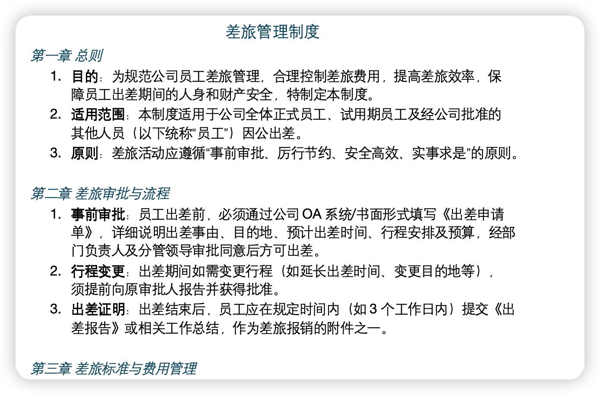
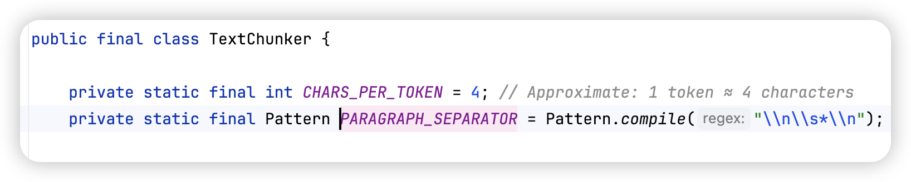
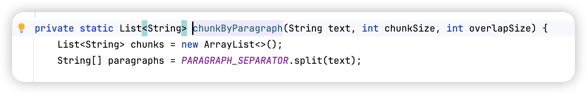
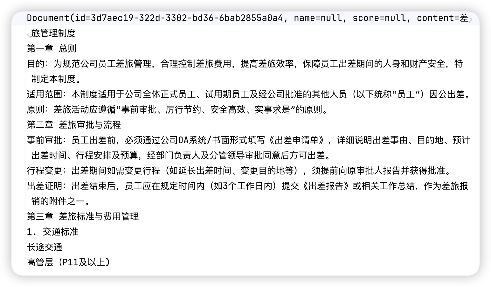
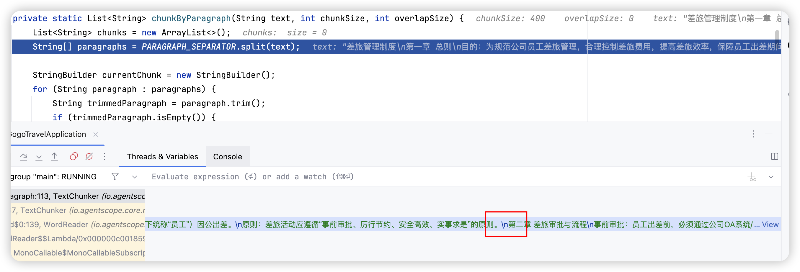

# ✅定义知识库chunsize并修复agentscope的bug

我们的差旅政策文档长这样：



我们使用的分段方式是`PARAGRAPH` 、chunksize设置的是300，案例来说 ，他应该在[第二章]之前帮我分段的，因为按照段落分段是遇到`\n\n` 就帮我分段，而且代码也是这么写的：





但是，实际运行的时候，是这么分的：



也就是说他没有按照段落帮我分段，而是按照我指定的300长度分了。

通过debug我们发现：**文档中明明有换行（Word 中按了两次回车），但解析后的 TextBlock 中段落间只有单个 ****`\n、`**。



这就导致`TextChunker.chunkByParagraph()` 的正则 `\n\s*\n`（双换行）匹配不到任何位置。那整个 TextBlock被视为一个"段落"，最终按字符数硬切。

根因分析

在 `.docx` 中，没有 `\n` 字符的概念。每次按下回车键，Word 会创建一个新的 `<w:p>` XML 元素（段落）。"空行"在 XML 中是一个空的 `<w:p>` 标签：

```xml
<w:p>
  <w:r><w:t>3.原则：差旅活动应遵循"事前审批"的原则。</w:t></w:r>
</w:p>
<w:p>
  <!-- 空段落：用户在 Word 中按了一次回车 -->
</w:p>
<w:p>
  <w:r><w:t>4.审批流程：所有出差须经部门经理审批。</w:t></w:r>
</w:p>
```

`WordReader.getDataBlocks()` 遍历所有段落时，对空段落的处理是**直接跳过**：

```java
// io.agentscope.core.rag.reader.WordReader
String text = extractTextFromParagraph(para);
if (text != null && !text.isEmpty()) {   // ← 空段落返回 ""，被过滤
    // 合并到上一个 TextBlock（用 \n 连接）
    lastBlock = lastBlock.getText() + "\n" + text;
}
// 空段落：什么都不做，直接跳过
```

导致合并结果：

```text
"3.原则：...的原则。\n第二章..."
                   ↑ 只有一个 \n，空行消失了
```

修复方案

创建 `FixedWordReader`，在空段落处理时追加一个 `\n` 而非跳过：

```java
// FixedWordReader.extractBlocks()
if (!text.isEmpty()) {
    // 非空段落：正常合并（与原版相同）
    lastBlock = lastBlock.getText() + "\n" + text;
} else {
    // ★ 修复点：空段落追加 \n，保留段落边界
    if (!blocks.isEmpty() && "text".equals(lastType)) {
        lastBlock = lastBlock.getText() + "\n";
    }
}
```

修复后合并结果：

```text

段落1(非空) + "\n" + 段落2(空 → "\n") + 段落3(非空)

→ "3.原则：...的原则。\n\n4.审批流程：..."
                   ↑↑ 两个 \n，TextChunker 可正确识别段落边界
```

chunksize设置

在修复后，问题就解决了，那么接下来我们可以根据文档设置chunksize了。

一开始针对差旅政策文档设置的是300的chunksize，因为我每一个分段分别看了下长度，最大的也就是200+，所以设置300刚好，每一个段落单独作为一个chunk。

但是分完段之后，我发现，表格被拆分了。

主要是因为我设置了separateTable为true，他会把识别到的表格解析成markdown类型，那么字符数就变多了。于是我重新调整了一下，把chunksize改成400，就合适了。

然后这样每一段就可以单独在一个chunk了，我最开始还设置了chunksize/10的overlap，后来干脆设置成0 了，按照段落分了，没必要加overlap了。

---

来源: https://thoughts.aliyun.com/workspaces/6963289eb0fc2e001bb052eb/docs/6a96f6a1c71a890001aee15c
