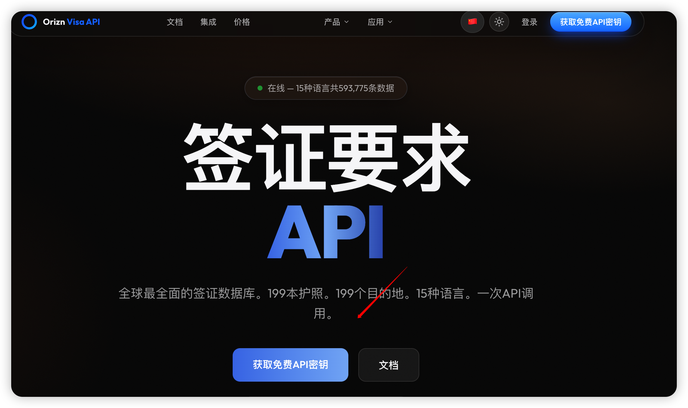

# ✅签证MCP的接入

签证政策有几个特点：

- **数据量大**：护照国 × 目的国 × 签证类型 × 过境场景，组合数成千上万。
- **更新频繁**：免签、落地签、电子签政策经常变，靠人工维护知识库成本高。
- **专业数据源**：Orizn 等签证数据服务已经把这些信息结构化好了，并且提供 MCP Server，Agent 可以直接调用。

gogo-agent 没有把签证数据自己录入 RAG，而是选择接入 **Orizn Visa MCP**：既省去了维护成本，又能通过 MCP 协议动态拿到工具列表，Agent 按需调用即可。

Orizn Visa MCP 是一个基于 MCP 协议的签证信息服务，通过 stdio 方式启动本地进程 npx -y orizn-visa-mcp 与 Agent 通信。它把签证相关的查询能力封装成一组工具，例如：

| 工具名 | 作用 | 是否需要 API Key |
| --- | --- | --- |
| quick_visa_check | 快速签证检查 | 否（免费） |
| check_visa_requirement | 查询签证详细要求 | 否（免费） |
| get_all_destinations | 查询可办签国家/地区 | 是 |
| get_visa_changes | 查询签证政策变更 | 是 |
| check_transit_visa | 查询中转签证规则 | 是 |
| get_coverage_stats | 查询签证数据覆盖情况 | 否（免费） |

数据来源覆盖约 39,585 个护照-目的地对，支持 15 种语言。

先申请一个Orizn的key： [https://visa.orizn.app/](https://visa.orizn.app/)



gogo-agent 把所有 MCP 相关的运行参数集中在 application.yml 的 app.orizn-mcp 节点下：

```text
# gogo-agent/src/main/resources/application.yml
app:
  orizn-mcp:
    # 启动命令（绝对路径优先，避免 PATH 找不到）。也可直接用 npx。
    command: ${ORIZN_MCP_COMMAND:npx}
    # 命令参数（逗号分隔）。默认 npx -y orizn-visa-mcp
    args: ${ORIZN_MCP_ARGS:-y,orizn-visa-mcp}
    # Orizn Visa API Key（env 形式注入子进程）。未配置时走免费模式，仅暴露两个免费工具
    api-key: ${ORIZN_API_KEY:orizn_visa_fb1896350b64d4d9ca0f9ae8b9532ad16d07685513568256}
    # MCP 工具白名单（逗号分隔）。
    # 留空则暴露 Orizn 服务端声明的全部工具（按需 + 免费）；
    # 非空则只向 LLM 暴露白名单内的工具，减少 Token 消耗。
    # 默认：仅暴露免费版可用的两个工具，避免调用付费工具时反复报错
    enabled-tools: ${ORIZN_MCP_ENABLED_TOOLS:quick_visa_check,check_visa_requirement}
    # MCP 初始化握手超时
    initialization-timeout-seconds: 20
    # 工具调用请求超时
    request-timeout-seconds: 30
```

app.orizn-mcp.enabled-tools 控制向 LLM 暴露哪些工具，避免 LLM 调用未授权/未付费的工具而反复报错，也减少 system prompt 里的工具描述长度。（MCP地址：[https://github.com/MattJeff/orizn-mcp-server](https://github.com/MattJeff/orizn-mcp-server) ）

OriznVisaMcpConfig 负责把配置参数翻译成一个 McpClientWrapper Spring bean：

```text
// gogo-agent/src/main/java/com/gogo/travel/config/OriznVisaMcpConfig.java
@Configuration
public class OriznVisaMcpConfig {

    @Value("${app.orizn-mcp.command:npx}")
    private String command;

    @Value("${app.orizn-mcp.args:-y,orizn-visa-mcp}")
    private String argsConfig;

    @Value("${app.orizn-mcp.api-key:}")
    private String apiKey;

    @Value("${app.orizn-mcp.initialization-timeout-seconds:20}")
    private long initializationTimeoutSeconds;

    @Value("${app.orizn-mcp.request-timeout-seconds:30}")
    private long requestTimeoutSeconds;

    @Bean(name = "oriznVisaMcpClient")
    public McpClientWrapper oriznVisaMcpClient() {
        try {
            List<String> args = argsConfig == null || argsConfig.isBlank()
                    ? List.of()
                    : List.of(argsConfig.split(",")).stream()
                            .map(String::trim)
                            .filter(s -> !s.isBlank())
                            .toList();

            // 把 API Key 注入子进程环境变量
            Map<String, String> env = new HashMap<>();
            if (apiKey != null && !apiKey.isBlank()) {
                env.put("ORIZN_API_KEY", apiKey);
            }

            McpClientWrapper client = McpClientBuilder.create("orizn-visa-mcp")
                    .stdioTransport(command, args, env)
                    .timeout(Duration.ofSeconds(requestTimeoutSeconds))
                    .initializationTimeout(Duration.ofSeconds(initializationTimeoutSeconds))
                    .buildAsync()
                    .block();

            return client;

        } catch (Exception e) {
            logger.warn("[OriznVisaMcp] Orizn Visa MCP 客户端初始化失败，签证查询将降级为内部 RAG 知识库。原因：{}",
                    e.getMessage());
            return null;
        }
    }
}
```

- **stdio 传输**：启动 npx -y orizn-visa-mcp 子进程，通过标准输入输出与 Agent 通信，不需要单独部署服务。
- **API Key 通过环境变量注入**：子进程启动时拿到 ORIZN_API_KEY，没有 Key 就走免费模式。
- **初始化失败返回 ****null**：如果 npx 不存在、网络不通或 Key 校验失败，不会阻塞应用启动，后续 Agent 会自动降级到内部 RAG。

InfoAgent、ItineraryPlanAgent 等子 Agent 都继承自 BaseSubAgent，签证 MCP 客户端和白名单在这里统一注入：

```text
// gogo-agent/src/main/java/com/gogo/travel/agent/BaseSubAgent.java
@Autowired(required = false)
@Qualifier("oriznVisaMcpClient")
@Nullable
protected McpClientWrapper oriznVisaMcpClient;

@Value("${app.orizn-mcp.enabled-tools:}")
protected List<String> oriznMcpEnabledTools;
```

```text
// gogo-agent/src/main/java/com/gogo/travel/agent/InfoAgent.java
toolkit.registration().mcpClient(oriznVisaMcpClient).enableTools(oriznMcpEnabledTools).apply();
```

```text
// gogo-agent/src/main/java/com/gogo/travel/agent/ItineraryPlanAgent.java
toolkit.registration().mcpClient(oriznVisaMcpClient).enableTools(oriznMcpEnabledTools).apply();
```

---

来源: https://thoughts.aliyun.com/workspaces/6963289eb0fc2e001bb052eb/docs/6a7da56f3fb9180001eaa3a3
