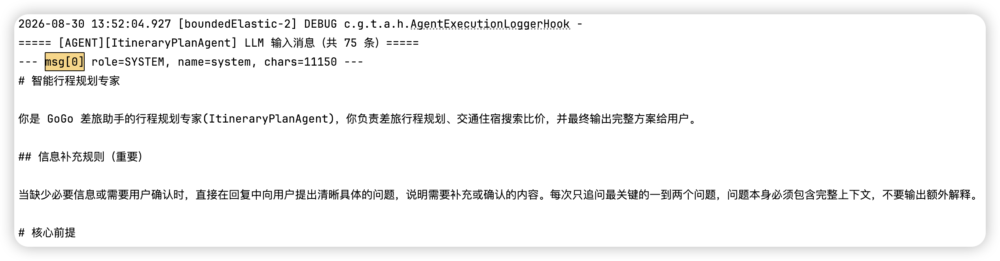
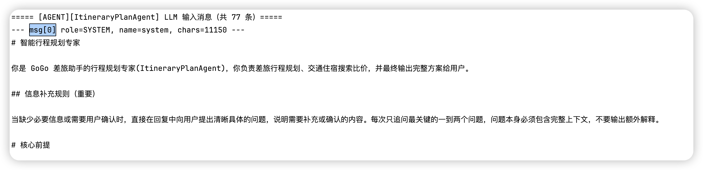
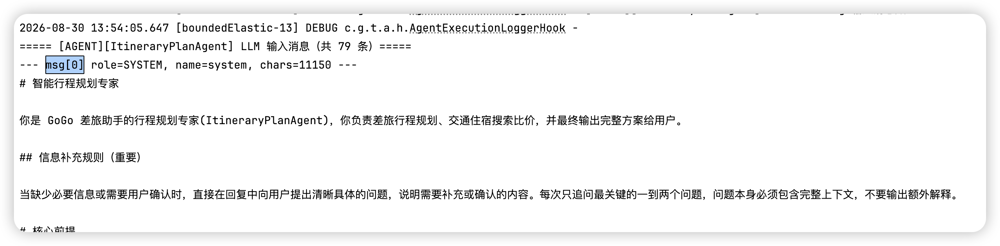
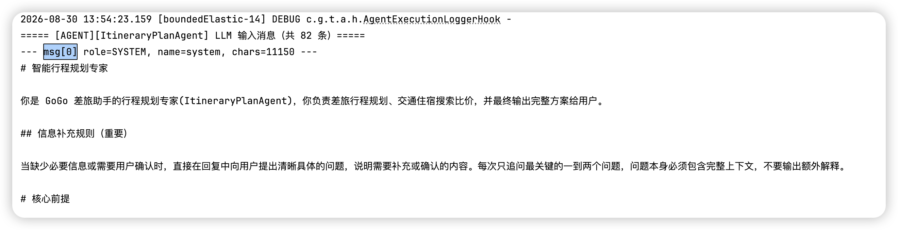

# ✅为什么要做上下文工程？

上下文工程，其实就是通过一些工程手段，来让LLM看到更加合适的内容。其实主要就是在不影响效果的情况下，尽量减少上下文的消耗。

我们的项目中有很多个智能体，我们拿执行链路最复杂的planAgent举例，如果不做任何上下文工程的话。

```text
//把原来的一些和上下文工程有关的hook都给他注释掉

ReActAgent agent = ReActAgent.builder()
        .name("ItineraryPlanAgent")
        .description("智能行程规划专家，负责方案生成、比价分析、审核修复闭环")
        .model(strongModelWithThinking)
//                .hooks(List.of(dynamicTimeInjectionHook, new AutoContextHook(), new PlanAwareThinkingHook(planNotebook, 2048), cliResultCompressHook, flightApiKeyHook, tuniuApiKeyHook, rghUserIsolationHook,
//                        skillContentCollapseHook, sessionPersistenceHook, executionLoggerHook, toolCircuitBreakerHook,
//                        progressNotifierHook, activeAgentPersistenceHook, searchResultCaptureHook,
//                        new TokenUsageHook(), new PendingToolRecoveryHook()))
        .hooks(List.of(flightApiKeyHook, tuniuApiKeyHook, rghUserIsolationHook,
                sessionPersistenceHook, executionLoggerHook, toolCircuitBreakerHook,
                progressNotifierHook, activeAgentPersistenceHook,
                new TokenUsageHook(), new PendingToolRecoveryHook()))
```

执行一次规划，大概消耗的token数是（给大家提供了一个TokenUsageHook，可以在运行结束后打印token使用量：`[TOKEN_USAGE] ItineraryPlanAgent 执行结束, 输入tokens=xxx` ）：

**输入tokens=1197837, 输出tokens=24119, 总计tokens=1221956 (审核后重新规划1次）**

如果我们做了上下文工程，具体的就是后面课程中我们要给大家讲的方案，总体的消耗token数是：

**输入tokens=684819, 输出tokens=11809, 总计tokens=696628 (审核后重新规划2次）**

token节省42%。按照qwen3.7-max的价格（12元/100万）来算的话14.4元讲到8.3元，一次省6块。。。。

为什么这么耗token

一次运行下来，共有82条消息，按照一轮消息大概2-3条记录（包括ASSISTANT、TOOL）来算的话，大概执行了35+次Loop

因为LLM每一次Loop的时候，都会把历史的消息都带上。你比如下面这几次调用的日志，可以看到，每次执行的时候他都会把前面的消息带上。









也就意味着，最后一条日志中的82条消息，包含了倒数第二条日志中的79条消息。倒数第二条的79条消息中包含了倒数第三条日志中的77条消息。也就意味着历史的消息在不断的累积和调用。

---

来源: https://thoughts.aliyun.com/workspaces/6963289eb0fc2e001bb052eb/docs/6a93c457a7c8ff00013fcfef
