# ✅如何实现流式断点续传？

我们的 DodoAgent 如果回答一个复杂问题，比如分析销售业绩这种问题，往往要跑几十秒：查表结构、写 SQL、执行查询、组织报告。这几十秒里用户不会一直干等着，切去看别的会话、切个浏览器标签，甚至把页面关了，都很正常。但我们原来 Agent 的行为是：连接一断，后端的执行跟着中断，答到一半的内容直接丢掉，用户回来什么都看不到。

交互上不得不提豆包，它的流式交互体验做得非常好，我们直接借鉴它的交互方案：页内切来切去不打断输出；断线了回来，从断的地方接着输出；页面关了重开，还能接着看那次没答完的回答。

现象与根因

Controller 把 agentx 框架返回的 Flux 直接交给 HTTP：


这里的上下游是按数据流的方向定义的：Agent 执行是上游，负责生产事件；HTTP 订阅和前端是下游，负责消费事件。数据从上游流向下游，而 cancel 是控制信号，方向正好相反，逆流而上：WebFlux 的规则是，前端一断开，HTTP 订阅层就取消自己的订阅，这个取消信号沿着订阅链一层层传回源头，Agent 的执行循环收到后就停止。打个比方，数据像河水从上游流向下游，下游喝水的人走了，取消信号逆流而上去通知上游关闸。执行和连接是绑死的，连接的生死决定了执行的生死。

除了关页面、断网这些操作，前端本身也有问题：原来的代码里，点击"新建会话"也会主动 abort 掉正在进行的请求。

整体思路

方案就是在前端和 agentx 框架之间加一层转发。但这层转发有两个特殊之处：

- **不怕断**：前端断开，它照样继续从框架收集流式事件；
- **留缓存**：转发过的事件都编上号、存进缓存，前端回来能从上次的位置补齐再接着看。

打个比方，直播大家都看过：Agent 就好比是主播，只管产出，不关心有没有人看；这层转发是直播服务器，负责缓存和分发；前端是观众，随时进出，中途退场直播不停，回来先看回放补进度，再接直播。


后端改造

事件编号与重放缓存

新增一个 LiveStreamRegistry，它就是前面比方里的"直播服务器"：内部是一张 ConcurrentHashMap，key 是会话 id，value 是这个会话当前进行中的那条流；一个会话同一时间只有一条进行中的流，流结束就从map表里删掉。一条流注册进来时，它就负责：给事件编号、缓存事件、驱动执行。

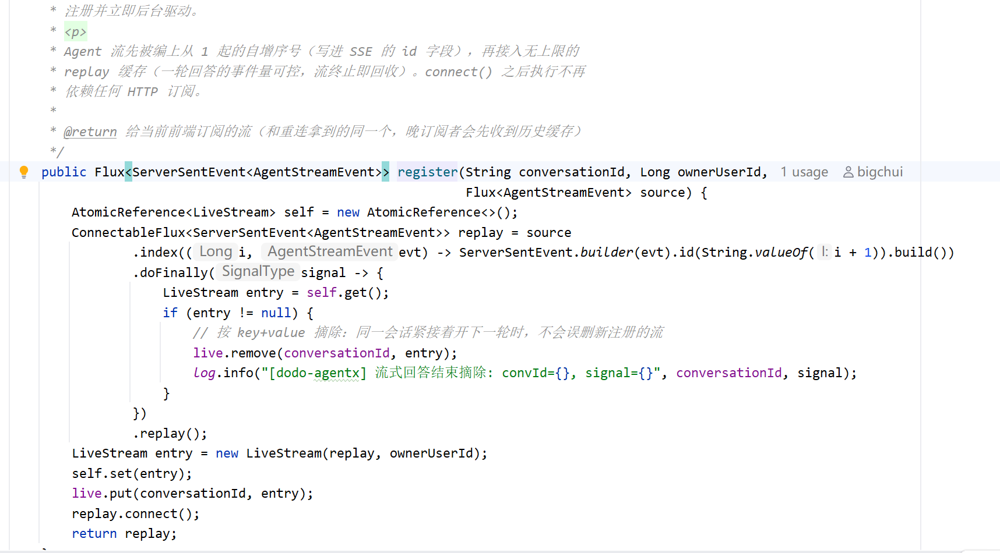

- `.index()` 是编号：给每个事件编上从 1 起的自增序号，写进 SSE 的 `id:` 字段。这是断点位置的依据，也是 SSE 协议标准的 Last-Event-ID 机制。比如前端收到第 57 号事件后断线，重连时就能明确报"我从 58 序号开始收"。
- `.replay()` 是缓存和回放：把流变成可重放的，晚来的订阅者会先收到全部历史缓存，再续实时尾流，相当于新进直播间的观众先把回放看完再接直播。
- `connect()` 是开播：注册完立即驱动，Agent 流马上开始执行，和有没有 HTTP 订阅无关。前端断开只是取消了它自己的订阅，执行照常跑、事件照常进缓存，这是整个方案的基础。
- `doFinally` 是清理：流结束（完成/出错/被停止）时从注册表摘除，用 key+value 匹配防止同一会话紧接着开下一轮时误删。

恢复请求

ChatRequest 加两个字段：`recovery`（是否恢复请求）和 `startSeq`（从第几个事件开始收）。

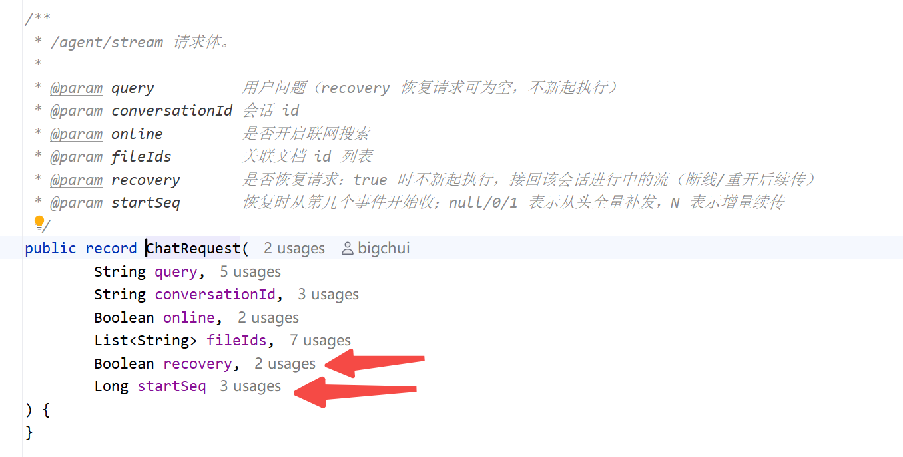

Controller 的分支逻辑：

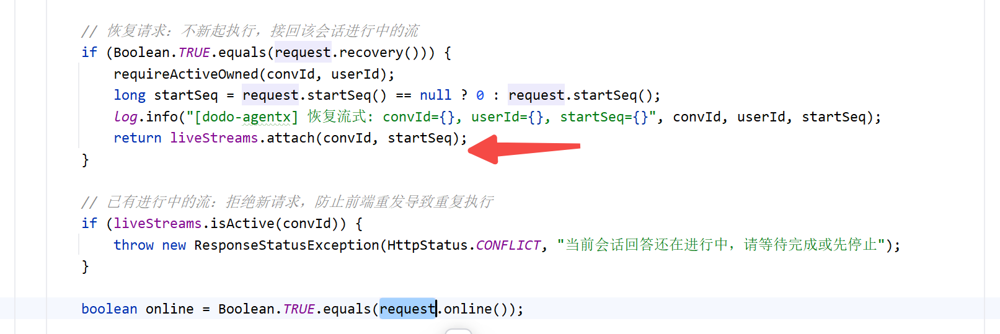

attach 的实现其实就一个 skipUntil：

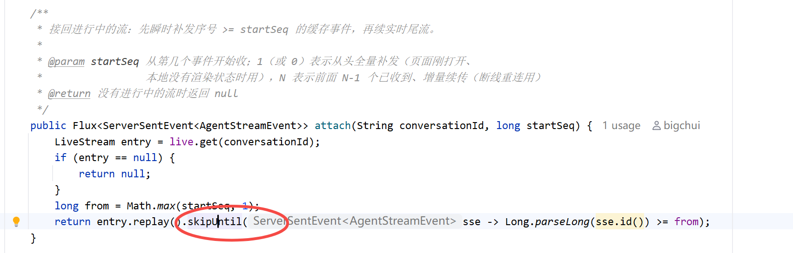

replay 的习惯是从头把缓存全部给晚来的订阅者，skipUntil 相当于在门口检票：排在第 startSeq 号之前的都拦住，从 startSeq 号开始放行。startSeq=1 就是全量补发，startSeq=58 就是跳过前 57 个增量续传，一个方法通吃两个场景。

AgentController 再加一个探测接口，进入前端页面的时候判断一下，这个会话是不是还在跑：

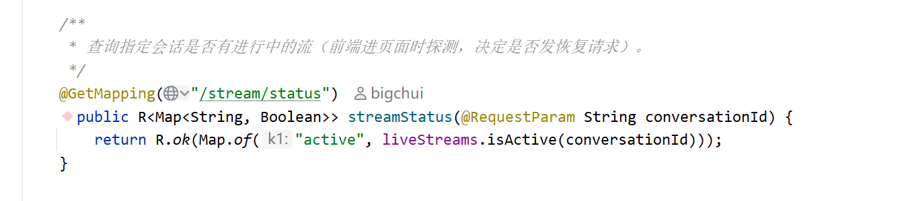

配套改动

会话列表查询接口，我们需要给每个会话带上 streaming 字段，侧栏就能显示"生成中"。另外前端断开时服务端往死连接写事件会抛 IOException，属于预期现象，在全局异常处理器里沿异常链识别出客户端断开后，降成一行 warn，不再刷 ERROR 堆栈。

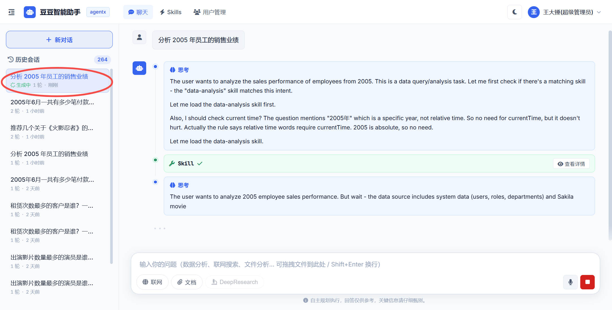

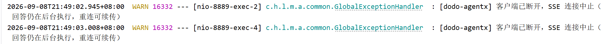

前端改造

流不绑在页面上

页内所有进行中的流放进一张全局表 liveStreams，按 conversationId 组织，每条记录消息对象、请求控制器和游标。切历史会话、新建会话都只是视图切换，流继续在表里跑、继续往消息对象上追加；切回来时重新渲染这条消息就接上了，这边的逻辑后端不参与。

游标记录与去重

收到每个事件时记序号，两行核心逻辑：

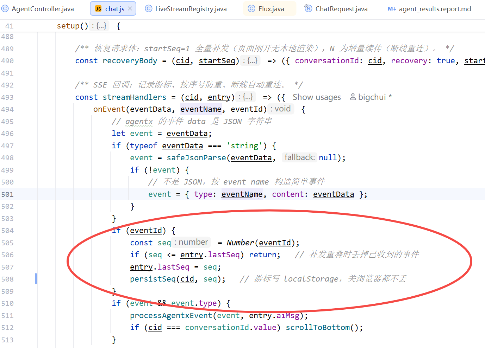

重连补发和实时尾流可能有一瞬间交叠，序号小于等于已记录的直接丢弃，保证文本不会拼接重复。

自动重连

连接出错时判断要不要重连：

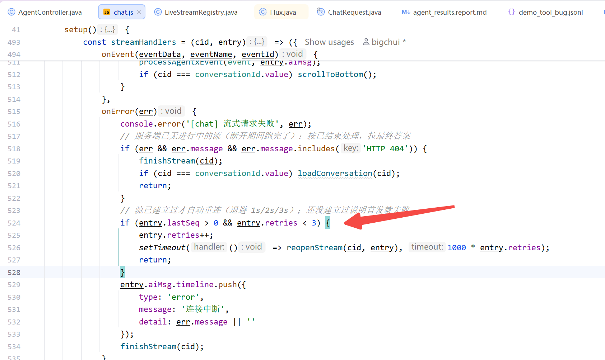

重连就是重发带游标的恢复请求：

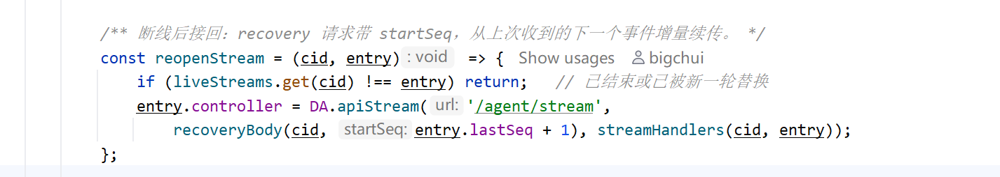

`startSeq = lastSeq + 1`，从上次收到的下一个事件增量续传。整体流程：


进页面恢复

页面刷新或重开时，本地渲染状态全没了，所以要探测加全量补发：

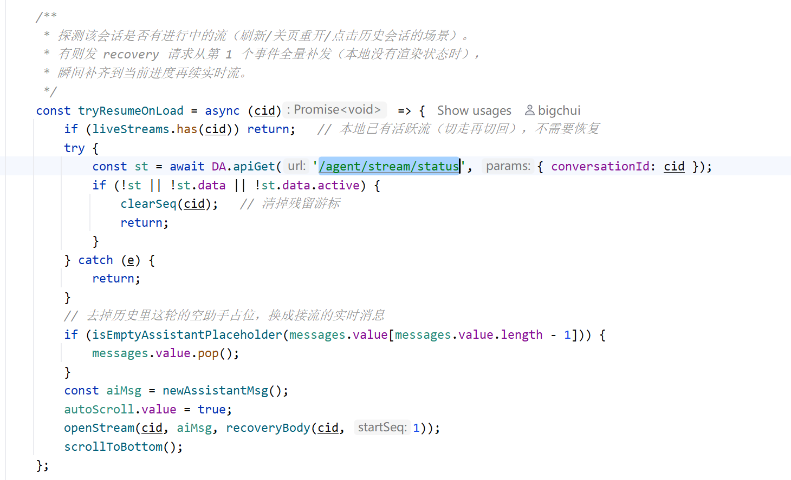

startSeq=1 从头补齐到当前进度，正好对应"关页重开"那个场景。另外发送瞬间就刷新侧栏，让这个会话立刻带着"生成中"标记出现，方便切走后再点回来；点历史会话进来也会走同样的探测恢复。

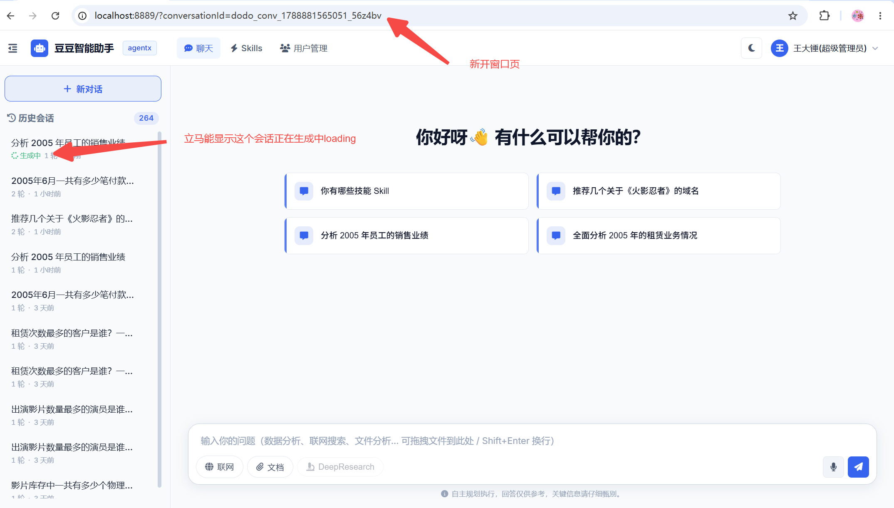

单机边界

需要说明的是：这套方案是面向单机部署的，问题就出在那层转发本身：LiveStreamRegistry 是 JVM 里的内存注册表，进行中的流只活在收到首发请求的那个实例里。一旦部署多个实例、nginx 随机转发，断线续传就会失效：

| 功能 | 多实例下的表现 |
| --- | --- |
| 恢复请求 | 打到别的实例，注册表里没有，404，续传失效 |
| status 探测 | 打到别的实例，返回没有进行中的流 |
| 侧栏生成中 | 列表接口查的是本机注册表，看不到别的实例上的流 |
| 409 防重复 | 别的实例没有记录，同一问题可能跑两遍 |

这是当前单机架构的固有边界。怎么把这层转发改造成分布式的，我们后面会单独展开分布式部署改造来讲。

小结

**流式中断的根因是执行和连接绑在一起：连接一断，cancel 向上传播，Agent 执行被取消。解决方法是在前端和框架之间加一层转发：Agent 的执行由转发层在后台驱动，不依赖任何前端连接；产出的每个事件编上序号、存进缓存，再分发给前端。前端断开只是取消了它自己的订阅，Agent 继续执行，事件继续进缓存。前端回来时带上最后收到的序号：页面还活着、内容都渲染过的，从下一号开始只补缺失的部分；页面是新开的、什么都还没渲染的，就从 1 号开始把缓存重放一遍。注意这里是重放缓存，不是重新生成，这个过程是瞬间完成的，补到当前位置后接上实时输出。在用户看来，输出从来没有停过。**

**前端配合两件事：进行中的流放在全局表里，页内切换不断流；游标写进 localStorage，关闭页面，再重新打开也不会丢失。**

---

来源: https://thoughts.aliyun.com/workspaces/6963289eb0fc2e001bb052eb/docs/6aa03137d31fed000101ca6b
