# ✅Agent评测实操：评测数据集的构建

前面的课程中，我们给大家介绍了 Agent 评测的方法论，整个体系分成三个阶段：Agent 执行、LLM Judge 评判、问题定位。那从这节课开始，我们就以 DataAgent 为例，来实操一下，如何搭建这个评测体系。

体系搭建需要从评测数据集开始，评测的原料，用户的问题、标准答案，都出自这个数据集，题目出得好不好、答案准不准，直接决定后面的判分可不可信。我们的业务 DataAgent 跑在一个影片租赁业务库上，围绕这个库一共准备了 100 道题，覆盖单轮、多轮，也覆盖全量视角和数据权限视角，放在了 dataset.jsonl 文件里，每一行是一道题。

评测集长什么样

主要包含六个字段：

| 字段 | 含义 |
| --- | --- |
| question_id | 题号 |
| difficulty | 难度，简单 / 中等 / 困难 |
| run_role | 评测时用哪个账号提问。admin 是全量视角，sh_sales 是只能看到本人数据的数据权限账号 |
| question | 问题。多轮题是字符串数组，评测时按序逐轮发问 |
| gold_sql | 标准答案的来源 SQL |
| gold_answer | 固化后的标准答案，gold_sql 真实执行结果的自然语言表述 |

run_role 决定了这道题用什么身份跑。大部分题用 admin，全量视角；还有一部分题用 sh_sales，这个账号的数据范围是 SELF，只能看到自己经手的数据。DataAgent 的核心能力之一就是数据权限改写，所以需要分账号来测试。

gold_sql 和 gold_answer 是一对。每道题的标准答案都是 gold_sql 在业务库上真实执行的结果。固化之后，业务库的数据就不能再动了，数据一动，已经固化的答案就过期，判分随之失效。

单轮题

比如第 1 题：

```json
{
	"question_id": 1,
	"difficulty": "简单",
	"run_role": "admin",
	"question": "影片库中共有多少部影片？",
	"gold_sql": "SELECT COUNT(*) FROM film",
	"gold_answer": "影片库共有 1000 部影片"
}
```

问题、gold_sql、gold_answer 三者一一对应：问什么、用什么 SQL 查、查出来的正确答案是什么。评测时 Agent 拿到的是问题，gold_sql 和 gold_answer 都只给裁判用。

多轮题

再比如第 60 题：

```json
{
	"question_id": 60,
	"difficulty": "困难",
	"run_role": "admin",
	"question": [
		"消费总金额最高的前3位客户是谁？各自消费了多少美元？",
		"他们各自的收入贡献率是多少？请用图表展示。"
	],
	"gold_sql": "SELECT c.first_name, c.last_name, ROUND(SUM(p.amount), 2) AS s, ROUND(SUM(p.amount) / (SELECT SUM(amount) FROM payment) * 100, 2) AS pct FROM payment p JOIN customer c ON p.customer_id = c.customer_id GROUP BY p.customer_id ORDER BY SUM(p.amount) DESC LIMIT 3",
	"gold_answer": "多轮期望：第1轮回答前3位客户及各自消费：KARL SEAL（221.55 美元）；ELEANOR HUNT（216.54 美元）；CLARA SHAW（195.58 美元）；第2轮回答各自贡献率（= 客户消费总额 / 全部付款总额 × 100）：KARL SEAL（0.33%）；ELEANOR HUNT（0.32%）；CLARA SHAW（0.29%），且需图表展示"
}
```

为什么要测多轮？因为 Agent 真正的使用场景就是连续对话：用户先问一个问题，接着在他给出的结果上追问。第 2 轮里的"他们"指谁、第 1 轮查到的结论能不能接着用，这些是单轮题考不出来的能力，所以评测集里专门留了 13 道多轮题。

多轮题的 question 是一个数组，评测时按序在同一会话里逐轮发问。gold_answer 也换了一种写法，叫多轮期望：把每一轮应该发生什么写清楚，包括"第 1 轮遇到没定义的术语应该向用户澄清，而不是编一个数字"这种对话行为。判分时，裁判拿到的是完整对话记录，逐轮对照这份期望来打分。

评测流程

以上面的两个例子为例，先看单轮题。评测脚本用题目指定的账号登录，新开一个会话，把问题发给 Agent，Agent 走完整的 ReAct 执行过程，查表、执行 SQL、组织报告，最后交出回答。回答连同问题、标准答案一起交给裁判判分：



多轮题的区别在发问方式上。数组里的几轮问题，必须在同一个会话里按序发：先发第 1 轮，等 Agent 回答，再发第 2 轮。因为多轮题考的就是上下文的延续，新开会话就白考了。全部轮次结束后，把每一轮的用户问题和 Agent 回答拼成完整对话记录，交给裁判判分：



难易分布

100 道题，简单、中等、困难按 7:2:1 配比，也就是 70 / 20 / 10：

- **简单（70）**：单轮、单表，过滤、聚合、排序、分布；
- **中等（20）**：多表 JOIN、数据权限、时间锚点，其中 8 道多轮；
- **困难（10）**：多步计算、扇出双表计数、空时段、两层聚合，其中 5 道多轮。

题号不是把 70 道简单题排前面、困难题堆到最后，而是每 10 题一组：1~7 简单、8~9 中等、10 困难，循环到 100。

这样排是为了子集评测。评测支持只跑前 N 题，比如先跑前 30 题快速验证一轮。如果难度堆在一起，截断后就只剩简单题，测不出问题；交错之后，**任意连续 30 题都恰好是 21 简单 / 6 中等 / 3 困难**，子集仍然按比例覆盖。

小结

评测集每行一道题，六个字段在评测里各司其职，question 按 run_role 指定的身份发给 DataAgent，是它的输入；gold_sql 和 gold_answer 只给裁判用，标准答案是真实执行 SQL 拿到结果后固化下来的，静态不变，固化后业务库数据也随之冻结。题目分单轮和多轮：单轮题一问一答，跑完即判；多轮题在同一会话里按序追问，考上下文延续和澄清、指代这些对话能力，全部轮次结束后完整对话记录一次性交给裁判，比对时对照每一轮的多轮期望。难易 7:2:1，题号交错排布，跑子集仍然按比例覆盖。

---

来源: https://thoughts.aliyun.com/workspaces/6963289eb0fc2e001bb052eb/docs/6a9d479574e40300011c3156
