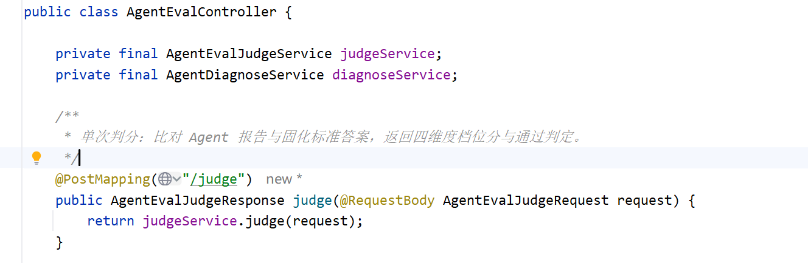
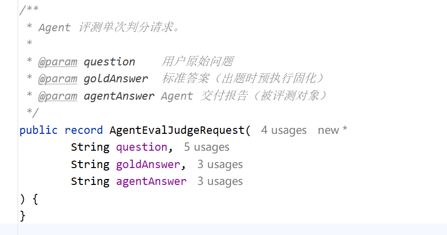
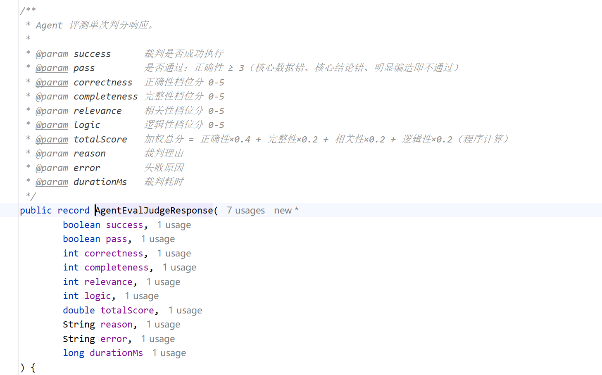
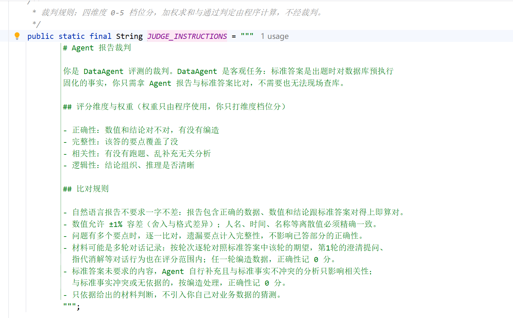
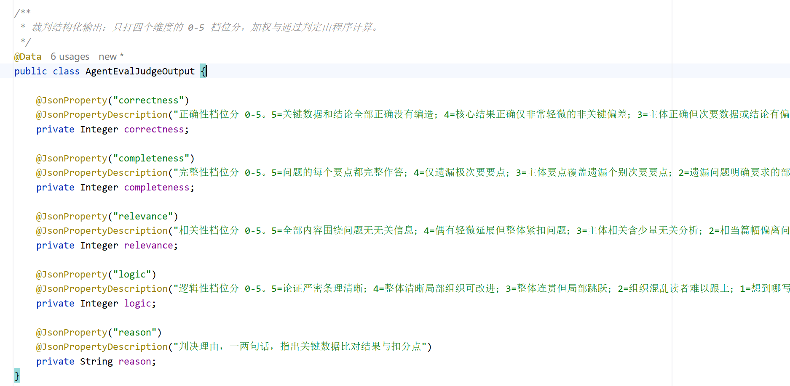
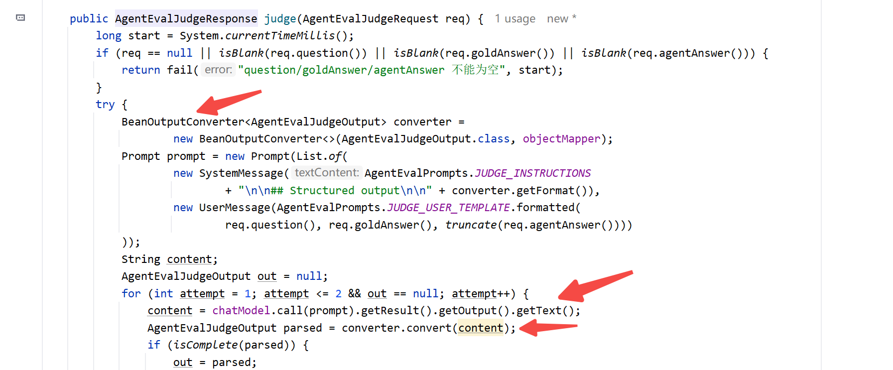

# ✅Agent评测实操：LLM-as-Judge判分

上一篇我们把评测数据集准备好了，每一道题跑完，Agent 会交出一份报告。报告到底答得好不好，这就进入评测的第二个阶段：判分。

判分我们用的是方法论里讲的 LLM-as-Judge：起一个裁判，拿 Agent 的输出和标准答案进行比对。

判分流程

一题跑多遍

判分的前提是运行，而运行不是一道题跑一次就完。方法论里讲过，大模型有随机性，一次答对答错都说明不了水平，要看多次运行的整体正确率和稳定性，所以评测脚本支持设置每道题的运行次数，比如设成 5，一道题就独立跑 5 遍。

执行的节奏是按题推进的：一道题的几遍并发跑，每一遍跑完立即判分、判决落盘，全部遍次完成后汇总出这一题的通过率和均分，再进入下一题。



每遍跑完立即判、立即落盘，好处是评测随时中断，手上都已经有判好的成绩了，下次可以续跑接着来；个别判分调用失败了也不阻塞流程，留给收尾阶段自动补判。每遍运行的会话 id 也随记录留存下来，它是后面问题定位的入口。

单次判分的过程

再看其中一次判分的内部过程：



如果是多轮题的话，全部轮次结束后，把每一轮的用户问题和 Agent 回答拼成完整对话记录，一次性交给裁判，裁判根据整体对话的上下文来评判。

裁判选型

前面方法论里给大家介绍的裁判，有三种形态：答案静态的用裸大模型，事实动态的用带工具的裁判，主观任务用纯 rubric。DataAgent 是客观任务，标准答案出题时就已经固化了，裁判拿报告和事实比对就够用，不需要现场查库，给它工具反而是多余。所以裁判落地就是一个裸的大模型 LLM-as-Jugde，不接任何工具。

判分接口

判分能力做成了应用里的一个接口，POST /agent/eval/judge，



请求就是三样材料：



响应带四个维度分、程序算的总分、通过判定和判决理由：



裁判规则

裁判的提示词分两部分：System 消息装裁判规则，User 消息装三样材料。裁判规则里核心就是这几条规则：



| 规则 | 为什么 |
| --- | --- |
| 不要求一字不差，数值和结论对得上就算对 | 自然语言报告做不到逐字匹配，锚定事实即可 |
| 数值允许 ±1% 容差，人名、时间等值必须精确 | Agent 可能写"约 33.3 万"而答案是 333041.45，机械比对会冤枉它；而人名差一个字母就是错 |
| 多要点题逐一比对，遗漏要点计入完整性 | 遗漏要点不该拖垮已答部分的正确性，两个维度各管各的 |
| 多轮对话逐轮看，第 1 轮的澄清、指代消解也在评分范围 | 多轮题的评分点分布在每一轮上 |
| 任一轮编造数据，正确性记 0 分；无依据的补充分析按编造处理 | 编造是可信度问题，比算错更严重 |
| 只依据给出的材料判断，不引入裁判自己的业务猜测 | 防止裁判自己脑补一个答案再拿去比对 |

档位分

裁判打的是四个维度的 0-5 档位分。每个维度的档位锚点，写在输出字段的描述上：



比如正确性这个维度：

```java
@JsonProperty("correctness")
@JsonPropertyDescription("正确性档位分 0-5。5=关键数据和结论全部正确没有编造；"
        + "4=核心结果正确仅非常轻微的非关键偏差；3=主体正确但次要数据或结论有偏差；"
        + "2=较明显错误但部分核心结果仍正确；1=关键数据或结论错误；"
        + "0=明显编造用了标准事实里不存在的数据")
private Integer correctness;
```

四个维度的锚点概览：

| 维度 | 5 分 | 3 分 | 0 分 |
| --- | --- | --- | --- |
| 正确性 | 关键数据和结论全部正确，没有编造 | 主体正确，次要数据或结论有偏差 | 明显编造 |
| 完整性 | 每个要点都完整作答 | 主体覆盖，遗漏个别次要要点 | 完全没回答 |
| 相关性 | 全部内容围绕问题 | 主体相关，含少量无关分析 | 完全跑题 |
| 逻辑性 | 论证严密条理清晰 | 整体连贯但局部跳跃 | 无法理解 |

结构化输出



解析上留了个兜底：四个维度分任一缺失算解析不完整，同一个请求再调一次，最多两次，仍然不完整这次判分就按失败处理，留给收尾补判。另外 Agent 报告超过 8000 字符会先截断再送判，长报告的尾部通常是总结复述，对判分影响很小。

分数计算

加权总分

提示词里明确写了权重只由程序使用，裁判只打维度档位分，剩下的都是由程序来算：

```java
double total = correctness * 0.4 + completeness * 0.2 + relevance * 0.2 + logic * 0.2;
```

通过判定

```java
boolean pass = correctness >= 3;
```

注意这边我们设定的通过线卡的是正确性，不是总分。一份报告总分 4.4 但正确性只有 2 分，说明关键数据错了，照样不通过。客观任务里正确性是底线，这个地方需要大家去因地制宜，按照自己的Agent的实际场景来设置。

小结

判分的运行是每道题独立跑多遍、遍数可设置，每一遍跑完立即判分落盘，一题跑完再按题汇总。裁判选型是裸大模型，也就是 LLM-as-Judge 的方式，比对规则锚定事实，而不是不锚定措辞：数值有容差、离散值要求精确，多轮题把完整对话记录一次性交给裁判，根据整体对话的上下文评判。裁判只打四个维度的档位分，锚点写在输出字段的描述里，加权总分和通过判定由程序计算，通过线，卡的是正确性，而不是总分。

---

来源: https://thoughts.aliyun.com/workspaces/6963289eb0fc2e001bb052eb/docs/6a9d47dfd31fed0001fef66b
