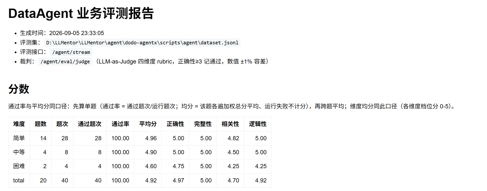

# ✅Agent评测实操：评分脚本运行与报告解读

这一篇就来实际跑一下评测脚本，涉及的文件：评测脚本是 scripts/agent 目录下的 agent_eval_runner.py，评测集是同目录的 dataset.jsonl。跑完在 report 目录下产出两个文件：agent_results.jsonl 是状态文件，记录每一遍的运行和判决；agent_results.report.md 是评测报告，汇总全部结果。

脚本怎么跑

先确认服务已启动，脚本默认连本机 8889 端口。常用命令：

```bash
python agent_eval_runner.py                     # 全量：运行 + 判分 + 报告
python agent_eval_runner.py --runs 3            # 每题独立跑 3 遍
python agent_eval_runner.py --ids 23,27         # 只跑指定题
python agent_eval_runner.py --max-questions 30  # 只跑前 30 题
python agent_eval_runner.py --rerun-failed      # 只重跑运行失败的遍次
python agent_eval_runner.py --judge-only      # 不运行，只判分已有结果出报告
```

| 参数 | 作用 |
| --- | --- |
| --runs | 每题独立运行次数，默认 1 |
| --ids | 只评测指定题号，逗号分隔 |
| --max-questions | 只评测前 N 题，配合评测集的交错题号，子集仍按难度比例覆盖 |
| --rerun-failed | 重跑状态文件里运行失败的遍次 |
| --judge-only | 跳过运行阶段，对已有结果判分并出报告 |
| --base-url | 服务地址，默认 [http://127.0.0.1:8889](http://127.0.0.1:8889) |

登录由脚本处理，按题目里的 run_role 登录对应账号（admin、sh_sales）。

执行过程

一次完整评测的内部过程：



调用的是 DataAgent 的流式接口 /agent/stream。脚本新开一个会话把问题发出去，把流消费到结束，这一轮执行就算完成；多轮题在同一会话里按序逐轮发。

多轮题取回后，把每一轮的用户问题和 Agent 回答拼成完整对话记录，就是上一篇说的交给裁判的那份材料，每遍跑完立即判分、立即落盘。

状态文件与断点续跑

agent_results.jsonl 每行一条记录，一次运行的回答和判决存在同一行里，格式展开了看是这样：

```json
{
	"question_id": "1",
	"run": 1,
	"run_role": "admin",
	"pred": "第1轮\n用户：影片库中共有多少部影片？\nAgent：影片库（film 表）中共有 **1000 部影片**。",
	"conversation_id": "eval_a538723a6f40",
	"duration_ms": 11421,
	"judge": {
		"pass": true,
		"scores": {
			"correctness": 5,
			"completeness": 5,
			"relevance": 5,
			"logic": 5
		},
		"total_score": 5.0,
		"reason": "Agent 报告给出影片库共有1000部影片，与标准答案完全一致，且简明直接地回答了用户问题。"
	}
}
```

| 字段 | 含义 |
| --- | --- |
| question_id / run | 题号和遍次，合起来是这条记录的 key |
| run_role | 这一遍用的账号 |
| pred | Agent 回答原文，多轮题是拼好的完整对话记录 |
| conversation_id | 会话 id，后面问题诊断的入口 |
| duration_ms | 这一遍的耗时 |
| error | 运行失败原因，只有失败的记录才有这个字段 |
| judge | 判决结果：pass 通过判定、scores 四维分、total_score 加权总分、reason 裁判理由 |

写入是追加式的，后写的覆盖先写的；每次启动先读状态文件，跑过的遍次直接跳过。所以评测随时可以中断，已判好的成绩都在，下次启动接着跑；想强制重跑某一遍，把那条记录删掉即可；运行失败的遍次用 --rerun-failed 集中重跑。

指标口径

通过率

单题通过率等于该题通过题次除以运行题次，再对所有题取平均。先单题再跨题，是为了让每道题权重相同：运行失败的遍次不计分之后，各题参与统计的遍数可能不一样，直接拿全部题次算总账，记录多的题话语权就大，先单题再平均，口径就统一了。

平均分

平均分同口径，先算单题均分，再跨题平均。运行失败的遍次不计分：运行失败没有答题质量可言，把 0 分算进平均分，会把跑不起来和答得差混成一个数。运行失败有多少，报告里单独一行反映。

全对率

全对率等于 N 次运行全部通过的题目占比，衡量稳定性。它和通过率回答的是两个问题：一道题跑 5 遍过 4 遍，通过率 80%，但不全对。通过率说平均能对多少，全对率说哪些题是稳定对的。

四个维度的档位分也按同样口径汇总成维度均分，用来定位短板出在哪个环节：正确性低说明取数就有问题，逻辑性低多半是报告组织的问题。

报告解读

以项目里跑出来的一次真实报告为例，report/agent_results.report.md，20 题、每题 2 遍。

报告头是生成时间、评测集路径、评测接口和裁判口径。往下是分数总表，按难度分组：



难度分组的 14 / 4 / 2，正是前 20 题按 7:2:1 交错分布的结果。

运行摘要把全局指标集中放在一起：

- 评分题次：40（20 题 × 2 次运行）
- 通过率：100.00%（先单题再跨题平均）
- 平均分：4.92 / 5（先单题均分再跨题平均，运行失败不计分）
- 全对率：20/20（100.00%，2 次运行全通过的题目占比）
- 运行失败：0
- 判分未通过：0
- 维度均分：正确性 4.97 / 完整性 5.00 / 相关性 4.70 / 逻辑性 4.92
- 运行累计耗时：11m32s

再往下是题目明细，每一遍一行，四维分和耗时。然后是运行失败表，列出运行失败的遍次和原因，没有就写无。最后是错题分析，判分未通过的题每题一节，给出问题、标准答案、维度得分、裁判理由和 Agent 回答原文，要改 Agent，先从这里入手。

读报告建议按这个顺序：先看运行失败数，有运行失败先解决环境问题，它们反映的不是答题能力；再看通过率和全对率，把握整体水平和稳定性；然后按难度看分数表，定位薄弱的难度段；最后进错题分析逐题看裁判理由。错题这一遍的会话 id 留在状态文件里，它是下一阶段问题诊断的入口。

小结

评测脚本按题推进、题内并发，每遍跑完立即判分落盘，收尾补判后出报告。状态文件追加式写入、跑过的遍次自动跳过，随时中断随时续跑。报告看三个指标，通过率、平均分、全对率，同口径先单题再跨题，运行失败不计分、单独统计。

---

来源: https://thoughts.aliyun.com/workspaces/6963289eb0fc2e001bb052eb/docs/6a9d481c51b1440001256cbb
