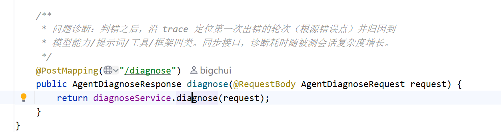
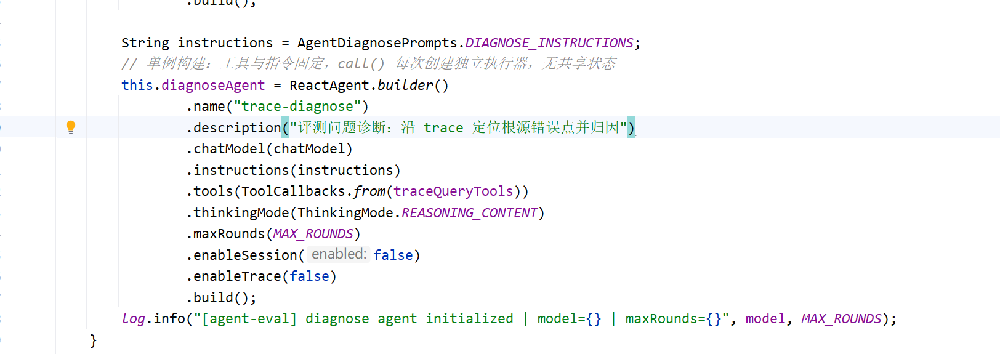
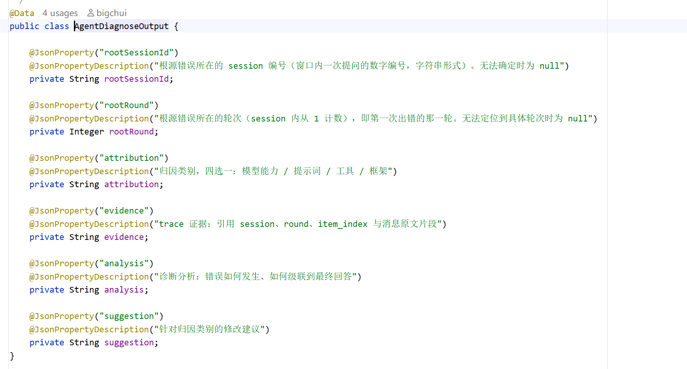
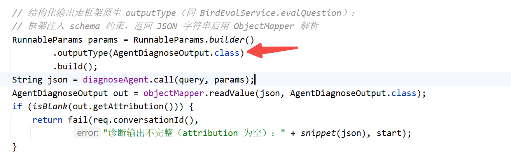

# ✅Agent评测实操：问题诊断流程

前面评测跑完、报告也读完了，错题已经摆在眼前。但报告只回答了哪道题错了，判不通过之后开发真正要问的是：错在哪一步、为什么错、该改哪里。这就进入评测的第三个阶段：问题诊断。

诊断的主体不是一个裸的大模型，而是一个带工具的诊断 Agent，这边我们就来讲一下诊断的整体流程。

裁判与诊断的分工

裁判和诊断是一对互补的角色，一个关注最终结果，一个关注执行过程：

|  | 裁判 | 诊断 Agent |
| --- | --- | --- |
| 形态 | 裸大模型，不接工具 | ReactAgent，注入 trace 查询工具 |
| 看什么 | 最终结果，问题、标准答案、回答 | 执行过程，trace 全程 |
| 回答什么 | 对不对、质量如何 | 错在哪一步、归因给谁 |

为什么诊断必须是带工具的 Agent？因为定位问题靠的原料是 trace，而一次执行的 trace 动辄几十轮，每轮的入参出参都是长文本，不可能整段塞进提示词让裸模型干看。诊断 Agent 需要的是按需查询的能力：先通读、再深查、再反查，像人排查问题一样一步步来。

诊断 Agent

诊断 Agent 落地是应用里的一个 ReactAgent，当然你也可以用什么codex，claude code都可以。

入口在 AgentEvalController：

指令是诊断的规则：trace 结构说明、三步查证流程、归因标准。工具注入就是 trace 查询工具。会话功能和 trace 功能都关了。诊断 Agent 自己也是 Agent，默认同样会有会话，会有 trace，所以两个都关，诊断过程不留痕。对外暴露成一个同步接口 POST /agent/eval/diagnose。

诊断流程

先说 trace 的组织结构，后面都建立在它上面。一个 conversation_id 对应一个聊天窗口；窗口内每次用户提问是一个 session；session 内每一轮 LLM 调用是一个 round，从 1 开始。单轮题的评测会话里，ReAct 循环转多少轮，session 里就有多少个 round；多轮题则是一个窗口里多个 session。诊断要定位的根源错误点，最终就落到 session 加 round 这个坐标上。

三步查证，对应三个工具：

| 工具 | 干什么 | 什么时候调 |
| --- | --- | --- |
| traceOverview | 通读完整执行过程 | 诊断第一步，先调这个 |
| traceRound | 查某一轮完整的入参出参 | 锁定可疑轮之后，还原现场 |
| traceFirstAppear | 反查关键词第一次出现在哪条消息 | 拿错误值定位源头 |

第一步通读全程。把整个会话从头到尾过一遍：用户问了什么、每一步调了哪个工具、返回了什么、最终交了什么答案。通读层返回的是截断的预览、省略模型思考，目的是建立全局印象、锁定可疑轮次，不是看细节。

第二步还原现场。对可疑轮次取这一轮完整的入参出参：当时模型看到了什么、输出了什么，模型思考的完整原文只有这里有。执行失败的轮次不产生回答消息，通读层看不到，也只有在这里能看到。

第三步反查首现。实际回答里错误的数值或结论，提取关键词反查它第一次出现在哪条消息，错误源头多半在首现附近。

根源错误点

诊断最重要的原则：找第一次出错的轮次，不是最后出错的轮次。因为 Agent 的错误会级联，后面的错误往往是前面带出来的。

举个例子：执行过程中某一步工具返回了错误的数据，模型没有识别出来，基于这份数据做了总结，最终报告里的数字就是错的。只看最终报告，像是总结环节出了问题，该归因到模型或者提示词的问题；但沿 trace 往前看，第一次出错是工具返回数据的那一刻，总结只是采信了错误数据。这种情况应该归因工具，而不是模型。归因归错了，改半天提示词、换模型，工具的问题还在，下次照样错。

这就是找根源错误点的意义：根源找到了，归因才能归对，优化才有目标。盯着最后一轮改总结，是这类诊断里最常见的误诊。真实案例怎么出题、怎么触发、诊断报告长什么样，后面的运行篇再详细看。

归因类别

找到根源错误点，再看它属于哪一类：

| 归因 | 典型表现 |
| --- | --- |
| 模型能力 | 模型自身理解、推理、决策或生成不足：理解错问题、选错字段、SQL 写错、分析结论错误 |
| 提示词 | 模型本身有能力，但 Prompt、规则、Schema 描述或任务约束设计不合理，把模型带偏 |
| 工具 | Agent 决策正确，但工具调用或工具返回异常：接口失败、工具内部逻辑错误、数据异常 |
| 框架 | 运行机制问题：工具编排、参数传递、上下文管理、记忆管理、超时、调用链、结果回传 |

判定规则按第一次出错的轮次归因。工具返回异常数据，本身就是出错点，归因工具；模型后续采信这个异常属于错误级联，不改判成模型能力，刚才那个例子就是这种情况。只有工具返回正常、模型自身推理理解或生成出错的，才归因模型能力。

归因不是拍脑袋，判断必须有 trace 证据：结论里要引用具体的 session、round、item_index 和消息原文片段，凭空推断不算数。

诊断的输入与输出

诊断的入口，就是评测状态文件里留的那个会话 id。判错之后，把这一遍的会话 id、用户问题、标准答案、Agent 回答、裁判判语五样材料一起交给诊断接口。会话 id 是关键，其余四样是背景：问题是什么、应该答成什么样、实际答了什么、裁判为什么判错。

输出是结构化的六个字段：

| 字段 | 含义 |
| --- | --- |
| rootSessionId | 根源错误所在的 session 编号 |
| rootRound | session 内第一次出错的轮次 |
| attribution | 归因类别，四选一 |
| evidence | trace 证据，引用 session、round、item_index 与消息原文片段 |
| analysis | 错误如何发生、如何级联到最终回答 |
| suggestion | 针对归因类别的修改建议 |

诊断 Agent 是框架里的 ReactAgent，框架本身支持指定输出类型：

小结

裁判判对错，诊断找根源。诊断 Agent 是注入三个 trace 查询工具的 ReactAgent。流程是三步查证：通读全程锁定可疑轮次，还原现场看模型的输入输出，反查首现定位源头；核心原则是找第一次出错的轮次而不是最后一次，最终归因到模型能力、提示词、工具、框架四类。输入以会话 id 为入口，输出是结构化的根源位置、归因、证据、分析和建议。

---

来源: https://thoughts.aliyun.com/workspaces/6963289eb0fc2e001bb052eb/docs/6a9d60c3c71a890001b38528
