# ✅Agent评测实操：trace 查询工具

上一篇讲了诊断的整体流程：通读全程、还原现场、反查首现三步查证。这三步背后是三个 trace 查询工具。

三个工具设计的出发点，是模拟人排查问题的操作：先看整体执行过程，锁定可疑的某一步，再反查错误值最早从哪来。但人和模型的差别在上下文，一份长任务的执行 trace 如果全量塞给模型，诊断还没开始上下文就满了。所以三个工具的核心，是分层给原文：通读只给截断预览，深查才给完整请求报文，反查只给命中片段。

调用记录存储

窗口里的三类消息

agentx 框架的消息存储借鉴了 AgentScope 的思路。Agent 在一个窗口里执行，每轮都会追加用户消息、模型回复、工具调用参数、工具返回结果，如果这些一直原样堆着，很快会出现两个问题：每轮 LLM 调用的成本越来越高，上下文逼近模型窗口上限，甚至直接失败。

所以框架做了上下文压缩。消息条数或 token 数超过阈值就触发，进入六层渐进式压缩策略，把历史压短：

| 层 | 处理区 | 是否调 LLM | 做什么 |
| --- | --- | --- | --- |
| L1 | 历史区 | 否 | 连续工具消息改写成结构化清单，同名同参数去重 |
| L2 / L3 | 历史区 | 否 | 把大块原文移出工作区 |
| L4 | 历史区 | 是 | 用 LLM 摘要较早轮次 |
| L5 / L6 | 当前任务区 | 是 | 压掉当前轮的大块内容或整体 |

六层可以按两个维度看：前三层不调 LLM，纯规则处理，毫秒级完成；后三层调 LLM 做摘要。前四层压的是历史区，后两层压的是当前正在执行的任务区。

这套六层策略沿用了 AgentScope 的框架，但我在上面做了两点优化，一是 L1 不调 LLM：AgentScope 的 L1 命中时也要调一次模型生成摘要，而 ReAct 里的工具调用日志结构很强，就是「工具名加参数」加「结果」，我们直接用规则模板把它改写成清单、同名同参数去重，毫秒级完成，省掉一次 LLM 调用的开销和延迟。二是调用边界独立成表：AgentScope 只按 session 持久化，调用方很难知道哪几条 session 属于同一次调用，我们加了 agentx_conversation 表单独存调用边界，查一次调用发生了什么不用自己去聚合。

压缩带来一个关键结果：一个窗口里同时存在三类消息。

| 消息 | 存什么 | 谁改写 | 用途 |
| --- | --- | --- | --- |
| original_messages | 从开局到现在的完整原文，真相链路 | 不改写 | 保留每一步的原始记录 |
| working_messages | 压缩后的可执行视图 | 压缩结果覆盖写到这 | 下一轮实际加载它 |
| offload_context | 被移出工作区的原文 | 压缩时写入 | 配 uuid 存起来，保证压缩可逆 |

压缩只改 working_messages，original 保持原文不动，被移走的大块进 offload_context，配 uuid 存着，模型需要时能用 context_reload 按 uuid 把原文取回来，所以压缩是可逆的。正是这套机制，Agent 才能在一个窗口里执行几十轮甚至更长的任务：working 是当前的执行视图，original 是只会append的真相。压缩解决的是当前会话怎么继续跑。

诊断怎么查

诊断要还原的是当时每一步到底发生了什么，所以它读的是 original_messages，而不是压缩后的 working_messages。working 已经把早期轮次摘要掉了，细节丢了；original 保留每一步的原文，连模型思考都在。

这里能看出诊断 Agent 和被测 Agent 看的是两套东西：被测 Agent 执行时加载的是 working 视图，诊断 Agent 回放时读的是 original 真相。而深查某一轮的时候，则去 trace 表取那一轮实际发给模型的完整请求。

三张表

框架里跟 trace 相关的有三张表：

| 表 | 代表什么 |
| --- | --- |
| agentx_conversation | 窗口内的一次调用，也就是一次用户提问 |
| agentx_session | 这次调用产生的消息链，用户、模型、工具的消息 |
| agentx_trace | 这次调用里每一轮 LLM 调用的入参出参 |

三张表是三层粒度，层层对应：

```text
一个窗口 conversation_id
  └─ 一次调用（agentx_conversation）
       ├─ 消息链（agentx_session，按 item_index 排）
       └─ 每轮 LLM 调用（agentx_trace，一轮一行）
```

一个 conversation_id 是一个聊天窗口，窗口里每问一次，agentx_conversation 就多一行，记这次提问的问题、状态和 token 用量。往下，agentx_conversation 的一条记录，对应 agentx_session 的多条消息——这是这一次调用从开局到结束的完整消息链，state_key 区分 original_messages 和 working_messages；同时也对应 agentx_trace 的多轮——这次调用里 ReAct 循环转了几轮，trace 里就有几行，input_data 是当时发给模型的完整请求，output_data 是模型的输出，工具轮是 tool_calls，最终轮是回答文本。

agentx_session 表的 item_index 字段，是窗口内消息的连续序号，跨对话一直累加，第一问存完第二问接着排，整个窗口的消息就按它排成一条时间线；agentx_trace 表的 round 字段，是一次调用内每轮 LLM 调用的序号，每个 session 从 1 重新开始。两者的关系是一轮 LLM 调用恰好产生一条 assistant 消息，所以按 item_index 顺下来的第 N 条 assistant 消息，正好对应同一 session 里 round 为 N 的那一轮，诊断就是靠数 assistant 消息来锁定轮次的。

三个工具

TraceQueryTools 类中有三个工具，模拟人工排查的三步：

| 工具 | 数据源 | 返回什么 |
| --- | --- | --- |
| traceOverview | agentx_session | 对话概要、轮次异常概览、消息截断预览 |
| traceRound | agentx_trace | 某一轮完整的LLM调用入参和出参 |
| traceFirstAppear | agentx_session | 关键词首现的位置和附近原文片段 |

通读全程

traceOverview 是诊断的第一步，把整个窗口的执行过程通读一遍，返回一份「执行过程全貌」。它按 conversation_id 取回全部消息，但吐出来的是压缩过的三块内容，大致长这样：

```text
# 执行过程全貌 conversation_id=eval_3f9c2a1b8d7e

## 窗口内对话（每次提问一行）
- session 2096269545817051138 | 用户 20 | 状态 completed | 问题：帮我查一下上个月华东大区的订单总额

## 轮次概览（只列失败轮与上下文压缩点，未列出的轮次均成功）
session 2096269545817051138 共 12 轮：
- round 7 | 失败 | 错误：SQL 执行超时

## 消息记录预览（正文截断、模型思考省略）
【session 2096269545817051138】
item 0 | user：帮我查一下上个月华东大区的订单总额
item 1 | assistant（round 1）：先看一下订单表的结构
        调用 describeTables({"tables":"orders"})
item 2 |   结果 describeTables：orders 表有 id、amount、region...
item 3 | assistant（round 2）：查一下上个月华东大区的订单总额
        调用 executeSql({"sql":"SELECT SUM(amount) ..."})
item 4 |   结果 executeSql：...（截断）
```

三块各有用处。第一块看这次会话问了什么、状态如何。第二块只列失败轮和压缩点，正常轮不列，哪轮失败了、哪轮之前发生过上下文压缩（input 字符量骤降），一眼就能看到。第三块是按 item_index 排的消息预览，一行一条消息，assistant 行标了它对应第几个轮次。

预览里做了精简：正文截断，模型思考直接去掉，这一步是让模型先拿到整个调用链的概览，正文截断到一行，足够看出这条消息在干什么；而模型思考往往特别长，对整体定位问题帮助又不大，留着只会白白占上下文。只有等锁定到具体轮次之后，再去看完整的思考过程才有意义。所以 10 几轮的会话通读下来也就几十行，模型先建立全局印象、数 assistant 消息，或者直接看到这round 次数，锁定可疑轮次，具体细节留着深查。

还原一轮

traceRound 在锁定可疑轮之后用，还原那一轮「当时模型看到了什么、输出了什么」。通读层的预览是截断的，这里给的是完整原文。拿上面例子里失败的 round 7 去查，返回大致长这样：

```text
# 轮次详情 session_id=2096269545817051138 round=7
耗时 3200ms | 失败 | 错误：SQL 执行超时

## input_data（本轮发给模型的完整请求，tools 定义默认省略）
{
  "model": "...",
  "messages": [
    {"role": "system", "content": "..."},
    {"role": "user", "content": "帮我查一下上个月华东大区的订单总额"},
    {"role": "assistant", "content": "...", "tool_calls": [...]},
    {"role": "tool", "content": "..."}
  ]
}
（tools 工具定义已省略：各轮相同且篇幅大；需核对工具 schema 时传 includeTools=true 重查）

## output_data（模型本轮输出原文）
[{"type": "function", "function": {"name": "executeSql", "arguments": "{\"sql\":\"SELECT SUM(amount) ...\"}"}}]
```

input_data 是这一轮实际发给模型的完整请求，output_data 是模型的输出——工具轮输出的是 tool_calls，也就是要调哪个工具、带什么参数，最终轮输出的才是回答文本。看了这一轮，就知道模型当时依据什么、又决定了什么。

tools 工具定义默认摘掉。它每轮都重复，而且非常占上下文，一个 14 轮的会话光工具部分的入参就重复了十几遍，而它对定位这一轮的问题，作用其实比较有限，除非是消息看不出问题，真要看工具定义的时候，traceRound 工具也支持取回工具参数。所以默认只给 messages 和顶层参数，需要核对工具 schema 时，再单独重查一轮工具即可，这边相当于也是一个渐进式按需加载的过程。

反查首现

traceFirstAppear 用来反查错误源头。实际回答里有个错误的数字或结论，拿它当关键词，去查它第一次出现在哪条消息。比如最终报告里写了个订单总额 328 万，搜这个数字，返回大致长这样：

```text
关键词「328」首次出现在 item_index=18 | session 2096269545817051138 | 工具结果 executeSql
原文片段（首现位置前后）：
...华东大区 | 3280000 | 2025-08 ...
```

命中在工具结果里，说明这个数字是工具返回的，源头在工具，模型只是基于它做了总结。反过来，如果首现落在模型思考里，返回会带一句提示：

```text
关键词「328 万」首次出现在 item_index=21 | session 2096269545817051138 | assistant 思考
原文片段（首现位置前后）：
...上个月华东大区大概 328 万左右...
（提示：命中模型思考，说明该措辞是模型推导出的；若要定位数据源头，可换工具返回的原始特征值如字段名、原始数值、人名再查）
```

关键词第一次出现的位置，多半就是错误源头。它扫的是四类内容：模型思考、正文、工具调用、工具结果。这一步只要知道错误值第一次出现在哪、前后什么语境就够了，用不着整条消息的全文。连思考也要扫，是因为错误既可能是模型自己推导出来的，也可能是工具返回的，首现落在思考里还是工具结果里，直接决定归因方向。

分层给原文

三个工具合起来，是一套按需取数的策略：



关键原则是服务端只取原文，不做解析、拼接、摘要。模型的上下文是有限的，一次性把几十轮完整 trace 塞进去，既浪费 token，又会稀释模型的注意力。分层之后，通读花最少的成本建立全局印象，完整的原文只花在可疑的那一轮上，反查几乎零成本。诊断 Agent 就是在这样的工具支撑下，一步步逼近根源错误点。

小结

trace 查询工具建立在 agentx 框架的消息存储之上：一个窗口里 original_messages、working_messages、offload_context 三份并存，上下文压缩只改 working，original 保留真相，被卸载的大文本则进入 offload_context 保证压缩可逆，这让 Agent 能在一个窗口里跑很长的任务，也给了诊断一份不被压缩破坏的原始记录。

三张表各有分工：conversation 存调用边界，session 存消息，trace 存每轮调用。

三个工具各取所需：traceOverview 通读全程，返回截断预览，省略模型思考，锁定可疑轮次；traceRound 还原某一次调用的完整入参出参，tools 定义默认摘掉，也可以按需获取；traceFirstAppear 反查错误值首现，命中即停。

三个工具的分层，每一步只给刚好够用的信息，通读给截断预览建立全局印象，深查给某一轮的完整原文，反查只给命中的片段，诊断就不会被整份 trace 撑爆上下文。

---

来源: https://thoughts.aliyun.com/workspaces/6963289eb0fc2e001bb052eb/docs/6a9ff65374e40300011eb0a2
