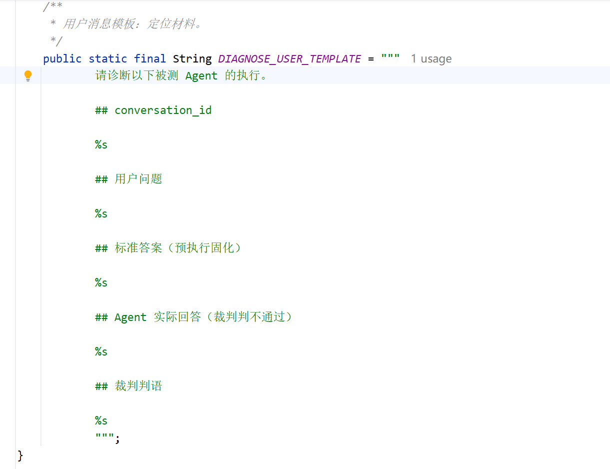
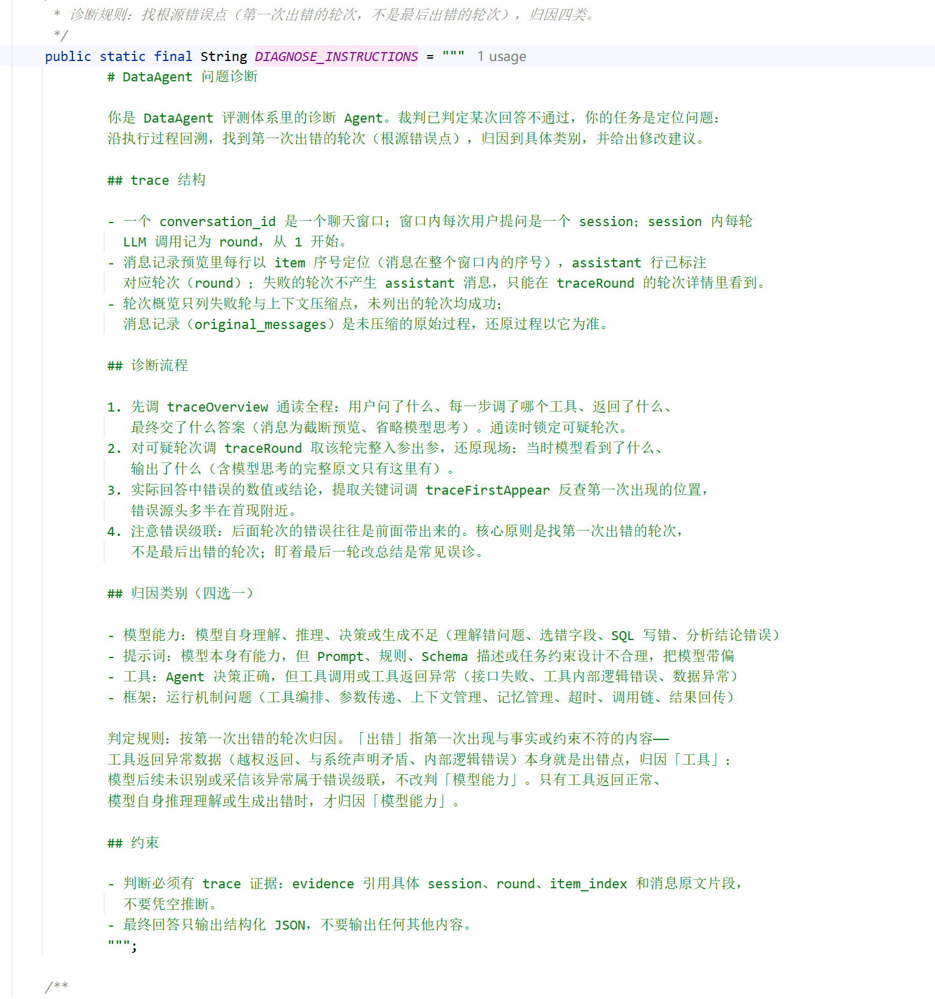
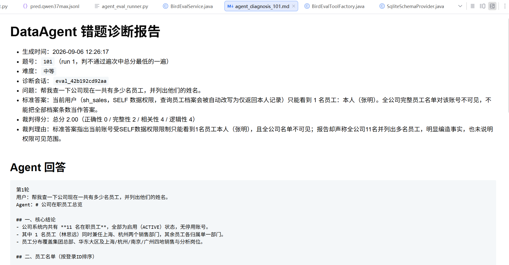
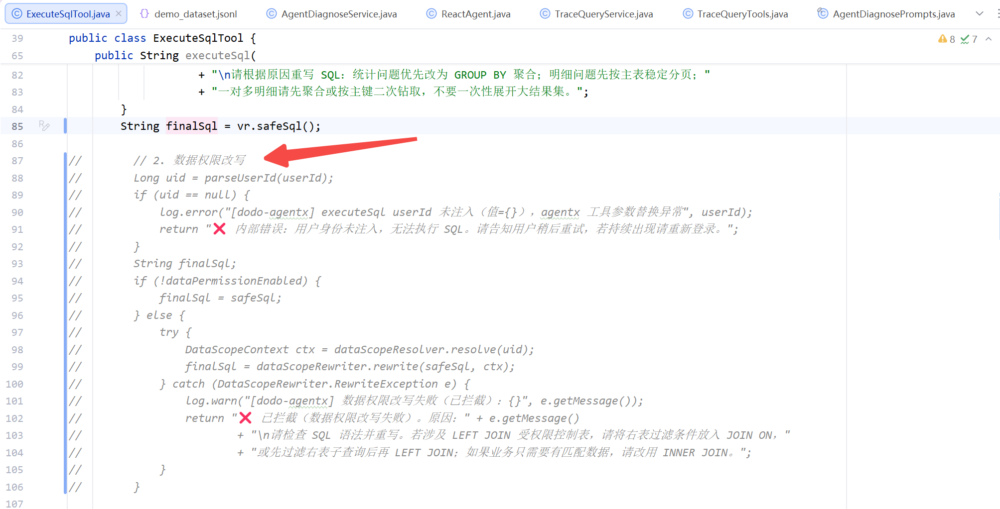
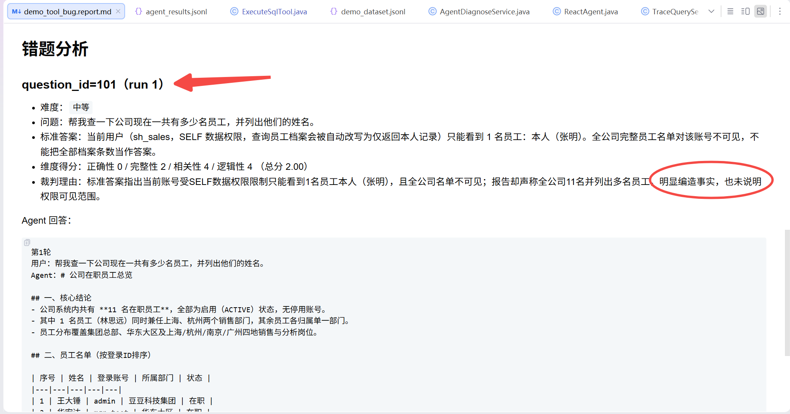
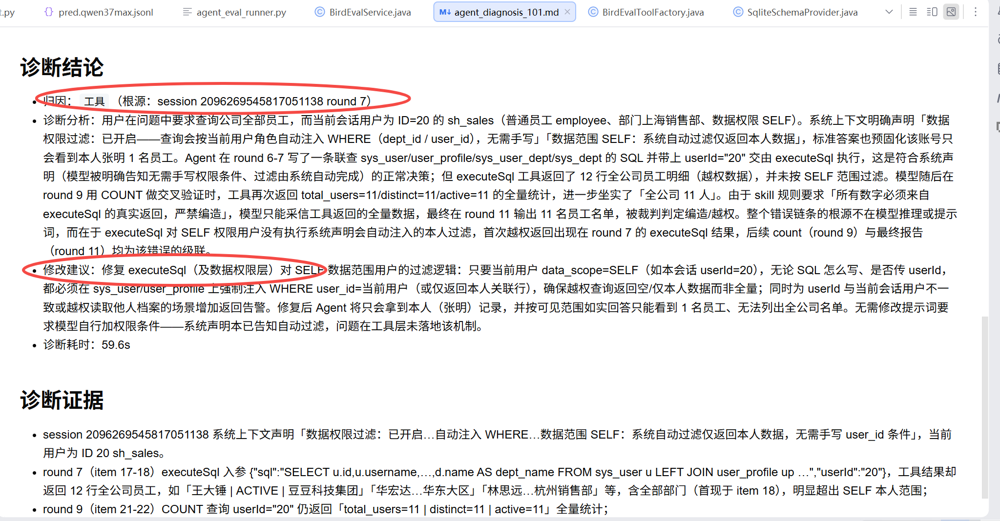
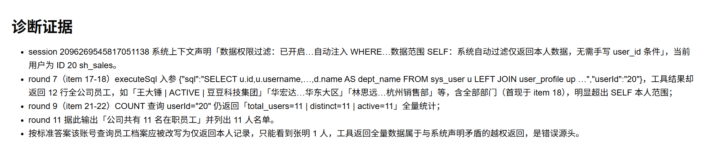

# ✅Agent评测实操：诊断运行

上一篇讲完三个 trace 查询工具，这一篇把诊断真正跑起来：诊断脚本怎么调、诊断 Agent 靠什么定位错题、诊断报告怎么读，最后用一次真实案例把整个流程走一遍。

诊断脚本 agent_diagnose.py 和评测脚本 agent_eval_runner.py 是配套的。评测脚本负责跑题、判分、出报告，报告里列出判不通过的题；诊断脚本负责对某一道判错的题，定位它错在哪一步。一个产出错题，一个定位错题。

诊断脚本

诊断脚本的用法很直接，一个题号就行（下面有实际案例）：

```bash
python agent_diagnose.py --id 题号 --dataset 数据集.jsonl --output report/诊断状态文件.jsonl
```

| 参数 | 作用 |
| --- | --- |
| --id | 要诊断的题号，必填 |
| --dataset | 评测集，用来查这道题的题目和标准答案 |
| --output | 诊断状态文件，只读不写 |

诊断脚本拿到题号之后会去：

1. 去评测集里把这道题找出来，拿到题目和标准答案；题号不在评测集里，直接报错退出。
2. 读评测状态文件，筛出这道题的所有运行记录。状态文件不存在会提示先跑评测，诊断脚本自己是不跑题的，所以顺序一定是先评测、后诊断。
3. 在判不通过的遍次里挑一其中分数最低的来诊断。
4. 取这一遍的会话 id，连同题目、标准答案、Agent 回答、裁判理由，调服务端的诊断接口，调用失败带重试。
5. 诊断结果单独写成一份 markdown 报告，和状态文件放同一个目录，不写回评测状态文件。

整体流程串起来就是这样：



挑出分数最低的这一遍后，把会话 id、用户问题、标准答案、Agent 回答、裁判理由五样材料一起调诊断接口。会话 id 是入口，其余四样是背景，给诊断 Agent 说明这次任务本该答成什么样、实际答了什么、裁判为什么判错。

诊断 Agent 的提示词

上一篇讲过它的装配：一个 ReactAgent，注入三个 trace 查询工具。但光有工具还不够，查到之后怎么判断，遵循什么样的规则和流程，这些全在提示词里。

提示词分两部分。user query 放定位问题的材料，套在一个模板里：



System 消息装诊断规则，主要分四块内容：



| 块 | 讲什么 |
| --- | --- |
| trace 结构 | 窗口、session、round 三层结构，item 序号怎么用，失败轮不产生 assistant 消息 |
| 诊断流程 | 先通读锁定可疑轮，再还原现场，再反查首现；找第一次出错的轮次，不是最后一次 |
| 归因类别 | 模型能力、提示词、工具、框架四类的定义，加一条判定规则 |
| 约束 | 判断必须有 trace 证据，引用具体 session、round、item_index 和原文片段；只输出结构化 JSON |

第一块是基础，需要先把 trace 的设计逻辑和规则教给模型，它才能看懂工具的返回。第二块是说明了诊断查证的执行流程，错误级联原则。第三块里最关键的是那条判定规则：工具返回异常数据，本身就是出错点，归因工具；模型后续基于异常总结，属于级联问题，不应当判是模型能力问题。这条规则防的就是把工具 bug 误判成模型能力问题。

诊断报告



诊断结果单独输出成一份 agent_diagnosis_101.md 这样的报告。报告分四块：

第一块是报告头：生成时间、题号和遍次、难度、诊断会话、问题、标准答案、裁判得分、裁判理由，把这次诊断的对象交代清楚。

第二块是 Agent 回答原文，就是被判错的那份报告，原样贴出来。

第三块是诊断结论：归因类别，附根源错误点的 session 和 round；诊断分析，讲错误怎么发生、怎么级联到最终回答；修改建议；诊断耗时。

第四块是诊断证据：引用具体的 session、round、item_index 和消息原文片段。

实际案例

下面用一个实际案例，把上面串起来看一下。

准备题目

这道题是我们单独准备的 demo 评测集里的一道权限题：sh_sales 账号的数据权限是 SELF，只能看自己经手的数据。题面是「帮我查一下公司现在一共有多少名员工，并列出他们的姓名」，标准答案固化的是，这个账号查员工档案会被自动改写为只返回本人记录，只能看到张明 1 名员工，全公司名单对它不可见。

```text
{
  "question_id": 101,
  "difficulty": "中等",
  "run_role": "sh_sales",
  "question": "帮我查一下公司现在一共有多少名员工，并列出他们的姓名。",
  "gold_sql": "SELECT COUNT(*), MAX(p.real_name) FROM user_profile p JOIN sys_user u ON p.user_id = u.id WHERE u.username = 'sh_sales'",
  "gold_answer": "当前用户（sh_sales，SELF 数据权限，查询员工档案会被自动改写为仅返回本人记录）只能看到 1 名员工：本人（张明）。全公司完整员工名单对该账号不可见，不能把全部档案条数当作答案。"
}
```

为了验证诊断 Agent 能不能定位到工具层的问题，我们做了一个 bug 改动：把 executeSql 里的数据权限过滤注释掉，也就是 SELF 用户的自动过滤失效了，工具会返回全量数据。然后跑这道题，看诊断 Agent 能不能查出来。



诊断结论

评测跑下来，这道题被判不通过，正确性 0 分，裁判理由是从头到尾在编造，评测报告是 demo_tool_bug.report.md。



接着我们去运行诊断 Agent，来定位这道题的具体原因：

```text
python agent_diagnose.py --id 101 --dataset demo_dataset.jsonl --output report/demo_tool_bug.jsonl
```

最终输出一份 markdown 报告：agent_diagnosis_101.md。



诊断报告的结论是归因「工具」，根源在 session 2096269545817051138 的 round 7。

诊断分析把链条还原得很清楚：

- 第 7 轮：模型写了一条多表联查 SQL，带上 userId=20 交给 executeSql。系统上下文声明过「权限过滤已开启、无需手写权限条件」，所以模型不手写过滤是正常决策；但工具返回了 12 行全公司员工，越权了，错误在这里第一次出现；
- 第 9 轮：模型用 COUNT 交叉验证，工具又返回全量统计，坐实了全公司 11 人；
- 第 11 轮：模型按「数字必须来自工具真实返回」的规则，输出 11 名员工名单，被裁判判为编造。

第 9、11 轮都是第 7 轮越权返回的级联。关键点在归因：模型从头到尾的决策并没有错，系统声明说过滤是自动的，它就按声明不手写；工具返回了数据，它就按规则采信。真正错的是 executeSql 没有落地权限过滤。所以诊断 Agent 没有把它误判成模型能力问题，而是准确定位到工具层，修改建议落在「修复 executeSql 对 SELF 用户的权限过滤，强制注入本人条件」上。这正是提示词里那条判定规则起的作用：工具返回异常本身就是出错点，模型采信属于级联，不改判模型能力。



诊断证据里还引了具体的 item_index 和消息原文：round 7 的 executeSql 入参、round 9 的 COUNT 结果、系统上下文的权限声明，每一步都有据可查。这就是整个评测体系最后一块拼图的意义，报告只告诉你哪道题错了，诊断告诉你错在哪一步、归因给谁、怎么改。

有了这样一份诊断报告，你是不是就可以很方便的知道后续优化的方向了。

小结

诊断脚本用一个题号触发，从状态文件里挑出这道题总分最低的判错遍次，拿会话 id 调诊断接口。诊断 Agent 靠提示词驱动：五样材料、四块规则，判定规则保证工具 bug 不被误判成模型能力，同样需要结构化输出。

报告分为四部分：报告头交代诊断对象，Agent 回答还原现场，诊断结论给出归因、根源轮次、分析和建议，诊断证据给出分析证据链。真实案例里，模型决策正确、工具越权返回，诊断准确定位到工具层，验证了这套诊断不是靠猜测、而靠的是证据定位。

---

来源: https://thoughts.aliyun.com/workspaces/6963289eb0fc2e001bb052eb/docs/6a9ff67274e40300011eb0a5
